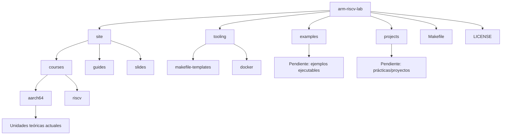
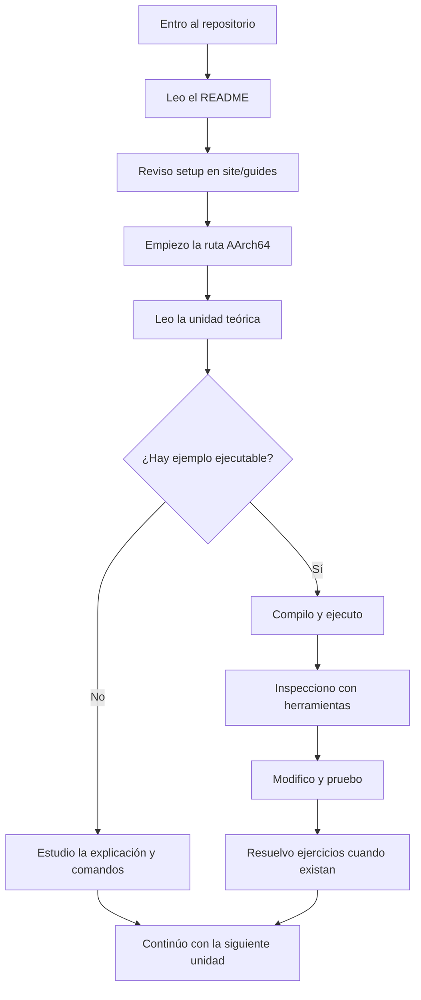
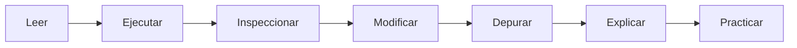

# ARM RISC-V Lab

Repositorio educativo para Arquitectura de Computadores y ensamblador AArch64 (ARM64) en Linux. Este laboratorio prioriza AArch64 hoy y mantiene RISC-V como ruta en planificación.

## Propósito del repositorio

Ser una guía de entrada clara para estudiar arquitectura y bajo nivel con AArch64: teoría organizada, guías de entorno, convenciones de ejemplos y herramientas. El repositorio está en construcción y separa explícitamente lo disponible hoy de lo que está planificado.

## ¿Para quién es este repositorio?

- Estudiantes de arquitectura de computadores.
- Personas que están empezando con ensamblador.
- Quienes quieren entender registros, memoria, syscalls y binarios ELF.
- Docentes o auxiliares que quieran usar o extender el material.

## ¿Qué vas a aprender aquí?

- Diferenciar AArch64 (estado de ejecución de 64 bits), A64 (conjunto de instrucciones) y ARM64 (nombre común).
- Representación binaria y hexadecimal.
- Escribir programas mínimos en AArch64.
- Usar registros de propósito general y flags.
- Ejecutar syscalls de Linux (x8 = número de syscall, x0–x5 argumentos).
- Ensamblar, enlazar y ejecutar binarios ELF.
- Usar QEMU user-mode para correr AArch64 en x86_64.
- Inspeccionar binarios con `objdump`, `readelf` y `nm`.
- Depurar con GDB.
- Distinguir la convención de syscalls de la convención AAPCS64.

## Estado actual del proyecto

- **AArch64 es la prioridad actual**: el material principal de estudio está en `site/courses/aarch64/`.
- **Guías de setup y troubleshooting**: disponibles en `site/guides/`.
- **Ejemplos ejecutables**: `examples/` y `projects/` existen, pero todavía no tienen ejemplos reales.
- **Slides**: `site/slides/` solo contiene README por ahora; los decks se agregarán más adelante.
- **RISC-V**: existe una portada en `site/courses/riscv/index.qmd`, pero la ruta está en planificación.

## Cómo está organizado el repositorio

| Ruta | Qué contiene | Cómo usarla |
|---|---|---|
| `site/` | Fuente del sitio Quarto | Leer el contenido del curso |
| `site/courses/` | Unidades y temas (AArch64 y RISC-V) | Estudio teórico |
| `site/guides/` | Setup, debugging, troubleshooting | Resolver entorno y errores |
| `site/slides/` | Fuentes Slidev | Apoyo visual cuando haya decks |
| `examples/` | Ejemplos ejecutables | Pendiente de poblar |
| `projects/` | Plantillas/proyectos de práctica | Pendiente de poblar |
| `tooling/make/makefile-templates/` | Makefiles para QEMU y ARM64 | Reusar en ejemplos |
| `tooling/docker/` | Dockerfile del laboratorio | Entorno reproducible |
| `_site/` | Sitio generado | No editar |
| `Makefile` | Comandos de sitio/diapositivas | Uso opcional |
| `LICENSE` | Licencia MIT | Referencia legal |



## ¿Dónde empiezo?

### Si es tu primera vez

1. Lee este README completo.
2. Revisa la guía de instalación en `site/guides/setup/index.qmd`.
3. Empieza por la ruta AArch64 en `site/courses/aarch64/`.
4. Continúa con la unidad de laboratorio en `site/courses/aarch64/laboratorio/index.qmd`.
5. No saltes todavía a ABI, ELF, stack o debugging avanzado.

### Si ya tienes el entorno instalado

1. Entra directamente a `site/courses/aarch64/`.
2. Sigue el orden de las unidades disponibles.
3. Usa `site/guides/` solo cuando necesites instalar herramientas o resolver errores.

### Si eres docente o auxiliar

1. Revisa las convenciones del repositorio.
2. Usa `site/courses/` para teoría.
3. Usa `examples/` o `projects/` para material ejecutable cuando se agregue.
4. Mantén cada unidad conectada con explicación, ejemplo y ejercicio.



## Flujo recomendado de estudio



- **Leer**: entender la idea principal en la unidad.
- **Ejecutar**: correr el ejemplo cuando exista.
- **Inspeccionar**: usar `objdump`, `readelf`, `strace` o GDB según la lección.
- **Modificar**: cambiar registros, valores o mensajes.
- **Depurar**: observar registros y memoria paso a paso.
- **Explicar**: describir qué hace el programa.
- **Practicar**: resolver ejercicios cuando existan.

## Cómo usar el material actual

Por ahora, el contenido principal está en `site/courses/aarch64/` como páginas `.qmd`.

Estas páginas funcionan como unidades teóricas y guías de estudio. Algunas pueden incluir fragmentos de código, comandos o referencias a ejemplos.

Relación rápida entre teoría, ejemplos, ejercicios y herramientas:

- `site/courses/`: teoría y guía de estudio.
- `site/guides/`: instalación, debugging y troubleshooting.
- `examples/` y `projects/`: ejemplos ejecutables y prácticas (pendientes de poblar).
- `tooling/`: plantillas y soporte de entorno.
- Ejercicios: se agregarán por unidad cuando estén disponibles.

Cuando existan ejemplos ejecutables asociados, normalmente estarán en `examples/` o `projects/`, y cada uno deberá indicar:

- qué hace el programa,
- cómo compilarlo,
- cómo ejecutarlo,
- qué salida esperar,
- qué observar con herramientas como GDB, `objdump`, `readelf` o `strace`.

Mientras los ejemplos completos se terminan, el flujo principal es:

1. Leer la unidad.
2. Revisar los comandos o código incluidos.
3. Preparar el entorno con `site/guides/`.
4. Seguir el orden de las unidades.
5. Ejecutar ejemplos cuando estén disponibles.

## Herramientas necesarias

Los comandos siguientes están pensados para sistemas basados en Debian/Ubuntu. Si usas otra distribución, instala los paquetes equivalentes con tu gestor de paquetes.

### Ruta recomendada: x86_64 con QEMU

```bash
sudo apt update
sudo apt install -y make gcc-aarch64-linux-gnu binutils-aarch64-linux-gnu qemu-user gdb-multiarch file strace
```

Esto incluye `objdump`, `readelf` y `nm` (vienen en binutils).

### Ruta ARM64 nativa

```bash
sudo apt update
sudo apt install -y make gcc binutils gdb file strace
```

### Verificación rápida

```bash
aarch64-linux-gnu-gcc --version
qemu-aarch64 --version
gdb-multiarch --version
```

### Opcional (solo si quieres ver el sitio localmente)

- Quarto
- Node.js + pnpm (para Slidev cuando haya decks)

## Cómo se ejecutarán los ejemplos AArch64

Cuando los ejemplos ejecutables estén disponibles, el flujo recomendado será:

```bash
cd <carpeta-del-ejemplo>/src
make
make run
make gdb
```

Cada ejemplo deberá incluir instrucciones propias. Si un ejemplo no tiene `Makefile`, se podrán usar las plantillas de `tooling/make/makefile-templates/`.

Este flujo todavía depende de que los ejemplos se vayan agregando a `examples/` o `projects/`.

## Si estás usando una computadora x86_64

Usa QEMU user-mode para ejecutar binarios AArch64. No necesitas hardware ARM para comenzar.

## Si estás usando una computadora ARM64

Puedes ejecutar binarios nativamente. Usa los templates `Makefile.arm64.*` para compilar y depurar sin QEMU.

## Sitio educativo y presentaciones

El sitio Quarto y las presentaciones son apoyo visual. El flujo principal del estudiante es leer las unidades y ejecutar ejemplos cuando estén disponibles.

Si deseas previsualizar el sitio:

```bash
make preview
```

Esto requiere Quarto y dependencias en `site/` (pnpm).

## Convenciones del repositorio

- Unidades numeradas y organizadas por tema en `site/courses/aarch64/`.
- Ejemplos esperados con `src/main.s`, `src/Makefile` y `build/` para salida.
- `.s` es el código fuente ensamblador, `.o` es el archivo objeto y el ejecutable final es un binario ELF.
- `examples/` para ejemplos autocontenidos y `projects/` para estructuras más grandes.

Si las convenciones cambian, se actualizará este README.

## Qué hacer si algo no funciona

- Verifica que tu toolchain esté instalado (`aarch64-linux-gnu-gcc`, `qemu-aarch64`).
- Confirma que estás dentro de `src/` antes de ejecutar `make`.
- Usa `make clean` si hay residuos en `build/`.
- Si `make gdb` no conecta, revisa que el puerto 1234 esté libre.
- Lee primero `site/guides/troubleshooting.qmd`.

## Para docentes o colaboradores

Una nueva lección debería incluir:

- Explicación breve en `.qmd`.
- Código fuente en `src/`.
- `Makefile` claro.
- Salida esperada.
- Paso opcional de depuración.
- Ejercicio asociado.
- Relación con la unidad anterior y la siguiente.

## Pendiente o en planificación

- Ejemplos ejecutables reales en `examples/` y `projects/`.
- Ejercicios por unidad.
- Slides de apoyo en `site/slides/`.
- Ruta RISC-V completa (solo hay portada inicial).
- Unidades avanzadas del roadmap AArch64 (ELF, debugging avanzado, SIMD, etc.) en `site/courses/aarch64/roadmap.qmd`.

## Licencia

Este repositorio usa licencia MIT. Ver `LICENSE`.
