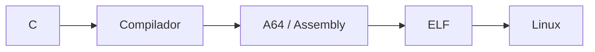
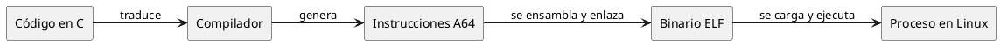

# Guía de estructura para presentaciones Slidev del curso

Esta guía define el formato común que deben seguir las presentaciones del curso **Arquitectura de Computadores y Ensambladores 1**. Su objetivo es que todas las unidades mantengan una estructura reconocible, coherente y pedagógica, sin convertir cada presentación en una plantilla rígida o sobrecargada.

---

## 1. Propósito de la presentación

Cada presentación debe servir como **apoyo visual de clase**, no como sustituto de la página teórica del sitio ni como un documento de lectura completo.

Debe ayudar a:

- abrir la clase y ubicar al estudiante;
- ordenar la explicación del docente;
- presentar ideas centrales con claridad visual;
- mostrar ejemplos, diagramas y código cuando aporten comprensión;
- cerrar con repaso, referencias y espacio para dudas.

La presentación no debe intentar contener todo el contenido de la unidad. La teoría completa vive en las páginas del curso; las diapositivas seleccionan lo esencial para enseñar en clase.

---

## 2. Estructura general obligatoria

Todas las presentaciones deben conservar este orden base:

1. **Portada institucional del curso**
2. **Presentación de la unidad**
3. **Anuncios importantes**
4. **Agenda**
5. **Competencias**
6. **Valor de la semana**
7. **Qué buscamos hoy**
8. **Contenido central de la clase**
9. **Preguntas de repaso**
10. **Ejemplo práctico / aplicación final**
11. **Fuentes**
12. **Dudas**
13. **Gracias por su atención**

La parte que cambia de una presentación a otra es el **contenido central**; los bloques de apertura y cierre deben mantenerse reconocibles para dar continuidad entre clases.

---

# 3. Bloques iniciales

## 3.1 Portada institucional del curso

### Función

Abrir la presentación con identidad institucional y del curso.

### Debe contener

- nombre de la institución o escuela;
- nombre del curso;
- diseño limpio, sin contenido técnico todavía.

### Recomendación

Usar la misma portada en todas las presentaciones del curso. Debe durar poco en clase y funcionar como marco institucional.

---

## 3.2 Presentación de la unidad

### Función

Ubicar al estudiante en la unidad específica.

### Debe contener

- número de unidad;
- nombre de la unidad;
- una frase breve que explique qué se estudiará;
- una nota corta sobre su papel dentro de la ruta de aprendizaje.

### Ejemplo de intención

> Unidad 00 · Contexto, historia y objetivos  
> Antes de escribir instrucciones, hace falta entender qué estudiamos cuando hablamos de ARM64 / AArch64 bajo Linux.

---

## 3.3 Anuncios importantes

### Función

Reservar un espacio fijo para avisos de la semana.

### Uso

- cambios de fechas;
- entregas;
- evaluaciones;
- recordatorios logísticos;
- enlaces o materiales de apoyo.

### Regla

Si no hay anuncios, se puede usar una versión breve con un solo mensaje como:

> No hay anuncios adicionales para hoy.

No debe eliminarse la sección si se quiere mantener la rutina visual de clase.

---

## 3.4 Agenda

### Función

Mostrar el recorrido de la sesión.

### Debe contener

Entre 3 y 6 puntos de agenda, expresados como bloques breves, no como párrafos.

### Recomendación

La agenda debe corresponder al flujo real de la clase, no repetir literalmente el índice de la unidad.

---

## 3.5 Competencias

### Función

Conectar la sesión con las competencias formativas del curso.

### Debe contener

- una o dos competencias relevantes;
- redacción completa, clara y académica;
- relación directa con la unidad o sesión.

### Recomendación

No variar el estilo visual entre clases. Usar tarjetas o bloques consistentes.

---

## 3.6 Valor de la semana

### Función

Conservar el componente formativo transversal del curso.

### Debe contener

- nombre del valor;
- definición breve;
- aplicación concreta en la clase o en el trabajo del estudiante.

### Recomendación

No convertirlo en una sección demasiado larga. Debe funcionar como apertura humana y formativa antes del contenido técnico.

---

## 3.7 Qué buscamos hoy

### Función

Definir los objetivos de aprendizaje de la sesión.

### Debe contener

Entre 3 y 5 objetivos concretos, escritos en lenguaje accesible.

### Recomendación

Conviene usar aparición progresiva con `v-click` para introducir los objetivos uno a uno.

Los objetivos deben responder a **qué podrá explicar, diferenciar, leer, construir o comprobar el estudiante al final de la sesión**.

---

# 4. Contenido central de la clase

## 4.1 Organización por secciones

El contenido central debe dividirse en **secciones conceptuales claras**, cada una precedida por una diapositiva de transición tipo `layout: section`.

### Ejemplo

- Assembly e ISA
- Familia ARM
- AArch64 y Linux
- Por qué estudiar assembly hoy

### Regla

Cada sección debe responder una pregunta central o desarrollar una idea mayor. No se deben crear secciones solo para dividir artificialmente el contenido.

---

## 4.2 Flujo recomendado dentro de cada sección

Una sección técnica suele funcionar mejor siguiendo este patrón:

1. **Pregunta o problema de entrada**
2. **Idea central**
3. **Desglose visual**
4. **Comparación o contraste**
5. **Ejemplo o aplicación**
6. **Regla práctica o conclusión parcial**

No todas las secciones necesitan todos los pasos, pero este flujo evita presentar listas aisladas sin hilo didáctico.

---

## 4.3 Tipos de diapositiva que conviene usar

### A. Pregunta de arranque

Sirve para activar ideas previas o introducir una dificultad conceptual.

Ejemplos:

- ¿Qué estamos estudiando realmente cuando decimos “assembly ARM64”?
- ¿Qué cambia cuando pasamos de cargar una dirección a cargar su contenido?

### B. Idea central

Debe contener una frase fuerte y breve, útil para que el estudiante recuerde el núcleo del tema.

### C. Comparación

Útil cuando hay conceptos que suelen confundirse:

- ISA vs implementación;
- dirección vs contenido;
- AArch64 vs A64;
- syscall vs función de biblioteca.

### D. Diagrama

Útil cuando se necesita explicar relaciones, flujos, jerarquías o recorridos.

### E. Código

Útil cuando el objetivo es leer, reconocer, comparar o construir un fragmento técnico.

### F. Regla práctica

Sirve para cerrar una parte antes de pasar a otra.

---

# 5. Diagramas

## 5.1 Cuándo usar Mermaid

Usar **Mermaid** para diagramas simples que se benefician de escribirse rápido dentro del propio Markdown:

- flujos lineales;
- diagramas de decisión sencillos;
- relaciones entre 3 a 6 conceptos;
- secuencias breves;
- mapas conceptuales simples.

### Ejemplos adecuados

- `C -> compilador -> assembly -> ELF -> Linux`
- `ARMv8-A -> AArch64 -> A64`
- flujo de una syscall;
- secuencia simple de compilación o ejecución.

### Reglas de uso

- Preferir pocos nodos y etiquetas cortas.
- Evitar diagramas demasiado anchos o con demasiadas ramas.
- Ajustar `scale` cuando sea necesario.
- Añadir siempre una leyenda o frase de lectura debajo si el diagrama resume una idea importante.

### Ejemplo



---

## 5.2 Cuándo usar PlantUML

Usar **PlantUML** cuando el diagrama necesite más control estructural o una estética más estable para:

- diagramas de componentes;
- bloques conceptuales con paquetes;
- relaciones más formales;
- diagramas de clases;
- arquitectura de sistema;
- flujos que en Mermaid se vuelven difíciles de acomodar.

### Ejemplos adecuados

- relación entre programador, compilador, assembly, binario y proceso;
- diagramas de memoria por regiones;
- diagramas de clases o arquitectura;
- representación de capas o paquetes.

### Reglas de uso

- Usar PlantUML cuando Mermaid se vuelva visualmente incómodo, no por costumbre.
- Mantener los diagramas reducidos a la idea que se está explicando.
- Evitar demasiados estilos locales si el estilo global ya está definido.
- Preferir nombres pedagógicos antes que nombres excesivamente técnicos cuando el objetivo sea introductorio.

### Ejemplo



---

## 5.3 Criterio para elegir entre Mermaid y PlantUML

| Si necesitas... | Conviene usar |
|---|---|
| Flujo simple y rápido | Mermaid |
| Diagrama muy corto dentro de la explicación | Mermaid |
| Secuencia breve | Mermaid |
| Paquetes, capas o bloques conceptuales más ordenados | PlantUML |
| Diagrama con clases o arquitectura | PlantUML |
| Más control sobre orientación y composición | PlantUML |

---

# 6. Código en las diapositivas

## 6.1 Regla general

El código debe mostrarse para **enseñar a leer**, no para llenar la diapositiva.

Cada bloque de código debe tener una finalidad clara:

- reconocer una instrucción;
- seguir el flujo de ejecución;
- comparar dos formas de resolver algo;
- ver cómo cambia un programa paso a paso;
- identificar registros, operandos, memoria o syscalls.

---

## 6.2 Bloques de código normales

Usar bloques estándar cuando el código sea corto y estable.

```asm
mov x0, #0
mov x8, #93
svc #0
```

### Recomendaciones

- preferir fragmentos pequeños;
- mantener `lineNumbers: true` globalmente;
- resaltar líneas si se explican por etapas;
- no mostrar un programa completo si solo se discutirán 3 instrucciones.

---

## 6.3 Números de línea y resaltado

Usar números de línea para poder referirse con precisión al código durante la explicación.

```asm {1|2|3}
mov x0, #0
mov x8, #93
svc #0
```

Útil para explicar:

- orden de preparación de registros;
- diferencias entre líneas;
- qué cambia de una etapa a otra;
- relación entre una línea y su efecto.

---

## 6.4 Shiki Magic Move

Usar **Shiki Magic Move** cuando se quiera mostrar la **evolución del mismo código** por pasos, por ejemplo:

- de programa incompleto a completo;
- de una versión simple a una con manejo de error;
- de una función sin stack frame a una con prólogo y epílogo;
- de pseudocódigo en C a su equivalente gradual en assembly.

### Regla

Usarlo solo cuando el estudiante deba observar **qué cambió**. No usarlo por decoración.

### Ejemplo de uso esperado

````md magic-move
```asm
mov x0, #0
```

```asm
mov x0, #0
mov x8, #93
```

```asm
mov x0, #0
mov x8, #93
svc #0
```
````

---

## 6.5 Code groups

Usar **code groups** cuando se necesite comparar variantes paralelas que no forman una evolución temporal, por ejemplo:

- C vs Assembly;
- AArch64 vs x86-64;
- `.s` vs comandos de terminal;
- versión con `as`/`ld` vs versión con `gcc`;
- pseudocódigo vs implementación.

### Ejemplo de uso esperado

```md
::code-group

```c [C]
return 0;
```

```asm [AArch64]
mov x0, #0
mov x8, #93
svc #0
```

::
```

### Nota

Para usar `code-group`, la presentación debe tener `comark: true` en el headmatter.

---

## 6.6 Código largo

Si un bloque no cabe bien en una diapositiva:

1. primero intentar reducirlo;
2. luego dividirlo en varias diapositivas;
3. solo si es realmente necesario, usar `maxHeight` con scroll.

No conviene enseñar código importante dentro de una caja con scroll si se puede evitar.

---

# 7. Fórmulas y notación matemática

Usar **LaTeX** cuando el contenido necesite precisión simbólica:

- rangos de enteros;
- potencias de 2;
- complemento a dos;
- cálculos de direcciones;
- alineación;
- máscaras de bits;
- fórmulas de tamaño, desplazamiento u offset.

### Ejemplos

```latex
$2^n$
```

```latex
$$
-2^{n-1} \le x \le 2^{n-1} - 1
$$
```

### Recomendación

Usar fórmulas cuando aclaren más que una explicación verbal. Evitar introducir notación solo para hacer la diapositiva más formal.

---

# 8. Comark Syntax

Activar `comark: true` cuando la presentación vaya a usar:

- `code-group`;
- sintaxis cómoda para aplicar clases;
- otros bloques enriquecidos que dependan de Comark.

### Recomendación

Si se adopta como estándar del curso, puede activarse globalmente en todas las presentaciones para evitar inconsistencias.

---

# 9. Animaciones y aparición progresiva

## 9.1 Cuándo usar `v-click`

Usar aparición progresiva cuando:

- se presenten objetivos;
- se quiera evitar revelar una respuesta demasiado pronto;
- una lista de ideas deba construirse paso a paso;
- se expliquen partes de un diagrama o comparación;
- el docente necesite controlar el ritmo de descubrimiento.

## 9.2 Cuándo no usarla

No usar `v-click` en todo por defecto. Una diapositiva con demasiados clics se vuelve lenta y mecánica.

### Regla práctica

Usar animación cuando tenga función didáctica; no cuando solo agregue movimiento.

---

# 10. Cierre de la presentación

## 10.1 Preguntas de repaso

### Función

Comprobar si el estudiante retuvo las ideas esenciales.

### Debe contener

Entre 3 y 6 preguntas breves que puedan responderse oralmente, en pareja o como actividad rápida.

### Tipos recomendados

- definir;
- diferenciar;
- explicar por qué;
- interpretar un fragmento;
- anticipar qué ocurrirá.

### Ejemplos

- ¿Qué diferencia hay entre AArch64 y A64?
- ¿Por qué una ISA no describe el pipeline interno del procesador?
- ¿Qué relación existe entre un programa en C y un binario ELF?

---

## 10.2 Ejemplo práctico / aplicación final

### Función

Cerrar la clase con una conexión concreta entre los conceptos vistos y una tarea técnica observable.

### Puede ser

- lectura de un fragmento de código;
- inspección de un binario;
- observación en GDB;
- pequeño ejercicio de traducción entre C y assembly;
- interpretación de memoria o registros;
- demostración corta.

### Recomendación

Debe ser más aplicado que las diapositivas conceptuales previas, pero lo bastante breve para caber en el cierre de clase.

---

## 10.3 Fuentes

### Función

Mostrar de dónde se tomó la información y dejar una ruta seria para profundizar.

### Debe incluir

- documentación oficial cuando exista;
- libros base del curso;
- referencias específicas usadas en la unidad;
- fuentes web solo si son pertinentes y confiables.

### Recomendación

No poner una bibliografía genérica idéntica en todas las presentaciones. Deben aparecer las fuentes realmente usadas para la unidad.

---

## 10.4 Dudas

### Función

Reservar de manera explícita un momento para preguntas antes del cierre final.

### Recomendación

Mantenerla simple y limpia, con poco texto.

---

## 10.5 Gracias por su atención

### Función

Cerrar formalmente la presentación.

### Recomendación

Usar siempre el mismo estilo visual para que funcione como cierre institucional del material.

---

# 11. Plantilla estructural sugerida

```md
---
theme: default
class: text-left
highlighter: shiki
lineNumbers: true
transition: slide-left
mdc: true
comark: true
title: "Unidad XX · Nombre de la unidad"
info: "Presentación de apoyo para la unidad XX."
author: "ARM RISC-V Lab"
---

<style>
@import "../styles/index.css";
</style>

<!-- 1. Portada institucional -->

---
layout: center
---

<!-- 2. Presentación de la unidad -->

---

# Anuncios importantes

---

# Agenda

---

# Competencias

---

# Valor de la semana

---

# Qué buscamos hoy

---
layout: section
---

# Primera sección conceptual

---

<!-- Contenido central -->

---
layout: section
---

# Segunda sección conceptual

---

<!-- Más contenido central -->

---

# Preguntas de repaso

---

# Ejemplo práctico

---

# Fuentes

---
layout: center
---

# Dudas

---
layout: center
---

# Gracias por su atención
```

---

# 12. Criterios de calidad antes de cerrar una presentación

Antes de considerar lista una presentación, comprobar:

- ¿La apertura conserva la estructura común del curso?
- ¿Los objetivos de la sesión son claros y medibles?
- ¿El contenido central tiene secciones con hilo lógico?
- ¿Cada diagrama tiene una razón para existir?
- ¿Se eligió Mermaid o PlantUML por conveniencia pedagógica, no por costumbre?
- ¿Cada bloque de código enseña algo concreto?
- ¿Las animaciones ayudan al ritmo en vez de estorbarlo?
- ¿Hay repaso, aplicación final, fuentes y cierre?
- ¿La diapositiva puede entenderse visualmente sin leer párrafos largos?
- ¿La teoría extensa quedó en la página del curso y no sobrecargó la presentación?

---

# 13. Regla final

Una buena presentación de este curso no es la que contiene más información, sino la que organiza mejor la explicación para que el estudiante pueda seguir el razonamiento, distinguir los conceptos importantes y conectar la teoría con la práctica.
