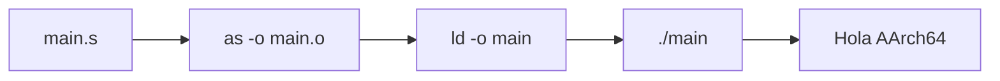
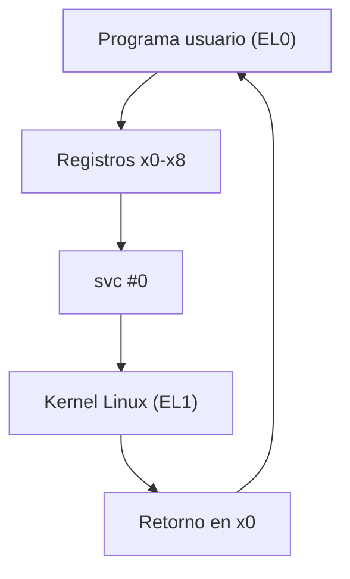
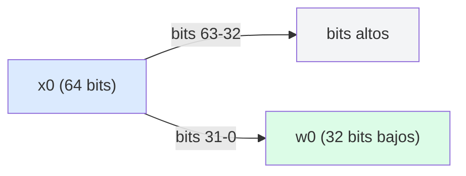
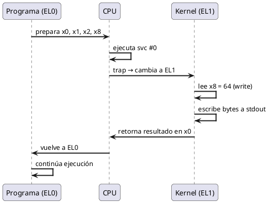
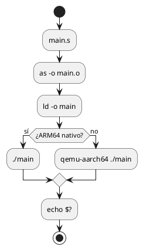
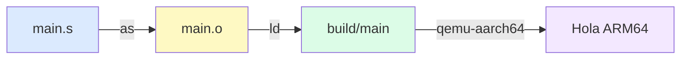
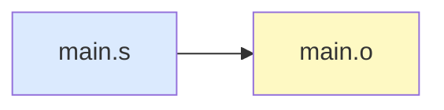
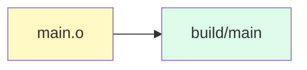
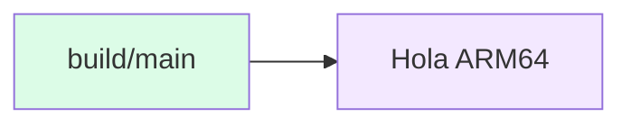

<CoverSlide
  title="Arquitectura de Computadores y Ensambladores 1"
  subtitle="Escuela de Ingeniería de Ciencias y Sistemas"
/>

---
layout: aarch64-section
---

# Referencia de Estilos y Componentes

Presentación de referencia para definir layouts, componentes y estilos

Unidad de diseño visual para todas las presentaciones AArch64

---

# Propósito de esta presentación

Esta presentación define el **estándar visual** que se aplicará a todas las presentaciones del curso.

### Qué se define aquí

- **Portada consistente** — Imagen institucional con texto negro
- **Layouts personalizados** — Estructuras reutilizables para cada tipo de contenido
- **Componentes Vue** — Elementos interactivos para registros, syscalls y más
- **Estilos CSS** — Tipografía, espaciado, colores y contraste

### Por qué es importante

Un diseño consistente ayuda a los estudiantes a enfocarse en el contenido técnico sin distracciones visuales.

---
layout: aarch64-section
---

# Estructura típica de una presentación

Cada presentación del curso sigue un patrón predecible

---

# Flujo de una presentación

1. **Portada institucional** — Imagen de fondo con título de la unidad
2. **Objetivos y agenda** — Qué se cubrirá y qué se espera del estudiante
3. **Contenido técnico** — Teoría, ejemplos de código, diagramas
4. **Preguntas de arranque** — Activar pensamiento crítico antes de cada tema
5. **Ejercicios prácticos** — Aplicar lo aprendido
6. **Checklist de cierre** — Verificar comprensión
7. **Preguntas de repaso** — Reforzar conceptos clave

---
layout: aarch64-section
---

# Portada institucional

La primera diapositiva de cada presentación

---

# Reglas de la portada

<div class="grid grid-cols-2 gap-8">

<div>

### Obligatorio

- Fondo: `Fondo_ECYS.png`
- Texto **negro** siempre
- Sin overlays ni rectángulos
- Texto en zona legible
- Estilo limpio e institucional

</div>

<div>

### Estructura

```yaml
---
layout: aarch64-cover
---

# Título de la Unidad

Subtítulo o descripción breve

Contexto adicional
```

</div>

</div>

---
layout: aarch64-section
---

# Portada con CoverSlide

Componente autocontenido para la primera diapositiva

---

# CoverSlide: uso básico

Para la primera diapositiva de cada presentación:

```html
<CoverSlide
  title="Arquitectura de Computadores y Ensambladores 1"
  subtitle="Escuela de Ingeniería de Ciencias y Sistemas"
/>
```

### Propiedades
- `title` — Título principal (obligatorio)
- `subtitle` — Subtítulo o institución (opcional)
- `note` — Nota o contexto adicional (opcional)

### Características
- Imagen de fondo incluida automáticamente
- Texto negro siempre, sin importar el tema
- Sin overlays ni rectángulos adicionales
- Funciona como primera slide sin layout especial

---

# CoverSlide: con nota

Para agregar contexto en la portada:

```html
<CoverSlide
  title="Unidad 01"
  subtitle="Laboratorio ARM64 reproducible"
  note="Semestre 2026-I · Prof. Nombre · Aula ECYS-101"
/>
```

### Uso típico
- Primera slide de cada presentación
- Semestre, profesor, aula o información contextual
- El note aparece con borde izquierdo sutil

---
layout: aarch64-section
---

# Layouts personalizados

Estructuras reutilizables para cada tipo de contenido

---

# Layouts disponibles

| Layout | Uso |
|--------|-----|
| `aarch64-section` | Separador de sección |
| `aarch64-statement` | Afirmación o concepto clave |
| `aarch64-code` | Diapositiva centrada en código |
| `aarch64-two-cols` | Dos columnas con separador |
| `aarch64-question` | Pregunta de arranque |
| `aarch64-checklist` | Lista de verificación |

---
layout: aarch64-section
---

# Layout: aarch64-section

Separador visual entre temas

---

# Ejemplo de section

Se usa al inicio de cada bloque temático:

```yaml
---
layout: aarch64-section
---

# Título del tema

Breve descripción del contenido
```

### Características

- Fondo con gradiente sutil
- Texto centrado
- Icono opcional con slot `name="icon"`
- Separa visualmente los temas

---
layout: aarch64-statement
---

# Las syscalls son el puente entre tu programa y el kernel de Linux

---
layout: aarch64-section
---

# Layout: aarch64-code

Para diapositivas centradas en código assembly

---

# Ejemplo: programa mínimo

```asm {all|1-2|4-7|9-11}
.global _start

.text
_start:
    mov x0, #0          // código de salida
    mov x8, #93         // syscall exit
    svc #0              // entrar al kernel
```

<div class="mt-4">

- `x0 = 0` — Código de salida
- `x8 = 93` — Número de syscall `exit`
- `svc #0` — Llamada al kernel

</div>

---

# Ejemplo: hello world

```asm {all|1-5|7-11|13-15}
.global _start

.text
_start:
    // syscall write
    mov x0, #1          // stdout
    ldr x1, =msg        // dirección
    mov x2, #len        // longitud
    mov x8, #64         // syscall write
    svc #0

    // syscall exit
    mov x0, #0
    mov x8, #93
    svc #0

.section .rodata
msg:    .ascii "Hola AArch64\n"
len = . - msg
```

---
layout: aarch64-section
---

# Layout: aarch64-two-cols

Dos columnas con separador visual

---
layout: aarch64-two-cols
---

# Ejemplo: dos rutas de desarrollo

::left::

### Raspberry Pi ARM64

- `uname -m` → `aarch64`
- Compilas y ejecutas directo
- Depuras con `gdb`
- Toolchain nativo

```bash
as main.s -o main.o
ld main.o -o main
./main
```

::right::

### x86_64 + QEMU user mode

- `uname -m` → `x86_64`
- Cross-compilas
- Ejecutas con `qemu-aarch64`
- Depuras con `gdb-multiarch`

```bash
aarch64-linux-gnu-as main.s -o main.o
aarch64-linux-gnu-ld main.o -o main
qemu-aarch64 ./main
```

---
layout: aarch64-section
---

# Componentes Vue

Elementos reutilizables para contenido técnico

---

# Componente: InfoBox

Cajas de información con diferentes tipos:

<InfoBox type="info" title="Información">
Este es un cuadro de información general. Úsalo para notas importantes.
</InfoBox>

<InfoBox type="warning" title="Precaución">
No uses `printf` en estos programas. Es función de libc, no syscall directa.
</InfoBox>

<InfoBox type="success" title="Correcto">
`echo $?` muestra el código de salida del último comando ejecutado.
</InfoBox>

<InfoBox type="note" title="Nota">
Los registros `x0` y `w0` son el mismo registro visto con tamaños distintos.
</InfoBox>

---

# Componente: Register

Resaltado inline de registros AArch64:

### Registros generales

- <Register name="x0" bits="64" description="Registro de propósito general 64 bits" /> — Argumento 1, retorno
- <Register name="x1" bits="64" description="Registro de propósito general 64 bits" /> — Argumento 2
- <Register name="x8" bits="64" description="Registro para número de syscall" /> — Número de syscall
- <Register name="sp" bits="64" description="Stack pointer" /> — Puntero de pila
- <Register name="pc" bits="64" description="Program counter" /> — Contador de programa
- <Register name="x30" bits="64" description="Link register" /> — Dirección de retorno

### Registros de 32 bits

- <Register name="w0" bits="32" description="Parte baja de x0" /> — 32 bits bajos de x0
- <Register name="wzr" bits="32" description="Zero register 32 bits" /> — Siempre cero

---

# Componente: SyscallCard

Tarjetas para documentar syscalls:

<div class="grid grid-cols-2 gap-4">

<SyscallCard number="64" name="write" :args="['fd (stdout=1)', 'dirección del buffer', 'cantidad de bytes']" description="Escribe bytes a un file descriptor." />

<SyscallCard number="93" name="exit" :args="['código de salida']" description="Termina el proceso y devuelve el código al shell." />

</div>

---

# Componente: StepList

Lista de pasos numerados:

<StepList :steps="[
  'Preparar argumentos en x0, x1, x2...',
  'Poner número de syscall en x8',
  'Ejecutar svc #0',
  'El kernel lee x8 y ejecuta la syscall'
]" />

---
layout: aarch64-section
---

# Nuevos componentes

Para explicaciones más detalladas de AArch64

---

# Componente: InstructionCard

Desglose completo de una instrucción assembly:

<InstructionCard
  mnemonic="MOV"
  name="Move"
  syntax="MOV Xd, #inmediato"
  description="Copia un valor inmediato en un registro. Si el destino es Wn, los 32 bits altos de Xn se ponen a cero."
  :flags-affected="[]"
  :example="{ code: 'mov x0, #5', explanation: 'x0 = 5' }"
  :notes="[
    'Escribir en Wn limpia los bits altos de Xn (zero-extension)',
    'No afecta flags de NZCV'
  ]"
/>

---

# InstructionCard: ADD con flags

<InstructionCard
  mnemonic="ADDS"
  name="Add with Flags"
  syntax="ADDS Xd, Xn, Xm"
  description="Suma Xn + Xm, guarda resultado en Xd y actualiza flags NZCV."
  :flags-affected="['N', 'Z', 'C', 'V']"
  :example="{ code: 'adds x0, x1, x2', explanation: 'x0 = x1 + x2, flags actualizados' }"
  :notes="[
    'La S al final indica que actualiza flags',
    'C = carry (unsigned overflow)',
    'V = overflow (signed overflow)'
  ]"
/>

---

# Componente: MemoryMap

Visualización del layout de memoria de un proceso:

<MemoryMap :animate="true" :regions="[
  { label: 'Kernel Space', start: '0xFFFFFFFFFFFFFFFF', end: '0xFFFF000000000000', color: 'red' },
  { label: 'Stack', start: '0x00007FFFFFFFFFFF', end: 'crece hacia abajo', color: 'blue' },
  { label: 'Heap', start: 'fin de .bss', end: 'crece hacia arriba', color: 'green' },
  { label: '.bss', start: '', end: 'datos no inicializados', color: 'yellow' },
  { label: '.data', start: '', end: 'datos inicializados', color: 'yellow' },
  { label: '.rodata', start: '', end: 'solo lectura (strings)', color: 'gray' },
  { label: '.text', start: '0x00400000', end: 'código ejecutable', color: 'purple' }
]" />

---

# Componente: StepByStep

Ejecución paso a paso con estado de registros:

<StepByStep :animate="true" :steps="[
  {
    label: 'mov x0, #1',
    registers: { x0: '1 (stdout)', x1: '?', x2: '?', x8: '?' },
    note: 'File descriptor = stdout'
  },
  {
    label: 'ldr x1, =msg',
    registers: { x0: '1', x1: '0x400078', x2: '?', x8: '?' },
    note: 'Dirección del mensaje en memoria'
  },
  {
    label: 'mov x2, #len',
    registers: { x0: '1', x1: '0x400078', x2: '14', x8: '?' },
    note: 'Longitud del mensaje'
  },
  {
    label: 'mov x8, #64',
    registers: { x0: '1', x1: '0x400078', x2: '14', x8: '64 (write)' },
    note: 'Número de syscall listo'
  }
]" />

---

# Componente: ComparisonTable

Comparación lado a lado de conceptos:

<ComparisonTable
  :headers="['Característica', 'Raspberry Pi ARM64', 'x86_64 + QEMU']"
  :rows="[
    ['Arquitectura', 'aarch64 nativo', 'x86_64 host'],
    ['Compilador', 'as / gcc', 'aarch64-linux-gnu-as'],
    ['Ejecución', './main directo', 'qemu-aarch64 ./main'],
    ['Debugger', 'gdb', 'gdb-multiarch'],
    ['Velocidad', 'Nativa', 'Emulada (más lenta)'],
    ['Ventaja', 'Hardware real', 'No requiere hardware ARM']
  ]"
/>

---

# ComparisonTable: Registros

<ComparisonTable
  :headers="['Aspecto', 'Xn (64 bits)', 'Wn (32 bits)']"
  :rows="[
    ['Tamaño', '64 bits', '32 bits'],
    ['Rango', '0 – 2⁶⁴-1', '0 – 2³²-1'],
    ['Relación', 'Registro completo', 'Bits bajos de Xn'],
    ['Escritura', 'Mantiene todos los bits', 'Limpia bits altos de Xn'],
    ['Uso típico', 'Direcciones, enteros 64-bit', 'Enteros 32-bit'],
    ['Ejemplo', 'ldr x0, =addr', 'mov w0, #1']
  ]"
/>

---

# Componente: Timeline

Secuencia de ejecución de un programa:

<Timeline :animate="true" :events="[
  { step: 1, label: 'Carga', desc: 'El loader carga el ELF en memoria', detail: 'Se mapean .text, .data, .bss' },
  { step: 2, label: 'Entry Point', desc: 'PC salta a _start', detail: 'Primera instrucción del programa' },
  { step: 3, label: 'Setup', desc: 'Se preparan registros para syscall', detail: 'x0, x1, x2, x8 configurados' },
  { step: 4, label: 'svc #0', desc: 'Trap al kernel (EL0 → EL1)', detail: 'Cambio de privilege level' },
  { step: 5, label: 'Kernel', desc: 'Linux ejecuta la syscall', detail: 'Lee x8 = 64 → write()' }
]" />

---

# Componente: CodeAnnotation

Código con anotaciones numeradas para explicar paso a paso:

<CodeAnnotation :annotations="[
  { num: '1', text: 'x0 = 1 → file descriptor stdout' },
  { num: '2', text: 'x1 = dirección del mensaje en memoria' },
  { num: '3', text: 'x2 = longitud del mensaje en bytes' },
  { num: '4', text: 'x8 = 64 → número de syscall write' },
  { num: '5', text: 'svc #0 → trap al kernel, ejecuta write' },
  { num: '6', text: 'x0 = 0 → código de salida exitoso' },
  { num: '7', text: 'x8 = 93 → número de syscall exit' },
  { num: '8', text: 'svc #0 → trap al kernel, termina proceso' }
]">

```asm
.global _start

.text
_start:
    mov x0, #1          // 1
    ldr x1, =msg        // 2
    mov x2, #len        // 3
    mov x8, #64         // 4
    svc #0              // 5

    mov x0, #0          // 6
    mov x8, #93         // 7
    svc #0              // 8

.section .rodata
msg:    .ascii "Hola AArch64\n"
len = . - msg
```

</CodeAnnotation>

---
layout: aarch64-section
---

# Estilos de texto

Clases para resaltar elementos técnicos

---

# Clases de resaltado

### En código assembly

```asm
_start:
    mov x0, #1          // fd = stdout
    ldr x1, =msg        // dirección
    mov x2, #14         // longitud
    mov x8, #64         // syscall write
    svc #0
```

### Inline

- Registro: <span class="reg">x0</span>, <span class="reg">x8</span>, <span class="reg">sp</span>
- Syscall: <span class="syscall">write (64)</span>, <span class="syscall">exit (93)</span>
- Instrucción: <span class="instr">mov</span>, <span class="instr">ldr</span>, <span class="instr">svc</span>
- Dirección: <span class="addr">0x00400000</span>

### Código inline

Usa `backticks` para código: `gcc`, `ld`, `gdb`, `qemu-aarch64`

---
layout: aarch64-section
---

# Diagramas con Mermaid

Para visualizar flujos y estructuras

---

# Flujo de compilación

<div v-click>



</div>

---

# Arquitectura de syscalls

<div v-click>



</div>

---

# Registros Xn y Wn

<div v-click>



</div>

---
layout: aarch64-section
---

# Diagramas con PlantUML

Para diagramas de secuencia y actividades más complejos

---

# PlantUML: Secuencia de syscall

<div v-click>



</div>

---

# PlantUML: Flujo de control

<div v-click>



</div>

---
layout: aarch64-section
---

# Tablas

Para datos estructurados

---

# Registros de propósito general

| Registro | Alias | Uso típico | Preservar |
|----------|-------|-----------|-----------|
| `x0`–`x7` | — | Argumentos / retorno | No |
| `x8` | — | Número de syscall | No |
| `x9`–`x15` | — | Temporales | No |
| `x16`–`x17` | `ip0`–`ip1` | Temporales intra-procedimiento | No |
| `x18` | `pr` | Platform register | Depende |
| `x19`–`x28` | — | Callee-saved | Sí |
| `x29` | `fp` | Frame pointer | Sí |
| `x30` | `lr` | Link register | Sí |
| `sp` | — | Stack pointer | Sí |
| `xzr` | — | Zero register | N/A |

---
layout: aarch64-section
---

# Preguntas de arranque

Layout para activar pensamiento crítico

---
layout: aarch64-question
---

## ¿Qué pasa cuando ejecutas `svc #0`?

- El procesador cambia de EL0 a EL1
- El kernel lee `x8` para saber qué syscall ejecutar
- Los argumentos están en `x0`–`x7`
- El resultado vuelve en `x0`

---
layout: aarch64-question
---

## ¿Son `x0` y `w0` registros separados?

- No, son el mismo registro físico
- `w0` son los 32 bits bajos de `x0`
- Escribir en `w0` limpia los bits altos de `x0`
- Esto se llama **zero-extension**

---
layout: aarch64-section
---

# Checklist de cierre

Para verificar comprensión al final

---
layout: aarch64-checklist
---

### Checklist mental

- <span class="check-icon">✓</span> Puedo escribir un programa con `exit` y `write`
- <span class="check-icon">✓</span> Puedo explicar la diferencia entre `x0` y `w0`
- <span class="check-icon">✓</span> Puedo identificar los registros de syscall
- <span class="check-icon">✓</span> Puedo compilar con `as` y enlazar con `ld`
- <span class="check-icon">✓</span> Puedo depurar con GDB paso a paso
- <span class="check-icon">✓</span> Entiendo el flujo: fuente → objeto → ejecutable

---

# Preguntas de repaso

### Para reforzar conceptos

1. ¿Qué registro contiene el número de syscall?
2. ¿Qué diferencia hay entre `x0 = 1` en `write` y `x0 = 1` en `exit`?
3. ¿Qué hace `svc #0` por sí solo, sin contexto de registros?
4. ¿Por qué no usamos `printf` en estos programas?
5. ¿Qué pasa si un programa no llama `exit`?

---
layout: aarch64-section
---

# Animaciones y Código Avanzado

Click animations, Shiki Magic Move, Code Groups y más

---
layout: aarch64-section
---

# v-clicks: Listas progresivas

Revelar items uno por uno con cada click

---

# Agenda del día

<v-clicks>

1. **Entorno Linux ARM64** — Raspberry Pi real o x86_64 con QEMU user mode
2. **Toolchain y herramientas** — Qué instalar según tu ruta
3. **Primer programa** — Compilar y ejecutar un binario AArch64 mínimo
4. **Inspección y debugging** — Mirar el binario por dentro y detenerte en `_start`
5. **Estructura del repositorio** — Cómo organizar carpetas, Makefiles y VS Code

</v-clicks>

---

# Checklist mental

<v-clicks>

- <span class="check-icon">✓</span> Puedo escribir un programa con `exit` y `write`
- <span class="check-icon">✓</span> Puedo explicar la diferencia entre `x0` y `w0`
- <span class="check-icon">✓</span> Puedo identificar los registros de syscall
- <span class="check-icon">✓</span> Puedo compilar con `as` y enlazar con `ld`
- <span class="check-icon">✓</span> Puedo depurar con GDB paso a paso

</v-clicks>

---

# v-click: Bloques de contenido

Controlar cuándo aparece cada bloque de texto

---

# Contrato de syscall AArch64

<v-click>

**Antes de `svc #0`:**

</v-click>

<v-click>

- `x0`–`x5` → Argumentos de la syscall
- `x8` → Número de syscall

</v-click>

<v-click>

**Después de `svc #0`:**

</v-click>

<v-click>

- `x0` → Valor de retorno (o error si < 0)
- El kernel restaura el contexto y vuelve a EL0

</v-click>

---

# v-after: Secuencia automática

El primer click revela el primer elemento, los demás aparecen automáticamente

---

# Flujo de una syscall

<div v-click>

**1. Preparar registros**

</div>

<div v-after>

**2. Ejecutar `svc #0`** → Trap al kernel

</div>

<div v-after>

**3. Kernel procesa** → Lee `x8`, ejecuta la syscall

</div>

<div v-after>

**4. Retorno a EL0** → Resultado en `x0`

</div>

---

# v-click.hide: Ocultar después de click

Elementos visibles que desaparecen al hacer click

---

# Concepto clave

<div v-click>

Las syscalls son el puente entre tu programa y el kernel

</div>

<div v-click.hide>

~~Esto es una abstracción~~ → En realidad es un trap de hardware controlado

</div>

<div v-after>

`svc #0` cambia el exception level de EL0 a EL1 instantáneamente

</div>

---

# Posicionamiento relativo y absoluto

Controlar el orden exacto de aparición con `at`

---

# Orden personalizado con `at`

<div v-click>

Aparece en click **1** (default `+1`)

</div>

<v-click at="+2">

Aparece en click **3** (salta un click)

</v-click>

<div v-click="'-1'">

Aparece en click **1** también (mismo click que el primero)

</div>

<v-click at="5">

Aparece en click **5** absoluto

</v-click>

---

# v-switch: Alternar contenido

Mostrar diferente contenido en diferentes clicks

---

# Estado de registros durante ejecución

<v-switch>

<template #1>

**Antes de `mov x0, #1`:**
`x0 = ?` — Sin inicializar

</template>

<template #2>

**Después de `mov x0, #1`:**
`x0 = 1` — File descriptor stdout

</template>

<template #3>

**Después de `mov x8, #64`:**
`x0 = 1`, `x8 = 64` — Listo para `write`

</template>

<template #4>

**Después de `svc #0`:**
`x0 = 14` — Bytes escritos correctamente

</template>

</v-switch>

---
layout: aarch64-section
---

# Shiki Magic Move

Código que evoluciona con cada click

---

# Magic Move: Construir syscall paso a paso

````md magic-move [main.s]
```asm
.global _start
.text
_start:
```
```asm
.global _start
.text
_start:
    mov x0, #1
    ldr x1, =msg
    mov x2, #len
```
```asm
.global _start
.text
_start:
    mov x0, #1
    ldr x1, =msg
    mov x2, #len
    mov x8, #64
    svc #0
```
```asm
.global _start
.text
_start:
    mov x0, #1
    ldr x1, =msg
    mov x2, #len
    mov x8, #64
    svc #0

    mov x0, #0
    mov x8, #93
    svc #0

.section .rodata
msg:    .ascii "Hola AArch64\n"
len = . - msg
```
````

---

# Magic Move: Loop con control de flujo

````md magic-move [loop.s]
```asm
.global _start
.text
_start:
```
```asm
.global _start
.text
_start:
    mov x0, #0
```
```asm
.global _start
.text
_start:
    mov x0, #0
loop:
    adds x0, x0, #1
```
```asm
.global _start
.text
_start:
    mov x0, #0
loop:
    adds x0, x0, #1
    cmp x0, #10
    b.lt loop
```
```asm
.global _start
.text
_start:
    mov x0, #0
loop:
    adds x0, x0, #1
    cmp x0, #10
    b.lt loop

    mov x8, #93
    svc #0
```
````

---

# Magic Move con line highlighting

````md magic-move {at: 2}
```asm {*|1-2|3-4|5-6}
mov x0, #5
mov x1, #10
adds x0, x0, x1
b.eq done
mov x8, #93
svc #0
```

Comentario entre pasos — se ignora en el morph.

```asm {*}{lines: false}
mov x0, #5
mov x1, #10
adds x0, x0, x1
b.eq done
mov x8, #93
svc #0
```
````

---
layout: aarch64-section
---

# Code Groups

Múltiples variantes de código con tabs

---

# Compilar: Pi vs QEMU

::code-group

```bash [Raspberry Pi]
as main.s -o main.o
ld main.o -o main
./main
```

```bash [x86_64 + QEMU]
aarch64-linux-gnu-as main.s -o main.o
aarch64-linux-gnu-ld main.o -o main
qemu-aarch64 ./main
```

```bash [Makefile]
make
make run
make clean
```

::

---

# Debugging: nativo vs remoto

::code-group

```bash [GDB nativo]
gdb ./main
break _start
run
info registers x0 x8 pc
stepi
```

```bash [GDB + QEMU]
# Terminal 1:
qemu-aarch64 -g 1234 ./main

# Terminal 2:
gdb-multiarch ./main
target remote localhost:1234
break _start
continue
```

::

---
layout: aarch64-section
---

# maxHeight: Código con scroll

Para bloques de código que no caben en una slide

---

# Código largo con scroll

```asm {maxHeight: '350px'}
.global _start

.section .data
filename:   .asciz "salida.txt"
msg:        .asciz "Hola desde AArch64\n"
msg_len = . - msg
err_msg:    .asciz "Error al abrir archivo\n"
err_len = . - err_msg

.section .text
.equ AT_FDCWD, -100
.equ O_WRONLY, 1
.equ O_CREAT, 64
.equ O_TRUNC, 512

_start:
    // openat
    mov x0, #AT_FDCWD
    ldr x1, =filename
    mov x2, #(O_WRONLY | O_CREAT | O_TRUNC)
    mov x3, #0644
    mov x8, #56
    svc #0
    cmp x0, #0
    b.lt error
    mov x19, x0

    // write
    mov x0, x19
    ldr x1, =msg
    mov x2, #msg_len
    mov x8, #64
    svc #0

    // close
    mov x0, x19
    mov x8, #57
    svc #0

    // exit
    mov x0, #0
    mov x8, #93
    svc #0

error:
    mov x0, #2
    ldr x1, =err_msg
    mov x2, #err_len
    mov x8, #64
    svc #0
    mov x0, #1
    mov x8, #93
    svc #0
```

---
layout: aarch64-section
---

# v-motion: Animaciones de movimiento

Elementos que se deslizan al entrar

---

# v-motion: Entrada desde la izquierda

<div
  v-motion
  :initial="{ x: -80, opacity: 0 }"
  :enter="{ x: 0, opacity: 1 }"
  :leave="{ x: 80, opacity: 0 }"
>

### Arquitectura AArch64

- 31 registros generales de 64 bits
- Registros especiales: SP, PC, LR
- Flags NZCV en PSTATE
- Exception levels EL0–EL3

</div>

---

# v-motion con clicks

<div
  v-motion
  :initial="{ x: -50, opacity: 0 }"
  :enter="{ x: 0, opacity: 1 }"
  :click-1="{ y: 0 }"
  :click-2="{ y: 20 }"
  :leave="{ x: 50, opacity: 0 }"
>

### Registros X0–X30

Cada `Xn` tiene un alias `Wn` para operaciones de 32 bits

</div>

<v-click>

Escribir en `Wn` limpia los 32 bits altos de `Xn`

</v-click>

<v-click>

Esto se llama **zero-extension** y evita valores residuales

</v-click>

---
layout: aarch64-section
---

# Animaciones con componentes

Cómo interactúan v-click con componentes Vue

---

# InfoBox con v-click

<v-click>

<InfoBox type="info" title="Paso 1: Setup">
Prepara los argumentos en x0–x5 y el número de syscall en x8
</InfoBox>

</v-click>

<v-click>

<InfoBox type="warning" title="Paso 2: Ejecutar">
Ejecuta `svc #0` — el kernel toma control y cambia a EL1
</InfoBox>

</v-click>

<v-click>

<InfoBox type="success" title="Paso 3: Retorno">
El resultado está en x0. Si es negativo, hubo un error
</InfoBox>

</v-click>

---

# Register con v-clicks

### Registros de syscall

<v-clicks>

- <Register name="x0" bits="64" description="Argumento 0 / retorno" /> — fd stdout / bytes escritos
- <Register name="x1" bits="64" description="Argumento 1" /> — dirección del buffer
- <Register name="x2" bits="64" description="Argumento 2" /> — longitud del buffer
- <Register name="x8" bits="64" description="Número de syscall" /> — 64 = write, 93 = exit

</v-clicks>

---

# SyscallCard con v-click

<div class="grid grid-cols-2 gap-4">

<v-click>

<SyscallCard number="64" name="write" :args="['fd', 'buffer', 'len']" description="Escribe bytes a un file descriptor." />

</v-click>

<v-click>

<SyscallCard number="93" name="exit" :args="['code']" description="Termina el proceso." />

</v-click>

</div>

---

# MemoryMap con :animate="true"

Cada región aparece con un click:

<MemoryMap :animate="true" :regions="[
  { label: 'Kernel Space', start: '0xFFFF...FFFF', end: '0xFFFF...0000', color: 'red' },
  { label: 'Stack', start: '0x7FFF...FFFF', end: 'crece ↓', color: 'blue' },
  { label: 'Heap', start: 'fin .bss', end: 'crece ↑', color: 'green' },
  { label: '.text', start: '0x00400000', end: 'código', color: 'purple' }
]" />

---

# Timeline con :animate="true"

Cada evento aparece con un click:

<Timeline :animate="true" :events="[
  { step: 1, label: 'Setup', desc: 'x0=1, x1=msg, x2=len, x8=64', detail: 'Argumentos listos' },
  { step: 2, label: 'svc #0', desc: 'Trap al kernel EL0→EL1', detail: 'Cambio de privilege level' },
  { step: 3, label: 'Kernel', desc: 'Linux ejecuta write()', detail: 'Escribe bytes a stdout' },
  { step: 4, label: 'Retorno', desc: 'x0 = bytes escritos', detail: 'Vuelve a EL0' }
]" />

---

# StepByStep con :animate="true"

Cada paso aparece con un click:

<StepByStep :animate="true" :steps="[
  { label: 'mov x0, #1', registers: { x0: '1', x8: '?' }, note: 'fd = stdout' },
  { label: 'mov x8, #64', registers: { x0: '1', x8: '64' }, note: 'syscall write' },
  { label: 'svc #0', registers: { x0: '14', x8: '64' }, note: '14 bytes escritos' }
]" />

---
layout: aarch64-section
---

# Click Animation Presets

Diferentes estilos de animación

---

# Presets disponibles

<div v-click.fade>

**fade** — Aparece con opacidad gradual

</div>

<div v-click.scale>

**scale** — Aparece escalando desde 0.9

</div>

<div v-click.fade.right>

**fade.right** — Fade + deslizamiento desde derecha

</div>

<div v-click.down>

**down** — Desliza desde arriba 20px

</div>

<div v-click.none>

**none** — Sin animación (aparece instantáneo)

</div>

---
layout: aarch64-section
---

# Clicks personalizados

Control total con `clicks` en frontmatter

---

# Clicks personalizados

<div v-click="1">

Click **1**: Código assembly

</div>

```asm {at: 1}
mov x0, #1
mov x8, #64
svc #0
```

<div v-click="3">

Click **3**: Explicación del retorno

</div>

<div v-click="4">

Click **4**: `x0` contiene bytes escritos

</div>

<div v-click="5">

Click **5**: Continuar con exit

</div>

---

# Enter & Leave: Visibilidad temporal

<div v-click.hide="[2, 4]">

Este bloque se oculta en clicks 2 y 3, visible en los demás

</div>

<div v-click />

<div v-click="['+1', '+1']">

Este bloque solo es visible en click 2

</div>

---
layout: aarch64-section
---

# Animaciones con Mermaid

Mermaid + v-click para diagramas progresivos

---

# Mermaid con v-click wrapper

Cada diagrama aparece con un click:

<div v-click>



</div>

---

# Mermaid: múltiples diagramas por slide

<div v-click>

**Paso 1:** Código fuente



</div>

<div v-click>

**Paso 2:** Enlazado



</div>

<div v-click>

**Paso 3:** Ejecución



</div>

---
layout: aarch64-section
---

# LaTeX / KaTeX

Fórmulas matemáticas y ecuaciones

---

# LaTeX: fórmulas inline

Fórmulas dentro del texto con `$...$`:

- Rango de `Wn`: $0$ a $2^{32} - 1$
- Rango de `Xn`: $0$ a $2^{64} - 1$
- Dirección de stack: $SP_{new} = SP_{old} - 16$
- Offset de struct: $\text{offset} = \sum_{i=0}^{n-1} \text{size}_i$
- Valor de syscall: $x8 = 64 \Rightarrow \text{write}(x0, x1, x2)$

---

# LaTeX: bloques de fórmulas

Fórmulas en bloque centrado con `$$...$$`:

$$
\begin{aligned}
\text{write}(fd, buf, len) &\rightarrow \text{bytes escritos} \\
\text{exit}(code) &\rightarrow \text{termina proceso} \\
\text{openat}(dirfd, path, flags, mode) &\rightarrow fd \geq 0 \text{ o } < 0 \text{ (error)}
\end{aligned}
$$

---

# LaTeX: resaltar líneas

$$ {1|2|3|all}
\begin{aligned}
\text{EL0} &\rightarrow \text{User mode (nuestros programas)} \\
\text{EL1} &\rightarrow \text{Kernel mode (Linux)} \\
\text{EL2} &\rightarrow \text{Hypervisor (virtualización)} \\
\text{EL3} &\rightarrow \text{Secure monitor}
\end{aligned}
$$

---
layout: aarch64-section
---

# Import Code Snippets

Importar código directamente desde archivos del repositorio

---

# Import: código desde archivo real

```asm src/00-hello-minimo/src/main.s{lineNumbers: true, maxHeight: '350px'}
```

**Ventaja:** si el código del laboratorio cambia, la slide se actualiza automáticamente.

**Sintaxis:**
```md
```lang path/to/file.ext{opciones}
```

---

# Import: con opciones avanzadas

Opciones disponibles:

- `{1-5}` — importar solo líneas 1 a 5
- `{lineNumbers: true}` — mostrar números de línea
- `{maxHeight: '300px'}` — scroll si es muy largo
- `{title: 'main.s'}` — título del bloque
- `{1,3,7-10}` — líneas específicas no consecutivas

**Ejemplo:**
```md
```asm src/00-hello-minimo/src/main.s{1-10, lineNumbers: true, title: 'main.s'}
```

---
layout: aarch64-section
---

# Tabla de Contenidos (Toc)

Índice automático de la presentación

---

# Toc: básico

<Toc />

Generada automáticamente de los títulos h1/h2.

---

# Toc: columnas y filtros

<Toc columns="2" maxDepth="1" />

- `columns="2"` — dos columnas
- `maxDepth="1"` — solo h1
- `minDepth="1"` — profundidad mínima
- `mode="onlyCurrentTree"` — solo sección activa
- `mode="onlySiblings"` — solo hermanos del activo

**Ocultar slide del Toc:**
```yaml
---
hideInToc: true
---
```

---
layout: aarch64-section
---

# Videos

Videos locales y de YouTube embebidos

---

# SlidevVideo: video local

<SlidevVideo controls>
  <source src="https://www.w3schools.com/html/mov_bbb.mp4" type="video/mp4" />
  Tu navegador no soporta videos.
</SlidevVideo>

**Props:**
- `controls` — mostrar controles de reproducción
- `autoplay="once"` — reproducir una vez al entrar
- `poster="/poster.png"` — imagen antes de reproducir
- `autoreset="slide"` — reiniciar al volver a la slide
- `autoreset="click"` — reiniciar al retroceder click

---

# YouTube: video embebido

<Youtube id="luoMHjh-XcQ" />

**Con tiempo específico:**

<Youtube id="luoMHjh-XcQ?start=120" />

- `id` — ID del video (requerido)
- `?start=120` — empezar en segundo 120 (2 min)
- `width` y `height` — dimensiones opcionales

---

# YouTube: ejemplo del curso

<Youtube id="g1lBSDKzVeM" />

Videos útiles para:
- Demostraciones en vivo durante la clase
- Explicaciones complementarias
- Referencias externas de conceptos complejos

---
layout: aarch64-section
---

# Navegación interna

Links entre slides de la misma presentación

---

# Link: navegar entre slides

<Link to="5" title="Ir a slide 5" />

<Link to="solutions" title="Ir a soluciones" />

**Con routeAlias en frontmatter:**
```yaml
---
routeAlias: solutions
---

# Soluciones del ejercicio
```

Útil para:
- Saltar a ejercicios prácticos
- Ir a sección de preguntas
- Navegación no lineal durante la clase

---
layout: aarch64-section
---

# RenderWhen: contenido condicional

Mostrar contenido solo en ciertos contextos

---

# RenderWhen: notas para el tutor

<RenderWhen context="presenter">

**Nota para el tutor:**
- Recordar hacer la demo de GDB aquí
- Tiempo estimado: 10 minutos
- Preguntas clave: ¿Qué registro contiene el número de syscall?

</RenderWhen>

<div v-click>

Este contenido **sí** se proyecta a los estudiantes.

</div>

**Contextos disponibles:**
- `main` — slide + presenter
- `visible` — cuando es visible
- `print` — al imprimir/exportar
- `slide` — solo en slide principal
- `overview` — vista de resumen
- `presenter` — solo en vista presenter
- `previewNext` — preview de siguiente slide

---
layout: aarch64-section
---

# Siguiente paso

Una vez aprobados estos estilos y componentes, se aplicarán a todas las presentaciones del curso:

- 00-semana-diagnostico.md
- 01-laboratorio-arm64-reproducible.md
- 02-bases-binarias-representacion.md
- 03-modelo-aarch64.md
- 04-gnu-assembly-directivas.md
- 05-primeros-programas.md
- ... y todas las demás

---
layout: aarch64-activity-register
activityName: "Laboratorio de Introducción a AArch64"
startTime: "14:00"
participants: "35"
endTime: "16:30"
planned: "Sí"
duration: "150"
---

---

# Registro de Actividad: ejemplo vacío

<ActivityRegister />

---
layout: aarch64-statement
---

# Dudas?

---

<CoverSlide
  title="Gracias por tu atención"
  subtitle="Arquitectura de Computadores y Ensambladores 1"
/>
