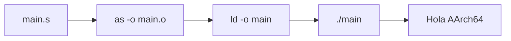
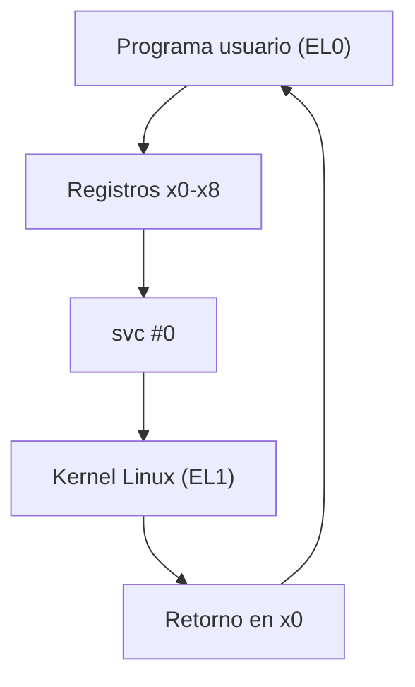
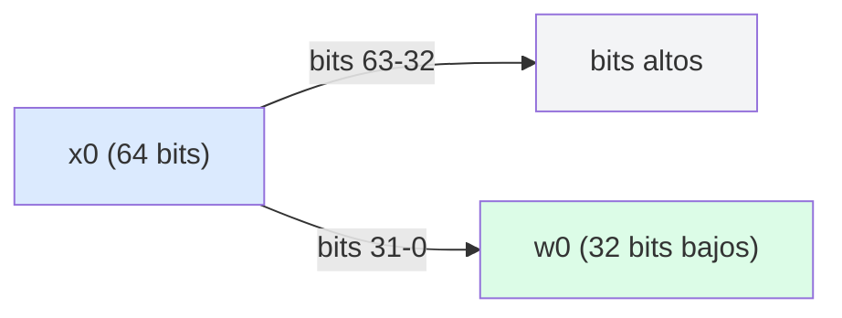
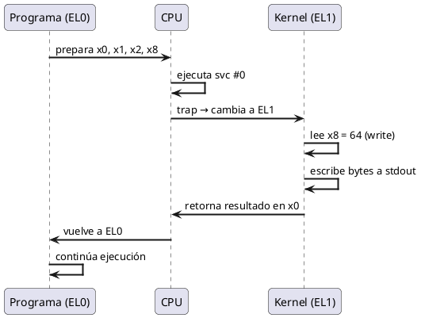
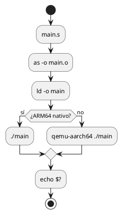

<CoverSlide
  title="Arquitectura de Computadores y Ensambladores 1"
  subtitle="Escuela de Ingeniería de Ciencias y Sistemas"
/>

---
layout: aarch64-section
---

# Referencia de Estilos y Componentes

Presentación de referencia para definir layouts, componentes y estilos

Unidad de diseño visual para todas las presentaciones AArch64

---

# Propósito de esta presentación

Esta presentación define el **estándar visual** que se aplicará a todas las presentaciones del curso.

### Qué se define aquí

- **Portada consistente** — Imagen institucional con texto negro
- **Layouts personalizados** — Estructuras reutilizables para cada tipo de contenido
- **Componentes Vue** — Elementos interactivos para registros, syscalls y más
- **Estilos CSS** — Tipografía, espaciado, colores y contraste

### Por qué es importante

Un diseño consistente ayuda a los estudiantes a enfocarse en el contenido técnico sin distracciones visuales.

---
layout: aarch64-section
---

# Estructura típica de una presentación

Cada presentación del curso sigue un patrón predecible

---

# Flujo de una presentación

1. **Portada institucional** — Imagen de fondo con título de la unidad
2. **Objetivos y agenda** — Qué se cubrirá y qué se espera del estudiante
3. **Contenido técnico** — Teoría, ejemplos de código, diagramas
4. **Preguntas de arranque** — Activar pensamiento crítico antes de cada tema
5. **Ejercicios prácticos** — Aplicar lo aprendido
6. **Checklist de cierre** — Verificar comprensión
7. **Preguntas de repaso** — Reforzar conceptos clave

---
layout: aarch64-section
---

# Portada institucional

La primera diapositiva de cada presentación

---

# Reglas de la portada

<div class="grid grid-cols-2 gap-8">

<div>

### Obligatorio

- Fondo: `Fondo_ECYS.png`
- Texto **negro** siempre
- Sin overlays ni rectángulos
- Texto en zona legible
- Estilo limpio e institucional

</div>

<div>

### Estructura

```yaml
---
layout: aarch64-cover
---

# Título de la Unidad

Subtítulo o descripción breve

Contexto adicional
```

</div>

</div>

---
layout: aarch64-section
---

# Portada con CoverSlide

Componente autocontenido para la primera diapositiva

---

# CoverSlide: uso básico

Para la primera diapositiva de cada presentación:

```html
<CoverSlide
  title="Arquitectura de Computadores y Ensambladores 1"
  subtitle="Escuela de Ingeniería de Ciencias y Sistemas"
/>
```

### Propiedades
- `title` — Título principal (obligatorio)
- `subtitle` — Subtítulo o institución (opcional)
- `note` — Nota o contexto adicional (opcional)

### Características
- Imagen de fondo incluida automáticamente
- Texto negro siempre, sin importar el tema
- Sin overlays ni rectángulos adicionales
- Funciona como primera slide sin layout especial

---

# CoverSlide: con nota

Para agregar contexto en la portada:

```html
<CoverSlide
  title="Unidad 01"
  subtitle="Laboratorio ARM64 reproducible"
  note="Semestre 2026-I · Prof. Nombre · Aula ECYS-101"
/>
```

### Uso típico
- Primera slide de cada presentación
- Semestre, profesor, aula o información contextual
- El note aparece con borde izquierdo sutil

---
layout: aarch64-section
---

# Layouts personalizados

Estructuras reutilizables para cada tipo de contenido

---

# Layouts disponibles

| Layout | Uso |
|--------|-----|
| `aarch64-section` | Separador de sección |
| `aarch64-statement` | Afirmación o concepto clave |
| `aarch64-code` | Diapositiva centrada en código |
| `aarch64-two-cols` | Dos columnas con separador |
| `aarch64-question` | Pregunta de arranque |
| `aarch64-checklist` | Lista de verificación |

---
layout: aarch64-section
---

# Layout: aarch64-section

Separador visual entre temas

---

# Ejemplo de section

Se usa al inicio de cada bloque temático:

```yaml
---
layout: aarch64-section
---

# Título del tema

Breve descripción del contenido
```

### Características

- Fondo con gradiente sutil
- Texto centrado
- Icono opcional con slot `name="icon"`
- Separa visualmente los temas

---
layout: aarch64-statement
---

# Las syscalls son el puente entre tu programa y el kernel de Linux

---
layout: aarch64-section
---

# Layout: aarch64-code

Para diapositivas centradas en código assembly

---

# Ejemplo: programa mínimo

```asm {all|1-2|4-7|9-11}
.global _start

.text
_start:
    mov x0, #0          // código de salida
    mov x8, #93         // syscall exit
    svc #0              // entrar al kernel
```

<div class="mt-4">

- `x0 = 0` — Código de salida
- `x8 = 93` — Número de syscall `exit`
- `svc #0` — Llamada al kernel

</div>

---

# Ejemplo: hello world

```asm {all|1-5|7-11|13-15}
.global _start

.text
_start:
    // syscall write
    mov x0, #1          // stdout
    ldr x1, =msg        // dirección
    mov x2, #len        // longitud
    mov x8, #64         // syscall write
    svc #0

    // syscall exit
    mov x0, #0
    mov x8, #93
    svc #0

.section .rodata
msg:    .ascii "Hola AArch64\n"
len = . - msg
```

---
layout: aarch64-section
---

# Layout: aarch64-two-cols

Dos columnas con separador visual

---
layout: aarch64-two-cols
---

# Ejemplo: dos rutas de desarrollo

::left::

### Raspberry Pi ARM64

- `uname -m` → `aarch64`
- Compilas y ejecutas directo
- Depuras con `gdb`
- Toolchain nativo

```bash
as main.s -o main.o
ld main.o -o main
./main
```

::right::

### x86_64 + QEMU user mode

- `uname -m` → `x86_64`
- Cross-compilas
- Ejecutas con `qemu-aarch64`
- Depuras con `gdb-multiarch`

```bash
aarch64-linux-gnu-as main.s -o main.o
aarch64-linux-gnu-ld main.o -o main
qemu-aarch64 ./main
```

---
layout: aarch64-section
---

# Componentes Vue

Elementos reutilizables para contenido técnico

---

# Componente: InfoBox

Cajas de información con diferentes tipos:

<InfoBox type="info" title="Información">
Este es un cuadro de información general. Úsalo para notas importantes.
</InfoBox>

<InfoBox type="warning" title="Precaución">
No uses `printf` en estos programas. Es función de libc, no syscall directa.
</InfoBox>

<InfoBox type="success" title="Correcto">
`echo $?` muestra el código de salida del último comando ejecutado.
</InfoBox>

<InfoBox type="note" title="Nota">
Los registros `x0` y `w0` son el mismo registro visto con tamaños distintos.
</InfoBox>

---

# Componente: Register

Resaltado inline de registros AArch64:

### Registros generales

- <Register name="x0" bits="64" description="Registro de propósito general 64 bits" /> — Argumento 1, retorno
- <Register name="x1" bits="64" description="Registro de propósito general 64 bits" /> — Argumento 2
- <Register name="x8" bits="64" description="Registro para número de syscall" /> — Número de syscall
- <Register name="sp" bits="64" description="Stack pointer" /> — Puntero de pila
- <Register name="pc" bits="64" description="Program counter" /> — Contador de programa
- <Register name="x30" bits="64" description="Link register" /> — Dirección de retorno

### Registros de 32 bits

- <Register name="w0" bits="32" description="Parte baja de x0" /> — 32 bits bajos de x0
- <Register name="wzr" bits="32" description="Zero register 32 bits" /> — Siempre cero

---

# Componente: SyscallCard

Tarjetas para documentar syscalls:

<div class="grid grid-cols-2 gap-4">

<SyscallCard number="64" name="write" :args="['fd (stdout=1)', 'dirección del buffer', 'cantidad de bytes']" description="Escribe bytes a un file descriptor." />

<SyscallCard number="93" name="exit" :args="['código de salida']" description="Termina el proceso y devuelve el código al shell." />

</div>

---

# Componente: StepList

Lista de pasos numerados:

<StepList :steps="[
  'Preparar argumentos en x0, x1, x2...',
  'Poner número de syscall en x8',
  'Ejecutar svc #0',
  'El kernel lee x8 y ejecuta la syscall'
]" />

---
layout: aarch64-section
---

# Nuevos componentes

Para explicaciones más detalladas de AArch64

---

# Componente: InstructionCard

Desglose completo de una instrucción assembly:

<InstructionCard
  mnemonic="MOV"
  name="Move"
  syntax="MOV Xd, #inmediato"
  description="Copia un valor inmediato en un registro. Si el destino es Wn, los 32 bits altos de Xn se ponen a cero."
  :flags-affected="[]"
  :example="{ code: 'mov x0, #5', explanation: 'x0 = 5' }"
  :notes="[
    'Escribir en Wn limpia los bits altos de Xn (zero-extension)',
    'No afecta flags de NZCV'
  ]"
/>

---

# InstructionCard: ADD con flags

<InstructionCard
  mnemonic="ADDS"
  name="Add with Flags"
  syntax="ADDS Xd, Xn, Xm"
  description="Suma Xn + Xm, guarda resultado en Xd y actualiza flags NZCV."
  :flags-affected="['N', 'Z', 'C', 'V']"
  :example="{ code: 'adds x0, x1, x2', explanation: 'x0 = x1 + x2, flags actualizados' }"
  :notes="[
    'La S al final indica que actualiza flags',
    'C = carry (unsigned overflow)',
    'V = overflow (signed overflow)'
  ]"
/>

---

# Componente: MemoryMap

Visualización del layout de memoria de un proceso:

<MemoryMap :regions="[
  { label: 'Kernel Space', start: '0xFFFFFFFFFFFFFFFF', end: '0xFFFF000000000000', color: 'red' },
  { label: 'Stack', start: '0x00007FFFFFFFFFFF', end: 'crece hacia abajo', color: 'blue' },
  { label: 'Heap', start: 'fin de .bss', end: 'crece hacia arriba', color: 'green' },
  { label: '.bss', start: '', end: 'datos no inicializados', color: 'yellow' },
  { label: '.data', start: '', end: 'datos inicializados', color: 'yellow' },
  { label: '.rodata', start: '', end: 'solo lectura (strings)', color: 'gray' },
  { label: '.text', start: '0x00400000', end: 'código ejecutable', color: 'purple' }
]" />

---

# Componente: StepByStep

Ejecución paso a paso con estado de registros:

<StepByStep :steps="[
  {
    label: 'mov x0, #1',
    registers: { x0: '1 (stdout)', x1: '?', x2: '?', x8: '?' },
    note: 'File descriptor = stdout'
  },
  {
    label: 'ldr x1, =msg',
    registers: { x0: '1', x1: '0x400078', x2: '?', x8: '?' },
    note: 'Dirección del mensaje en memoria'
  },
  {
    label: 'mov x2, #len',
    registers: { x0: '1', x1: '0x400078', x2: '14', x8: '?' },
    note: 'Longitud del mensaje'
  },
  {
    label: 'mov x8, #64',
    registers: { x0: '1', x1: '0x400078', x2: '14', x8: '64 (write)' },
    note: 'Número de syscall listo'
  }
]" />

---

# Componente: ComparisonTable

Comparación lado a lado de conceptos:

<ComparisonTable
  :headers="['Característica', 'Raspberry Pi ARM64', 'x86_64 + QEMU']"
  :rows="[
    ['Arquitectura', 'aarch64 nativo', 'x86_64 host'],
    ['Compilador', 'as / gcc', 'aarch64-linux-gnu-as'],
    ['Ejecución', './main directo', 'qemu-aarch64 ./main'],
    ['Debugger', 'gdb', 'gdb-multiarch'],
    ['Velocidad', 'Nativa', 'Emulada (más lenta)'],
    ['Ventaja', 'Hardware real', 'No requiere hardware ARM']
  ]"
/>

---

# ComparisonTable: Registros

<ComparisonTable
  :headers="['Aspecto', 'Xn (64 bits)', 'Wn (32 bits)']"
  :rows="[
    ['Tamaño', '64 bits', '32 bits'],
    ['Rango', '0 – 2⁶⁴-1', '0 – 2³²-1'],
    ['Relación', 'Registro completo', 'Bits bajos de Xn'],
    ['Escritura', 'Mantiene todos los bits', 'Limpia bits altos de Xn'],
    ['Uso típico', 'Direcciones, enteros 64-bit', 'Enteros 32-bit'],
    ['Ejemplo', 'ldr x0, =addr', 'mov w0, #1']
  ]"
/>

---

# Componente: Timeline

Secuencia de ejecución de un programa:

<Timeline :events="[
  { step: 1, label: 'Carga', desc: 'El loader carga el ELF en memoria', detail: 'Se mapean .text, .data, .bss' },
  { step: 2, label: 'Entry Point', desc: 'PC salta a _start', detail: 'Primera instrucción del programa' },
  { step: 3, label: 'Setup', desc: 'Se preparan registros para syscall', detail: 'x0, x1, x2, x8 configurados' },
  { step: 4, label: 'svc #0', desc: 'Trap al kernel (EL0 → EL1)', detail: 'Cambio de privilege level' },
  { step: 5, label: 'Kernel', desc: 'Linux ejecuta la syscall', detail: 'Lee x8 = 64 → write()' }
]" />

---

# Componente: CodeAnnotation

Código con anotaciones numeradas para explicar paso a paso:

<CodeAnnotation :annotations="[
  { num: '1', text: 'x0 = 1 → file descriptor stdout' },
  { num: '2', text: 'x1 = dirección del mensaje en memoria' },
  { num: '3', text: 'x2 = longitud del mensaje en bytes' },
  { num: '4', text: 'x8 = 64 → número de syscall write' },
  { num: '5', text: 'svc #0 → trap al kernel, ejecuta write' },
  { num: '6', text: 'x0 = 0 → código de salida exitoso' },
  { num: '7', text: 'x8 = 93 → número de syscall exit' },
  { num: '8', text: 'svc #0 → trap al kernel, termina proceso' }
]">

```asm
.global _start

.text
_start:
    mov x0, #1          // 1
    ldr x1, =msg        // 2
    mov x2, #len        // 3
    mov x8, #64         // 4
    svc #0              // 5

    mov x0, #0          // 6
    mov x8, #93         // 7
    svc #0              // 8

.section .rodata
msg:    .ascii "Hola AArch64\n"
len = . - msg
```

</CodeAnnotation>

---
layout: aarch64-section
---

# Estilos de texto

Clases para resaltar elementos técnicos

---

# Clases de resaltado

### En código assembly

```asm
_start:
    mov x0, #1          // fd = stdout
    ldr x1, =msg        // dirección
    mov x2, #14         // longitud
    mov x8, #64         // syscall write
    svc #0
```

### Inline

- Registro: <span class="reg">x0</span>, <span class="reg">x8</span>, <span class="reg">sp</span>
- Syscall: <span class="syscall">write (64)</span>, <span class="syscall">exit (93)</span>
- Instrucción: <span class="instr">mov</span>, <span class="instr">ldr</span>, <span class="instr">svc</span>
- Dirección: <span class="addr">0x00400000</span>

### Código inline

Usa `backticks` para código: `gcc`, `ld`, `gdb`, `qemu-aarch64`

---
layout: aarch64-section
---

# Diagramas con Mermaid

Para visualizar flujos y estructuras

---

# Flujo de compilación



---

# Arquitectura de syscalls



---

# Registros Xn y Wn



---
layout: aarch64-section
---

# Diagramas con PlantUML

Para diagramas de secuencia y actividades más complejos

---

# PlantUML: Secuencia de syscall



---

# PlantUML: Flujo de control



---
layout: aarch64-section
---

# Tablas

Para datos estructurados

---

# Registros de propósito general

| Registro | Alias | Uso típico | Preservar |
|----------|-------|-----------|-----------|
| `x0`–`x7` | — | Argumentos / retorno | No |
| `x8` | — | Número de syscall | No |
| `x9`–`x15` | — | Temporales | No |
| `x16`–`x17` | `ip0`–`ip1` | Temporales intra-procedimiento | No |
| `x18` | `pr` | Platform register | Depende |
| `x19`–`x28` | — | Callee-saved | Sí |
| `x29` | `fp` | Frame pointer | Sí |
| `x30` | `lr` | Link register | Sí |
| `sp` | — | Stack pointer | Sí |
| `xzr` | — | Zero register | N/A |

---
layout: aarch64-section
---

# Preguntas de arranque

Layout para activar pensamiento crítico

---
layout: aarch64-question
---

## ¿Qué pasa cuando ejecutas `svc #0`?

- El procesador cambia de EL0 a EL1
- El kernel lee `x8` para saber qué syscall ejecutar
- Los argumentos están en `x0`–`x7`
- El resultado vuelve en `x0`

---
layout: aarch64-question
---

## ¿Son `x0` y `w0` registros separados?

- No, son el mismo registro físico
- `w0` son los 32 bits bajos de `x0`
- Escribir en `w0` limpia los bits altos de `x0`
- Esto se llama **zero-extension**

---
layout: aarch64-section
---

# Checklist de cierre

Para verificar comprensión al final

---
layout: aarch64-checklist
---

### Checklist mental

- <span class="check-icon">✓</span> Puedo escribir un programa con `exit` y `write`
- <span class="check-icon">✓</span> Puedo explicar la diferencia entre `x0` y `w0`
- <span class="check-icon">✓</span> Puedo identificar los registros de syscall
- <span class="check-icon">✓</span> Puedo compilar con `as` y enlazar con `ld`
- <span class="check-icon">✓</span> Puedo depurar con GDB paso a paso
- <span class="check-icon">✓</span> Entiendo el flujo: fuente → objeto → ejecutable

---

# Preguntas de repaso

### Para reforzar conceptos

1. ¿Qué registro contiene el número de syscall?
2. ¿Qué diferencia hay entre `x0 = 1` en `write` y `x0 = 1` en `exit`?
3. ¿Qué hace `svc #0` por sí solo, sin contexto de registros?
4. ¿Por qué no usamos `printf` en estos programas?
5. ¿Qué pasa si un programa no llama `exit`?

---

# Siguiente paso

Una vez aprobados estos estilos y componentes, se aplicarán a todas las presentaciones del curso:

- 00-semana-diagnostico.md
- 01-laboratorio-arm64-reproducible.md
- 02-bases-binarias-representacion.md
- 03-modelo-aarch64.md
- 04-gnu-assembly-directivas.md
- 05-primeros-programas.md
- ... y todas las demás

---
layout: aarch64-statement
---

# Dudas?

---

<CoverSlide
  title="Gracias por tu atención"
  subtitle="Arquitectura de Computadores y Ensambladores 1"
/>
