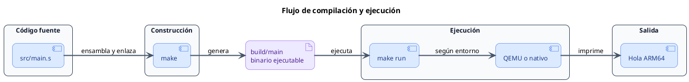
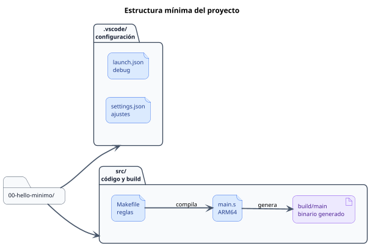

<CoverSlide
  title="Unidad 01 · Laboratorio ARM64 reproducible"
  subtitle="Arquitectura de Computadores y Ensambladores 1"
  note="Escuela de Ingeniería de Ciencias y Sistemas"
/>

---
layout: aarch64-section
---

# Bienvenidos a la Unidad 01

Antes de estudiar instrucciones y registros, necesitamos un entorno que compile, ejecute y depure un programa AArch64 mínimo

---

# Laboratorio ARM64 reproducible

Unidad práctica: entorno, toolchain, primer binario, inspección y debugging inicial.

### Agenda

<v-clicks>

1. **Entorno Linux ARM64** — Raspberry Pi real o x86_64 con QEMU user mode
2. **Toolchain y herramientas** — Qué instalar según tu ruta
3. **Primer programa** — Compilar y ejecutar un binario AArch64 mínimo
4. **Inspección y debugging** — Mirar el binario por dentro y detenerte en `_start`
5. **Estructura del repositorio** — Cómo organizar carpetas, Makefiles y VS Code

</v-clicks>

---

# Anuncios importantes

<InfoBox type="warning" title="Anuncios">

- **Anuncio 1** — Pendiente por definir

</InfoBox>

---

# Competencias del curso

<InfoBox type="info" title="Competencia 1">

El estudiante desarrolla soluciones eficientes en sistemas computacionales integrando arquitectura de computadores, programación en bajo nivel y herramientas modernas de análisis y simulación para resolver problemas complejos en sistemas embebidos e IoT.

</InfoBox>

<InfoBox type="info" title="Competencia 2">

Analiza el comportamiento de arquitecturas modernas (ARM y RISC-V) utilizando simuladores como Gem5, QEMU, registros e instrucciones optimizando programas a bajo nivel en microprocesadores.

</InfoBox>

---

# Valor de la semana

<InfoBox type="note" title="Análisis">

Capacidad de interpretar información técnica y comprender el funcionamiento interno de un sistema.

</InfoBox>

### Aplicación en clase

Permite al estudiante analizar cómo se representan y almacenan los datos dentro del computador, base fundamental para entender instrucciones a bajo nivel y el flujo completo desde el código fuente hasta el binario ejecutable.

---

# Qué buscamos hoy

<StepList :steps="[
  'Elegir ruta de ejecución — Saber si usaremos Raspberry Pi real o x86_64 con QEMU user mode',
  'Instalar el toolchain — Tener las herramientas mínimas listas para compilar AArch64',
  'Ejecutar el primer binario — Correr make y make run y ver la salida esperada',
  'Inspeccionar y depurar — Usar herramientas básicas para mirar el binario y detenernos en _start'
]" />

---
layout: aarch64-section
---

# Entorno Linux ARM64

Linux como base, dos rutas y un flujo reproducible

---
layout: aarch64-question
---

## ¿Dónde va a correr tu programa AArch64?

<v-clicks>

- No siempre tenemos hardware ARM64 real
- QEMU user mode ejecuta un binario ARM64 sobre x86_64
- En ambos casos el código fuente es el mismo

</v-clicks>

<Mascot emotion="confundido" />

---
layout: aarch64-statement
---

# Linux será el entorno principal del curso

---

# Por qué Linux

Linux permite estudiar AArch64 desde userland: procesos, binarios, syscalls y herramientas de inspección sin entrar todavía a bare metal.

<v-clicks>

- **Herramientas estándar:** `gcc`, `as`, `ld`, `gdb`, `objdump`, `readelf`
- **Entorno reproducible:** Mismo flujo en Raspberry Pi, QEMU o Docker
- **Acceso real al sistema:** Syscalls, procesos, archivos y depuración directa

</v-clicks>

---
layout: aarch64-two-cols
---

# Dos rutas, un mismo flujo

::left::

### Raspberry Pi ARM64

- `uname -m` muestra `aarch64`
- Compilas y ejecutas directo
- Depuras con `gdb`

::right::

### x86_64 + QEMU user mode

- `uname -m` muestra `x86_64`
- Cross-compilas con `aarch64-linux-gnu-gcc`
- Ejecutas con `qemu-aarch64`
- Depuras con `gdb-multiarch`

---
layout: aarch64-two-cols
---

# QEMU user mode vs system mode

::left::

### User mode

- Emula un proceso AArch64
- Ruta principal en x86_64
- Rápido y ligero

::right::

### System mode

- Emula una máquina ARM completa
- Kernel, firmware, bare metal
- Solo mención en esta unidad

<InfoBox type="note" title="Regla práctica">

Si solo quieres correr `build/main`, usa QEMU user mode.

</InfoBox>

---
layout: aarch64-section
---

# Toolchain e instalación

Solo lo necesario para compilar, ejecutar e inspeccionar

---

# Herramientas por función

<v-clicks>

- **Construir** — `make`, `gcc` / `aarch64-linux-gnu-gcc`, `as`, `ld`
- **Ejecutar** — `./build/main` (nativo), `qemu-aarch64` (cross)
- **Inspeccionar** — `file`, `readelf`, `objdump`, `nm`, `strace`
- **Depurar** — `gdb` (nativo), `gdb-multiarch` (cross)

</v-clicks>

---

# Instalación rápida

::code-group

```bash [Raspberry Pi]
sudo apt update
sudo apt install -y build-essential \
  binutils gdb make file xxd strace
```

```bash [x86_64 + QEMU]
sudo apt update
sudo apt install -y build-essential \
  gcc-aarch64-linux-gnu \
  binutils-aarch64-linux-gnu \
  qemu-user gdb-multiarch make file
```

::

---

# Verificación mínima

<v-clicks>

- `uname -m` → confirma tu arquitectura
- `gcc --version` o `aarch64-linux-gnu-gcc --version` → compilador listo
- `qemu-aarch64 --version` → emulador disponible (solo x86_64)
- `gdb --version` o `gdb-multiarch --version` → depurador funcional

</v-clicks>

<InfoBox type="warning" title="Importante">

Si algo no responde, revisa que instalaste los paquetes de tu ruta.

</InfoBox>

---
layout: aarch64-section
---

# Primer programa

Compilar, ejecutar y confirmar que el laboratorio funciona

---

# Estructura del ejemplo

<CodeBlock title="00-hello-minimo/" lang="bash">

```bash
00-hello-minimo/
|- .vscode/
|  |- launch.json
|  `- settings.json
`- src/
   |- Makefile
   `- main.s
```

</CodeBlock>

<v-clicks>

- `main.s` — Código assembly AArch64
- `Makefile` — Flujo de compilación según la ruta
- `.vscode/` — Configuración para debugging visual

</v-clicks>

---

# Código mínimo

Un programa que imprime "Hola ARM64" y termina limpiamente.

<CodeAnnotation :annotations="[
  { num: '1', text: 'Sección de datos inicializados' },
  { num: '2', text: 'msg: etiqueta con el mensaje' },
  { num: '3', text: 'msg_len = . - msg → longitud calculada' },
  { num: '4', text: 'Sección de código ejecutable' },
  { num: '5', text: '_start: punto de entrada del programa' },
  { num: '6', text: 'x0 = 1 → file descriptor stdout' },
  { num: '7', text: 'x1 = dirección del mensaje' },
  { num: '8', text: 'x2 = longitud del mensaje' },
  { num: '9', text: 'x8 = 64 → syscall write' },
  { num: '10', text: 'svc #0 → trap al kernel, ejecuta write' },
  { num: '11', text: 'x0 = 0 → código de salida exitoso' },
  { num: '12', text: 'x8 = 93 → syscall exit' },
  { num: '13', text: 'svc #0 → trap al kernel, termina proceso' }
]">

```asm
.section .data
msg:    .ascii "Hola ARM64\n"
msg_len = . - msg

.section .text
.global _start

_start:
    mov x0, #1          // fd = stdout
    adr x1, msg         // dirección del mensaje
    mov x2, msg_len     // longitud
    mov x8, #64         // syscall write
    svc #0

    mov x0, #0          // código de salida
    mov x8, #93         // syscall exit
    svc #0
```

</CodeAnnotation>

---

# Compilar y ejecutar

<div v-click>



</div>

<div v-click class="mt-4 text-lg leading-relaxed">

Flujo completo: el archivo `src/main.s` se compila con `make`, se genera el binario `build/main` y luego se ejecuta con `make run`, ya sea en **QEMU** o en una máquina **ARM64 nativa**.

</div>

<v-clicks>

- `make` — Genera `build/main`
- `make run` — Ejecuta el binario usando QEMU o ejecución nativa
- `make clean` — Borra `build/` para reconstruir desde cero

</v-clicks>

---
layout: aarch64-section
---

# Inspección del binario

El binario no es una caja negra: herramientas para mirarlo por dentro

---

# Primera mirada al binario

<v-clicks>

- `file` — Confirma que es ELF AArch64
- `readelf -h` — Muestra clase ELF64, máquina y entry point
- `objdump -d` — Muestra instrucciones desensambladas
- `nm` — Lista símbolos: `_start`, `msg`, `msg_len`

</v-clicks>

---

# Qué buscar en cada herramienta

<v-clicks>

- `file build/main` → ELF 64-bit, AArch64
- `readelf -h` → Class: ELF64, Machine: AArch64, Entry point
- `objdump -d` → `_start`, instrucciones `mov`, `adr`, `svc`
- `nm` → símbolos y sus direcciones
- `hexdump -C` / `xxd` → el archivo final son bytes

</v-clicks>

---
layout: aarch64-section
---

# Debugging mínimo

Detenerse en `_start`, mirar registros y avanzar instrucción por instrucción

---

# Flujo de debugging

::code-group

```bash [Raspberry Pi]
make gdb
# Dentro de GDB:
break _start
run
info registers x0 x1 x2 x8 pc
stepi
```

```bash [x86_64 + QEMU]
# Terminal 1:
make gdb
# Terminal 2:
gdb-multiarch build/main
target remote localhost:1234
break _start
continue
```

::

---

# Qué observar primero

<div class="mascot-row">

<div class="mascot-content">

<v-clicks>

- `pc` — Instrucción actual que se va a ejecutar
- `x0` — Primer argumento de syscall (file descriptor)
- `x1` — Dirección del mensaje en memoria
- `x2` — Longitud del mensaje
- `x8` — Número de syscall (64 = write, 93 = exit)

</v-clicks>

</div>

<Mascot emotion="leyendo" />

</div>

---

# Comandos GDB esenciales

<CodeBlock title="GDB esencial" lang="bash">

```bash
break _start                  # breakpoint en entrada
info registers x0 x1 x8 pc    # ver registros
x/4i $pc                      # ver próximas 4 instrucciones
stepi                         # avanzar una instrucción
quit                          # salir
```

</CodeBlock>

<InfoBox type="note" title="Importante">

`svc #0` entra al kernel. No se depura por dentro como tu código. Observa registros antes y después.

</InfoBox>

---
layout: aarch64-section
---

# Estructura del repositorio

Carpetas claras para que el estudiante no se pierda

---

# Proyecto mínimo

<div v-click class="w-full flex justify-center">

<div class="w-[60%]">



</div>

</div>

<div v-click class="mt-4 text-lg leading-relaxed">

Cada ejemplo mantiene la misma estructura: una carpeta principal con `.vscode/` para configuración del entorno y `src/` para el código ensamblador, el `Makefile` y el binario generado.

</div>

---

# Un flujo que se repite

No hace falta aprender un flujo distinto para cada ejemplo. La estructura cambia poco; lo que cambia es el programa que queremos construir.

<v-clicks>

- **Flujo único:** `make` · `make run` · `make gdb`
- **Cambiar ruta:** Solo reemplazas `src/Makefile`

</v-clicks>

<InfoBox type="info" title="Meta del curso">

Que el estudiante pueda concentrarse en assembly, no en reaprender el entorno en cada ejercicio.

</InfoBox>

---
layout: aarch64-checklist
---

### Checklist mental

<div class="mascot-row">

<div class="mascot-content">

- <span class="check-icon">✓</span> Sé si mi ruta es Raspberry Pi o x86_64 con QEMU
- <span class="check-icon">✓</span> Instalé las herramientas mínimas de mi ruta
- <span class="check-icon">✓</span> `make` genera `build/main`
- <span class="check-icon">✓</span> `make run` imprime `Hola ARM64`
- <span class="check-icon">✓</span> `file build/main` identifica un binario AArch64
- <span class="check-icon">✓</span> Puedo detenerme en `_start` con GDB

</div>

<Mascot emotion="solucinado" />

</div>

---
layout: aarch64-statement
---

# Siguiente paso: Entorno y ruta elegidos → Toolchain instalado → Primer binario ejecutado → Representación de datos y tipos

---
layout: aarch64-question
---

## Preguntas de repaso

<div class="mascot-row">

<div class="mascot-content">

<v-clicks>

- ¿Qué diferencia hay entre QEMU user mode y QEMU system mode?
- ¿Qué comando confirma que tienes un binario AArch64?
- ¿Qué registros preparas antes de llamar a `svc #0`?
- ¿Qué hace `stepi` en GDB?
- ¿Por qué usamos `make` en vez de escribir comandos directos?

</v-clicks>

</div>

<Mascot emotion="pensando" />

</div>

---

# Ejemplo práctico

Abrir terminal, entrar al ejemplo, compilar, ejecutar e inspeccionar.

<StepList :steps="[
  'Compilar — cd 00-hello-minimo/src && make',
  'Ejecutar — make run → debe imprimir Hola ARM64',
  'Inspeccionar — file build/main y objdump -d build/main',
  'Depurar — make gdb, breakpoint en _start, stepi'
]" />

---

# Fuentes

- Página Quarto: `site/courses/aarch64/laboratorio/`
- QEMU, *User space emulator documentation*
- GDB, *Debugging with GDB — Remote Debugging*
- GNU Binutils, *as, ld, objdump, readelf, nm*
- Larry D. Pyeatt y William Ughetta, *ARM 64-Bit Assembly Language*
- Slidev, documentación oficial

---
layout: aarch64-statement
---

# ¿Dudas?

---

<CoverSlide
  title="Gracias por tu atención"
  subtitle="Arquitectura de Computadores y Ensambladores 1"
/>
