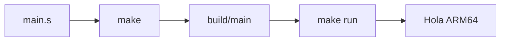
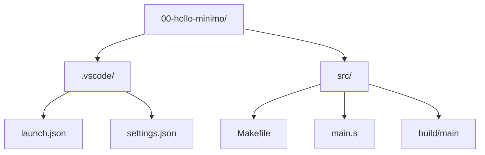

# Arquitectura de Computadores y Ensambladores 1

Escuela de Ingeniería de Ciencias y Sistemas

---
layout: center
---

Arquitectura de Computadores y Ensambladores 1

## Unidad 01
## Laboratorio ARM64 reproducible

Antes de estudiar instrucciones y registros, necesitamos un entorno que compile, ejecute y depure un programa AArch64 mínimo.

Unidad práctica: entorno, toolchain, primer binario, inspección y debugging inicial.

---

# Anuncios importantes

1. **Anuncio 1**

---

# Agenda

1. **Entorno Linux ARM64** — Raspberry Pi real o x86_64 con QEMU user mode.
2. **Toolchain y herramientas** — Qué instalar según tu ruta.
3. **Primer programa** — Compilar y ejecutar un binario AArch64 mínimo.
4. **Inspección y debugging** — Mirar el binario por dentro y detenerte en `_start`.
5. **Estructura del repositorio** — Cómo organizar carpetas, Makefiles y VS Code.

---

# Competencias

### Competencia 1
El estudiante desarrolla soluciones eficientes en sistemas computacionales integrando arquitectura de computadores, programación en bajo nivel y herramientas modernas de análisis y simulación para resolver problemas complejos en sistemas embebidos e IoT.

### Competencia 2
Analiza el comportamiento de arquitecturas modernas (ARM y RISC-V) utilizando simuladores como Gem5, QEMU, registros e instrucciones optimizando programas a bajo nivel en microprocesadores.

---

# Valor de la semana

**Análisis.** Capacidad de interpretar información técnica y comprender el funcionamiento interno de un sistema.

### Aplicación en clase
Permite al estudiante analizar cómo se representan y almacenan los datos dentro del computador, base fundamental para entender instrucciones a bajo nivel y el flujo completo desde el código fuente hasta el binario ejecutable.

---

# Qué buscamos hoy

1. **Elegir ruta de ejecución** — Saber si usaremos Raspberry Pi real o x86_64 con QEMU user mode.
2. **Instalar el toolchain** — Tener las herramientas mínimas listas para compilar AArch64.
3. **Ejecutar el primer binario** — Correr `make` y `make run` y ver la salida esperada.
4. **Inspeccionar y depurar** — Usar herramientas básicas para mirar el binario y detenernos en `_start`.

---
layout: section
---

# Entorno Linux ARM64

Linux como base, dos rutas y un flujo reproducible.

---
layout: center
class: text-center
---

### Pregunta de arranque

## ¿Dónde va a correr tu programa AArch64?

- No siempre tenemos hardware ARM64 real.
- QEMU user mode ejecuta un binario ARM64 sobre x86_64.
- En ambos casos el código fuente es el mismo.

---
layout: statement
---

# Linux será el entorno principal del curso

---

# Por qué Linux

Linux permite estudiar AArch64 desde userland: procesos, binarios, syscalls y herramientas de inspección sin entrar todavía a bare metal.

- **Herramientas estándar:** `gcc`, `as`, `ld`, `gdb`, `objdump`, `readelf`.
- **Entorno reproducible:** Mismo flujo en Raspberry Pi, QEMU o Docker.
- **Acceso real al sistema:** Syscalls, procesos, archivos y depuración directa.

---

# Dos rutas, un mismo flujo

**Raspberry Pi ARM64**
- `uname -m` muestra `aarch64`.
- Compilas y ejecutas directo.
- Depuras con `gdb`.

**x86_64 + QEMU user mode**
- `uname -m` muestra `x86_64`.
- Cross-compilas con `aarch64-linux-gnu-gcc`.
- Ejecutas con `qemu-aarch64`.
- Depuras con `gdb-multiarch`.

---

# QEMU user mode vs system mode

**User mode**
- Emula un proceso AArch64.
- Ruta principal en x86_64.
- Rápido y ligero.

**System mode**
- Emula una máquina ARM completa.
- Kernel, firmware, bare metal.
- Solo mención en esta unidad.

Si solo quieres correr `build/main`, usa QEMU user mode.

---
layout: section
---

# Toolchain e instalación

Solo lo necesario para compilar, ejecutar e inspeccionar.

---

# Herramientas por función

**Construir**
- `make`
- `gcc` / `aarch64-linux-gnu-gcc`
- `as` · `ld`

**Ejecutar**
- `./build/main` (nativo)
- `qemu-aarch64` (cross)

**Inspeccionar**
- `file` · `readelf`
- `objdump` · `nm`
- `strace`

**Depurar**
- `gdb` (nativo)
- `gdb-multiarch` (cross)

---

# Instalación rápida

**Raspberry Pi ARM64**
```bash
sudo apt update
sudo apt install -y build-essential \
  binutils gdb make file xxd strace
```

**x86_64 + QEMU**
```bash
sudo apt update
sudo apt install -y build-essential \
  gcc-aarch64-linux-gnu \
  binutils-aarch64-linux-gnu \
  qemu-user gdb-multiarch make file
```

---

# Verificación mínima

- `uname -m` → confirma tu arquitectura.
- `gcc --version` o `aarch64-linux-gnu-gcc --version` → compilador listo.
- `qemu-aarch64 --version` → emulador disponible (solo x86_64).
- `gdb --version` o `gdb-multiarch --version` → depurador funcional.

Si algo no responde, revisa que instalaste los paquetes de tu ruta.

---
layout: section
---

# Primer programa

Compilar, ejecutar y confirmar que el laboratorio funciona.

---

# Estructura del ejemplo

```bash
00-hello-minimo/
|- .vscode/
|  |- launch.json
|  `- settings.json
`- src/
   |- Makefile
   `- main.s
```

- `main.s` — Código assembly AArch64.
- `Makefile` — Flujo de compilación según la ruta.
- `.vscode/` — Configuración para debugging visual.

---

# Código mínimo

Un programa que imprime "Hola ARM64" y termina limpiamente.

```asm {1-2|4-5|7-11|13-15}
.section .data
msg:    .ascii "Hola ARM64\n"
msg_len = . - msg

.section .text
.global _start

_start:
    mov x0, #1          // fd = stdout
    adr x1, msg         // dirección del mensaje
    mov x2, msg_len     // longitud
    mov x8, #64         // syscall write
    svc #0

    mov x0, #0          // código de salida
    mov x8, #93         // syscall exit
    svc #0
```

---

# Compilar y ejecutar



Flujo completo: entra a `src/`, compila con `make`, ejecuta con `make run`.

- `make` — Genera `build/main`.
- `make run` — Ejecuta el binario (QEMU o nativo).
- `make clean` — Borra `build/` para reconstruir.

---
layout: section
---

# Inspección del binario

El binario no es una caja negra: herramientas para mirarlo por dentro.

---

# Primera mirada al binario

- `file` — Confirma que es ELF AArch64.
- `readelf -h` — Muestra clase ELF64, máquina y entry point.
- `objdump -d` — Muestra instrucciones desensambladas.
- `nm` — Lista símbolos: `_start`, `msg`, `msg_len`.

---

# Qué buscar en cada herramienta

- `file build/main` → ELF 64-bit, AArch64.
- `readelf -h` → Class: ELF64, Machine: AArch64, Entry point.
- `objdump -d` → `_start`, instrucciones `mov`, `adr`, `svc`.
- `nm` → símbolos y sus direcciones.
- `hexdump -C` / `xxd` → el archivo final son bytes.

---
layout: section
---

# Debugging mínimo

Detenerse en `_start`, mirar registros y avanzar instrucción por instrucción.

---

# Flujo de debugging

**Raspberry Pi**
```bash
make gdb
# Dentro de GDB:
break _start
run
info registers x0 x1 x2 x8 pc
stepi
```

**x86_64 + QEMU**
```bash
# Terminal 1:
make gdb
# Terminal 2:
gdb-multiarch build/main
target remote localhost:1234
break _start
continue
```

---

# Qué observar primero

- `pc` — Instrucción actual que se va a ejecutar.
- `x0` — Primer argumento de syscall (file descriptor).
- `x1` — Dirección del mensaje en memoria.
- `x2` — Longitud del mensaje.
- `x8` — Número de syscall (64 = write, 93 = exit).

---

# Comandos GDB esenciales

```bash
break _start              # breakpoint en entrada
info registers x0 x1 x8 pc  # ver registros
x/4i $pc                  # ver próximas 4 instrucciones
stepi                     # avanzar una instrucción
quit                      # salir
```

`svc #0` entra al kernel. No se depura por dentro como tu código. Observa registros antes y después.

---
layout: section
---

# Estructura del repositorio

Carpetas claras para que el estudiante no se pierda.

---

# Proyecto mínimo



Cada ejemplo mantiene la misma estructura: una carpeta con `.vscode/` y `src/`.

---

# Un flujo que se repite

No hace falta aprender un flujo distinto para cada ejemplo. La estructura cambia poco; lo que cambia es el programa que queremos construir.

- **Flujo único:** `make` · `make run` · `make gdb`
- **Cambiar ruta:** Solo reemplazas `src/Makefile`.

La meta es que el estudiante pueda concentrarse en assembly, no en reaprender el entorno en cada ejercicio.

---

# Checklist mental

- Sé si mi ruta es Raspberry Pi o x86_64 con QEMU.
- Instalé las herramientas mínimas de mi ruta.
- `make` genera `build/main`.
- `make run` imprime `Hola ARM64`.
- `file build/main` identifica un binario AArch64.
- Puedo detenerme en `_start` con GDB.

---

# Siguiente paso

Entorno y ruta elegidos → Toolchain instalado → Primer binario ejecutado → Representación de datos y tipos

---
layout: center
class: text-center
---

### Actividad de cierre

# Preguntas de repaso

- ¿Qué diferencia hay entre QEMU user mode y QEMU system mode?
- ¿Qué comando confirma que tienes un binario AArch64?
- ¿Qué registros preparas antes de llamar a `svc #0`?
- ¿Qué hace `stepi` en GDB?
- ¿Por qué usamos `make` en vez de escribir comandos directos?

---

### Ejemplo Práctico

Abrir terminal, entrar al ejemplo, compilar, ejecutar e inspeccionar.

1. **Compilar** — `cd 00-hello-minimo/src && make`
2. **Ejecutar** — `make run` → debe imprimir `Hola ARM64`.
3. **Inspeccionar** — `file build/main` y `objdump -d build/main`.
4. **Depurar** — `make gdb`, breakpoint en `_start`, `stepi`.

---

# Fuentes

- Página Quarto: `site/courses/aarch64/laboratorio/`
- QEMU, *User space emulator documentation*
- GDB, *Debugging with GDB — Remote Debugging*
- GNU Binutils, *as, ld, objdump, readelf, nm*
- Larry D. Pyeatt y William Ughetta, *ARM 64-Bit Assembly Language*
- Slidev, documentación oficial

---
layout: statement
---

# Dudas¿?

---
layout: center
---

# Gracias por tu atención
