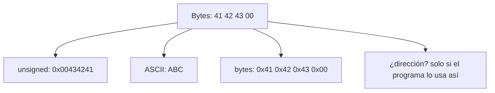

<style>
@import "../styles/index.css";
</style>

<div class="ecys-cover-bg"></div>

<div class="ecys-title-cover">

<div class="muted">Escuela de Ingeniería de Ciencias y Sistemas</div>

# Arquitectura de Computadores y Ensambladores 1

</div>

---
layout: center
---

<div class="muted">Arquitectura de Computadores y Ensambladores 1</div>

## Unidad 02
## Bases binarias y representación de datos

Antes de leer registros o memoria, necesitamos entender cómo se representan
y almacenan los datos dentro del computador.

<div class="cover-note">
Unidad conceptual: bits, bytes, bases, enteros, texto, endianness, direcciones y punteros.
</div>

---

# Anuncios importantes

<div class="numbered-grid">
  <div class="numbered-card">
    <div class="card-number">1</div>
    <h3>Anuncio 1</h3>
    <p></p>
  </div>
</div>

---

# Agenda

<div class="numbered-grid">
  <div class="numbered-card">
    <div class="card-number">1</div>
    <h3>Bits, bytes y bases</h3>
    <p>Tamaños, decimal, binario y hexadecimal.</p>
  </div>

  <div class="numbered-card">
    <div class="card-number">2</div>
    <h3>Enteros, signo y rangos</h3>
    <p>Unsigned, signed, complemento a dos.</p>
  </div>

  <div class="numbered-card">
    <div class="card-number">3</div>
    <h3>Overflow y extensiones</h3>
    <p>Carry, borrow, overflow, zero y sign extension.</p>
  </div>

  <div class="numbered-card">
    <div class="card-number">4</div>
    <h3>Texto, endianness y memoria</h3>
    <p>ASCII, UTF-8, orden de bytes, direcciones y punteros.</p>
  </div>
</div>

---

# Competencias

<div class="concept-grid vertical-center">
  <div class="concept-card">
    <h3>Competencia 1</h3>
    <p>
      Analiza el comportamiento de arquitecturas modernas (ARM y RISC-V)
      utilizando simuladores como Gem5, QEMU, registros e instrucciones
      optimizando programas a bajo nivel en microprocesadores.
    </p>
  </div>

  <div class="concept-card">
    <h3>Competencia 2</h3>
    <p>
      El estudiante desarrolla soluciones eficientes en sistemas computacionales
      integrando arquitectura de computadores, programación en bajo nivel y
      herramientas modernas de análisis y simulación para resolver problemas
      complejos en sistemas embebidos e IoT.
    </p>
  </div>
</div>

---

# Valor de la semana

<div class="callout tip">
  <strong>Precisión.</strong>
  Capacidad de trabajar con exactitud en procesos técnicos.
</div>

<div class="concept-grid">
  <div class="concept-card">
    <h3>Aplicación en clase</h3>
    <p>
      Fundamental para entender instrucciones y ejecución en bajo nivel.
      Permite al estudiante interpretar datos exactos en registros y memoria,
      distinguir representaciones y evitar errores al operar con valores binarios.
    </p>
  </div>
</div>

---

# Qué buscamos hoy

<div class="slide-center-block">

<div class="objective-grid">
  <div v-click class="objective-item">
    <div class="item-number">1</div>
    <h3>Tamaños y bases</h3>
    <p>Distinguir bit, byte, nibble, word y doubleword; convertir entre bases.</p>
  </div>

  <div v-click class="objective-item">
    <div class="item-number">2</div>
    <h3>Signed vs unsigned</h3>
    <p>Entender por qué <code>0xFF</code> puede ser <code>255</code> o <code>-1</code>.</p>
  </div>

  <div v-click class="objective-item">
    <div class="item-number">3</div>
    <h3>Efectos aritméticos</h3>
    <p>Diferenciar carry, borrow y overflow; aplicar extensiones.</p>
  </div>

  <div v-click class="objective-item">
    <div class="item-number">4</div>
    <h3>Memoria y direcciones</h3>
    <p>Separar dirección, contenido y valor interpretado.</p>
  </div>
</div>

</div>

---
layout: section
---

# Bits, bytes y bases

Todo dato visible para un programa termina representado como bits.

---
layout: center
class: text-center
---

<div class="big-question">
  <div class="muted">Pregunta de arranque</div>
  <h3>¿Qué significa que un registro tenga 64 bits?</h3>
  <div class="question-points">
    <div v-click>No es solo un número grande.</div>
    <div v-click>Es la cantidad de posiciones binarias disponibles.</div>
    <div v-click>Determina qué valores puede guardar y cómo los interpreta.</div>
  </div>
</div>

---

# Bit, byte, nibble

<div class="slide-center-block">

<div class="content-stack-lg">

<div class="key-idea centered-narrow">
  <div class="muted">Idea central</div>
  <p>Un bit es 0 o 1. Un byte agrupa 8 bits. Un nibble agrupa 4 bits y coincide con un dígito hexadecimal.</p>
</div>

<div class="concept-grid">
  <div v-click class="concept-card">
    <h3>Bit</h3>
    <p>1 posición: <code>0</code> o <code>1</code>.</p>
  </div>
  <div v-click class="concept-card">
    <h3>Nibble</h3>
    <p>4 bits = 1 dígito hex.</p>
  </div>
  <div v-click class="concept-card">
    <h3>Byte</h3>
    <p>8 bits = 2 dígitos hex.</p>
  </div>
</div>

</div>

</div>

---

# Tamaños en AArch64

<div class="slide-center-block">

<div class="concept-grid">
  <div v-click class="concept-card">
    <h3>Byte — 8 bits</h3>
    <p>Caracteres, buffers, memoria cruda.</p>
  </div>
  <div v-click class="concept-card">
    <h3>Halfword — 16 bits</h3>
    <p>Datos pequeños, cargas de 16 bits.</p>
  </div>
  <div v-click class="concept-card">
    <h3>Word — 32 bits</h3>
    <p>Registros <code>w0</code>–<code>w30</code>.</p>
  </div>
  <div v-click class="concept-card">
    <h3>Doubleword — 64 bits</h3>
    <p>Registros <code>x0</code>–<code>x30</code> y direcciones.</p>
  </div>
</div>

<div v-click class="callout info centered-narrow">
<code>w0</code> son los 32 bits bajos de <code>x0</code>. No son registros separados.
</div>

</div>

---

# Tres bases, un mismo valor

<div class="slide-center-block">

<div class="content-stack-lg">

```bash
Decimal:     42
Binario:     0b00101010
Hexadecimal: 0x2A
```

<div class="compare-grid">
  <div v-click class="compare-card">
    <div class="card-kicker">Decimal</div>
    <ul>
      <li>Dígitos <code>0</code> a <code>9</code>.</li>
      <li>Lectura humana común.</li>
    </ul>
  </div>
  <div v-click class="compare-card">
    <div class="card-kicker">Binario</div>
    <ul>
      <li>Dígitos <code>0</code> y <code>1</code>.</li>
      <li>Forma directa de hablar de bits.</li>
    </ul>
  </div>
  <div v-click class="compare-card">
    <div class="card-kicker">Hexadecimal</div>
    <ul>
      <li>Dígitos <code>0</code>–<code>9</code>, <code>A</code>–<code>F</code>.</li>
      <li>Cada dígito = 4 bits exactos.</li>
    </ul>
  </div>
</div>

</div>

</div>

---

# Leer hexadecimal como bits

<div class="slide-center-block">

<div class="content-stack-lg">

```bash
0x2A
  2    A
0010 1010
```

<div v-click class="callout tip centered-narrow">
Hexadecimal es cómodo en bajo nivel porque cada dígito representa exactamente 4 bits.
</div>

<div v-click class="key-idea centered-narrow">
  <p>En AArch64: <code>mov w0, #0x2A</code> guarda <code>0x0000002A</code> en un registro de 32 bits.</p>
</div>

</div>

</div>

---
layout: section
---

# Enteros, signo y rangos

Los bits no cambian; cambia la regla con la que los interpretas.

---
layout: statement
---

# Un patrón de bits no trae etiqueta de "positivo" o "negativo"

---

# Unsigned: solo magnitud

<div class="slide-center-block">

<div class="content-stack-lg">

<div class="key-idea centered-narrow">

Unsigned usa todos los bits para magnitud no negativa.

$$
0 \le x \le 2^n - 1
$$

</div>

<div class="concept-grid">
  <div v-click class="concept-card">
    <h3>8 bits</h3>
    <p><code>0</code> a <code>255</code></p>
  </div>
  <div v-click class="concept-card">
    <h3>32 bits</h3>
    <p><code>0</code> a <code>4 294 967 295</code></p>
  </div>
  <div v-click class="concept-card">
    <h3>64 bits</h3>
    <p><code>0</code> a <code>~1.8 × 10¹⁹</code></p>
  </div>
</div>

</div>

</div>

---

# Signed: complemento a dos

<div class="slide-center-block">

<div class="content-stack-lg">

<div class="key-idea centered-narrow">

Signed reserva un rango para negativos usando complemento a dos.

$$
-2^{n-1} \le x \le 2^{n-1} - 1
$$

</div>

<div class="concept-grid">
  <div v-click class="concept-card">
    <h3>8 bits</h3>
    <p><code>-128</code> a <code>127</code></p>
  </div>
  <div v-click class="concept-card">
    <h3>32 bits</h3>
    <p><code>-2 147 483 648</code> a <code>2 147 483 647</code></p>
  </div>
</div>

</div>

</div>

---

# El mismo byte, dos lecturas

<div class="slide-center-block">

<div class="content-stack-lg">

<div class="compare-grid">
  <div v-click class="compare-card">
    <div class="card-kicker">Unsigned 8 bits</div>
    <ul>
      <li><code>0x00</code> → <code>0</code></li>
      <li><code>0x7F</code> → <code>127</code></li>
      <li><code>0x80</code> → <code>128</code></li>
      <li><code>0xFF</code> → <code>255</code></li>
    </ul>
  </div>
  <div v-click class="compare-card">
    <div class="card-kicker">Signed 8 bits</div>
    <ul>
      <li><code>0x00</code> → <code>0</code></li>
      <li><code>0x7F</code> → <code>127</code></li>
      <li><code>0x80</code> → <code>-128</code></li>
      <li><code>0xFF</code> → <code>-1</code></li>
    </ul>
  </div>
</div>

<div v-click class="callout warning centered-narrow">
<code>0xFF</code> no cambia. Lo que cambia es la interpretación.
</div>

</div>

</div>

---

# Complemento a dos: paso a paso

<div class="slide-center-block">

<div class="content-stack-lg">

<div class="reveal-list centered-narrow">
  <div v-click class="reveal-item">1. Escribe el valor positivo: <code>00000101</code> (+5)</div>
  <div v-click class="reveal-item">2. Invierte los bits: <code>11111010</code></div>
  <div v-click class="reveal-item">3. Suma 1: <code>11111011</code> (-5)</div>
</div>

<div v-click class="key-idea centered-narrow">
  <p><code>+1 = 00000001</code> · <code>-1 = 11111111</code> · <code>+5 = 00000101</code> · <code>-5 = 11111011</code></p>
</div>

</div>

</div>

---
layout: section
---

# Overflow y extensiones

Cuando el resultado no cabe, los bits visibles se recortan.

---

# Carry, borrow y overflow

<div class="slide-center-block">

<div class="concept-grid">
  <div v-click class="concept-card">
    <h3>Carry</h3>
    <p>Suma unsigned: acarreo fuera del bit más alto.<br/><code>0xFF + 0x01 = 0x00</code> con carry.</p>
  </div>
  <div v-click class="concept-card">
    <h3>Borrow</h3>
    <p>Resta unsigned: préstamo necesario.<br/><code>0x00 - 0x01 = 0xFF</code> con borrow.</p>
  </div>
  <div v-click class="concept-card">
    <h3>Overflow</h3>
    <p>Aritmética signed: resultado fuera de rango.<br/><code>127 + 1 = -128</code> en 8 bits signed.</p>
  </div>
</div>

<div v-click class="callout info centered-narrow">
Carry ayuda a razonar unsigned. Overflow ayuda a razonar signed. No son lo mismo.
</div>

</div>

---

# Zero extension vs sign extension

<div class="slide-center-block">

<div class="compare-grid">
  <div v-click class="compare-card">
    <div class="card-kicker">Zero extension</div>
    <ul>
      <li>Rellena con ceros a la izquierda.</li>
      <li><code>0xFF</code> → <code>0x000000FF</code> = 255.</li>
      <li>Conserva valor unsigned.</li>
    </ul>
  </div>
  <div v-click class="compare-card">
    <div class="card-kicker">Sign extension</div>
    <ul>
      <li>Copia el bit de signo a la izquierda.</li>
      <li><code>0xFF</code> → <code>0xFFFFFFFF</code> = -1.</li>
      <li>Conserva valor signed.</li>
    </ul>
  </div>
</div>

</div>

---

# Relación con Wn y Xn

<div class="slide-center-block">

<div class="content-stack-lg">

```asm
mov x0, -1      // x0 = 0xFFFFFFFFFFFFFFFF
mov w0, #42     // x0 = 0x000000000000002A
```

<div v-click class="callout warning centered-narrow">
Escribir en <code>w0</code> limpia los 32 bits altos de <code>x0</code>.
Muchas instrucciones AArch64 controlan si un valor se extiende con ceros o con signo.
</div>

</div>

</div>

---
layout: section
---

# Bytes y texto

Texto también son bytes, pero no todos los caracteres ocupan un byte.

---

# ASCII básico

<div class="slide-center-block">

<div class="content-stack-lg">

<div class="concept-grid">
  <div v-click class="concept-card">
    <h3><code>A</code> = <code>0x41</code></h3>
    <p>Decimal 65.</p>
  </div>
  <div v-click class="concept-card">
    <h3><code>a</code> = <code>0x61</code></h3>
    <p>Decimal 97.</p>
  </div>
  <div v-click class="concept-card">
    <h3><code>'0'</code> = <code>0x30</code></h3>
    <p>Decimal 48. No es el número cero.</p>
  </div>
  <div v-click class="concept-card">
    <h3><code>\n</code> = <code>0x0A</code></h3>
    <p>Nueva línea.</p>
  </div>
</div>

<div v-click class="callout warning centered-narrow">
El número <code>0</code> no es el mismo byte que el carácter <code>'0'</code>.
El carácter <code>'0'</code> se guarda como <code>0x30</code>.
</div>

</div>

</div>

---

# ASCII en assembly

<div class="slide-center-block">

<div class="content-stack-lg">

```asm
.section .data
ascii:
    .ascii "ABC\n"       // equivale a bytes: 41 42 43 0A

bytes:
    .byte 0x41, 0x42, 0x43, 0x0A
```

<div v-click class="callout info centered-narrow">
Ambas formas producen los mismos bytes en memoria. La diferencia es cómo lo escribes en el fuente.
</div>

</div>

</div>

---
layout: section
---

# Endianness y alineación

El orden de bytes en memoria afecta cómo lees valores de varios bytes.

---

# Little endian vs big endian

<div class="slide-center-block">

<div class="content-stack-lg">

<div class="key-idea centered-narrow">
  <p>Valor de 32 bits: <code>0x12345678</code></p>
</div>

<div class="compare-grid">
  <div v-click class="compare-card">
    <div class="card-kicker">Big endian</div>
    <ul>
      <li>Byte más significativo primero.</li>
      <li><code>12 34 56 78</code></li>
    </ul>
  </div>
  <div v-click class="compare-card">
    <div class="card-kicker">Little endian</div>
    <ul>
      <li>Byte menos significativo primero.</li>
      <li><code>78 56 34 12</code></li>
    </ul>
  </div>
</div>

<div v-click class="callout tip centered-narrow">
AArch64 Linux trabaja normalmente en little endian. Al inspeccionar memoria, verás los bytes invertidos respecto al valor lógico.
</div>

</div>

</div>

---

# Ejemplo en memoria

<div class="slide-center-block">

<div class="content-stack-lg">

```asm
.section .data
numero:
    .word 0x12345678
```

```bash
Dirección      Byte (little endian)
0x400080       78
0x400081       56
0x400082       34
0x400083       12
```

<div v-click class="callout info centered-narrow">
Si lees un <code>word</code> desde <code>0x400080</code>, el valor interpretado sigue siendo <code>0x12345678</code>.
</div>

</div>

</div>

---
layout: section
---

# Direcciones, punteros y memoria

Dirección, contenido y valor no son lo mismo.

---

# Dirección, contenido y valor

<div class="slide-center-block">

<div class="content-stack-lg">

<div class="concept-grid">
  <div v-click class="concept-card">
    <h3>Dirección</h3>
    <p>Número que identifica una ubicación de memoria.</p>
  </div>
  <div v-click class="concept-card">
    <h3>Contenido</h3>
    <p>Bytes guardados desde esa dirección.</p>
  </div>
  <div v-click class="concept-card">
    <h3>Valor</h3>
    <p>Interpretación de esos bytes con tamaño y tipo.</p>
  </div>
</div>

```bash
Dirección: 0x400080
Contenido: 2A 00 00 00
Valor como int32 little endian: 42
```

</div>

</div>

---

# Punteros en AArch64

<div class="slide-center-block">

<div class="content-stack-lg">

```asm
.section .data
valor:
    .word 42

.section .text
    adr x0, valor     // x0 recibe la dirección
    ldr w1, [x0]      // w1 recibe el contenido (32 bits)
```

<div class="compare-grid">
  <div v-click class="compare-card">
    <div class="card-kicker"><code>adr x0, valor</code></div>
    <ul>
      <li>Guarda dirección en registro.</li>
      <li><code>x0</code> contiene un puntero.</li>
    </ul>
  </div>
  <div v-click class="compare-card">
    <div class="card-kicker"><code>ldr w1, [x0]</code></div>
    <ul>
      <li>Lee contenido desde la dirección.</li>
      <li><code>w1</code> recibe el valor.</li>
    </ul>
  </div>
</div>

</div>

</div>

---

# Mismos bytes, varias interpretaciones

<div class="slide-center-block">

<div class="diagram-block">



<div class="diagram-caption">
El depurador muestra bytes. El programador decide la interpretación.
</div>

</div>

</div>

---

# Checklist mental

<div class="slide-center-block">

<div class="reveal-list centered-narrow">
  <div v-click class="reveal-item">Puedo distinguir bit, byte, nibble, word y doubleword.</div>
  <div v-click class="reveal-item">Puedo convertir valores pequeños entre decimal, binario y hexadecimal.</div>
  <div v-click class="reveal-item">Puedo explicar por qué <code>0xFF</code> puede ser <code>255</code> o <code>-1</code>.</div>
  <div v-click class="reveal-item">Puedo distinguir carry, borrow y overflow.</div>
  <div v-click class="reveal-item">Puedo distinguir zero extension de sign extension.</div>
  <div v-click class="reveal-item">Puedo separar dirección, contenido y valor interpretado.</div>
</div>

</div>

---

# Siguiente paso

<div class="slide-center-block">

<div class="flow-column">
  <div v-click class="flow-step">Bits, bytes y bases dominados</div>
  <div v-click class="flow-arrow">→</div>
  <div v-click class="flow-step">Enteros signed y unsigned claros</div>
  <div v-click class="flow-arrow">→</div>
  <div v-click class="flow-step">Extensiones y efectos aritméticos</div>
  <div v-click class="flow-arrow">→</div>
  <div v-click class="flow-step">Registros, instrucciones y modelo de ejecución</div>
</div>

</div>

---
layout: center
class: text-center
---

<div class="muted">Actividad de cierre</div>

# Preguntas de repaso

<div class="question-points mx-auto mt-6 max-w-2xl text-left">
  <div v-click>¿Cuántos bits tiene un doubleword y qué registro AArch64 lo usa?</div>
  <div v-click>¿Por qué <code>0xFF</code> puede interpretarse como <code>255</code> o <code>-1</code>?</div>
  <div v-click>¿Qué diferencia hay entre carry y overflow?</div>
  <div v-click>¿Cómo se ve <code>0x12345678</code> en memoria little endian?</div>
  <div v-click>¿Qué diferencia hay entre dirección, contenido y valor?</div>
</div>

---

###### Ejemplo Práctico

<div class="slide-center-block">

<div class="content-stack-lg">

<div class="key-idea centered-narrow">
  <div class="muted">Actividad guiada</div>
  <p>Verificar interpretaciones con herramientas de terminal y con registros.</p>
</div>

<div class="concept-grid concept-grid-4">
  <div v-click class="concept-card">
    <h3>Convertir</h3>
    <p><code>printf "%d\n" 0x2A</code> → <code>42</code></p>
  </div>

  <div v-click class="concept-card">
    <h3>Ver bytes</h3>
    <p><code>printf 'ABC\n' | xxd</code></p>
  </div>

  <div v-click class="concept-card">
    <h3>Inspeccionar</h3>
    <p><code>objdump -d build/main</code> y observar instrucciones.</p>
  </div>

  <div v-click class="concept-card">
    <h3>Registros en GDB</h3>
    <p><code>info registers x0</code> y verificar tamaño y valor.</p>
  </div>
</div>

</div>

</div>

---

# Fuentes

- Página Quarto: `site/courses/aarch64/bases-binarias/`
- Larry D. Pyeatt y William Ughetta, *ARM 64-Bit Assembly Language*
- William Hohl y Christopher Hinds, *ARM Assembly Language: Fundamentals and Techniques*
- Arm, *Learn the Architecture - A64 Instruction Set Architecture Guide*
- `man ascii`, `man xxd`, `man hexdump`
- Slidev, documentación oficial

---
layout: statement
---

# Dudas¿?

---
layout: center
---

# Gracias por tu atención
