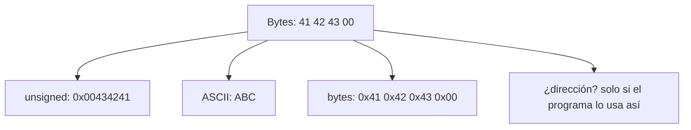

# Arquitectura de Computadores y Ensambladores 1

Escuela de Ingeniería de Ciencias y Sistemas

---
layout: center
---

Arquitectura de Computadores y Ensambladores 1

## Unidad 02
## Bases binarias y representación de datos

Antes de leer registros o memoria, necesitamos entender cómo se representan y almacenan los datos dentro del computador.

Unidad conceptual: bits, bytes, bases, enteros, texto, endianness, direcciones y punteros.

---

# Anuncios importantes

1. **Anuncio 1**

---

# Agenda

1. **Bits, bytes y bases** — Tamaños, decimal, binario y hexadecimal.
2. **Enteros, signo y rangos** — Unsigned, signed, complemento a dos.
3. **Overflow y extensiones** — Carry, borrow, overflow, zero y sign extension.
4. **Texto, endianness y memoria** — ASCII, UTF-8, orden de bytes, direcciones y punteros.

---

# Competencias

### Competencia 1
Analiza el comportamiento de arquitecturas modernas (ARM y RISC-V) utilizando simuladores como Gem5, QEMU, registros e instrucciones optimizando programas a bajo nivel en microprocesadores.

### Competencia 2
El estudiante desarrolla soluciones eficientes en sistemas computacionales integrando arquitectura de computadores, programación en bajo nivel y herramientas modernas de análisis y simulación para resolver problemas complejos en sistemas embebidos e IoT.

---

# Valor de la semana

**Precisión.** Capacidad de trabajar con exactitud en procesos técnicos.

### Aplicación en clase
Fundamental para entender instrucciones y ejecución en bajo nivel. Permite al estudiante interpretar datos exactos en registros y memoria, distinguir representaciones y evitar errores al operar con valores binarios.

---

# Qué buscamos hoy

1. **Tamaños y bases** — Distinguir bit, byte, nibble, word y doubleword; convertir entre bases.
2. **Signed vs unsigned** — Entender por qué `0xFF` puede ser `255` o `-1`.
3. **Efectos aritméticos** — Diferenciar carry, borrow y overflow; aplicar extensiones.
4. **Memoria y direcciones** — Separar dirección, contenido y valor interpretado.

---
layout: section
---

# Bits, bytes y bases

Todo dato visible para un programa termina representado como bits.

---
layout: center
class: text-center
---

### Pregunta de arranque

## ¿Qué significa que un registro tenga 64 bits?

- No es solo un número grande.
- Es la cantidad de posiciones binarias disponibles.
- Determina qué valores puede guardar y cómo los interpreta.

---

# Bit, byte, nibble

Un bit es 0 o 1. Un byte agrupa 8 bits. Un nibble agrupa 4 bits y coincide con un dígito hexadecimal.

- **Bit** — 1 posición: `0` o `1`.
- **Nibble** — 4 bits = 1 dígito hex.
- **Byte** — 8 bits = 2 dígitos hex.

---

# Tamaños en AArch64

- **Byte — 8 bits** — Caracteres, buffers, memoria cruda.
- **Halfword — 16 bits** — Datos pequeños, cargas de 16 bits.
- **Word — 32 bits** — Registros `w0`–`w30`.
- **Doubleword — 64 bits** — Registros `x0`–`x30` y direcciones.

`w0` son los 32 bits bajos de `x0`. No son registros separados.

---

# Tres bases, un mismo valor

```bash
Decimal:     42
Binario:     0b00101010
Hexadecimal: 0x2A
```

- **Decimal** — Dígitos `0` a `9`. Lectura humana común.
- **Binario** — Dígitos `0` y `1`. Forma directa de hablar de bits.
- **Hexadecimal** — Dígitos `0`–`9`, `A`–`F`. Cada dígito = 4 bits exactos.

---

# Leer hexadecimal como bits

```bash
0x2A
  2    A
0010 1010
```

Hexadecimal es cómodo en bajo nivel porque cada dígito representa exactamente 4 bits.

En AArch64: `mov w0, #0x2A` guarda `0x0000002A` en un registro de 32 bits.

---
layout: section
---

# Enteros, signo y rangos

Los bits no cambian; cambia la regla con la que los interpretas.

---
layout: statement
---

# Un patrón de bits no trae etiqueta de "positivo" o "negativo"

---

# Unsigned: solo magnitud

Unsigned usa todos los bits para magnitud no negativa.

$$
0 \le x \le 2^n - 1
$$

- **8 bits** — `0` a `255`
- **32 bits** — `0` a `4 294 967 295`
- **64 bits** — `0` a `~1.8 × 10¹⁹`

---

# Signed: complemento a dos

Signed reserva un rango para negativos usando complemento a dos.

$$
-2^{n-1} \le x \le 2^{n-1} - 1
$$

- **8 bits** — `-128` a `127`
- **32 bits** — `-2 147 483 648` a `2 147 483 647`

---

# El mismo byte, dos lecturas

**Unsigned 8 bits**
- `0x00` → `0`
- `0x7F` → `127`
- `0x80` → `128`
- `0xFF` → `255`

**Signed 8 bits**
- `0x00` → `0`
- `0x7F` → `127`
- `0x80` → `-128`
- `0xFF` → `-1`

`0xFF` no cambia. Lo que cambia es la interpretación.

---

# Complemento a dos: paso a paso

1. Escribe el valor positivo: `00000101` (+5)
2. Invierte los bits: `11111010`
3. Suma 1: `11111011` (-5)

`+1 = 00000001` · `-1 = 11111111` · `+5 = 00000101` · `-5 = 11111011`

---
layout: section
---

# Overflow y extensiones

Cuando el resultado no cabe, los bits visibles se recortan.

---

# Carry, borrow y overflow

- **Carry** — Suma unsigned: acarreo fuera del bit más alto. `0xFF + 0x01 = 0x00` con carry.
- **Borrow** — Resta unsigned: préstamo necesario. `0x00 - 0x01 = 0xFF` con borrow.
- **Overflow** — Aritmética signed: resultado fuera de rango. `127 + 1 = -128` en 8 bits signed.

Carry ayuda a razonar unsigned. Overflow ayuda a razonar signed. No son lo mismo.

---

# Zero extension vs sign extension

**Zero extension**
- Rellena con ceros a la izquierda.
- `0xFF` → `0x000000FF` = 255.
- Conserva valor unsigned.

**Sign extension**
- Copia el bit de signo a la izquierda.
- `0xFF` → `0xFFFFFFFF` = -1.
- Conserva valor signed.

---

# Relación con Wn y Xn

```asm
mov x0, -1      // x0 = 0xFFFFFFFFFFFFFFFF
mov w0, #42     // x0 = 0x000000000000002A
```

Escribir en `w0` limpia los 32 bits altos de `x0`. Muchas instrucciones AArch64 controlan si un valor se extiende con ceros o con signo.

---
layout: section
---

# Bytes y texto

Texto también son bytes, pero no todos los caracteres ocupan un byte.

---

# ASCII básico

- `A` = `0x41` — Decimal 65.
- `a` = `0x61` — Decimal 97.
- `'0'` = `0x30` — Decimal 48. No es el número cero.
- `\n` = `0x0A` — Nueva línea.

El número `0` no es el mismo byte que el carácter `'0'`. El carácter `'0'` se guarda como `0x30`.

---

# ASCII en assembly

```asm
.section .data
ascii:
    .ascii "ABC\n"       // equivale a bytes: 41 42 43 0A

bytes:
    .byte 0x41, 0x42, 0x43, 0x0A
```

Ambas formas producen los mismos bytes en memoria. La diferencia es cómo lo escribes en el fuente.

---
layout: section
---

# Endianness y alineación

El orden de bytes en memoria afecta cómo lees valores de varios bytes.

---

# Little endian vs big endian

Valor de 32 bits: `0x12345678`

**Big endian**
- Byte más significativo primero.
- `12 34 56 78`

**Little endian**
- Byte menos significativo primero.
- `78 56 34 12`

AArch64 Linux trabaja normalmente en little endian. Al inspeccionar memoria, verás los bytes invertidos respecto al valor lógico.

---

# Ejemplo en memoria

```asm
.section .data
numero:
    .word 0x12345678
```

```bash
Dirección      Byte (little endian)
0x400080       78
0x400081       56
0x400082       34
0x400083       12
```

Si lees un `word` desde `0x400080`, el valor interpretado sigue siendo `0x12345678`.

---
layout: section
---

# Direcciones, punteros y memoria

Dirección, contenido y valor no son lo mismo.

---

# Dirección, contenido y valor

- **Dirección** — Número que identifica una ubicación de memoria.
- **Contenido** — Bytes guardados desde esa dirección.
- **Valor** — Interpretación de esos bytes con tamaño y tipo.

```bash
Dirección: 0x400080
Contenido: 2A 00 00 00
Valor como int32 little endian: 42
```

---

# Punteros en AArch64

```asm
.section .data
valor:
    .word 42

.section .text
    adr x0, valor     // x0 recibe la dirección
    ldr w1, [x0]      // w1 recibe el contenido (32 bits)
```

- `adr x0, valor` — Guarda dirección en registro. `x0` contiene un puntero.
- `ldr w1, [x0]` — Lee contenido desde la dirección. `w1` recibe el valor.

---

# Mismos bytes, varias interpretaciones



El depurador muestra bytes. El programador decide la interpretación.

---

# Checklist mental

- Puedo distinguir bit, byte, nibble, word y doubleword.
- Puedo convertir valores pequeños entre decimal, binario y hexadecimal.
- Puedo explicar por qué `0xFF` puede ser `255` o `-1`.
- Puedo distinguir carry, borrow y overflow.
- Puedo distinguir zero extension de sign extension.
- Puedo separar dirección, contenido y valor interpretado.

---

# Siguiente paso

Bits, bytes y bases dominados → Enteros signed y unsigned claros → Extensiones y efectos aritméticos → Registros, instrucciones y modelo de ejecución

---
layout: center
class: text-center
---

### Actividad de cierre

# Preguntas de repaso

- ¿Cuántos bits tiene un doubleword y qué registro AArch64 lo usa?
- ¿Por qué `0xFF` puede interpretarse como `255` o `-1`?
- ¿Qué diferencia hay entre carry y overflow?
- ¿Cómo se ve `0x12345678` en memoria little endian?
- ¿Qué diferencia hay entre dirección, contenido y valor?

---

### Ejemplo Práctico

Verificar interpretaciones con herramientas de terminal y con registros.

1. **Convertir** — `printf "%d\n" 0x2A` → `42`
2. **Ver bytes** — `printf 'ABC\n' | xxd`
3. **Inspeccionar** — `objdump -d build/main` y observar instrucciones.
4. **Registros en GDB** — `info registers x0` y verificar tamaño y valor.

---

# Fuentes

- Página Quarto: `site/courses/aarch64/bases-binarias/`
- Larry D. Pyeatt y William Ughetta, *ARM 64-Bit Assembly Language*
- William Hohl y Christopher Hinds, *ARM Assembly Language: Fundamentals and Techniques*
- Arm, *Learn the Architecture - A64 Instruction Set Architecture Guide*
- `man ascii`, `man xxd`, `man hexdump`
- Slidev, documentación oficial

---
layout: statement
---

# Dudas¿?

---
layout: center
---

# Gracias por tu atención
