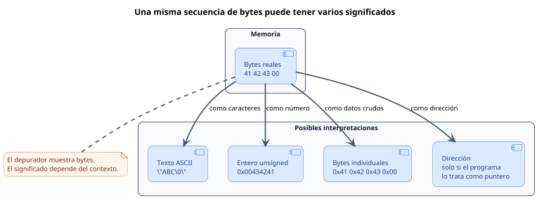

<CoverSlide
  title="Unidad 02 · Bases binarias y representación de datos"
  subtitle="Arquitectura de Computadores y Ensambladores 1"
  note="Escuela de Ingeniería de Ciencias y Sistemas"
/>

---
layout: aarch64-section
---

# Bienvenidos a la Unidad 02

Antes de leer registros o memoria, necesitamos entender cómo se representan y almacenan los datos dentro del computador

---

# Bases binarias y representación de datos

Unidad conceptual: bits, bytes, bases, enteros, texto, endianness, direcciones y punteros.

### Agenda

<v-clicks>

1. **Bits, bytes y bases** — Tamaños, decimal, binario y hexadecimal
2. **Enteros, signo y rangos** — Unsigned, signed, complemento a dos
3. **Overflow y extensiones** — Carry, borrow, overflow, zero y sign extension
4. **Texto, endianness y memoria** — ASCII, UTF-8, orden de bytes, direcciones y punteros

</v-clicks>

---

# Anuncios importantes

<InfoBox type="warning" title="Anuncios">

- **Anuncio 1** — Pendiente por definir

</InfoBox>

---

# Competencias del curso

<InfoBox type="info" title="Competencia 1">

Analiza el comportamiento de arquitecturas modernas (ARM y RISC-V) utilizando simuladores como Gem5, QEMU, registros e instrucciones optimizando programas a bajo nivel en microprocesadores.

</InfoBox>

<InfoBox type="info" title="Competencia 2">

El estudiante desarrolla soluciones eficientes en sistemas computacionales integrando arquitectura de computadores, programación en bajo nivel y herramientas modernas de análisis y simulación para resolver problemas complejos en sistemas embebidos e IoT.

</InfoBox>

---

# Valor de la semana

<InfoBox type="note" title="Precisión">

Capacidad de trabajar con exactitud en procesos técnicos.

</InfoBox>

### Aplicación en clase

Fundamental para entender instrucciones y ejecución en bajo nivel. Permite al estudiante interpretar datos exactos en registros y memoria, distinguir representaciones y evitar errores al operar con valores binarios.

---

# Qué buscamos hoy

<StepList :steps="[
  'Tamaños y bases — Distinguir bit, byte, nibble, word y doubleword; convertir entre bases',
  'Signed vs unsigned — Entender por qué 0xFF puede ser 255 o -1',
  'Efectos aritméticos — Diferenciar carry, borrow y overflow; aplicar extensiones',
  'Memoria y direcciones — Separar dirección, contenido y valor interpretado'
]" />

---
layout: aarch64-section
---

# Bits, bytes y bases

Todo dato visible para un programa termina representado como bits

---
layout: aarch64-question
---

## ¿Qué significa que un registro tenga 64 bits?

<v-clicks>

- No es solo un número grande
- Es la cantidad de posiciones binarias disponibles
- Determina qué valores puede guardar y cómo los interpreta

</v-clicks>

---

# Bit, byte, nibble

<div class="mascot-row">

<div class="mascot-content">

Un bit es 0 o 1. Un byte agrupa 8 bits. Un nibble agrupa 4 bits y coincide con un dígito hexadecimal.

<v-clicks>

- **Bit** — 1 posición: `0` o `1`
- **Nibble** — 4 bits = 1 dígito hex
- **Byte** — 8 bits = 2 dígitos hex

</v-clicks>

</div>


</div>

---

# Tamaños en AArch64

<v-clicks>

- **Byte — 8 bits** — Caracteres, buffers, memoria cruda
- **Halfword — 16 bits** — Datos pequeños, cargas de 16 bits
- **Word — 32 bits** — Registros `w0`–`w30`
- **Doubleword — 64 bits** — Registros `x0`–`x30` y direcciones

</v-clicks>

<InfoBox type="note" title="Importante">

`w0` son los 32 bits bajos de `x0`. No son registros separados.

</InfoBox>

---

# Tres bases, un mismo valor

<CodeBlock title="Tres representaciones del mismo valor" lang="bash">

```bash
Decimal:     42
Binario:     0b00101010
Hexadecimal: 0x2A
```

</CodeBlock>

<v-clicks>

- **Decimal** — Dígitos `0` a `9`. Lectura humana común
- **Binario** — Dígitos `0` y `1`. Forma directa de hablar de bits
- **Hexadecimal** — Dígitos `0`–`9`, `A`–`F`. Cada dígito = 4 bits exactos

</v-clicks>

---

# Leer hexadecimal como bits

<div class="mascot-row">

<div class="mascot-content">

<CodeBlock title="De hex a binario" lang="bash">

```bash
0x2A
  2    A
0010 1010
```

</CodeBlock>

Hexadecimal es cómodo en bajo nivel porque cada dígito representa exactamente 4 bits.

En AArch64: `mov w0, #0x2A` guarda `0x0000002A` en un registro de 32 bits.

</div>


</div>

---
layout: aarch64-section
---

# Enteros, signo y rangos

Los bits no cambian; cambia la regla con la que los interpretas

---
layout: aarch64-statement
---

# Un patrón de bits no trae etiqueta de "positivo" o "negativo"

---

# Unsigned: solo magnitud

Unsigned usa todos los bits para magnitud no negativa.

$$
0 \le x \le 2^n - 1
$$

<v-clicks>

- **8 bits** — `0` a `255`
- **32 bits** — `0` a `4 294 967 295`
- **64 bits** — `0` a `~1.8 × 10¹⁹`

</v-clicks>

---

# Signed: complemento a dos

Signed reserva un rango para negativos usando complemento a dos.

$$
-2^{n-1} \le x \le 2^{n-1} - 1
$$

<v-clicks>

- **8 bits** — `-128` a `127`
- **32 bits** — `-2 147 483 648` a `2 147 483 647`

</v-clicks>

---
layout: aarch64-two-cols
---

# El mismo byte, dos lecturas

::left::

### Unsigned 8 bits

- `0x00` → `0`
- `0x7F` → `127`
- `0x80` → `128`
- `0xFF` → `255`

::right::

### Signed 8 bits

- `0x00` → `0`
- `0x7F` → `127`
- `0x80` → `-128`
- `0xFF` → `-1`

<InfoBox type="note" title="Clave">

`0xFF` no cambia. Lo que cambia es la interpretación.

</InfoBox>

---

# Complemento a dos: paso a paso

<StepList :steps="[
  'Escribe el valor positivo: 00000101 (+5)',
  'Invierte los bits: 11111010',
  'Suma 1: 11111011 (-5)'
]" />

<v-clicks>

- `+1 = 00000001` · `-1 = 11111111`
- `+5 = 00000101` · `-5 = 11111011`

</v-clicks>

---
layout: aarch64-section
---

# Overflow y extensiones

Cuando el resultado no cabe, los bits visibles se recortan

---

# Carry, borrow y overflow

<div class="mascot-row">

<div class="mascot-content">

<v-clicks>

- **Carry** — Suma unsigned: acarreo fuera del bit más alto. `0xFF + 0x01 = 0x00` con carry
- **Borrow** — Resta unsigned: préstamo necesario. `0x00 - 0x01 = 0xFF` con borrow
- **Overflow** — Aritmética signed: resultado fuera de rango. `127 + 1 = -128` en 8 bits signed

</v-clicks>

</div>


</div>

<InfoBox type="note" title="Diferencia clave">

Carry ayuda a razonar unsigned. Overflow ayuda a razonar signed. No son lo mismo.

</InfoBox>

---
layout: aarch64-two-cols
---

# Zero extension vs sign extension

::left::

### Zero extension

- Rellena con ceros a la izquierda
- `0xFF` → `0x000000FF` = 255
- Conserva valor unsigned

::right::

### Sign extension

- Copia el bit de signo a la izquierda
- `0xFF` → `0xFFFFFFFF` = -1
- Conserva valor signed

---

# Relación con Wn y Xn

<CodeAnnotation :annotations="[
  { num: '1', text: 'x0 = -1 → todos los bits en 1 (64 bits)' },
  { num: '2', text: 'Escribir en w0 limpia los 32 bits altos de x0' },
  { num: '3', text: 'x0 = 0x000000000000002A (zero-extension)' }
]">

```asm
mov x0, -1      // 1
mov w0, #42     // 2
                // 3
```

</CodeAnnotation>

<InfoBox type="note" title="Regla de AArch64">

Escribir en `w0` limpia los 32 bits altos de `x0`. Muchas instrucciones AArch64 controlan si un valor se extiende con ceros o con signo.

</InfoBox>

---
layout: aarch64-section
---

# Bytes y texto

Texto también son bytes, pero no todos los caracteres ocupan un byte

---

# ASCII básico

<v-clicks>

- `A` = `0x41` — Decimal 65
- `a` = `0x61` — Decimal 97
- `'0'` = `0x30` — Decimal 48. No es el número cero
- `\n` = `0x0A` — Nueva línea

</v-clicks>

<InfoBox type="warning" title="Cuidado">

El número `0` no es el mismo byte que el carácter `'0'`. El carácter `'0'` se guarda como `0x30`.

</InfoBox>

---

# ASCII en assembly

<CodeAnnotation :annotations="[
  { num: '1', text: '.ascii: forma legible, el ensamblador convierte a bytes' },
  { num: '2', text: '.byte: bytes explícitos, mismo resultado en memoria' },
  { num: '3', text: '41 42 43 0A = A B C \\n' }
]">

```asm
.section .data
ascii:
    .ascii "ABC\n"       // 1

bytes:
    .byte 0x41, 0x42, 0x43, 0x0A  // 2
                                 // 3
```

</CodeAnnotation>

Ambas formas producen los mismos bytes en memoria. La diferencia es cómo lo escribes en el fuente.

---
layout: aarch64-section
---

# Endianness y alineación

El orden de bytes en memoria afecta cómo lees valores de varios bytes

---
layout: aarch64-two-cols
---

# Little endian vs big endian

Valor de 32 bits: `0x12345678`

::left::

### Big endian

- Byte más significativo primero
- `12 34 56 78`

::right::

### Little endian

- Byte menos significativo primero
- `78 56 34 12`

<InfoBox type="note" title="AArch64 Linux">

Trabaja normalmente en little endian. Al inspeccionar memoria, verás los bytes invertidos respecto al valor lógico.

</InfoBox>

---

# Ejemplo en memoria

<CodeBlock title="Código assembly" lang="asm">

```asm
.section .data
numero:
    .word 0x12345678
```

</CodeBlock>

<CodeBlock title="Memoria (little endian)" lang="bash">

```bash
Dirección      Byte
0x400080       78
0x400081       56
0x400082       34
0x400083       12
```

</CodeBlock>

Si lees un `word` desde `0x400080`, el valor interpretado sigue siendo `0x12345678`.

---
layout: aarch64-section
---

# Direcciones, punteros y memoria

Dirección, contenido y valor no son lo mismo

---

# Dirección, contenido y valor

<div class="mascot-row">

<div class="mascot-content">

<v-clicks>

- **Dirección** — Número que identifica una ubicación de memoria
- **Contenido** — Bytes guardados desde esa dirección
- **Valor** — Interpretación de esos bytes con tamaño y tipo

</v-clicks>

<CodeBlock title="Ejemplo" lang="bash">

```bash
Dirección: 0x400080
Contenido: 2A 00 00 00
Valor como int32 little endian: 42
```

</CodeBlock>

</div>


</div>

---

# Punteros en AArch64

<CodeAnnotation :annotations="[
  { num: '1', text: 'valor: etiqueta con el dato .word 42' },
  { num: '2', text: 'adr: carga la dirección de valor en x0 (puntero)' },
  { num: '3', text: 'ldr: lee el contenido desde [x0] en w1 (32 bits)' }
]">

```asm
.section .data
valor:           // 1
    .word 42

.section .text
    adr x0, valor     // 2
    ldr w1, [x0]      // 3
```

</CodeAnnotation>

<v-clicks>

- `adr x0, valor` — Guarda dirección en registro. `x0` contiene un puntero
- `ldr w1, [x0]` — Lee contenido desde la dirección. `w1` recibe el valor

</v-clicks>

---

# Mismos bytes, varias interpretaciones

<div v-click class="w-full flex justify-center">

<div class="w-[86%]">



</div>

</div>

<div class="mascot-row mt-4">

<div class="mascot-content">

El depurador muestra bytes. El programador decide la interpretación.

</div>


</div>

---
layout: aarch64-checklist
---

### Checklist mental

<div class="mascot-row">

<div class="mascot-content">

- <span class="check-icon">✓</span> Puedo distinguir bit, byte, nibble, word y doubleword
- <span class="check-icon">✓</span> Puedo convertir valores pequeños entre decimal, binario y hexadecimal
- <span class="check-icon">✓</span> Puedo explicar por qué `0xFF` puede ser `255` o `-1`
- <span class="check-icon">✓</span> Puedo distinguir carry, borrow y overflow
- <span class="check-icon">✓</span> Puedo distinguir zero extension de sign extension
- <span class="check-icon">✓</span> Puedo separar dirección, contenido y valor interpretado

</div>


</div>

---
layout: aarch64-statement
---

# Siguiente paso: Bits, bytes y bases dominados → Enteros signed y unsigned claros → Extensiones y efectos aritméticos → Registros, instrucciones y modelo de ejecución

---
layout: aarch64-question
---

## Preguntas de repaso

<div class="mascot-row">

<div class="mascot-content">

<v-clicks>

- ¿Cuántos bits tiene un doubleword y qué registro AArch64 lo usa?
- ¿Por qué `0xFF` puede interpretarse como `255` o `-1`?
- ¿Qué diferencia hay entre carry y overflow?
- ¿Cómo se ve `0x12345678` en memoria little endian?
- ¿Qué diferencia hay entre dirección, contenido y valor?

</v-clicks>

</div>


</div>

---

# Ejemplo práctico

Verificar interpretaciones con herramientas de terminal y con registros.

<StepList :steps="[
  'Convertir — printf 0x2A → 42',
  'Ver bytes — printf ABC | xxd',
  'Inspeccionar — objdump -d build/main y observar instrucciones',
  'Registros en GDB — info registers x0 y verificar tamaño y valor'
]" />

---

# Fuentes

- Página Quarto: `site/courses/aarch64/bases-binarias/`
- Larry D. Pyeatt y William Ughetta, *ARM 64-Bit Assembly Language*
- William Hohl y Christopher Hinds, *ARM Assembly Language: Fundamentals and Techniques*
- Arm, *Learn the Architecture - A64 Instruction Set Architecture Guide*
- `man ascii`, `man xxd`, `man hexdump`
- Slidev, documentación oficial

---
layout: aarch64-statement
---

# ¿Dudas?

---

<CoverSlide
  title="Gracias por tu atención"
  subtitle="Arquitectura de Computadores y Ensambladores 1"
/>
