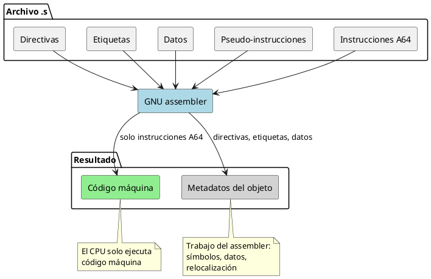

<CoverSlide
  title="Unidad 04 · GNU Assembly, directivas y pseudo-instrucciones"
  subtitle="Arquitectura de Computadores y Ensambladores 1"
  note="Escuela de Ingeniería de Ciencias y Sistemas"
/>

---
layout: aarch64-section
---

# GNU Assembly, directivas y pseudo-instrucciones

No todo lo que aparece en un archivo `.s` llega al procesador como instrucción A64. Separar capas es la clave.

Unidad práctica: archivo .s, secciones, directivas, datos, pseudo-instrucciones y lectura integrada.

---

# Anuncios importantes

<InfoBox type="warning" title="Anuncios">

- **Anuncio 1**

</InfoBox>

---

# Agenda

<v-clicks>

1. **Estructura de un archivo .s** — Comentarios, etiquetas, símbolos y punto de entrada.
2. **Secciones y directivas** — `.text`, `.data`, `.rodata`, `.bss`, `.global`, `.equ`.
3. **Definición de datos** — `.byte`, `.word`, `.quad`, `.ascii`, `.asciz`, `.skip`.
4. **Pseudo-instrucciones y macros** — `ldr =symbol`, `adr`, `adrp + add`, `.include`, `.macro`.
5. **Lectura integrada** — Clasificar un `.s` completo línea por línea.

</v-clicks>

---

# Competencias

<InfoBox type="info" title="Competencia 1">

El estudiante desarrolla soluciones eficientes en sistemas computacionales integrando arquitectura de computadores, programación en bajo nivel y herramientas modernas de análisis y simulación para resolver problemas complejos en sistemas embebidos e IoT.

</InfoBox>

<InfoBox type="info" title="Competencia 2">

Implementa sistemas embebidos orientados a IoT mediante el uso de Raspberry Pi, sensores digitales y comunicación con la nube para resolver problemas reales mediante automatización de procesos.

</InfoBox>

---

# Valor de la semana

<InfoBox type="note" title="Aplicación">

Capacidad de llevar teoría a la práctica.

Relacionar arquitectura con sistemas reales. Permite al estudiante conectar directivas, secciones y pseudo-instrucciones con el binario final que ejecuta el procesador.

</InfoBox>

---

# Qué buscamos hoy

<StepList :steps="[
  'Leer un archivo .s: reconocer comentarios, etiquetas, directivas e instrucciones A64',
  'Separar capas: distinguir qué procesa el assembler y qué ejecuta el CPU',
  'Declarar datos: usar directivas para colocar bytes, words, strings y espacio reservado',
  'Entender atajos: saber que pseudo-instrucciones y macros se resuelven antes de ejecutar'
]" />

---
layout: aarch64-section
---

# Estructura de un archivo .s

Comentarios, etiquetas, símbolos y punto de entrada.

---
layout: aarch64-question
---

## ¿Todo lo que escribes en un .s llega al procesador?

- Algunas líneas son para el assembler.
- Otras nombran direcciones.
- Solo las instrucciones A64 terminan como código máquina.

---

# Archivo mínimo

Un programa AArch64 con lo esencial: directivas, etiqueta e instrucciones.

<CodeAnnotation :annotations="[
  { num: '1', text: 'Hace visible _start al linker' },
  { num: '2', text: 'Sección de código ejecutable' },
  { num: '3', text: 'Etiqueta: punto de entrada' },
  { num: '4', text: 'Instrucciones A64: el CPU las ejecuta' }
]">

```asm {1-2|4|5|7-9}
.global _start
.type _start, %function

.text
_start:
    mov x0, #0          // código de salida
    mov x8, #93         // syscall exit
    svc #0              // entrar al kernel

.size _start, . - _start
```

</CodeAnnotation>

---

# Clasificar cada línea

<v-clicks>

- `.global _start` — Directiva: hace visible el símbolo
- `.text` — Directiva: cambia a sección de código
- `_start:` — Etiqueta: nombra una dirección
- `mov x0, #0` — Instrucción A64: el CPU la ejecuta
- `.size _start, . - _start` — Directiva: calcula tamaño del símbolo

</v-clicks>

<div class="mascot-row mt-4">
<Mascot emotion="leyendo" />
</div>

---

# Etiquetas y símbolos

Etiqueta = nombre de una dirección. No es una variable de alto nivel.

<CodeAnnotation :annotations="[
  { num: '1', text: 'Símbolo constante: el assembler resuelve el nombre' },
  { num: '2', text: 'Símbolo de dirección: nombra el punto de entrada' }
]">

```asm
.equ SYS_exit, 93       // símbolo constante

_start:                  // símbolo de dirección
    mov x8, #SYS_exit   // el assembler resuelve el nombre
```

</CodeAnnotation>

- **Etiqueta** — Termina con `:`. Nombra dirección de código o datos.
- **Constante .equ** — Crea símbolo con valor fijo. Resuelta por el assembler.

---
layout: aarch64-section
---

# Secciones

Dónde colocar código, datos y espacio reservado.

---

# Cuatro secciones principales

<v-clicks>

- `.text` — Instrucciones. Código ejecutable.
- `.data` — Datos inicializados modificables.
- `.rodata` — Datos de solo lectura. Mensajes, tablas constantes.
- `.bss` — Espacio reservado. No escribe bytes en el archivo.

</v-clicks>

<InfoBox type="note" title="Importante">

Las secciones no son decoración. Le dicen al assembler y al linker dónde va cada cosa.

</InfoBox>

---

# Ejemplo integrado de secciones

<CodeAnnotation :annotations="[
  { num: '1', text: 'Sección de código ejecutable' },
  { num: '2', text: 'Datos inicializados modificables' },
  { num: '3', text: 'Datos de solo lectura' },
  { num: '4', text: 'Espacio reservado (no ocupa bytes en archivo)' }
]">

```asm {1-4|6-9|11-13|15-17}
.text
_start:
    mov x0, #0
    svc #0

.data
contador:
    .word 10

.section .rodata
mensaje:
    .asciz "Hola AArch64\n"

.bss
buffer:
    .skip 64
```

</CodeAnnotation>

---
layout: aarch64-section
---

# Directivas básicas

Instrucciones para el assembler, no para el CPU.

---

# Directivas de visibilidad y metadatos

<v-clicks>

- `.global` — Hace visible un símbolo fuera del archivo objeto.
- `.type` — Marca tipo del símbolo para herramientas (`%function`).
- `.size` — Calcula tamaño: `. - _start` = distancia en bytes.
- `.equ` / `.set` — Nombres simbólicos. `.equ SYS_exit, 93`

</v-clicks>

---

# Alineación

<CodeBlock title="Alineación con .balign" lang="asm">

```asm
.balign 4
numero:
    .word 10
```

</CodeBlock>

<InfoBox type="note" title="Nota">

- `.balign 4` — Avanza posición hasta múltiplo de 4 bytes.
- `.balign 8` — Para doublewords de 8 bytes.

Usaremos `.balign` porque el número expresa bytes directamente. Es más clara que `.align` para empezar.

</InfoBox>

---
layout: aarch64-section
---

# Definición de datos

Bytes, words, strings y espacio reservado.

---
layout: aarch64-two-cols
---

# Directivas de datos por tamaño

::left::

### Enteros

- `.byte` — 1 byte
- `.hword` — 2 bytes
- `.word` — 4 bytes
- `.quad` — 8 bytes

::right::

### Texto

- `.ascii` — sin terminador
- `.asciz` — con byte cero

### Espacio

- `.skip N` — reserva N bytes
- `.space N` — equivalente

---

# .ascii vs .asciz

<ComparisonTable
  :headers="['Directiva', 'Bytes', 'Terminador']"
  :rows='[
    [".ascii ABC", "41 42 43", "No"],
    [".asciz ABC", "41 42 43 00", "Sí (byte cero)"]
  ]'
/>

<InfoBox type="warning" title="Cuidado">

No asumas que `.ascii` termina el string. Si necesitas byte cero, usa `.asciz`.

</InfoBox>

---
layout: aarch64-section
---

# Pseudo-instrucciones y direcciones

Atajos que el assembler resuelve antes de ejecutar.

---

# Tres formas de obtener una dirección

<v-clicks>

- `adr x0, sym` — Dirección cercana al PC. Instrucción real.
- `adrp + add` — Construye dirección por página y offset. Dos instrucciones reales.
- `ldr x0, =sym` — Pseudo-instrucción. El assembler elige la estrategia.

</v-clicks>

<InfoBox type="note" title="Importante">

`ldr x0, =mensaje` no carga contenido de memoria. Es un atajo para obtener un valor o dirección.

</InfoBox>

---

# Literal pools

Algunas constantes no caben directamente en una instrucción. El assembler coloca el valor en memoria cercana y genera una carga hacia el registro.

<div v-click class="mt-6 grid grid-cols-3 gap-4 items-center text-sm">

<div class="border border-slate-400 rounded-lg overflow-hidden">
  <div class="bg-slate-700 text-white px-3 py-2 font-semibold">
    Código escrito
  </div>

  <div class="p-4 font-mono bg-slate-100 text-slate-900">
    ldr x0, =0x1122334455667788
  </div>

  <div class="px-4 pb-4 text-slate-700">
    Pseudo-instrucción aceptada por el assembler.
  </div>
</div>

<div class="text-center text-3xl font-bold text-slate-500">
  →
</div>

<div class="border border-blue-400 rounded-lg overflow-hidden">
  <div class="bg-blue-700 text-white px-3 py-2 font-semibold">
    Trabajo del assembler
  </div>

  <div class="p-4 font-mono bg-blue-50 text-blue-950">
    ldr x0, [pc, #offset]
  </div>

  <div class="border-t border-blue-200 p-4 font-mono bg-blue-100 text-blue-950">
    .quad 0x1122334455667788
  </div>
</div>

</div>

<div v-click class="mt-6 border border-orange-300 rounded-lg overflow-hidden">
  <div class="bg-orange-100 text-orange-900 px-4 py-2 font-semibold">
    Idea clave
  </div>

  <div class="p-4 leading-relaxed">
    El CPU no entiende la pseudo-instrucción <code>ldr x0, =...</code>.
    El assembler la convierte en una carga real desde una zona cercana del código llamada
    <strong>literal pool</strong>.
  </div>
</div>

<div class="mascot-row mt-4">
<Mascot emotion="idea" />
</div>

---
layout: aarch64-section
---

# Include y macros

Reutilizar sin esconder lo que el assembler hace.

---

# .include y .macro

::code-group

```asm [constantes.inc]
.equ SYS_exit, 93
.equ EXIT_OK, 0
```

```asm [macro salir]
.macro salir codigo
    mov x0, #\codigo
    mov x8, #93
    svc #0
.endm
```

::

Una macro se expande durante ensamblado. No hay llamada, retorno ni stack frame. No es función.

---
layout: aarch64-section
---

# Lectura integrada

Clasificar un archivo .s completo línea por línea.

---

# Archivo completo

<CodeAnnotation :annotations="[
  { num: '1', text: 'Símbolos constantes para syscalls y valores' },
  { num: '2', text: 'Visibilidad y tipo del punto de entrada' },
  { num: '3', text: 'Sección de código ejecutable' },
  { num: '4', text: 'Preparar argumentos de write (fd, buffer, len)' },
  { num: '5', text: 'Syscall write' },
  { num: '6', text: 'Preparar argumentos de exit' },
  { num: '7', text: 'Syscall exit' },
  { num: '8', text: 'Mensaje en sección de solo lectura' }
]">

```asm {1-4|6-7|9|10-16|18-20|22-24}{maxHeight:'400px'}
.equ SYS_write, 64
.equ SYS_exit, 93
.equ STDOUT, 1
.equ EXIT_OK, 0

.global _start
.type _start, %function

.text
_start:
    mov x0, #STDOUT
    ldr x1, =mensaje
    mov x2, #mensaje_len
    mov x8, #SYS_write
    svc #0

    mov x0, #EXIT_OK
    mov x8, #SYS_exit
    svc #0

.section .rodata
mensaje:
    .ascii "Hola GNU Assembly\n"
mensaje_len = . - mensaje
```

</CodeAnnotation>

---

## Qué ejecuta el CPU vs qué procesa el assembler
El assembler procesa todo. Solo las instrucciones A64 terminan como código que ejecuta el procesador.

<div v-click>



</div>


---
layout: aarch64-checklist
---

# Checklist mental

- <span class="check-icon">✓</span> Puedo distinguir directiva de instrucción A64
- <span class="check-icon">✓</span> Puedo reconocer etiquetas y símbolos
- <span class="check-icon">✓</span> Puedo explicar `.text`, `.data`, `.rodata` y `.bss`
- <span class="check-icon">✓</span> Puedo declarar datos con `.byte`, `.word`, `.ascii`, `.asciz`
- <span class="check-icon">✓</span> Puedo explicar por qué `ldr x0, =symbol` es pseudo-instrucción
- <span class="check-icon">✓</span> Puedo leer un `.s` completo y clasificar cada línea

<div class="mascot-row mt-4">
<Mascot emotion="solucionado" />
</div>

---
layout: aarch64-statement
---

# Siguiente paso

Archivo .s leído y clasificado → Secciones y directivas dominadas → Datos declarados y pseudo-instrucciones claras → Registros, instrucciones y modelo de ejecución

---
layout: aarch64-question
---

## Preguntas de repaso

- ¿Qué diferencia hay entre directiva e instrucción A64?
- ¿Para qué sirve `.global _start`?
- ¿Qué diferencia hay entre `.ascii` y `.asciz`?
- ¿Por qué `ldr x0, =symbol` puede no ser una instrucción real única?
- ¿Qué sección usarías para un buffer de 64 bytes?

<div class="mascot-row mt-4">
<Mascot emotion="pensando" />
</div>

---

# Ejemplo práctico

Ensamblar, inspeccionar y clasificar líneas de un archivo .s real.

<StepList :steps="[
  'Ensamblar: aarch64-linux-gnu-as main.s -o main.o',
  'Enlazar: aarch64-linux-gnu-ld main.o -o main',
  'Inspeccionar: objdump -d main y objdump -s -j .rodata main',
  'Clasificar: marcar directivas, etiquetas, datos e instrucciones'
]" />

---

# Fuentes

- Página Quarto: `site/courses/aarch64/gnu-assembly/`
- Larry D. Pyeatt y William Ughetta, *ARM 64-Bit Assembly Language*
- Arm, *Learn the Architecture - A64 Instruction Set Architecture Guide*
- William Hohl y Christopher Hinds, *ARM Assembly Language: Fundamentals and Techniques*
- `man as`, `info as` — GNU assembler
- Slidev, documentación oficial

---
layout: aarch64-statement
---

# ¿Dudas?

---

<CoverSlide
  title="Gracias por tu atención"
  subtitle="Arquitectura de Computadores y Ensambladores 1"
/>
