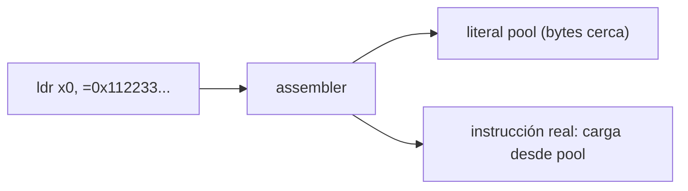
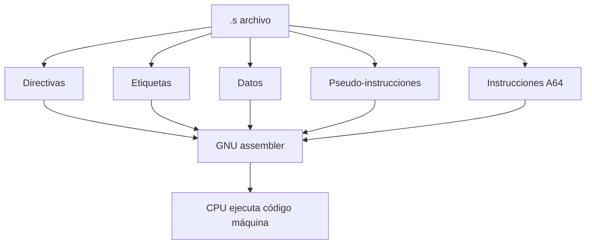

# Arquitectura de Computadores y Ensambladores 1

Escuela de Ingeniería de Ciencias y Sistemas

---
layout: center
---

Arquitectura de Computadores y Ensambladores 1

## Unidad 04
## GNU Assembly, directivas y pseudo-instrucciones

No todo lo que aparece en un archivo `.s` llega al procesador como instrucción A64. Separar capas es la clave.

Unidad práctica: archivo .s, secciones, directivas, datos, pseudo-instrucciones y lectura integrada.

---

# Anuncios importantes

1. **Anuncio 1**

---

# Agenda

1. **Estructura de un archivo .s** — Comentarios, etiquetas, símbolos y punto de entrada.
2. **Secciones y directivas** — `.text`, `.data`, `.rodata`, `.bss`, `.global`, `.equ`.
3. **Definición de datos** — `.byte`, `.word`, `.quad`, `.ascii`, `.asciz`, `.skip`.
4. **Pseudo-instrucciones y macros** — `ldr =symbol`, `adr`, `adrp + add`, `.include`, `.macro`.
5. **Lectura integrada** — Clasificar un `.s` completo línea por línea.

---

# Competencias

### Competencia 1
El estudiante desarrolla soluciones eficientes en sistemas computacionales integrando arquitectura de computadores, programación en bajo nivel y herramientas modernas de análisis y simulación para resolver problemas complejos en sistemas embebidos e IoT.

### Competencia 2
Implementa sistemas embebidos orientados a IoT mediante el uso de Raspberry Pi, sensores digitales y comunicación con la nube para resolver problemas reales mediante automatización de procesos.

---

# Valor de la semana

**Aplicación.** Capacidad de llevar teoría a la práctica.

### Aplicación en clase
Relacionar arquitectura con sistemas reales. Permite al estudiante conectar directivas, secciones y pseudo-instrucciones con el binario final que ejecuta el procesador.

---

# Qué buscamos hoy

1. **Leer un archivo .s** — Reconocer comentarios, etiquetas, directivas e instrucciones A64.
2. **Separar capas** — Distinguir qué procesa el assembler y qué ejecuta el CPU.
3. **Declarar datos** — Usar directivas para colocar bytes, words, strings y espacio reservado.
4. **Entender atajos** — Saber que pseudo-instrucciones y macros se resuelven antes de ejecutar.

---
layout: section
---

# Estructura de un archivo .s

Comentarios, etiquetas, símbolos y punto de entrada.

---
layout: center
class: text-center
---

### Pregunta de arranque

## ¿Todo lo que escribes en un .s llega al procesador?

- Algunas líneas son para el assembler.
- Otras nombran direcciones.
- Solo las instrucciones A64 terminan como código máquina.

---

# Archivo mínimo

Un programa AArch64 con lo esencial: directivas, etiqueta e instrucciones.

```asm {1-2|4-5|7-9|11}
.global _start
.type _start, %function

.text
_start:
    mov x0, #0          // código de salida
    mov x8, #93         // syscall exit
    svc #0              // entrar al kernel

.size _start, . - _start
```

---

# Clasificar cada línea

- `.global _start` — Directiva: hace visible el símbolo.
- `.text` — Directiva: cambia a sección de código.
- `_start:` — Etiqueta: nombra una dirección.
- `mov x0, #0` — Instrucción A64: el CPU la ejecuta.
- `.size _start, . - _start` — Directiva: calcula tamaño del símbolo.

---

# Etiquetas y símbolos

Etiqueta = nombre de una dirección. No es una variable de alto nivel.

```asm
.equ SYS_exit, 93       // símbolo constante

_start:                  // símbolo de dirección
    mov x8, #SYS_exit   // el assembler resuelve el nombre
```

- **Etiqueta** — Termina con `:`. Nombra dirección de código o datos.
- **Constante .equ** — Crea símbolo con valor fijo. Resuelta por el assembler.

---
layout: section
---

# Secciones

Dónde colocar código, datos y espacio reservado.

---

# Cuatro secciones principales

- `.text` — Instrucciones. Código ejecutable.
- `.data` — Datos inicializados modificables.
- `.rodata` — Datos de solo lectura. Mensajes, tablas constantes.
- `.bss` — Espacio reservado. No escribe bytes en el archivo.

Las secciones no son decoración. Le dicen al assembler y al linker dónde va cada cosa.

---

# Ejemplo integrado de secciones

```asm {1-4|6-9|11-13|15-17}
.text
_start:
    mov x0, #0
    svc #0

.data
contador:
    .word 10

.section .rodata
mensaje:
    .asciz "Hola AArch64\n"

.bss
buffer:
    .skip 64
```

---
layout: section
---

# Directivas básicas

Instrucciones para el assembler, no para el CPU.

---

# Directivas de visibilidad y metadatos

- `.global` — Hace visible un símbolo fuera del archivo objeto.
- `.type` — Marca tipo del símbolo para herramientas (`%function`).
- `.size` — Calcula tamaño: `. - _start` = distancia en bytes.
- `.equ` / `.set` — Nombres simbólicos. `.equ SYS_exit, 93`

---

# Alineación

```asm
.balign 4
numero:
    .word 10
```

- `.balign 4` — Avanza posición hasta múltiplo de 4 bytes.
- `.balign 8` — Para doublewords de 8 bytes.

Usaremos `.balign` porque el número expresa bytes directamente. Es más clara que `.align` para empezar.

---
layout: section
---

# Definición de datos

Bytes, words, strings y espacio reservado.

---

# Directivas de datos por tamaño

**Enteros**
- `.byte` — 1 byte
- `.hword` — 2 bytes
- `.word` — 4 bytes
- `.quad` — 8 bytes

**Texto**
- `.ascii` — sin terminador
- `.asciz` — con byte cero

**Espacio**
- `.skip N` — reserva N bytes
- `.space N` — equivalente

---

# .ascii vs .asciz

- `.ascii "ABC"` — Bytes: `41 42 43`. Sin terminador automático.
- `.asciz "ABC"` — Bytes: `41 42 43 00`. Agrega byte cero al final.

No asumas que `.ascii` termina el string. Si necesitas byte cero, usa `.asciz`.

---
layout: section
---

# Pseudo-instrucciones y direcciones

Atajos que el assembler resuelve antes de ejecutar.

---

# Tres formas de obtener una dirección

- `adr x0, sym` — Dirección cercana al PC. Instrucción real.
- `adrp + add` — Construye dirección por página y offset. Dos instrucciones reales.
- `ldr x0, =sym` — Pseudo-instrucción. El assembler elige la estrategia.

`ldr x0, =mensaje` no carga contenido de memoria. Es un atajo para obtener un valor o dirección.

---

# Literal pools

Algunas constantes no caben en una instrucción. El assembler coloca un literal cerca y genera una carga.



El CPU ejecuta una instrucción de carga. El literal pool es trabajo previo del assembler.

---
layout: section
---

# Include y macros

Reutilizar sin esconder lo que el assembler hace.

---

# .include y .macro

**.include**
```asm
// constantes.inc
.equ SYS_exit, 93
.equ EXIT_OK, 0
```

**.macro**
```asm
.macro salir codigo
    mov x0, #\codigo
    mov x8, #93
    svc #0
.endm
```

Una macro se expande durante ensamblado. No hay llamada, retorno ni stack frame. No es función.

---
layout: section
---

# Lectura integrada

Clasificar un archivo .s completo línea por línea.

---

# Archivo completo

```asm {1-4|6-7|9-10|11-15|17-19|21-24}
.equ SYS_write, 64
.equ SYS_exit, 93
.equ STDOUT, 1
.equ EXIT_OK, 0

.global _start
.type _start, %function

.text
_start:
    mov x0, #STDOUT
    ldr x1, =mensaje
    mov x2, #mensaje_len
    mov x8, #SYS_write
    svc #0

    mov x0, #EXIT_OK
    mov x8, #SYS_exit
    svc #0

.section .rodata
mensaje:
    .ascii "Hola GNU Assembly\n"
mensaje_len = . - mensaje
```

---

# Qué ejecuta el CPU vs qué procesa el assembler



El assembler procesa todo. Solo las instrucciones A64 terminan como código que ejecuta el procesador.

---

# Checklist mental

- Puedo distinguir directiva de instrucción A64.
- Puedo reconocer etiquetas y símbolos.
- Puedo explicar `.text`, `.data`, `.rodata` y `.bss`.
- Puedo declarar datos con `.byte`, `.word`, `.ascii`, `.asciz`.
- Puedo explicar por qué `ldr x0, =symbol` es pseudo-instrucción.
- Puedo leer un `.s` completo y clasificar cada línea.

---

# Siguiente paso

Archivo .s leído y clasificado → Secciones y directivas dominadas → Datos declarados y pseudo-instrucciones claras → Registros, instrucciones y modelo de ejecución

---
layout: center
class: text-center
---

### Actividad de cierre

# Preguntas de repaso

- ¿Qué diferencia hay entre directiva e instrucción A64?
- ¿Para qué sirve `.global _start`?
- ¿Qué diferencia hay entre `.ascii` y `.asciz`?
- ¿Por qué `ldr x0, =symbol` puede no ser una instrucción real única?
- ¿Qué sección usarías para un buffer de 64 bytes?

---

### Ejemplo Práctico

Ensamblar, inspeccionar y clasificar líneas de un archivo .s real.

1. **Ensamblar** — `aarch64-linux-gnu-as main.s -o main.o`
2. **Enlazar** — `aarch64-linux-gnu-ld main.o -o main`
3. **Inspeccionar** — `objdump -d main` y `objdump -s -j .rodata main`
4. **Clasificar** — Marcar directivas, etiquetas, datos e instrucciones.

---

# Fuentes

- Página Quarto: `site/courses/aarch64/gnu-assembly/`
- Larry D. Pyeatt y William Ughetta, *ARM 64-Bit Assembly Language*
- Arm, *Learn the Architecture - A64 Instruction Set Architecture Guide*
- William Hohl y Christopher Hinds, *ARM Assembly Language: Fundamentals and Techniques*
- `man as`, `info as` — GNU assembler
- Slidev, documentación oficial

---
layout: statement
---

# Dudas¿?

---
layout: center
---

# Gracias por tu atención
