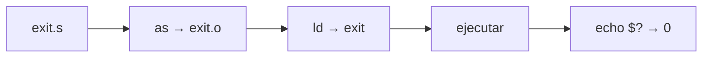
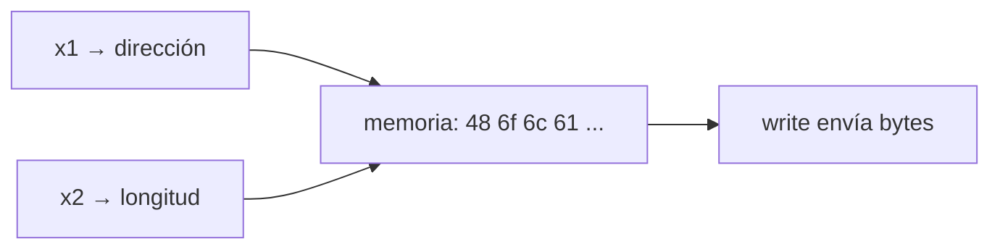
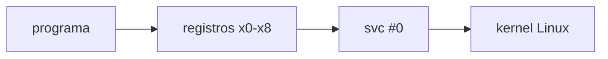

# Arquitectura de Computadores y Ensambladores 1

Escuela de Ingeniería de Ciencias y Sistemas

---
layout: center
---

Arquitectura de Computadores y Ensambladores 1

## Unidad 05
## Primeros programas en Linux AArch64

El laboratorio se convierte en programas reales: `exit`, `write`, registros de syscall y `svc #0`.

Unidad práctica: programa mínimo, hello world, stdout/stderr, _start vs main y lectura de syscalls.

---

# Anuncios importantes

1. **Anuncio 1**

---

# Agenda

1. **Programa mínimo con exit** — Ensamblar, enlazar, ejecutar y verificar código de salida.
2. **Hello World con write** — Escribir bytes en stdout sin printf.
3. **stdout, stderr y exit codes** — Destinos de escritura vs resultado del proceso.
4. **_start, main y libc** — Por qué no usamos runtime de C.
5. **Lectura guiada de syscalls** — Clasificar registros usados por exit y write.

---

# Competencias

### Competencia 1
Identifica los conceptos fundamentales del lenguaje ensamblador ARM-64 mediante el análisis del vocabulario básico, tipos de datos y registros del procesador para comprender la arquitectura y funcionamiento interno del hardware.

### Competencia 2
Configura entornos de desarrollo para programación en ensamblador ARM-64 instalando y verificando herramientas en Linux como GAS, GDB y Make para establecer un ambiente funcional de compilación y depuración de código.

---

# Valor de la semana

**Aplicación.** Capacidad de llevar teoría a la práctica.

### Aplicación en clase
Relacionar arquitectura con sistemas reales. Cada programa de esta unidad conecta registros, syscalls y herramientas con un resultado observable en Linux.

---

# Qué buscamos hoy

1. **Escribir y ejecutar** — Crear un programa AArch64 que termina con `exit` y verificar con `echo $?`.
2. **Imprimir texto** — Usar `write` para enviar bytes a `stdout` sin `printf`.
3. **Entender registros de syscall** — Saber qué va en `x0`, `x1`, `x2`, `x8` y para qué sirve `svc #0`.
4. **Distinguir _start de main** — Entender por qué estos programas no usan runtime de C.

---
layout: section
---

# Programa mínimo con exit

El programa más pequeño útil: solo le dice al kernel que terminó.

---
layout: center
class: text-center
---

### Pregunta de arranque

## ¿Cuál es el programa AArch64 más corto que hace algo real?

- No necesita imprimir nada.
- Solo necesita terminar de forma definida.
- Linux necesita saber que el proceso acabó.

---

# exit.s

Tres instrucciones: código de salida, número de syscall y entrada al kernel.

```asm {1-3|5-6|7-9}
.global _start

.text
_start:
    mov x0, #0          // código de salida
    mov x8, #93         // syscall exit
    svc #0              // entrar al kernel
```

- `x0 = 0` — Código de salida que recibirá el shell.
- `x8 = 93` — Número de syscall `exit` en Linux AArch64.
- `svc #0` — Cambia al kernel. Linux lee `x8` y ejecuta la syscall.

---

# Flujo: ensamblar, enlazar, ejecutar



Flujo completo: código fuente → objeto → ejecutable → resultado observable.

**x86_64 + QEMU**
```bash
aarch64-linux-gnu-as exit.s -o exit.o
aarch64-linux-gnu-ld exit.o -o exit
qemu-aarch64 ./exit
echo $?
```

**ARM64 nativo**
```bash
as exit.s -o exit.o
ld exit.o -o exit
./exit
echo $?
```

---

# Cambiar el código de salida

```asm
_start:
    mov x0, #7          // cambia código de salida
    mov x8, #93
    svc #0
```

```bash
echo $?
# Resultado: 7
```

`echo $?` muestra el código del último comando. Si ejecutas otro comando antes, ya no verás el resultado de tu programa.

---
layout: section
---

# Hello World con write

Ahora el programa produce salida visible usando syscall directa.

---

# hello.s

```asm {1-5|7-11|13-14|16-18}
.global _start

.text
_start:
    // syscall write
    mov x0, #1          // stdout
    ldr x1, =mensaje    // dirección del mensaje
    mov x2, #len        // cantidad de bytes
    mov x8, #64         // syscall write
    svc #0

    // syscall exit
    mov x0, #0          // código de salida
    mov x8, #93         // syscall exit
    svc #0

.section .rodata
mensaje:
    .ascii "Hola AArch64\n"
len = . - mensaje
```

---

# Registros de write

- `x0 = 1` — File descriptor: `stdout`.
- `x1 = dirección` — Dónde empiezan los bytes del mensaje.
- `x2 = len` — Cuántos bytes debe escribir el kernel.
- `x8 = 64` — Número de syscall `write`.

`svc #0` no imprime por sí solo. La impresión ocurre porque `x8 = 64` y los argumentos están preparados.

---

# Dirección no es contenido

`ldr x1, =mensaje` prepara una dirección en `x1`. No copia el texto dentro del registro.



`write` usa la dirección y la longitud para leer bytes desde memoria.

---
layout: section
---

# stdout, stderr y exit codes

No son lo mismo: destino de escritura vs resultado del proceso.

---

# File descriptors básicos

- `0` — stdin — Entrada estándar.
- `1` — stdout — Salida normal.
- `2` — stderr — Salida de error.

`x0 = 1` en `write` significa stdout. `x0 = 1` en `exit` significa código de salida. El significado depende de `x8`.

---

# Escribir en stderr

```asm
_start:
    mov x0, #2          // stderr (no stdout)
    ldr x1, =mensaje
    mov x2, #len
    mov x8, #64
    svc #0

    mov x0, #1          // exit code 1
    mov x8, #93
    svc #0
```

- **Destino** — `x0 = 2` antes de `write`. El mensaje va a stderr.
- **Resultado** — `x0 = 1` antes de `exit`. `echo $?` muestra `1`.

---
layout: section
---

# _start, main y libc

Por qué estos programas no usan runtime de C.

---

# _start vs main

**Nuestros programas**
- Entrada: `_start`
- Sin runtime de C.
- Syscalls directas.
- Enlazamos con `ld` solo.

**Programas con libc**
- Runtime prepara entorno.
- Llama a `main`.
- Usa `printf`, `malloc`, etc.
- Enlaza con `gcc` (incluye libc).

---

# Por qué no usamos printf

`printf` no es syscall. Es función de biblioteca. Agrega formato, buffering y capas intermedias.



Sin libc, la relación con Linux queda visible y directa.

---
layout: section
---

# Lectura guiada de syscalls

Patrón general: preparar registros, poner syscall en x8, ejecutar svc #0.

---

# Patrón de syscall

**Secuencia general**
1. Preparar argumentos en `x0`, `x1`, `x2`...
2. Poner número de syscall en `x8`.
3. Ejecutar `svc #0`.
4. Linux lee `x8` y ejecuta la syscall.

**exit (x8 = 93)**
- `x0` = código de salida

**write (x8 = 64)**
- `x0` = fd
- `x1` = dirección
- `x2` = bytes

---

# Checklist mental

- Puedo escribir un programa que termina con `exit`.
- Puedo ensamblar con `as` y enlazar con `ld`.
- Puedo escribir texto con `write` en `stdout`.
- Puedo distinguir `stdout` de `stderr` y de código de salida.
- Puedo explicar `x0`, `x1`, `x2`, `x8` y `svc #0`.
- Puedo distinguir `_start` de `main`.

---

# Siguiente paso

Programa mínimo con exit → Hello World con write → stdout, stderr y exit codes → Aritmética, lógica y control de flujo

---
layout: center
class: text-center
---

### Actividad de cierre

# Preguntas de repaso

- ¿Qué registro contiene el número de syscall?
- ¿Qué diferencia hay entre `x0 = 1` en `write` y `x0 = 1` en `exit`?
- ¿Qué hace `svc #0` por sí solo, sin contexto de registros?
- ¿Por qué no usamos `printf` en estos programas?
- ¿Qué pasa si un programa no llama `exit`?

---

### Ejemplo Práctico

Escribir, ensamblar, ejecutar y modificar programas con exit y write.

1. **exit.s** — Escribir programa mínimo, ejecutar y ver `echo $?`.
2. **hello.s** — Agregar `write` y verificar salida en terminal.
3. **Modificar** — Cambiar mensaje, destino (`stderr`) y código de salida.
4. **Clasificar** — Leer registros de cada syscall e identificar su papel.

---

# Fuentes

- Página Quarto: `site/courses/aarch64/primeros-programas/`
- Larry D. Pyeatt y William Ughetta, *ARM 64-Bit Assembly Language*
- Arm, *Learn the Architecture - A64 Instruction Set Architecture Guide*
- Linux, *syscall(2)* — convención de llamada AArch64
- `man strace` — observar syscalls en ejecución
- Slidev, documentación oficial

---
layout: statement
---

# Dudas¿?

---
layout: center
---

# Gracias por tu atención
