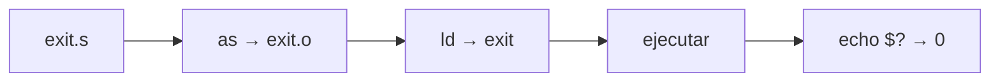
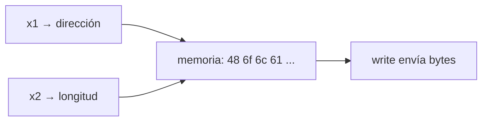
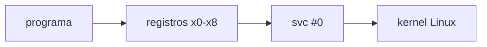

<style>
@import "../styles/index.css";
</style>

<div class="ecys-cover-bg"></div>

<div class="ecys-title-cover">

<div class="muted">Escuela de Ingeniería de Ciencias y Sistemas</div>

# Arquitectura de Computadores y Ensambladores 1

</div>

---
layout: center
---

<div class="muted">Arquitectura de Computadores y Ensambladores 1</div>

## Unidad 05
## Primeros programas en Linux AArch64

El laboratorio se convierte en programas reales: `exit`, `write`,
registros de syscall y `svc #0`.

<div class="cover-note">
Unidad práctica: programa mínimo, hello world, stdout/stderr, _start vs main y lectura de syscalls.
</div>

---

# Anuncios importantes

<div class="numbered-grid">
  <div class="numbered-card">
    <div class="card-number">1</div>
    <h3>Anuncio 1</h3>
    <p></p>
  </div>
</div>

---

# Agenda

<div class="numbered-grid">
  <div class="numbered-card">
    <div class="card-number">1</div>
    <h3>Programa mínimo con exit</h3>
    <p>Ensamblar, enlazar, ejecutar y verificar código de salida.</p>
  </div>

  <div class="numbered-card">
    <div class="card-number">2</div>
    <h3>Hello World con write</h3>
    <p>Escribir bytes en stdout sin printf.</p>
  </div>

  <div class="numbered-card">
    <div class="card-number">3</div>
    <h3>stdout, stderr y exit codes</h3>
    <p>Destinos de escritura vs resultado del proceso.</p>
  </div>

  <div class="numbered-card">
    <div class="card-number">4</div>
    <h3>_start, main y libc</h3>
    <p>Por qué no usamos runtime de C.</p>
  </div>

  <div class="numbered-card">
    <div class="card-number">5</div>
    <h3>Lectura guiada de syscalls</h3>
    <p>Clasificar registros usados por exit y write.</p>
  </div>
</div>

---

# Competencias

<div class="concept-grid vertical-center">
  <div class="concept-card">
    <h3>Competencia 1</h3>
    <p>
      Identifica los conceptos fundamentales del lenguaje ensamblador ARM-64
      mediante el análisis del vocabulario básico, tipos de datos y registros
      del procesador para comprender la arquitectura y funcionamiento interno
      del hardware.
    </p>
  </div>

  <div class="concept-card">
    <h3>Competencia 2</h3>
    <p>
      Configura entornos de desarrollo para programación en ensamblador ARM-64
      instalando y verificando herramientas en Linux como GAS, GDB y Make para
      establecer un ambiente funcional de compilación y depuración de código.
    </p>
  </div>
</div>

---

# Valor de la semana

<div class="callout tip">
  <strong>Aplicación.</strong>
  Capacidad de llevar teoría a la práctica.
</div>

<div class="concept-grid">
  <div class="concept-card">
    <h3>Aplicación en clase</h3>
    <p>
      Relacionar arquitectura con sistemas reales. Cada programa de esta
      unidad conecta registros, syscalls y herramientas con un resultado
      observable en Linux.
    </p>
  </div>
</div>

---

# Qué buscamos hoy

<div class="slide-center-block">

<div class="objective-grid">
  <div v-click class="objective-item">
    <div class="item-number">1</div>
    <h3>Escribir y ejecutar</h3>
    <p>Crear un programa AArch64 que termina con <code>exit</code> y verificar con <code>echo $?</code>.</p>
  </div>

  <div v-click class="objective-item">
    <div class="item-number">2</div>
    <h3>Imprimir texto</h3>
    <p>Usar <code>write</code> para enviar bytes a <code>stdout</code> sin <code>printf</code>.</p>
  </div>

  <div v-click class="objective-item">
    <div class="item-number">3</div>
    <h3>Entender registros de syscall</h3>
    <p>Saber qué va en <code>x0</code>, <code>x1</code>, <code>x2</code>, <code>x8</code> y para qué sirve <code>svc #0</code>.</p>
  </div>

  <div v-click class="objective-item">
    <div class="item-number">4</div>
    <h3>Distinguir _start de main</h3>
    <p>Entender por qué estos programas no usan runtime de C.</p>
  </div>
</div>

</div>

---
layout: section
---

# Programa mínimo con exit

El programa más pequeño útil: solo le dice al kernel que terminó.

---
layout: center
class: text-center
---

<div class="big-question">
  <div class="muted">Pregunta de arranque</div>
  <h3>¿Cuál es el programa AArch64 más corto que hace algo real?</h3>
  <div class="question-points">
    <div v-click>No necesita imprimir nada.</div>
    <div v-click>Solo necesita terminar de forma definida.</div>
    <div v-click>Linux necesita saber que el proceso acabó.</div>
  </div>
</div>

---

# exit.s

<div class="lead-text">
Tres instrucciones: código de salida, número de syscall y entrada al kernel.
</div>

```asm {1-3|5-6|7-9}
.global _start

.text
_start:
    mov x0, #0          // código de salida
    mov x8, #93         // syscall exit
    svc #0              // entrar al kernel
```

<div class="concept-grid">
  <div v-click class="concept-card">
    <h3><code>x0 = 0</code></h3>
    <p>Código de salida que recibirá el shell.</p>
  </div>
  <div v-click class="concept-card">
    <h3><code>x8 = 93</code></h3>
    <p>Número de syscall <code>exit</code> en Linux AArch64.</p>
  </div>
  <div v-click class="concept-card">
    <h3><code>svc #0</code></h3>
    <p>Cambia al kernel. Linux lee <code>x8</code> y ejecuta la syscall.</p>
  </div>
</div>

---

# Flujo: ensamblar, enlazar, ejecutar

<div class="slide-center-block">

<div class="diagram-block">



<div class="diagram-caption">
Flujo completo: código fuente → objeto → ejecutable → resultado observable.
</div>

</div>

<div class="compare-grid">
  <div v-click class="compare-card">
    <div class="card-kicker">x86_64 + QEMU</div>

```bash {1|2|3|4}
aarch64-linux-gnu-as exit.s -o exit.o
aarch64-linux-gnu-ld exit.o -o exit
qemu-aarch64 ./exit
echo $?
```

  </div>
  <div v-click class="compare-card">
    <div class="card-kicker">ARM64 nativo</div>

```bash {1|2|3|4}
as exit.s -o exit.o
ld exit.o -o exit
./exit
echo $?
```

  </div>
</div>

</div>

---

# Cambiar el código de salida

<div class="slide-center-block">

<div class="content-stack-lg">

```asm
_start:
    mov x0, #7          // cambia código de salida
    mov x8, #93
    svc #0
```

```bash
echo $?
# Resultado: 7
```

<div v-click class="callout warning centered-narrow">
<code>echo $?</code> muestra el código del último comando. Si ejecutas otro comando antes, ya no verás el resultado de tu programa.
</div>

</div>

</div>

---
layout: section
---

# Hello World con write

Ahora el programa produce salida visible usando syscall directa.

---

# hello.s

```asm {1-5|7-11|13-14|16-18}
.global _start

.text
_start:
    // syscall write
    mov x0, #1          // stdout
    ldr x1, =mensaje    // dirección del mensaje
    mov x2, #len        // cantidad de bytes
    mov x8, #64         // syscall write
    svc #0

    // syscall exit
    mov x0, #0          // código de salida
    mov x8, #93         // syscall exit
    svc #0

.section .rodata
mensaje:
    .ascii "Hola AArch64\n"
len = . - mensaje
```

---

# Registros de write

<div class="slide-center-block">

<div class="concept-grid">
  <div v-click class="concept-card">
    <h3><code>x0 = 1</code></h3>
    <p>File descriptor: <code>stdout</code>.</p>
  </div>
  <div v-click class="concept-card">
    <h3><code>x1 = dirección</code></h3>
    <p>Dónde empiezan los bytes del mensaje.</p>
  </div>
  <div v-click class="concept-card">
    <h3><code>x2 = len</code></h3>
    <p>Cuántos bytes debe escribir el kernel.</p>
  </div>
  <div v-click class="concept-card">
    <h3><code>x8 = 64</code></h3>
    <p>Número de syscall <code>write</code>.</p>
  </div>
</div>

<div v-click class="callout info centered-narrow">
<code>svc #0</code> no imprime por sí solo. La impresión ocurre porque <code>x8 = 64</code> y los argumentos están preparados.
</div>

</div>

---

# Dirección no es contenido

<div class="slide-center-block">

<div class="content-stack-lg">

<div class="key-idea centered-narrow">

<code>ldr x1, =mensaje</code> prepara una dirección en <code>x1</code>. No copia el texto dentro del registro.

</div>

<div class="diagram-block">



<div class="diagram-caption">
<code>write</code> usa la dirección y la longitud para leer bytes desde memoria.
</div>

</div>

</div>

</div>

---
layout: section
---

# stdout, stderr y exit codes

No son lo mismo: destino de escritura vs resultado del proceso.

---

# File descriptors básicos

<div class="slide-center-block">

<div class="concept-grid">
  <div v-click class="concept-card">
    <h3><code>0</code> — stdin</h3>
    <p>Entrada estándar.</p>
  </div>
  <div v-click class="concept-card">
    <h3><code>1</code> — stdout</h3>
    <p>Salida normal.</p>
  </div>
  <div v-click class="concept-card">
    <h3><code>2</code> — stderr</h3>
    <p>Salida de error.</p>
  </div>
</div>

<div v-click class="callout warning centered-narrow">
<code>x0 = 1</code> en <code>write</code> significa stdout. <code>x0 = 1</code> en <code>exit</code> significa código de salida. El significado depende de <code>x8</code>.
</div>

</div>

---

# Escribir en stderr

<div class="slide-center-block">

<div class="content-stack-lg">

```asm
_start:
    mov x0, #2          // stderr (no stdout)
    ldr x1, =mensaje
    mov x2, #len
    mov x8, #64
    svc #0

    mov x0, #1          // exit code 1
    mov x8, #93
    svc #0
```

<div class="compare-grid">
  <div v-click class="compare-card">
    <div class="card-kicker">Destino</div>
    <ul>
      <li><code>x0 = 2</code> antes de <code>write</code></li>
      <li>El mensaje va a stderr.</li>
    </ul>
  </div>
  <div v-click class="compare-card">
    <div class="card-kicker">Resultado</div>
    <ul>
      <li><code>x0 = 1</code> antes de <code>exit</code></li>
      <li><code>echo $?</code> muestra <code>1</code>.</li>
    </ul>
  </div>
</div>

</div>

</div>

---
layout: section
---

# _start, main y libc

Por qué estos programas no usan runtime de C.

---

# _start vs main

<div class="slide-center-block">

<div class="compare-grid">
  <div v-click class="compare-card">
    <div class="card-kicker">Nuestros programas</div>
    <ul>
      <li>Entrada: <code>_start</code></li>
      <li>Sin runtime de C.</li>
      <li>Syscalls directas.</li>
      <li>Enlazamos con <code>ld</code> solo.</li>
    </ul>
  </div>
  <div v-click class="compare-card">
    <div class="card-kicker">Programas con libc</div>
    <ul>
      <li>Runtime prepara entorno.</li>
      <li>Llama a <code>main</code>.</li>
      <li>Usa <code>printf</code>, <code>malloc</code>, etc.</li>
      <li>Enlaza con <code>gcc</code> (incluye libc).</li>
    </ul>
  </div>
</div>

</div>

---

# Por qué no usamos printf

<div class="slide-center-block">

<div class="content-stack-lg">

<div class="key-idea centered-narrow">

<code>printf</code> no es syscall. Es función de biblioteca. Agrega formato, buffering y capas intermedias.

</div>

<div class="diagram-block">



<div class="diagram-caption">
Sin libc, la relación con Linux queda visible y directa.
</div>

</div>

</div>

</div>

---
layout: section
---

# Lectura guiada de syscalls

Patrón general: preparar registros, poner syscall en x8, ejecutar svc #0.

---

##### Patrón de syscall

<div class="slide-center-block">

<div class="two-column-layout">

<div class="content-stack-md">

<div class="muted">Secuencia general</div>

<div class="reveal-list">
  <div v-click class="reveal-item">1. Preparar argumentos en <code>x0</code>, <code>x1</code>, <code>x2</code>...</div>
  <div v-click class="reveal-item">2. Poner número de syscall en <code>x8</code>.</div>
  <div v-click class="reveal-item">3. Ejecutar <code>svc #0</code>.</div>
  <div v-click class="reveal-item">4. Linux lee <code>x8</code> y ejecuta la syscall.</div>
</div>

</div>

<div class="content-stack-md">

<div class="compare-grid compare-grid-stacked">
  <div v-click class="compare-card">
    <div class="card-kicker">exit (x8 = 93)</div>
    <ul>
      <li><code>x0</code> = código de salida</li>
    </ul>
  </div>

  <div v-click class="compare-card">
    <div class="card-kicker">write (x8 = 64)</div>
    <ul>
      <li><code>x0</code> = fd</li>
      <li><code>x1</code> = dirección</li>
      <li><code>x2</code> = bytes</li>
    </ul>
  </div>
</div>

</div>

</div>

</div>

---

# Checklist mental

<div class="slide-center-block">

<div class="reveal-list centered-narrow">
  <div v-click class="reveal-item">Puedo escribir un programa que termina con <code>exit</code>.</div>
  <div v-click class="reveal-item">Puedo ensamblar con <code>as</code> y enlazar con <code>ld</code>.</div>
  <div v-click class="reveal-item">Puedo escribir texto con <code>write</code> en <code>stdout</code>.</div>
  <div v-click class="reveal-item">Puedo distinguir <code>stdout</code> de <code>stderr</code> y de código de salida.</div>
  <div v-click class="reveal-item">Puedo explicar <code>x0</code>, <code>x1</code>, <code>x2</code>, <code>x8</code> y <code>svc #0</code>.</div>
  <div v-click class="reveal-item">Puedo distinguir <code>_start</code> de <code>main</code>.</div>
</div>

</div>

---

# Siguiente paso

<div class="slide-center-block">

<div class="flow-column">
  <div v-click class="flow-step">Programa mínimo con exit</div>
  <div v-click class="flow-arrow">→</div>
  <div v-click class="flow-step">Hello World con write</div>
  <div v-click class="flow-arrow">→</div>
  <div v-click class="flow-step">stdout, stderr y exit codes</div>
  <div v-click class="flow-arrow">→</div>
  <div v-click class="flow-step">Aritmética, lógica y control de flujo</div>
</div>

</div>

---
layout: center
class: text-center
---

<div class="muted">Actividad de cierre</div>

# Preguntas de repaso

<div class="question-points mx-auto mt-6 max-w-2xl text-left">
  <div v-click>¿Qué registro contiene el número de syscall?</div>
  <div v-click>¿Qué diferencia hay entre <code>x0 = 1</code> en <code>write</code> y <code>x0 = 1</code> en <code>exit</code>?</div>
  <div v-click>¿Qué hace <code>svc #0</code> por sí solo, sin contexto de registros?</div>
  <div v-click>¿Por qué no usamos <code>printf</code> en estos programas?</div>
  <div v-click>¿Qué pasa si un programa no llama <code>exit</code>?</div>
</div>

---

###### Ejemplo Práctico

<div class="slide-center-block">

<div class="content-stack-lg">

<div class="key-idea centered-narrow">
  <div class="muted">Actividad guiada</div>
  <p>Escribir, ensamblar, ejecutar y modificar programas con exit y write.</p>
</div>

<div class="concept-grid concept-grid-4">
  <div v-click class="concept-card">
    <h3>exit.s</h3>
    <p>Escribir programa mínimo, ejecutar y ver <code>echo $?</code>.</p>
  </div>

  <div v-click class="concept-card">
    <h3>hello.s</h3>
    <p>Agregar <code>write</code> y verificar salida en terminal.</p>
  </div>

  <div v-click class="concept-card">
    <h3>Modificar</h3>
    <p>Cambiar mensaje, destino (<code>stderr</code>) y código de salida.</p>
  </div>

  <div v-click class="concept-card">
    <h3>Clasificar</h3>
    <p>Leer registros de cada syscall e identificar su papel.</p>
  </div>
</div>

</div>

</div>

---

# Fuentes

- Página Quarto: `site/courses/aarch64/primeros-programas/`
- Larry D. Pyeatt y William Ughetta, *ARM 64-Bit Assembly Language*
- Arm, *Learn the Architecture - A64 Instruction Set Architecture Guide*
- Linux, *syscall(2)* — convención de llamada AArch64
- `man strace` — observar syscalls en ejecución
- Slidev, documentación oficial

---
layout: statement
---

# Dudas¿?

---
layout: center
---

# Gracias por tu atención
