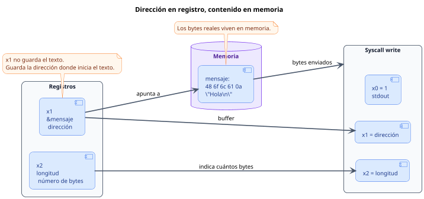
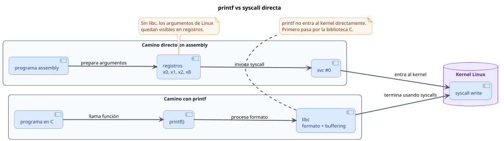

<CoverSlide
  title="Unidad 05 · Primeros programas en Linux AArch64"
  subtitle="Arquitectura de Computadores y Ensambladores 1"
  note="Escuela de Ingeniería de Ciencias y Sistemas"
/>

---
layout: aarch64-section
---

# Primeros programas en Linux AArch64

El laboratorio se convierte en programas reales: `exit`, `write`, registros de syscall y `svc #0`.

Unidad práctica: programa mínimo, hello world, stdout/stderr, _start vs main y lectura de syscalls.

---

# Anuncios importantes

<InfoBox type="warning" title="Anuncios">

- **Anuncio 1**

</InfoBox>

---

# Agenda

<v-clicks>

1. **Programa mínimo con exit** — Ensamblar, enlazar, ejecutar y verificar código de salida.
2. **Hello World con write** — Escribir bytes en stdout sin printf.
3. **stdout, stderr y exit codes** — Destinos de escritura vs resultado del proceso.
4. **_start, main y libc** — Por qué no usamos runtime de C.
5. **Lectura guiada de syscalls** — Clasificar registros usados por exit y write.

</v-clicks>

---

# Competencias

<InfoBox type="info" title="Competencia 1">

Identifica los conceptos fundamentales del lenguaje ensamblador ARM-64 mediante el análisis del vocabulario básico, tipos de datos y registros del procesador para comprender la arquitectura y funcionamiento interno del hardware.

</InfoBox>

<InfoBox type="info" title="Competencia 2">

Configura entornos de desarrollo para programación en ensamblador ARM-64 instalando y verificando herramientas en Linux como GAS, GDB y Make para establecer un ambiente funcional de compilación y depuración de código.

</InfoBox>

---

# Valor de la semana

<InfoBox type="note" title="Aplicación">

Capacidad de llevar teoría a la práctica.

Cada programa de esta unidad conecta registros, syscalls y herramientas con un resultado observable en Linux.

</InfoBox>

---

# Qué buscamos hoy

<StepList :steps="[
  'Escribir y ejecutar: crear un programa AArch64 que termina con exit y verificar con echo $?',
  'Imprimir texto: usar write para enviar bytes a stdout sin printf',
  'Entender registros de syscall: saber qué va en x0, x1, x2, x8 y para qué sirve svc #0',
  'Distinguir _start de main: entender por qué estos programas no usan runtime de C'
]" />

---
layout: aarch64-section
---

# Programa mínimo con exit

El programa más pequeño útil: solo le dice al kernel que terminó.

---
layout: aarch64-question
---

## ¿Cuál es el programa AArch64 más corto que hace algo real?

- No necesita imprimir nada.
- Solo necesita terminar de forma definida.
- Linux necesita saber que el proceso acabó.

---

# exit.s

Tres instrucciones: código de salida, número de syscall y entrada al kernel.

<CodeAnnotation :annotations="[
  { num: '1', text: 'x0 = 0 → código de salida para el shell' },
  { num: '2', text: 'x8 = 93 → syscall exit en Linux AArch64' },
  { num: '3', text: 'svc #0 → trap al kernel, Linux lee x8 y ejecuta' }
]">

```asm {1-3|5-6|7-9}
.global _start

.text
_start:
    mov x0, #0          // código de salida
    mov x8, #93         // syscall exit
    svc #0              // entrar al kernel
```

</CodeAnnotation>

---

# Flujo: ensamblar, enlazar, ejecutar

```plantuml
@startuml
scale 0.88

title De código fuente a resultado observable

left to right direction

skinparam backgroundColor transparent
skinparam shadowing false
skinparam roundcorner 16
skinparam defaultFontName Arial
skinparam defaultFontSize 12

skinparam artifact {
  BorderColor #334155
  BackgroundColor #f8fafc
  FontColor #0f172a
}

skinparam rectangle {
  BorderColor #2563eb
  BackgroundColor #dbeafe
  FontColor #1e3a8a
}

skinparam database {
  BorderColor #7c3aed
  BackgroundColor #ede9fe
  FontColor #4c1d95
}

skinparam note {
  BorderColor #f97316
  BackgroundColor #fff7ed
  FontColor #7c2d12
}

skinparam arrow {
  Color #475569
  Thickness 2
}

artifact "exit.s\ncódigo fuente AArch64" as SRC

rectangle "GNU assembler\nas" as AS
artifact "exit.o\narchivo objeto" as OBJ

rectangle "Linker\nld" as LD
database "exit\nbinario ELF ejecutable" as ELF

rectangle "Linux\ncarga y ejecuta" as RUN
artifact "echo $?\n0" as RESULT

SRC --> AS : ensambla
AS --> OBJ : genera
OBJ --> LD : entrada
LD --> ELF : enlaza
ELF --> RUN : ./exit
RUN --> RESULT : código de salida

note bottom of OBJ
Contiene código máquina,
símbolos y metadatos,
pero aún no es el ejecutable final.
end note

note bottom of ELF
El linker produce un binario ELF
que Linux puede cargar como proceso.
end note

@enduml
```

<div v-click class="w-full flex justify-center mt-4">

<div class="w-[92%]">



</div>

</div>

<div v-click class="mt-4 text-lg leading-relaxed">

El flujo completo transforma `exit.s` en un archivo objeto `exit.o`, luego en un ejecutable ELF llamado `exit`, y finalmente permite observar el resultado mediante el código de salida del proceso.

</div>

::code-group

```bash [x86_64 + QEMU]
aarch64-linux-gnu-as exit.s -o exit.o
aarch64-linux-gnu-ld exit.o -o exit
qemu-aarch64 ./exit
echo $?
```

```bash [ARM64 nativo]
as exit.s -o exit.o
ld exit.o -o exit
./exit
echo $?
```

::

---

# Cambiar el código de salida

<CodeBlock title="exit.s con código de salida 7" lang="asm">

```asm
_start:
    mov x0, #7          // cambia código de salida
    mov x8, #93
    svc #0
```

</CodeBlock>

<InfoBox type="note" title="Nota">

`echo $?` muestra el código del último comando. Si ejecutas otro comando antes, ya no verás el resultado de tu programa.

</InfoBox>

---
layout: aarch64-section
---

# Hello World con write

Ahora el programa produce salida visible usando syscall directa.

---

# hello.s

<CodeAnnotation :annotations="[
  { num: '1', text: 'Preparar argumentos de write: fd, dirección, longitud' },
  { num: '2', text: 'x8 = 64 → syscall write' },
  { num: '3', text: 'Preparar argumentos de exit: código 0' },
  { num: '4', text: 'Mensaje en sección de solo lectura' }
]">

```asm {1-5|7-11|13-14|16-18}
.global _start

.text
_start:
    // syscall write
    mov x0, #1          // stdout
    ldr x1, =mensaje    // dirección del mensaje
    mov x2, #len        // cantidad de bytes
    mov x8, #64         // syscall write
    svc #0

    // syscall exit
    mov x0, #0          // código de salida
    mov x8, #93         // syscall exit
    svc #0

.section .rodata
mensaje:
    .ascii "Hola AArch64\n"
len = . - mensaje
```

</CodeAnnotation>

---

# Registros de write

<v-clicks>

- `x0 = 1` — File descriptor: `stdout`
- `x1 = dirección` — Dónde empiezan los bytes del mensaje
- `x2 = len` — Cuántos bytes debe escribir el kernel
- `x8 = 64` — Número de syscall `write`

</v-clicks>

<InfoBox type="note" title="Importante">

`svc #0` no imprime por sí solo. La impresión ocurre porque `x8 = 64` y los argumentos están preparados.

</InfoBox>

<div class="mascot-row mt-4">
<Mascot emotion="leyendo" />
</div>

---

# Dirección no es contenido

`ldr x1, =mensaje` prepara una dirección en `x1`. No copia el texto dentro del registro.

<div v-click class="w-full flex justify-center mt-4">

<div class="w-[90%]">



</div>

</div>

---

# Puntero vs contenido

<div v-click class="mt-4 text-lg leading-relaxed">

En `write`, el registro `x1` funciona como **puntero al buffer**: contiene la dirección inicial de `mensaje`.
El registro `x2` indica cuántos bytes debe leer Linux desde esa dirección.

</div>

<InfoBox type="note" title="Concepto clave">

`write` usa la dirección y la longitud para leer bytes desde memoria. El registro solo apunta, no contiene el texto.

</InfoBox>

---
layout: aarch64-section
---

# stdout, stderr y exit codes

No son lo mismo: destino de escritura vs resultado del proceso.

---

# File descriptors básicos

<v-clicks>

- `0` — stdin — Entrada estándar
- `1` — stdout — Salida normal
- `2` — stderr — Salida de error

</v-clicks>

<InfoBox type="note" title="Contexto importa">

`x0 = 1` en `write` significa stdout. `x0 = 1` en `exit` significa código de salida. El significado depende de `x8`.

</InfoBox>

---

# Escribir en stderr

<CodeBlock title="stderr + exit code 1" lang="asm">

```asm
_start:
    mov x0, #2          // stderr (no stdout)
    ldr x1, =mensaje
    mov x2, #len
    mov x8, #64
    svc #0

    mov x0, #1          // exit code 1
    mov x8, #93
    svc #0
```

</CodeBlock>

<v-clicks>

- **Destino** — `x0 = 2` antes de `write`. El mensaje va a stderr
- **Resultado** — `x0 = 1` antes de `exit`. `echo $?` muestra `1`

</v-clicks>

---
layout: aarch64-section
---

# _start, main y libc

Por qué estos programas no usan runtime de C.

---
layout: aarch64-two-cols
---

# _start vs main

::left::

### Nuestros programas

- Entrada: `_start`
- Sin runtime de C
- Syscalls directas
- Enlazamos con `ld` solo

::right::

### Programas con libc

- Runtime prepara entorno
- Llama a `main`
- Usa `printf`, `malloc`, etc.
- Enlaza con `gcc` (incluye libc)

---

# Por qué no usamos printf

`printf` no es syscall. Es función de biblioteca. Agrega formato, buffering y capas intermedias.

<div v-click class="w-full flex justify-center mt-4">

<div class="w-[92%]">



</div>

</div>

<InfoBox v-click type="note" title="Ventaja">

Sin libc, la relación con Linux queda visible y directa: el programa coloca argumentos en registros, ejecuta `svc #0` y el kernel atiende la syscall.

</InfoBox>

---
layout: aarch64-section
---

# Lectura guiada de syscalls

Patrón general: preparar registros, poner syscall en x8, ejecutar svc #0.

---

# Patrón de syscall

<StepList :steps="[
  'Preparar argumentos en x0, x1, x2...',
  'Poner número de syscall en x8',
  'Ejecutar svc #0',
  'Linux lee x8 y ejecuta la syscall'
]" />

<div class="grid grid-cols-2 gap-4 mt-4">

<SyscallCard
  number="93"
  name="exit"
  :args="['código de salida']"
  description="Termina el proceso."
/>

<SyscallCard
  number="64"
  name="write"
  :args="['fd (stdout=1)', 'dirección del buffer', 'cantidad de bytes']"
  description="Escribe bytes a un file descriptor."
/>

</div>

---
layout: aarch64-checklist
---

# Checklist mental

- <span class="check-icon">✓</span> Puedo escribir un programa que termina con `exit`
- <span class="check-icon">✓</span> Puedo ensamblar con `as` y enlazar con `ld`
- <span class="check-icon">✓</span> Puedo escribir texto con `write` en `stdout`
- <span class="check-icon">✓</span> Puedo distinguir `stdout` de `stderr` y de código de salida
- <span class="check-icon">✓</span> Puedo explicar `x0`, `x1`, `x2`, `x8` y `svc #0`
- <span class="check-icon">✓</span> Puedo distinguir `_start` de `main`

<div class="mascot-row mt-4">
<Mascot emotion="solucionado" />
</div>

---
layout: aarch64-statement
---

# Siguiente paso

Programa mínimo con exit → Hello World con write → stdout, stderr y exit codes → Aritmética, lógica y control de flujo

---
layout: aarch64-question
---

## Preguntas de repaso

- ¿Qué registro contiene el número de syscall?
- ¿Qué diferencia hay entre `x0 = 1` en `write` y `x0 = 1` en `exit`?
- ¿Qué hace `svc #0` por sí solo, sin contexto de registros?
- ¿Por qué no usamos `printf` en estos programas?
- ¿Qué pasa si un programa no llama `exit`?

<div class="mascot-row mt-4">
<Mascot emotion="pensando" />
</div>

---

# Ejemplo práctico

Escribir, ensamblar, ejecutar y modificar programas con exit y write.

<StepList :steps="[
  'exit.s: escribir programa mínimo, ejecutar y ver echo $?',
  'hello.s: agregar write y verificar salida en terminal',
  'Modificar: cambiar mensaje, destino (stderr) y código de salida',
  'Clasificar: leer registros de cada syscall e identificar su papel'
]" />

---

# Fuentes

- Página Quarto: `site/courses/aarch64/primeros-programas/`
- Larry D. Pyeatt y William Ughetta, *ARM 64-Bit Assembly Language*
- Arm, *Learn the Architecture - A64 Instruction Set Architecture Guide*
- Linux, *syscall(2)* — convención de llamada AArch64
- `man strace` — observar syscalls en ejecución
- Slidev, documentación oficial

---

<ActivityRegister />

---
layout: aarch64-statement
---

# ¿Dudas?

---

<CoverSlide
  title="Gracias por tu atención"
  subtitle="Arquitectura de Computadores y Ensambladores 1"
/>
