<CoverSlide
  title="Unidad 06 · Memoria básica, secciones y direccionamiento"
  subtitle="Arquitectura de Computadores y Ensambladores 1"
  note="Escuela de Ingeniería de Ciencias y Sistemas"
/>

---
layout: aarch64-section
---

# Memoria básica, secciones y direccionamiento

AArch64 es load/store: la ALU trabaja con registros y la memoria se toca de forma explícita.

Unidad práctica: dirección vs contenido, secciones, ldr/str, tamaños, modos de direccionamiento y arrays.

---

# Anuncios importantes

<InfoBox type="warning" title="Anuncios">

- **Anuncio 1**

</InfoBox>

---

# Agenda

<v-clicks>

1. **Dirección y contenido** — Memoria como bytes, punteros y diferencia entre cargar dirección y contenido.
2. **Secciones y mapa de memoria** — `.text`, `.rodata`, `.data`, `.bss`, stack y heap.
3. **Load/store básico** — `ldr`, `str`, cargar-modificar-guardar.
4. **Tamaños y modos de direccionamiento** — `ldrb`, `ldrh`, `ldrsw`, offsets, pre-index y post-index.
5. **Arrays y recorrido** — Base + índice × tamaño, escalas y lectura guiada.

</v-clicks>

---

# Competencias

<InfoBox type="info" title="Competencia 1">

Aplica el set de instrucciones ARM-64 utilizando instrucciones aritméticas, lógicas, de carga/almacenamiento, desplazamientos y rotaciones para construir programas funcionales que manipulen datos a nivel de registros y memoria.

</InfoBox>

<InfoBox type="info" title="Competencia 2">

Analiza el comportamiento de arquitecturas modernas (ARM y RISC-V) utilizando simuladores como Gem5, QEMU, registros e instrucciones optimizando programas a bajo nivel en microprocesadores.

</InfoBox>

---

# Valor de la semana

<InfoBox type="note" title="Precisión">

Exactitud al escribir y ejecutar instrucciones a nivel de máquina.

En ensamblador, un error de un bit o una instrucción mal escrita puede producir resultados completamente inesperados. La precisión es esencial al trabajar con instrucciones aritméticas, lógicas y de memoria.

</InfoBox>

---

# Qué buscamos hoy

<StepList :steps="[
  'Dirección vs contenido: distinguir dirección, contenido y valor interpretado en memoria',
  'Load/store: cargar datos a registros y escribir resultados de vuelta a memoria',
  'Tamaños de acceso: elegir ldrb, ldrh, ldr w o ldr x según el dato',
  'Direccionamiento y arrays: calcular offsets, usar escalas y recorrer memoria con post-index'
]" />

---
layout: aarch64-section
---

# Dirección y contenido

La primera regla: una dirección dice dónde mirar; el contenido dice qué bytes hay allí.

---
layout: aarch64-question
---

## ¿Qué diferencia hay entre cargar una dirección y cargar lo que hay en esa dirección?

- Una dirección es un número que indica posición.
- El contenido son bytes guardados en esa posición.
- El valor depende de la instrucción y el tamaño de lectura.

---

# Memoria como arreglo de bytes

<CodeBlock title="Bytes en memoria" lang="bash">

```bash
Dirección:   0x400120  0x400121  0x400122  0x400123
Contenido:      2A        00        00        00
```

</CodeBlock>

<v-clicks>

- **Dirección** — Número que indica posición. Ej: `0x400120`
- **Contenido** — Bytes guardados. Ej: `2A 00 00 00`
- **Valor** — Interpretación. Ej: `42` como int32 LE

</v-clicks>

---

# Cargar dirección vs cargar contenido

<CodeAnnotation :annotations="[
  { num: '1', text: 'x0 = dirección donde empieza valor (puntero)' },
  { num: '2', text: 'x1 = contenido de 64 bits guardado en esa dirección' }
]">

```asm {1-4|6-9}
.data
valor:
    .quad 42

.text
_start:
    ldr x0, =valor    // x0 = dirección donde empieza valor
    ldr x1, [x0]      // x1 = contenido de 64 bits guardado allí
```

</CodeAnnotation>

---

# La diferencia está en los corchetes

<v-clicks>

- **Sin corchetes** — `ldr x0, =valor` → Obtienes la **dirección** asociada al símbolo
- **Con corchetes** — `ldr x1, [x0]` → Lees el **contenido** almacenado en esa dirección

</v-clicks>

<InfoBox type="note" title="Regla de oro">

Los corchetes indican acceso a memoria: "ve a esa dirección y lee lo que hay allí".

</InfoBox>

<div class="mascot-row mt-4">
<Mascot emotion="leyendo" />
</div>

---
layout: aarch64-section
---

# Secciones y mapa de memoria

Dónde viven código, datos constantes, datos modificables y espacio reservado.

---

# Mapa inicial de memoria

<MemoryMap :animate="true" :regions="[
  { label: 'Stack', start: '0x7FFF...FFFF', end: 'crece ↓', color: 'blue' },
  { label: 'Heap', start: 'fin .bss', end: 'crece ↑', color: 'green' },
  { label: '.bss', start: 'datos no inicializados', end: '', color: 'yellow' },
  { label: '.data', start: 'datos inicializados', end: '', color: 'purple' },
  { label: '.rodata', start: 'solo lectura', end: '', color: 'gray' },
  { label: '.text', start: '0x00400000', end: 'código', color: 'red' }
]" />

<v-clicks>

- **Stack** — Existe desde `_start`. `sp` apunta a esta zona
- **Heap** — Memoria dinámica futura. No la usaremos aún

</v-clicks>

---
layout: aarch64-section
---

# Load/store básico

AArch64 calcula en registros y accede a memoria con instrucciones explícitas.

---

# Arquitectura load/store

```plantuml
@startuml
scale 0.90

title Arquitectura load/store: memoria, registros y ALU

left to right direction

skinparam backgroundColor transparent
skinparam shadowing false
skinparam roundcorner 16
skinparam defaultFontName Arial
skinparam defaultFontSize 12

skinparam rectangle {
  BorderColor #334155
  BackgroundColor #f8fafc
  FontColor #0f172a
}

skinparam component {
  BorderColor #2563eb
  BackgroundColor #dbeafe
  FontColor #1e3a8a
}

skinparam database {
  BorderColor #7c3aed
  BackgroundColor #ede9fe
  FontColor #4c1d95
}

skinparam note {
  BorderColor #f97316
  BackgroundColor #fff7ed
  FontColor #7c2d12
}

skinparam arrow {
  Color #475569
  Thickness 2
}

database "Memoria" as MEM1 {
  component "dato\n[address]" as DATA
}

rectangle "Load" as LOAD_STAGE {
  component "LDR\ncargar desde memoria" as LDR
}

rectangle "Registros" as REGS1 {
  component "X0\noperando A" as X0
  component "X1\noperando B" as X1
}

rectangle "ALU" as ALU_STAGE {
  component "ADD / SUB / AND\noperación sobre registros" as ALU
}

rectangle "Registros" as REGS2 {
  component "X2\nresultado" as X2
}

rectangle "Store" as STORE_STAGE {
  component "STR\nguardar en memoria" as STR
}

database "Memoria" as MEM2 {
  component "resultado\n[address]" as RESULT
}

DATA --> LDR : leer bytes
LDR --> X0 : coloca valor en registro
X0 --> ALU
X1 --> ALU
ALU --> X2 : produce resultado
X2 --> STR : valor a guardar
STR --> RESULT : escribe bytes

note bottom of ALU
La ALU no opera directamente
sobre variables en memoria.
Opera sobre registros.
end note

@enduml
```

<div v-click class="w-full flex justify-center mt-4">

<div class="w-[92%]">



</div>

</div>

<InfoBox v-click type="note" title="Load/store">

La ALU trabaja con registros. Si un valor está en memoria, primero lo cargas con `LDR`. Si quieres conservar el resultado, lo escribes de vuelta con `STR`.

</InfoBox>

---

# Patrón cargar-modificar-guardar

<CodeAnnotation :annotations="[
  { num: '1', text: 'Cargar dirección del contador' },
  { num: '2', text: 'Cargar contenido al registro' },
  { num: '3', text: 'Modificar en registro' },
  { num: '4', text: 'Guardar resultado en memoria' }
]">

```asm {1|2|3|4}
ldr x0, =contador
ldr x1, [x0]       // cargar
add x1, x1, #1     // modificar
str x1, [x0]       // guardar
```

</CodeAnnotation>

<StepList :steps="[
  'Cargar dirección',
  'Cargar contenido al registro',
  'Modificar en registro',
  'Guardar resultado en memoria'
]" />

---
layout: aarch64-section
---

# Tamaños de acceso

La instrucción decide cuántos bytes leer o escribir.

---

# Instrucciones por tamaño

<v-clicks>

- `ldrb` / `strb` — 1 byte
- `ldrh` / `strh` — 2 bytes (halfword)
- `ldr w` / `str w` — 4 bytes (word)
- `ldr x` / `str x` — 8 bytes (doubleword)

</v-clicks>

---

# Mismos bytes, lecturas distintas

<CodeAnnotation :annotations="[
  { num: '1', text: 'w1 = 0x11 (1 byte)' },
  { num: '2', text: 'w2 = 0x2211 (2 bytes, little-endian)' },
  { num: '3', text: 'w3 = 0x44332211 (4 bytes, little-endian)' }
]">

```asm {1-4|6-8|9|10|11}
.data
bytes:
    .byte 0x11, 0x22, 0x33, 0x44

.text
_start:
    ldr x0, =bytes
    ldrb w1, [x0]    // w1 = 0x11
    ldrh w2, [x0]    // w2 = 0x2211 (little-endian)
    ldr  w3, [x0]    // w3 = 0x44332211
```

</CodeAnnotation>

<div class="mascot-row mt-4">
<Mascot emotion="sorprendido" />
</div>

<InfoBox type="note" title="Concepto clave">

No existe "leer una variable". Existen instrucciones que leen 1, 2, 4 u 8 bytes desde una dirección. Elegir tamaño correcto es parte del programa.

</InfoBox>

---

# ldrsw: sign extension a 64 bits

<ComparisonTable
  :headers="['Instrucción', 'Lee', 'Extensión', '0xFFFFFFFF →']"
  :rows='[
    ["ldr w1, [x0]", "32 bits", "Limpia mitad alta", "0x00000000FFFFFFFF"],
    ["ldrsw x2, [x0]", "32 bits", "Extiende signo", "0xFFFFFFFFFFFFFFFF"]
  ]'
/>

<InfoBox type="note" title="Importante">

La diferencia no está en los bytes guardados. Está en cómo se extiende el valor al registro de 64 bits.

</InfoBox>

---
layout: aarch64-section
---

# Modos de direccionamiento

Cómo AArch64 calcula la dirección efectiva de un acceso a memoria.

---

# Formas principales

<v-clicks>

- `[x0]` — Base sola. Dirección en `x0`
- `[x0, #8]` — Offset inmediato. `x0 + 8`
- `[x0, x1]` — Offset en registro. `x0 + x1`
- `[x0, x1, lsl #3]` — Offset escalado. `x0 + x1 × 8`
- `[x0, #8]!` — Pre-index. Actualiza `x0`, luego lee
- `[x0], #8` — Post-index. Lee, luego actualiza `x0`

</v-clicks>

---
layout: aarch64-two-cols
---

# Pre-index vs post-index

::left::

### Pre-index `[x0, #8]!`

- Primero: `x0 = x0 + 8`
- Luego: lee desde nuevo `x0`
- Avanza el puntero antes del acceso

::right::

### Post-index `[x0], #8`

- Primero: lee desde `x0` actual
- Luego: `x0 = x0 + 8`
- Avanza el puntero después del acceso

<InfoBox type="note" title="Tip">

Post-index es cómodo para recorrer memoria linealmente: lee y avanza en una sola instrucción.

</InfoBox>

---
layout: aarch64-section
---

# Arrays y recorrido

Un array es memoria consecutiva. La dirección del elemento depende de base + índice × tamaño.

---

# Fórmula de acceso a arrays

$$
\text{dir}[i] = \text{base} + i \times \text{tamaño}
$$

**Escalas comunes**
- `.byte` — sin escala
- `.word` — `lsl #2` (×4)
- `.quad` — `lsl #3` (×8)

<CodeAnnotation :annotations="[
  { num: '1', text: 'Cargar dirección base del array' },
  { num: '2', text: 'Índice = 2 (tercer elemento)' },
  { num: '3', text: 'Acceso escalado: x0 + x1 × 8 → array[2] = 30' }
]">

```asm {1-3|5-6|7}
.data
array:
    .quad 10, 20, 30, 40

.text
_start:
    ldr x0, =array
    mov x1, #2              // índice
    ldr x2, [x0, x1, lsl #3]
    // x2 = array[2] = 30
```

</CodeAnnotation>

---

# Recorrido con post-index

<CodeAnnotation :annotations="[
  { num: '1', text: 'x1 = array[0], luego x0 avanza 8 bytes' },
  { num: '2', text: 'x2 = array[1], luego x0 avanza 8 bytes' },
  { num: '3', text: 'x3 = array[2], luego x0 avanza 8 bytes' }
]">

```asm {1|2|3|4}
ldr x0, =array
ldr x1, [x0], #8    // x1 = array[0], x0 avanza
ldr x2, [x0], #8    // x2 = array[1], x0 avanza
ldr x3, [x0], #8    // x3 = array[2], x0 avanza
```

</CodeAnnotation>

<StepList :steps="[
  'Inicio: x0 → array[0]',
  'Después 1: x0 → array[1]',
  'Después 2: x0 → array[2]',
  'Después 3: x0 → después del array'
]" />

---

# ldp y stp: pares de registros

<CodeBlock title="Carga de pares" lang="asm">

```asm
.data
pares:
    .quad 11, 22

.text
_start:
    ldr x0, =pares
    ldp x1, x2, [x0]    // x1 = 11, x2 = 22
```

</CodeBlock>

<InfoBox type="note" title="Nota">

`ldp` carga dos registros consecutivos. `stp` guarda dos. Aparecerán mucho con stack frames.

</InfoBox>

---
layout: aarch64-checklist
---

# Checklist mental

- <span class="check-icon">✓</span> Puedo distinguir dirección, contenido y valor
- <span class="check-icon">✓</span> Puedo cargar una dirección con `ldr =symbol`
- <span class="check-icon">✓</span> Puedo cargar contenido con `ldr xN, [xM]`
- <span class="check-icon">✓</span> Puedo escribir memoria con `str`
- <span class="check-icon">✓</span> Puedo elegir entre `ldrb`, `ldrh`, `ldr` y `ldrsw`
- <span class="check-icon">✓</span> Puedo calcular offsets para arrays
- <span class="check-icon">✓</span> Puedo distinguir pre-index de post-index

<div class="mascot-row mt-4">
<Mascot emotion="solucionado" />
</div>

---
layout: aarch64-statement
---

# Siguiente paso

Dirección vs contenido dominados → Load/store y tamaños claros → Modos de direccionamiento y arrays → Control de flujo, stack y funciones

---
layout: aarch64-question
---

## Preguntas de repaso

- ¿Qué diferencia hay entre `ldr x0, =valor` y `ldr x1, [x0]`?
- ¿Qué lee `ldrb w1, [x0]` vs `ldr w2, [x0]` desde los mismos bytes?
- ¿Qué escala usarías para un array de `.word`?
- ¿Qué diferencia hay entre pre-index y post-index?
- ¿Por qué AArch64 se llama arquitectura load/store?

<div class="mascot-row mt-4">
<Mascot emotion="pensando" />
</div>

---

# Ejemplo práctico

Declarar datos, cargar, modificar, guardar y recorrer un array en AArch64.

<StepList :steps="[
  'Cargar: ldr x0, =dato y ldr x1, [x0] para dirección y contenido',
  'Modificar: add x1, x1, #1 y str x1, [x0] para leer-modificar-guardar',
  'Recorrer: array con post-index: ldr x1, [x0], #8 y acumular',
  'Inspeccionar: objdump -s -j .data para ver bytes antes y después'
]" />

---

# Fuentes

- Página Quarto: `site/courses/aarch64/memoria-direccionamiento/`
- Larry D. Pyeatt y William Ughetta, *ARM 64-Bit Assembly Language*
- Arm, *Learn the Architecture - A64 Instruction Set Architecture Guide*
- William Hohl y Christopher Hinds, *ARM Assembly Language: Fundamentals and Techniques*
- `man objdump`, `man readelf` — inspección de secciones y datos
- Slidev, documentación oficial

---
layout: aarch64-statement
---

# ¿Dudas?

---

<CoverSlide
  title="Gracias por tu atención"
  subtitle="Arquitectura de Computadores y Ensambladores 1"
/>
