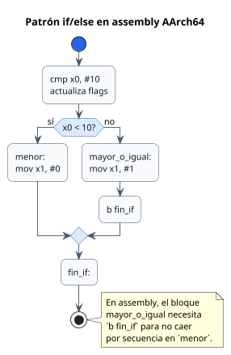

<CoverSlide
  title="Unidad 08 · Control de flujo y programación estructurada"
  subtitle="Arquitectura de Computadores y Ensambladores 1"
  note="Escuela de Ingeniería de Ciencias y Sistemas"
/>

---
layout: aarch64-section
---

# Control de flujo y programación estructurada

Traduce `if`, `while`, `for` y llamadas a etiquetas, branches y condiciones AArch64.

Unidad práctica: etiquetas, branches condicionales, if/else, loops, cbz/tbz, csel y bl/ret.

---

# Anuncios importantes

<InfoBox type="warning" title="Anuncios">

- **Anuncio 1**

</InfoBox>

---

# Agenda

<v-clicks>

1. **Branching y etiquetas** — Saltos hacia adelante, hacia atrás y flujo no lineal.
2. **Condiciones y flags** — `cmp`, NZCV, condiciones signed vs unsigned.
3. **if, else y loops** — Traducción de decisiones y ciclos a assembly.
4. **Branches especializados y csel** — `cbz`, `tbz`, `csel`, `cset` y selección sin rama.
5. **bl, ret y branch por registro** — Introducción a llamadas, retorno y `LR/X30`.

</v-clicks>

---

# Competencias

<InfoBox type="info" title="Competencia 1">

Aplica el set de instrucciones ARM-64 utilizando instrucciones aritméticas, lógicas, de carga/almacenamiento, desplazamientos y rotaciones para construir programas funcionales que manipulen datos a nivel de registros y memoria.

</InfoBox>

<InfoBox type="info" title="Competencia 2">

El estudiante desarrolla soluciones eficientes en sistemas computacionales integrando arquitectura de computadores, programación en bajo nivel y herramientas modernas de análisis y simulación para resolver problemas complejos en sistemas embebidos e IoT.

</InfoBox>

---

# Valor de la semana

<InfoBox type="note" title="Análisis">

Capacidad de interpretar información técnica y comprender el funcionamiento interno de un sistema.

Leer un programa con branches requiere trazar mentalmente cada camino posible. El análisis de flujo convierte etiquetas y condiciones en una historia clara del comportamiento del programa.

</InfoBox>

---

# Qué buscamos hoy

<StepList :steps="[
  'Etiquetas y branches: entender saltos hacia adelante, hacia atrás y flujo no lineal',
  'Condiciones signed vs unsigned: elegir correctamente entre b.lt/b.ge y b.lo/b.hs',
  'Traducir estructuras: convertir if, while, for a comparaciones + ramas + etiquetas',
  'bl y ret: entender llamada y retorno como preparación para funciones'
]" />

---
layout: aarch64-section
---

# Branching y etiquetas

Una etiqueta marca un lugar; una rama cambia el flujo hacia ese lugar.

---
layout: aarch64-question
---

## ¿El procesador entiende if, while o for?

- No. Son palabras de lenguajes de alto nivel.
- En assembly se construyen con comparaciones, flags y branches.
- Todo control de flujo se reduce a: ¿salto o no salto?

---

# Flujo normal vs branch

<v-clicks>

- **Sin branch** — `A → B → C → D`. El procesador ejecuta la siguiente instrucción
- **Con branch** — `A → b destino → destino → ...`. Una rama cambia qué se ejecuta después

</v-clicks>

<InfoBox type="note" title="Concepto clave">

Una etiqueta no ejecuta nada. Solo nombra una posición. La rama es la instrucción que cambia el flujo.

</InfoBox>

---
layout: aarch64-two-cols
---

# Salto adelante vs salto atrás

::left::

### Salto hacia adelante — omitir código

```asm
_start:
    b salir

    mov x0, #99   // no se ejecuta

salir:
    mov x0, #0
    mov x8, #93
    svc #0
```

::right::

### Salto hacia atrás — repetir código

```asm
mov x0, #0

loop:
    add x0, x0, #1
    cmp x0, #3
    b.lt loop
```

<InfoBox type="note" title="Concepto clave">

Un loop no es magia. Es una rama hacia atrás controlada por una condición.

</InfoBox>

---
layout: aarch64-section
---

# Condiciones y flags

La rama condicional consulta flags que otra instrucción preparó.

---
layout: aarch64-two-cols
---

# Signed vs unsigned

::left::

### Signed

- `b.gt` — mayor
- `b.ge` — mayor o igual
- `b.lt` — menor
- `b.le` — menor o igual

::right::

### Unsigned

- `b.hi` — mayor
- `b.hs` — mayor o igual
- `b.lo` — menor
- `b.ls` — menor o igual

<InfoBox type="warning" title="Cuidado">

`b.ge` y `b.hs` NO son sinónimos. `b.ge` es signed (usa N y V). `b.hs` es unsigned (usa C).

</InfoBox>

---

# cmp prepara, b.cond consulta

<CodeBlock title="Comparación y lectura" lang="asm">

```asm
mov x0, #-1
mov x1, #1
cmp x0, x1       // actualiza NZCV como x0 - x1
```

</CodeBlock>

<v-clicks>

- **Lectura signed** — `-1 < 1` → `b.lt` salta
- **Lectura unsigned** — `0xFFFF...FF > 1` → `b.hi` salta

</v-clicks>

<div class="mascot-row mt-4">
<Mascot emotion="confundido" />
</div>

<InfoBox type="note" title="Concepto clave">

Mismos bits, misma comparación, distinta interpretación. Tú decides al elegir la condición.

</InfoBox>

---
layout: aarch64-section
---

# if, else y loops

El procesador no tiene `if`. Lo construyes con comparación, rama y etiquetas.

---

###### Patrón if/else

<CodeAnnotation :annotations="[
  { num: '1', text: 'Compara x0 con 10, actualiza flags' },
  { num: '2', text: 'Si x0 < 10, salta a menor' },
  { num: '3', text: 'Salto para evitar caer en el bloque menor' }
]">

```asm {1-2|4-6|8-9|11}
    cmp x0, #10
    b.lt menor

mayor_o_igual:
    mov x1, #1
    b fin_if

menor:
    mov x1, #0

fin_if:
```

</CodeAnnotation>

<InfoBox type="note" title="Nota">

`b fin_if` evita que el flujo caiga al bloque `menor` después de ejecutar `mayor_o_igual`.

</InfoBox>

---
layout: aarch64-two-cols
---

# Patrón if/else: código y flujo

::left::

```asm
    cmp x0, #10
    b.lt menor

mayor_o_igual:
    mov x1, #1
    b fin_if

menor:
    mov x1, #0

fin_if:
```

::right::



---
layout: aarch64-two-cols
---

# Loops: while, do-while

::left::

### while — Probar antes de ejecutar

Puede no ejecutarse nunca.

```asm
loop:
    cmp x0, x1
    b.ge fin
    add x0, x0, #1
    b loop
fin:
```

::right::

### do-while — Ejecutar antes de probar

Siempre al menos una vez.

```asm
loop:
    add x0, x0, #1
    cmp x0, #5
    b.lt loop
```

---

# Loop con puntero y array

<CodeAnnotation :annotations="[
  { num: '1', text: 'x0 = puntero al array, x1 = cantidad, x3 = acumulador' },
  { num: '2', text: 'Si x1 == 0, termina el loop' },
  { num: '3', text: 'Lee elemento y avanza puntero 8 bytes (post-index)' },
  { num: '4', text: 'Acumula, decrementa contador, vuelve al inicio' }
]">

```asm {1-3|5|6|7-8|9-10}
    ldr x0, =array       // puntero actual
    mov x1, #4            // cantidad
    mov x3, #0            // suma

loop:
    cbz x1, fin
    ldr x2, [x0], #8     // lee y avanza
    add x3, x3, x2
    sub x1, x1, #1
    b loop

fin:
```

</CodeAnnotation>

<div class="mascot-row mt-4">
<Mascot emotion="leyendo" />
</div>

<v-clicks>

- **Registros** — `x0` = puntero al elemento actual. `x1` = elementos restantes. `x3` = acumulador
- **Patrón** — `cbz x1, fin` → sale si terminó. `[x0], #8` → post-index avanza. `b loop` → rama hacia atrás

</v-clicks>

---
layout: aarch64-section
---

# Branches especializados y csel

Casos frecuentes con instrucciones más directas.

---

# cbz, cbnz, tbz, tbnz

<v-clicks>

- `cbz` — Salta si registro = 0. Sin necesidad de `cmp`
- `cbnz` — Salta si registro ≠ 0
- `tbz` — Salta si bit N del registro = 0
- `tbnz` — Salta si bit N del registro = 1

</v-clicks>

<InfoBox type="note" title="Atajos útiles">

`cbz` reemplaza `cmp x0, #0` + `b.eq`. `tbz` reemplaza `tst` + `b.eq` para un bit concreto.

</InfoBox>

---

# Conditional select: csel y familia

<CodeBlock title="Selección condicional sin rama" lang="asm">

```asm
cmp x0, x1
csel x2, x0, x1, gt    // si x0 > x1 (signed), x2 = x0; si no, x2 = x1
```

</CodeBlock>

<v-clicks>

- `csel` — Elige entre dos registros según condición
- `cset` — Escribe 1 si condición se cumple, 0 si no
- `cinc` — Elige registro o registro + 1
- `cneg` — Elige registro o su negación (valor absoluto)

</v-clicks>

<InfoBox type="note" title="Cuándo usar">

`csel` no reemplaza toda estructura `if`. Reemplaza decisiones pequeñas donde solo necesitas elegir un valor.

</InfoBox>

---
layout: aarch64-section
---

# bl, ret y branch por registro

Preparación para funciones: saltar, guardar retorno y volver.

---

# bl y ret

<CodeAnnotation :annotations="[
  { num: '1', text: 'Salta a funcion_simple y guarda dirección de retorno en x30/lr' },
  { num: '2', text: 'Vuelve a la dirección guardada en lr' }
]">

```asm {1|2-6|8-10}
_start:
    bl funcion_simple     // salta y guarda retorno en x30/lr

    mov x0, #0
    mov x8, #93
    svc #0

funcion_simple:
    mov x1, #42
    ret                   // vuelve a la dirección en lr
```

</CodeAnnotation>

<v-clicks>

- **`b` vs `bl`** — `b` solo salta. `bl` salta Y guarda retorno en `x30/lr`
- **`br` vs `blr`** — `br xN` salta a dirección en registro. `blr xN` salta Y guarda retorno

</v-clicks>

---
layout: aarch64-checklist
---

# Checklist mental

- <span class="check-icon">✓</span> Puedo explicar etiquetas y branches
- <span class="check-icon">✓</span> Puedo separar condiciones signed y unsigned
- <span class="check-icon">✓</span> Puedo traducir `if`, `if/else`, `while` y `for`
- <span class="check-icon">✓</span> Puedo usar `cbz`, `tbz` y `csel` en casos apropiados
- <span class="check-icon">✓</span> Puedo explicar `bl` y `ret` como mecanismo de llamada/retorno
- <span class="check-icon">✓</span> Puedo escribir un loop con puntero y post-index

<div class="mascot-row mt-4">
<Mascot emotion="solucionado" />
</div>

---
layout: aarch64-statement
---

# Siguiente paso

Branches y condiciones dominados → Loops y recorrido de arrays → bl y ret como base de llamadas → Stack frames, funciones y ABI

---
layout: aarch64-question
---

## Preguntas de repaso

- ¿Una etiqueta ejecuta código por sí sola?
- ¿Cuál es la diferencia entre `b.lt` y `b.lo`?
- ¿Por qué necesitas `b fin_if` en un patrón if/else?
- ¿Cuándo usarías `csel` en lugar de un branch?
- ¿Qué guarda `bl` que `b` no guarda?

<div class="mascot-row mt-4">
<Mascot emotion="pensando" />
</div>

---

# Ejemplo práctico

Escribir un programa con if/else y un loop que recorra un array sumando elementos.

<StepList :steps="[
  'if/else: comparar un valor, dos caminos, salida común',
  'Loop: recorrer array con puntero, post-index y cbz',
  'csel: elegir el mayor de dos valores sin rama',
  'bl + ret: extraer el cuerpo del loop a una función simple'
]" />

---

# Fuentes

- Página Quarto: `site/courses/aarch64/control-flujo/`
- Arm, *Learn the Architecture - A64 Instruction Set Architecture Guide*
- Larry D. Pyeatt y William Ughetta, *ARM 64-Bit Assembly Language*
- William Hohl y Christopher Hinds, *ARM Assembly Language: Fundamentals and Techniques*
- Arm, *Arm Architecture Reference Manual for A-profile architecture*
- Slidev, documentación oficial

---
layout: aarch64-statement
---

# ¿Dudas?

---

<CoverSlide
  title="Gracias por tu atención"
  subtitle="Arquitectura de Computadores y Ensambladores 1"
/>
