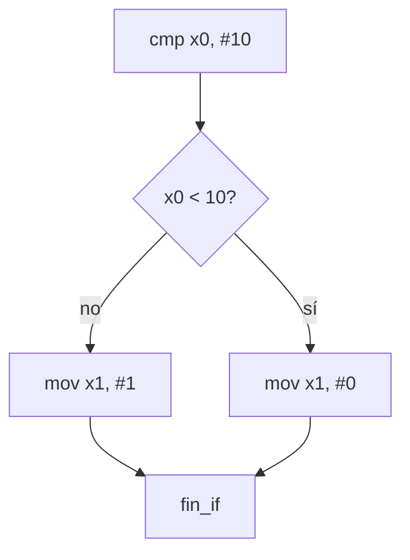

<style>
@import "../styles/index.css";
</style>

<div class="ecys-cover-bg"></div>

<div class="ecys-title-cover">

<div class="muted">Escuela de Ingeniería de Ciencias y Sistemas</div>

# Arquitectura de Computadores y Ensambladores 1

</div>

---
layout: center
---

<div class="muted">Arquitectura de Computadores y Ensambladores 1</div>

## Unidad 08
## Control de flujo y programación estructurada

Traduce `if`, `while`, `for` y llamadas a etiquetas,
branches y condiciones AArch64.

<div class="cover-note">
Unidad práctica: etiquetas, branches condicionales, if/else, loops, cbz/tbz, csel y bl/ret.
</div>

---

# Anuncios importantes

<div class="numbered-grid">
  <div class="numbered-card">
    <div class="card-number">1</div>
    <h3>Anuncio 1</h3>
    <p></p>
  </div>
</div>

---

# Agenda

<div class="numbered-grid">
  <div class="numbered-card">
    <div class="card-number">1</div>
    <h3>Branching y etiquetas</h3>
    <p>Saltos hacia adelante, hacia atrás y flujo no lineal.</p>
  </div>

  <div class="numbered-card">
    <div class="card-number">2</div>
    <h3>Condiciones y flags</h3>
    <p><code>cmp</code>, NZCV, condiciones signed vs unsigned.</p>
  </div>

  <div class="numbered-card">
    <div class="card-number">3</div>
    <h3>if, else y loops</h3>
    <p>Traducción de decisiones y ciclos a assembly.</p>
  </div>

  <div class="numbered-card">
    <div class="card-number">4</div>
    <h3>Branches especializados y csel</h3>
    <p><code>cbz</code>, <code>tbz</code>, <code>csel</code>, <code>cset</code> y selección sin rama.</p>
  </div>

  <div class="numbered-card">
    <div class="card-number">5</div>
    <h3>bl, ret y branch por registro</h3>
    <p>Introducción a llamadas, retorno y <code>LR/X30</code>.</p>
  </div>
</div>

---

# Competencias

<div class="concept-grid vertical-center">
  <div class="concept-card">
    <h3>Competencia 1</h3>
    <p>
      Aplica el set de instrucciones ARM-64 utilizando instrucciones aritméticas,
      lógicas, de carga/almacenamiento, desplazamientos y rotaciones para
      construir programas funcionales que manipulen datos a nivel de registros
      y memoria.
    </p>
  </div>

  <div class="concept-card">
    <h3>Competencia 2</h3>
    <p>
      El estudiante desarrolla soluciones eficientes en sistemas computacionales
      integrando arquitectura de computadores, programación en bajo nivel y
      herramientas modernas de análisis y simulación para resolver problemas
      complejos en sistemas embebidos e IoT.
    </p>
  </div>
</div>

---

# Valor de la semana

<div class="callout tip">
  <strong>Análisis.</strong>
  Capacidad de interpretar información técnica y comprender el funcionamiento
  interno de un sistema.
</div>

<div class="concept-grid">
  <div class="concept-card">
    <h3>Aplicación en clase</h3>
    <p>
      Leer un programa con branches requiere trazar mentalmente cada camino
      posible. El análisis de flujo convierte etiquetas y condiciones en una
      historia clara del comportamiento del programa.
    </p>
  </div>
</div>

---

# Qué buscamos hoy

<div class="slide-center-block">

<div class="objective-grid">
  <div v-click class="objective-item">
    <div class="item-number">1</div>
    <h3>Etiquetas y branches</h3>
    <p>Entender saltos hacia adelante, hacia atrás y flujo no lineal.</p>
  </div>

  <div v-click class="objective-item">
    <div class="item-number">2</div>
    <h3>Condiciones signed vs unsigned</h3>
    <p>Elegir correctamente entre <code>b.lt</code>/<code>b.ge</code> y <code>b.lo</code>/<code>b.hs</code>.</p>
  </div>

  <div v-click class="objective-item">
    <div class="item-number">3</div>
    <h3>Traducir estructuras</h3>
    <p>Convertir <code>if</code>, <code>while</code>, <code>for</code> a comparaciones + ramas + etiquetas.</p>
  </div>

  <div v-click class="objective-item">
    <div class="item-number">4</div>
    <h3>bl y ret</h3>
    <p>Entender llamada y retorno como preparación para funciones.</p>
  </div>
</div>

</div>

---
layout: section
---

# Branching y etiquetas

Una etiqueta marca un lugar; una rama cambia el flujo hacia ese lugar.

---
layout: center
class: text-center
---

<div class="big-question">
  <div class="muted">Pregunta de arranque</div>
  <h3>¿El procesador entiende if, while o for?</h3>
  <div class="question-points">
    <div v-click>No. Son palabras de lenguajes de alto nivel.</div>
    <div v-click>En assembly se construyen con comparaciones, flags y branches.</div>
    <div v-click>Todo control de flujo se reduce a: ¿salto o no salto?</div>
  </div>
</div>

---

# Flujo normal vs branch

<div class="slide-center-block">

<div class="compare-grid">
  <div v-click class="compare-card">
    <div class="card-kicker">Sin branch</div>

```bash
A → B → C → D
```

<p>El procesador ejecuta la siguiente instrucción.</p>
  </div>
  <div v-click class="compare-card">
    <div class="card-kicker">Con branch</div>

```bash
A → b destino → destino → ...
```

<p>Una rama cambia qué se ejecuta después.</p>
  </div>
</div>

<div v-click class="callout info centered-narrow">
Una etiqueta no ejecuta nada. Solo nombra una posición. La rama es la instrucción que cambia el flujo.
</div>

</div>

---

##### Salto adelante vs salto atrás

<div class="slide-center-block">

<div class="two-column-layout">

<div class="content-stack-md">

<div class="muted">Salto hacia adelante — omitir código</div>

```asm
_start:
    b salir

    mov x0, #99   // no se ejecuta

salir:
    mov x0, #0
    mov x8, #93
    svc #0
```

</div>

<div class="content-stack-md">

<div class="muted">Salto hacia atrás — repetir código</div>

```asm
mov x0, #0

loop:
    add x0, x0, #1
    cmp x0, #3
    b.lt loop
```

<div v-click class="callout tip">
Un loop no es magia. Es una rama hacia atrás controlada por una condición.
</div>

</div>

</div>

</div>

---
layout: section
---

# Condiciones y flags

La rama condicional consulta flags que otra instrucción preparó.

---

# Signed vs unsigned

<div class="slide-center-block">

<div class="compare-grid">
  <div v-click class="compare-card">
    <div class="card-kicker">Signed</div>
    <ul>
      <li><code>b.gt</code> — mayor</li>
      <li><code>b.ge</code> — mayor o igual</li>
      <li><code>b.lt</code> — menor</li>
      <li><code>b.le</code> — menor o igual</li>
    </ul>
  </div>
  <div v-click class="compare-card">
    <div class="card-kicker">Unsigned</div>
    <ul>
      <li><code>b.hi</code> — mayor</li>
      <li><code>b.hs</code> — mayor o igual</li>
      <li><code>b.lo</code> — menor</li>
      <li><code>b.ls</code> — menor o igual</li>
    </ul>
  </div>
</div>

<div v-click class="callout warning centered-narrow">
<code>b.ge</code> y <code>b.hs</code> NO son sinónimos. <code>b.ge</code> es signed (usa N y V). <code>b.hs</code> es unsigned (usa C).
</div>

</div>

---

# cmp prepara, b.cond consulta

<div class="slide-center-block">

<div class="content-stack-lg">

```asm
mov x0, #-1
mov x1, #1
cmp x0, x1       // actualiza NZCV como x0 - x1
```

<div class="compare-grid">
  <div v-click class="compare-card">
    <div class="card-kicker">Lectura signed</div>
    <ul>
      <li><code>-1 < 1</code> → <code>b.lt</code> salta.</li>
    </ul>
  </div>
  <div v-click class="compare-card">
    <div class="card-kicker">Lectura unsigned</div>
    <ul>
      <li><code>0xFFFF...FF > 1</code> → <code>b.hi</code> salta.</li>
    </ul>
  </div>
</div>

<div v-click class="key-idea centered-narrow">
Mismos bits, misma comparación, distinta interpretación. Tú decides al elegir la condición.
</div>

</div>

</div>

---
layout: section
---

# if, else y loops

El procesador no tiene `if`. Lo construyes con comparación, rama y etiquetas.

---

# Patrón if/else

<div class="slide-center-block">

<div class="content-stack-lg">

```asm
    cmp x0, #10
    b.lt menor

mayor_o_igual:
    mov x1, #1
    b fin_if

menor:
    mov x1, #0

fin_if:
```

<div class="diagram-block">



<div class="diagram-caption">
<code>b fin_if</code> evita que el flujo caiga al bloque <code>menor</code> después de ejecutar <code>mayor_o_igual</code>.
</div>

</div>

</div>

</div>

---

# Loops: while, do-while, for

<div class="slide-center-block">

<div class="concept-grid">
  <div v-click class="concept-card">
    <h3>while</h3>
    <p>Probar antes de ejecutar. Puede no ejecutarse nunca.</p>

```asm
loop:
    cmp x0, x1
    b.ge fin
    add x0, x0, #1
    b loop
fin:
```

  </div>
  <div v-click class="concept-card">
    <h3>do-while</h3>
    <p>Ejecutar antes de probar. Siempre al menos una vez.</p>

```asm
loop:
    add x0, x0, #1
    cmp x0, #5
    b.lt loop
```

  </div>
</div>

</div>

---

# Loop con puntero y array

<div class="slide-center-block">

<div class="content-stack-lg">

```asm
    ldr x0, =array       // puntero actual
    mov x1, #4            // cantidad
    mov x3, #0            // suma

loop:
    cbz x1, fin
    ldr x2, [x0], #8     // lee y avanza
    add x3, x3, x2
    sub x1, x1, #1
    b loop

fin:
```

<div class="compare-grid">
  <div v-click class="compare-card">
    <div class="card-kicker">Registros</div>
    <ul>
      <li><code>x0</code> = puntero al elemento actual.</li>
      <li><code>x1</code> = elementos restantes.</li>
      <li><code>x3</code> = acumulador.</li>
    </ul>
  </div>
  <div v-click class="compare-card">
    <div class="card-kicker">Patrón</div>
    <ul>
      <li><code>cbz x1, fin</code> → sale si terminó.</li>
      <li><code>[x0], #8</code> → post-index avanza.</li>
      <li><code>b loop</code> → rama hacia atrás.</li>
    </ul>
  </div>
</div>

</div>

</div>

---
layout: section
---

# Branches especializados y csel

Casos frecuentes con instrucciones más directas.

---

# cbz, cbnz, tbz, tbnz

<div class="slide-center-block">

<div class="concept-grid">
  <div v-click class="concept-card">
    <h3><code>cbz</code></h3>
    <p>Salta si registro = 0. Sin necesidad de <code>cmp</code>.</p>
  </div>
  <div v-click class="concept-card">
    <h3><code>cbnz</code></h3>
    <p>Salta si registro ≠ 0.</p>
  </div>
  <div v-click class="concept-card">
    <h3><code>tbz</code></h3>
    <p>Salta si bit N del registro = 0.</p>
  </div>
  <div v-click class="concept-card">
    <h3><code>tbnz</code></h3>
    <p>Salta si bit N del registro = 1.</p>
  </div>
</div>

<div v-click class="callout info centered-narrow">
<code>cbz</code> reemplaza <code>cmp x0, #0</code> + <code>b.eq</code>. <code>tbz</code> reemplaza <code>tst</code> + <code>b.eq</code> para un bit concreto.
</div>

</div>

---

# Conditional select: csel y familia

<div class="slide-center-block">

<div class="content-stack-lg">

```asm
cmp x0, x1
csel x2, x0, x1, gt    // si x0 > x1 (signed), x2 = x0; si no, x2 = x1
```

<div class="concept-grid">
  <div v-click class="concept-card">
    <h3><code>csel</code></h3>
    <p>Elige entre dos registros según condición.</p>
  </div>
  <div v-click class="concept-card">
    <h3><code>cset</code></h3>
    <p>Escribe 1 si condición se cumple, 0 si no.</p>
  </div>
  <div v-click class="concept-card">
    <h3><code>cinc</code></h3>
    <p>Elige registro o registro + 1.</p>
  </div>
  <div v-click class="concept-card">
    <h3><code>cneg</code></h3>
    <p>Elige registro o su negación (valor absoluto).</p>
  </div>
</div>

<div v-click class="callout tip centered-narrow">
<code>csel</code> no reemplaza toda estructura <code>if</code>. Reemplaza decisiones pequeñas donde solo necesitas elegir un valor.
</div>

</div>

</div>

---
layout: section
---

# bl, ret y branch por registro

Preparación para funciones: saltar, guardar retorno y volver.

---

# bl y ret

<div class="slide-center-block">

<div class="content-stack-lg">

```asm
_start:
    bl funcion_simple     // salta y guarda retorno en x30/lr

    mov x0, #0
    mov x8, #93
    svc #0

funcion_simple:
    mov x1, #42
    ret                   // vuelve a la dirección en lr
```

<div class="compare-grid">
  <div v-click class="compare-card">
    <div class="card-kicker"><code>b</code> vs <code>bl</code></div>
    <ul>
      <li><code>b</code> solo salta.</li>
      <li><code>bl</code> salta Y guarda retorno en <code>x30/lr</code>.</li>
    </ul>
  </div>
  <div v-click class="compare-card">
    <div class="card-kicker"><code>br</code> vs <code>blr</code></div>
    <ul>
      <li><code>br xN</code> salta a dirección en registro.</li>
      <li><code>blr xN</code> salta Y guarda retorno.</li>
    </ul>
  </div>
</div>

</div>

</div>

---

# Checklist mental

<div class="slide-center-block">

<div class="reveal-list centered-narrow">
  <div v-click class="reveal-item">Puedo explicar etiquetas y branches.</div>
  <div v-click class="reveal-item">Puedo separar condiciones signed y unsigned.</div>
  <div v-click class="reveal-item">Puedo traducir <code>if</code>, <code>if/else</code>, <code>while</code> y <code>for</code>.</div>
  <div v-click class="reveal-item">Puedo usar <code>cbz</code>, <code>tbz</code> y <code>csel</code> en casos apropiados.</div>
  <div v-click class="reveal-item">Puedo explicar <code>bl</code> y <code>ret</code> como mecanismo de llamada/retorno.</div>
  <div v-click class="reveal-item">Puedo escribir un loop con puntero y post-index.</div>
</div>

</div>

---

# Siguiente paso

<div class="slide-center-block">

<div class="flow-column">
  <div v-click class="flow-step">Branches y condiciones dominados</div>
  <div v-click class="flow-arrow">→</div>
  <div v-click class="flow-step">Loops y recorrido de arrays</div>
  <div v-click class="flow-arrow">→</div>
  <div v-click class="flow-step">bl y ret como base de llamadas</div>
  <div v-click class="flow-arrow">→</div>
  <div v-click class="flow-step">Stack frames, funciones y ABI</div>
</div>

</div>

---
layout: center
class: text-center
---

<div class="muted">Actividad de cierre</div>

# Preguntas de repaso

<div class="question-points mx-auto mt-6 max-w-2xl text-left">
  <div v-click>¿Una etiqueta ejecuta código por sí sola?</div>
  <div v-click>¿Cuál es la diferencia entre <code>b.lt</code> y <code>b.lo</code>?</div>
  <div v-click>¿Por qué necesitas <code>b fin_if</code> en un patrón if/else?</div>
  <div v-click>¿Cuándo usarías <code>csel</code> en lugar de un branch?</div>
  <div v-click>¿Qué guarda <code>bl</code> que <code>b</code> no guarda?</div>
</div>

---

###### Ejemplo Práctico

<div class="slide-center-block">

<div class="content-stack-lg">

<div class="key-idea centered-narrow">
  <div class="muted">Actividad guiada</div>
  <p>Escribir un programa con if/else y un loop que recorra un array sumando elementos.</p>
</div>

<div class="concept-grid concept-grid-4">
  <div v-click class="concept-card">
    <h3>if/else</h3>
    <p>Comparar un valor, dos caminos, salida común.</p>
  </div>

  <div v-click class="concept-card">
    <h3>Loop</h3>
    <p>Recorrer array con puntero, post-index y <code>cbz</code>.</p>
  </div>

  <div v-click class="concept-card">
    <h3>csel</h3>
    <p>Elegir el mayor de dos valores sin rama.</p>
  </div>

  <div v-click class="concept-card">
    <h3>bl + ret</h3>
    <p>Extraer el cuerpo del loop a una función simple.</p>
  </div>
</div>

</div>

</div>

---

# Fuentes

- Página Quarto: `site/courses/aarch64/control-flujo/`
- Arm, *Learn the Architecture - A64 Instruction Set Architecture Guide*
- Larry D. Pyeatt y William Ughetta, *ARM 64-Bit Assembly Language*
- William Hohl y Christopher Hinds, *ARM Assembly Language: Fundamentals and Techniques*
- Arm, *Arm Architecture Reference Manual for A-profile architecture*
- Slidev, documentación oficial

---
layout: statement
---

# Dudas¿?

---
layout: center
---

# Gracias por tu atención
