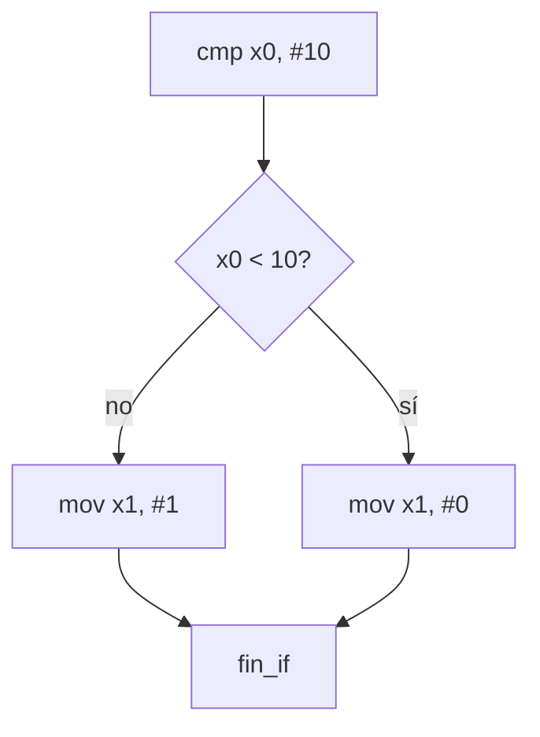

# Arquitectura de Computadores y Ensambladores 1

Escuela de Ingeniería de Ciencias y Sistemas

---
layout: center
---

Arquitectura de Computadores y Ensambladores 1

## Unidad 08
## Control de flujo y programación estructurada

Traduce `if`, `while`, `for` y llamadas a etiquetas, branches y condiciones AArch64.

Unidad práctica: etiquetas, branches condicionales, if/else, loops, cbz/tbz, csel y bl/ret.

---

# Anuncios importantes

1. **Anuncio 1**

---

# Agenda

1. **Branching y etiquetas** — Saltos hacia adelante, hacia atrás y flujo no lineal.
2. **Condiciones y flags** — `cmp`, NZCV, condiciones signed vs unsigned.
3. **if, else y loops** — Traducción de decisiones y ciclos a assembly.
4. **Branches especializados y csel** — `cbz`, `tbz`, `csel`, `cset` y selección sin rama.
5. **bl, ret y branch por registro** — Introducción a llamadas, retorno y `LR/X30`.

---

# Competencias

### Competencia 1
Aplica el set de instrucciones ARM-64 utilizando instrucciones aritméticas, lógicas, de carga/almacenamiento, desplazamientos y rotaciones para construir programas funcionales que manipulen datos a nivel de registros y memoria.

### Competencia 2
El estudiante desarrolla soluciones eficientes en sistemas computacionales integrando arquitectura de computadores, programación en bajo nivel y herramientas modernas de análisis y simulación para resolver problemas complejos en sistemas embebidos e IoT.

---

# Valor de la semana

**Análisis.** Capacidad de interpretar información técnica y comprender el funcionamiento interno de un sistema.

### Aplicación en clase
Leer un programa con branches requiere trazar mentalmente cada camino posible. El análisis de flujo convierte etiquetas y condiciones en una historia clara del comportamiento del programa.

---

# Qué buscamos hoy

1. **Etiquetas y branches** — Entender saltos hacia adelante, hacia atrás y flujo no lineal.
2. **Condiciones signed vs unsigned** — Elegir correctamente entre `b.lt`/`b.ge` y `b.lo`/`b.hs`.
3. **Traducir estructuras** — Convertir `if`, `while`, `for` a comparaciones + ramas + etiquetas.
4. **bl y ret** — Entender llamada y retorno como preparación para funciones.

---
layout: section
---

# Branching y etiquetas

Una etiqueta marca un lugar; una rama cambia el flujo hacia ese lugar.

---
layout: center
class: text-center
---

### Pregunta de arranque

## ¿El procesador entiende if, while o for?

- No. Son palabras de lenguajes de alto nivel.
- En assembly se construyen con comparaciones, flags y branches.
- Todo control de flujo se reduce a: ¿salto o no salto?

---

# Flujo normal vs branch

- **Sin branch** — `A → B → C → D`. El procesador ejecuta la siguiente instrucción.
- **Con branch** — `A → b destino → destino → ...`. Una rama cambia qué se ejecuta después.

Una etiqueta no ejecuta nada. Solo nombra una posición. La rama es la instrucción que cambia el flujo.

---

# Salto adelante vs salto atrás

**Salto hacia adelante — omitir código**
```asm
_start:
    b salir

    mov x0, #99   // no se ejecuta

salir:
    mov x0, #0
    mov x8, #93
    svc #0
```

**Salto hacia atrás — repetir código**
```asm
mov x0, #0

loop:
    add x0, x0, #1
    cmp x0, #3
    b.lt loop
```

Un loop no es magia. Es una rama hacia atrás controlada por una condición.

---
layout: section
---

# Condiciones y flags

La rama condicional consulta flags que otra instrucción preparó.

---

# Signed vs unsigned

**Signed**
- `b.gt` — mayor
- `b.ge` — mayor o igual
- `b.lt` — menor
- `b.le` — menor o igual

**Unsigned**
- `b.hi` — mayor
- `b.hs` — mayor o igual
- `b.lo` — menor
- `b.ls` — menor o igual

`b.ge` y `b.hs` NO son sinónimos. `b.ge` es signed (usa N y V). `b.hs` es unsigned (usa C).

---

# cmp prepara, b.cond consulta

```asm
mov x0, #-1
mov x1, #1
cmp x0, x1       // actualiza NZCV como x0 - x1
```

- **Lectura signed** — `-1 < 1` → `b.lt` salta.
- **Lectura unsigned** — `0xFFFF...FF > 1` → `b.hi` salta.

Mismos bits, misma comparación, distinta interpretación. Tú decides al elegir la condición.

---
layout: section
---

# if, else y loops

El procesador no tiene `if`. Lo construyes con comparación, rama y etiquetas.

---

# Patrón if/else

```asm
    cmp x0, #10
    b.lt menor

mayor_o_igual:
    mov x1, #1
    b fin_if

menor:
    mov x1, #0

fin_if:
```



`b fin_if` evita que el flujo caiga al bloque `menor` después de ejecutar `mayor_o_igual`.

---

# Loops: while, do-while, for

**while** — Probar antes de ejecutar. Puede no ejecutarse nunca.
```asm
loop:
    cmp x0, x1
    b.ge fin
    add x0, x0, #1
    b loop
fin:
```

**do-while** — Ejecutar antes de probar. Siempre al menos una vez.
```asm
loop:
    add x0, x0, #1
    cmp x0, #5
    b.lt loop
```

---

# Loop con puntero y array

```asm
    ldr x0, =array       // puntero actual
    mov x1, #4            // cantidad
    mov x3, #0            // suma

loop:
    cbz x1, fin
    ldr x2, [x0], #8     // lee y avanza
    add x3, x3, x2
    sub x1, x1, #1
    b loop

fin:
```

- **Registros** — `x0` = puntero al elemento actual. `x1` = elementos restantes. `x3` = acumulador.
- **Patrón** — `cbz x1, fin` → sale si terminó. `[x0], #8` → post-index avanza. `b loop` → rama hacia atrás.

---
layout: section
---

# Branches especializados y csel

Casos frecuentes con instrucciones más directas.

---

# cbz, cbnz, tbz, tbnz

- `cbz` — Salta si registro = 0. Sin necesidad de `cmp`.
- `cbnz` — Salta si registro ≠ 0.
- `tbz` — Salta si bit N del registro = 0.
- `tbnz` — Salta si bit N del registro = 1.

`cbz` reemplaza `cmp x0, #0` + `b.eq`. `tbz` reemplaza `tst` + `b.eq` para un bit concreto.

---

# Conditional select: csel y familia

```asm
cmp x0, x1
csel x2, x0, x1, gt    // si x0 > x1 (signed), x2 = x0; si no, x2 = x1
```

- `csel` — Elige entre dos registros según condición.
- `cset` — Escribe 1 si condición se cumple, 0 si no.
- `cinc` — Elige registro o registro + 1.
- `cneg` — Elige registro o su negación (valor absoluto).

`csel` no reemplaza toda estructura `if`. Reemplaza decisiones pequeñas donde solo necesitas elegir un valor.

---
layout: section
---

# bl, ret y branch por registro

Preparación para funciones: saltar, guardar retorno y volver.

---

# bl y ret

```asm
_start:
    bl funcion_simple     // salta y guarda retorno en x30/lr

    mov x0, #0
    mov x8, #93
    svc #0

funcion_simple:
    mov x1, #42
    ret                   // vuelve a la dirección en lr
```

- `b` vs `bl` — `b` solo salta. `bl` salta Y guarda retorno en `x30/lr`.
- `br` vs `blr` — `br xN` salta a dirección en registro. `blr xN` salta Y guarda retorno.

---

# Checklist mental

- Puedo explicar etiquetas y branches.
- Puedo separar condiciones signed y unsigned.
- Puedo traducir `if`, `if/else`, `while` y `for`.
- Puedo usar `cbz`, `tbz` y `csel` en casos apropiados.
- Puedo explicar `bl` y `ret` como mecanismo de llamada/retorno.
- Puedo escribir un loop con puntero y post-index.

---

# Siguiente paso

Branches y condiciones dominados → Loops y recorrido de arrays → bl y ret como base de llamadas → Stack frames, funciones y ABI

---
layout: center
class: text-center
---

### Actividad de cierre

# Preguntas de repaso

- ¿Una etiqueta ejecuta código por sí sola?
- ¿Cuál es la diferencia entre `b.lt` y `b.lo`?
- ¿Por qué necesitas `b fin_if` en un patrón if/else?
- ¿Cuándo usarías `csel` en lugar de un branch?
- ¿Qué guarda `bl` que `b` no guarda?

---

### Ejemplo Práctico

Escribir un programa con if/else y un loop que recorra un array sumando elementos.

1. **if/else** — Comparar un valor, dos caminos, salida común.
2. **Loop** — Recorrer array con puntero, post-index y `cbz`.
3. **csel** — Elegir el mayor de dos valores sin rama.
4. **bl + ret** — Extraer el cuerpo del loop a una función simple.

---

# Fuentes

- Página Quarto: `site/courses/aarch64/control-flujo/`
- Arm, *Learn the Architecture - A64 Instruction Set Architecture Guide*
- Larry D. Pyeatt y William Ughetta, *ARM 64-Bit Assembly Language*
- William Hohl y Christopher Hinds, *ARM Assembly Language: Fundamentals and Techniques*
- Arm, *Arm Architecture Reference Manual for A-profile architecture*
- Slidev, documentación oficial

---
layout: statement
---

# Dudas¿?

---
layout: center
---

# Gracias por tu atención
