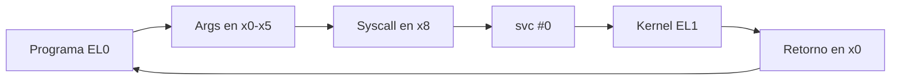

# Arquitectura de Computadores y Ensambladores 1

Escuela de Ingeniería de Ciencias y Sistemas

---
layout: center
---

Arquitectura de Computadores y Ensambladores 1

## Unidad 09
## Syscalls esenciales

Usa Linux directamente como API del kernel desde programas AArch64 sin libc.

Unidad práctica: contrato syscall, exit, write, read, openat, close y manejo mínimo de errores.

---

# Anuncios importantes

1. **Anuncio 1**

---

# Agenda

1. **Contrato de syscall** — Registros, `svc #0`, EL0 → EL1 y retorno en `x0`.
2. **exit y write** — Terminar proceso y escribir bytes a stdout/stderr.
3. **read y buffers** — Leer desde stdin hacia `.bss` y eco básico.
4. **openat y close** — Abrir archivos, file descriptors y cerrar recursos.
5. **Errores mínimos** — Retornos negativos, `b.lt error` y mensajes a stderr.

---

# Competencias

### Competencia 1
El estudiante desarrolla soluciones eficientes en sistemas computacionales integrando arquitectura de computadores, programación en bajo nivel y herramientas modernas de análisis y simulación para resolver problemas complejos en sistemas embebidos e IoT.

### Competencia 2
Configura entornos de desarrollo para programación en ensamblador ARM-64 instalando y verificando herramientas en Linux como GAS, GDB y Make para establecer un ambiente funcional de compilación y depuración de código.

---

# Valor de la semana

**Aplicación.** Capacidad de llevar teoría a la práctica.

### Aplicación en clase
Las syscalls convierten conocimiento de registros, flags y control de flujo en programas que interactúan con el sistema operativo real: leen entrada, escriben archivos y manejan errores.

---

# Qué buscamos hoy

1. **Contrato completo** — Preparar argumentos, elegir syscall, ejecutar `svc #0` y leer retorno.
2. **I/O básico** — Usar `exit`, `write` y `read` como herramientas directas del kernel.
3. **Archivos** — Abrir, escribir, cerrar con `openat` y `close`.
4. **Manejo de errores** — Detectar retornos negativos y reaccionar con mensajes a stderr.

---
layout: section
---

# Contrato de syscall

Linux mira registros: número en x8, argumentos en x0–x5, retorno en x0.

---
layout: center
class: text-center
---

### Pregunta de arranque

## ¿svc #0 sabe qué hacer por sí solo?

- No. Solo provoca la entrada al kernel.
- Antes debes poner el número de syscall en x8.
- Y los argumentos en x0–x5.

---

# El contrato AArch64 Linux



EL0 → svc #0 → Kernel EL1 → retorno en x0.

**Plantilla mental**
```asm
mov x0, #...    // arg 0
mov x1, #...    // arg 1
mov x2, #...    // arg 2
mov x8, #...    // syscall
svc #0          // kernel
// x0 = retorno
```

---

# Syscalls de esta unidad

- `exit` — 93 — Terminar proceso con código de salida.
- `write` — 64 — Escribir bytes a un file descriptor.
- `read` — 63 — Leer bytes desde un file descriptor.
- `openat` — 56 — Abrir archivo y obtener un fd.
- `close` — 57 — Cerrar file descriptor.

---
layout: section
---

# exit y write

Terminar proceso y escribir bytes directos sin printf ni libc.

---

# exit en detalle

Terminar el proceso

```asm
mov x0, #0      // código de salida
mov x8, #93     // exit
svc #0
```

Después de `exit`, el proceso termina. No se ejecuta código posterior.

---

# write en detalle

Escribir bytes en stdout

```asm
mov x0, #1          // stdout
ldr x1, =mensaje    // buffer
mov x2, #len        // longitud
mov x8, #64         // write
svc #0
```

**write ≠ printf**
- No interpreta formato.
- No busca `\0`.
- Escribe exactamente `x2` bytes.

---

# File descriptors iniciales

- fd 0 — stdin — Entrada estándar. `read` lee desde aquí.
- fd 1 — stdout — Salida estándar. `write` escribe aquí.
- fd 2 — stderr — Salida de error. Mensajes de fallo van aquí.

`stdout = 1` no es lo mismo que código de salida `1`. Son números con propósitos distintos.

---
layout: section
---

# read y buffers

Leer bytes desde stdin hacia memoria reservada en .bss.

---

# Eco básico: read → write

```asm
    mov x0, #0          // stdin
    ldr x1, =buffer     // buffer destino
    mov x2, #64         // máximo bytes
    mov x8, #63         // read
    svc #0              // x0 = bytes leídos

    mov x2, x0          // cantidad leída → longitud
    mov x0, #1          // stdout
    ldr x1, =buffer
    mov x8, #64         // write
    svc #0
```

- **Antes de read** — `x0 = 0` → fd stdin. `x1` = dirección del buffer. `x2` = máximo a leer.
- **Después de read** — `x0` = bytes leídos (ya no es fd). `mov x2, x0` pasa la cantidad a write. Buffer contiene los datos.

---
layout: section
---

# openat y close

Abrir un archivo devuelve un file descriptor. Cerrar libera ese recurso.

---

# openat: nombre → fd

```asm
.equ AT_FDCWD, -100
.equ O_WRONLY, 1
.equ O_CREAT,  64
.equ O_TRUNC,  512

    mov x0, #AT_FDCWD                   // directorio actual
    ldr x1, =nombre                     // nombre del archivo
    mov x2, #(O_WRONLY | O_CREAT | O_TRUNC)
    mov x3, #0644                       // permisos
    mov x8, #56                         // openat
    svc #0                              // x0 = fd o error
```

- **Registros** — `x0` = directorio base (`AT_FDCWD`). `x1` = nombre del archivo. `x2` = flags de apertura. `x3` = modo/permisos.
- **Después** — `x0 ≥ 0` → fd válido. `x0 < 0` → error. Guardar fd en `x19` para write y close.

---

# Ciclo de archivo: abrir → escribir → cerrar

Un fd es un recurso del proceso. Abrirlo, usarlo y cerrarlo es el ciclo mínimo.

```bash
openat  → x0 = fd
guardar → x19 = fd
write   → x0 cambia a bytes escritos
close   → x0 debe volver a ser fd (desde x19)
```

Si no guardas el fd antes de `write`, no sabrás qué cerrar. `write` reemplaza `x0` con su retorno.

---
layout: section
---

# Errores mínimos

Si el retorno es negativo, algo falló.

---

# Patrón de error mínimo

```asm
svc #0
cmp x0, #0
b.lt error
```

- **Retorno válido** — `x0 ≥ 0`. Continúa normalmente.
- **Retorno de error** — `x0 < 0`. Saltar al bloque de error. Escribir a stderr (fd 2) y exit(1).

No sobrescribas `x0` antes de revisarlo. Primero `cmp`, luego guarda o usa.

---

# Bloque de error completo

```asm
error:
    mov x0, #2              // stderr
    ldr x1, =msg_error
    mov x2, #msg_error_len
    mov x8, #64             // write
    svc #0

    mov x0, #1              // exit code 1
    mov x8, #93             // exit
    svc #0
```

Varios puntos del programa pueden saltar a la misma etiqueta `error`. Esto evita duplicar código de manejo.

---

# Checklist mental

- Puedo explicar el contrato: x8, x0–x5, svc #0, retorno.
- Puedo usar `exit` y `write` formalmente.
- Puedo leer entrada con `read` y hacer eco.
- Puedo abrir, escribir y cerrar un archivo con `openat`/`close`.
- Puedo detectar error con `cmp x0, #0` + `b.lt`.
- Puedo distinguir syscall directa de función de libc.

---

# Siguiente paso

Contrato de syscall dominado → I/O básico: exit, write, read → Archivos: openat, close → Stack frames, funciones y ABI

---
layout: center
class: text-center
---

### Actividad de cierre

# Preguntas de repaso

- ¿Qué registro contiene el número de syscall?
- ¿Qué contiene `x0` después de `svc #0`?
- ¿Por qué `write` necesita longitud explícita?
- ¿Qué pasa si no guardas el fd antes de llamar `write`?
- ¿Por qué `b.lt` funciona para detectar errores?

---

### Ejemplo Práctico

Crear un archivo con `openat`, escribir un mensaje con `write`, cerrar con `close` y manejar errores.

1. **openat** — Abrir `salida.txt` con flags `O_WRONLY | O_CREAT | O_TRUNC`.
2. **write** — Escribir mensaje, usar retorno como verificación.
3. **close** — Cerrar fd guardado en `x19`.
4. **Error** — Cada syscall revisa `x0 < 0` y salta a bloque compartido.

---

# Fuentes

- Página Quarto: `site/courses/aarch64/syscalls-esenciales/`
- Arm, *Learn the Architecture - A64 Instruction Set Architecture Guide*
- Larry D. Pyeatt y William Ughetta, *ARM 64-Bit Assembly Language*
- Linux kernel, *syscall table for AArch64*
- `man 2 write`, `man 2 read`, `man 2 openat`, `man 2 close`
- Slidev, documentación oficial

---
layout: statement
---

# Dudas¿?

---
layout: center
---

# Gracias por tu atención
