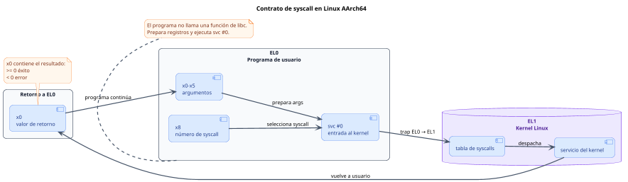

<CoverSlide
  title="Unidad 09 · Syscalls esenciales"
  subtitle="Arquitectura de Computadores y Ensambladores 1"
  note="Escuela de Ingeniería de Ciencias y Sistemas"
/>

---
layout: aarch64-section
---

# Syscalls esenciales

Usa Linux directamente como API del kernel desde programas AArch64 sin libc.

Unidad práctica: contrato syscall, exit, write, read, openat, close y manejo mínimo de errores.

---

# Anuncios importantes

<InfoBox type="warning" title="Anuncios">

- **Anuncio 1**

</InfoBox>

---

# Agenda

<v-clicks>

1. **Contrato de syscall** — Registros, `svc #0`, EL0 → EL1 y retorno en `x0`.
2. **exit y write** — Terminar proceso y escribir bytes a stdout/stderr.
3. **read y buffers** — Leer desde stdin hacia `.bss` y eco básico.
4. **openat y close** — Abrir archivos, file descriptors y cerrar recursos.
5. **Errores mínimos** — Retornos negativos, `b.lt error` y mensajes a stderr.

</v-clicks>

---

# Competencias

<InfoBox type="info" title="Competencia 1">

El estudiante desarrolla soluciones eficientes en sistemas computacionales integrando arquitectura de computadores, programación en bajo nivel y herramientas modernas de análisis y simulación para resolver problemas complejos en sistemas embebidos e IoT.

</InfoBox>

<InfoBox type="info" title="Competencia 2">

Configura entornos de desarrollo para programación en ensamblador ARM-64 instalando y verificando herramientas en Linux como GAS, GDB y Make para establecer un ambiente funcional de compilación y depuración de código.

</InfoBox>

---

# Valor de la semana

<InfoBox type="note" title="Aplicación">

Capacidad de llevar teoría a la práctica.

Las syscalls convierten conocimiento de registros, flags y control de flujo en programas que interactúan con el sistema operativo real: leen entrada, escriben archivos y manejan errores.

</InfoBox>

---

# Qué buscamos hoy

<StepList :steps="[
  'Contrato completo: preparar argumentos, elegir syscall, ejecutar svc #0 y leer retorno',
  'I/O básico: usar exit, write y read como herramientas directas del kernel',
  'Archivos: abrir, escribir, cerrar con openat y close',
  'Manejo de errores: detectar retornos negativos y reaccionar con mensajes a stderr'
]" />

---
layout: aarch64-section
---

# Contrato de syscall

Linux mira registros: número en x8, argumentos en x0–x5, retorno en x0.

---
layout: aarch64-question
---

## ¿svc #0 sabe qué hacer por sí solo?

- No. Solo provoca la entrada al kernel.
- Antes debes poner el número de syscall en x8.
- Y los argumentos en x0–x5.

---

###### El contrato AArch64 Linux

<div v-click class="w-full flex justify-center mt-4">

<div class="w-[92%]">



</div>

</div>

<CodeBlock title="Plantilla mental" lang="asm">

```asm
mov x0, #...    // arg 0
mov x1, #...    // arg 1
mov x2, #...    // arg 2
mov x8, #...    // número de syscall
svc #0          // entra al kernel
// x0 = retorno
```

</CodeBlock>

---

<CodeBlock title="Plantilla mental" lang="asm">

```asm
mov x0, #...    // arg 0
mov x1, #...    // arg 1
mov x2, #...    // arg 2
mov x8, #...    // número de syscall
svc #0          // entra al kernel
// x0 = retorno
```

</CodeBlock>

<StepList :steps="[
  'Preparar argumentos en x0–x5',
  'Poner número de syscall en x8',
  'Ejecutar svc #0 → trap de EL0 a EL1',
  'Leer retorno en x0: ≥ 0 éxito, < 0 error'
]" />

<div class="mascot-row mt-4">
<Mascot emotion="leyendo" />
</div>

---

# Syscalls de esta unidad

<div class="grid grid-cols-2 gap-4">

<SyscallCard
  number="93"
  name="exit"
  :args="['código de salida']"
  description="Termina el proceso."
/>

<SyscallCard
  number="64"
  name="write"
  :args="['fd', 'buffer', 'len']"
  description="Escribe bytes a un file descriptor."
/>

<SyscallCard
  number="63"
  name="read"
  :args="['fd', 'buffer', 'max_len']"
  description="Lee bytes desde un file descriptor."
/>

<SyscallCard
  number="56"
  name="openat"
  :args="['dirfd', 'pathname', 'flags', 'mode']"
  description="Abre archivo, retorna fd."
/>

<SyscallCard
  number="57"
  name="close"
  :args="['fd']"
  description="Cierra file descriptor."
/>

</div>

---
layout: aarch64-section
---

# exit y write

Terminar proceso y escribir bytes directos sin printf ni libc.

---

# exit en detalle

<SyscallCard
  number="93"
  name="exit"
  :args="['código de salida']"
  description="Termina el proceso inmediatamente. No se ejecuta código posterior."
/>

<CodeBlock title="exit.s" lang="asm">

```asm
mov x0, #0      // código de salida
mov x8, #93     // exit
svc #0
```

</CodeBlock>

---

###### write en detalle

<SyscallCard
  number="64"
  name="write"
  :args="['fd (stdout=1)', 'dirección del buffer', 'cantidad de bytes']"
  description="Escribe exactamente x2 bytes desde la dirección en x1 al fd en x0."
/>

<CodeBlock title="write.s" lang="asm">

```asm
mov x0, #1          // stdout
ldr x1, =mensaje    // buffer
mov x2, #len        // longitud
mov x8, #64         // write
svc #0
```

</CodeBlock>

<InfoBox type="warning" title="write ≠ printf">

- No interpreta formato.
- No busca `\0`.
- Escribe exactamente `x2` bytes.

</InfoBox>

---

# File descriptors iniciales

<v-clicks>

- **fd 0** — stdin — Entrada estándar. `read` lee desde aquí
- **fd 1** — stdout — Salida estándar. `write` escribe aquí
- **fd 2** — stderr — Salida de error. Mensajes de fallo van aquí

</v-clicks>

<InfoBox type="note" title="Cuidado">

`stdout = 1` no es lo mismo que código de salida `1`. Son números con propósitos distintos.

</InfoBox>

---
layout: aarch64-section
---

# read y buffers

Leer bytes desde stdin hacia memoria reservada en .bss.

---

# Eco básico: read → write

<CodeAnnotation :annotations="[
  { num: '1', text: 'read: x0=stdin, x1=buffer, x2=máximo bytes' },
  { num: '2', text: 'Después de read: x0 = bytes leídos (ya no es fd)' },
  { num: '3', text: 'write: x0=stdout, x1=buffer, x2=bytes leídos' }
]">

```asm {1-5|7|8-11}
    mov x0, #0          // stdin
    ldr x1, =buffer     // buffer destino
    mov x2, #64         // máximo bytes
    mov x8, #63         // read
    svc #0              // x0 = bytes leídos

    mov x2, x0          // cantidad leída → longitud
    mov x0, #1          // stdout
    ldr x1, =buffer
    mov x8, #64         // write
    svc #0
```

</CodeAnnotation>

<v-clicks>

- **Antes de read** — `x0 = 0` → fd stdin. `x1` = dirección del buffer. `x2` = máximo a leer
- **Después de read** — `x0` = bytes leídos. `mov x2, x0` pasa la cantidad a write

</v-clicks>

---
layout: aarch64-section
---

# openat y close

Abrir un archivo devuelve un file descriptor. Cerrar libera ese recurso.

---

# openat: nombre → fd

<CodeAnnotation :annotations="[
  { num: '1', text: 'x0 = AT_FDCWD: directorio de trabajo actual' },
  { num: '2', text: 'x1 = dirección del nombre del archivo' },
  { num: '3', text: 'x2 = flags: O_WRONLY | O_CREAT | O_TRUNC' },
  { num: '4', text: 'x3 = permisos: 0644 (rw-r--r--)' }
]">

```asm {1-4|6|7|8|9|10|11}
.equ AT_FDCWD, -100
.equ O_WRONLY, 1
.equ O_CREAT,  64
.equ O_TRUNC,  512

    mov x0, #AT_FDCWD                   // directorio actual
    ldr x1, =nombre                     // nombre del archivo
    mov x2, #(O_WRONLY | O_CREAT | O_TRUNC)
    mov x3, #0644                       // permisos
    mov x8, #56                         // openat
    svc #0                              // x0 = fd o error
```

</CodeAnnotation>

<v-clicks>

- **Después** — `x0 ≥ 0` → fd válido. `x0 < 0` → error
- **Importante** — Guardar fd en `x19` para write y close posteriores

</v-clicks>

---

# Ciclo de archivo: abrir → escribir → cerrar

<StepList :steps="[
  'openat → x0 = fd',
  'guardar → x19 = fd',
  'write → x0 cambia a bytes escritos',
  'close → x0 debe volver a ser fd (desde x19)'
]" />

<InfoBox type="warning" title="Cuidado">

Si no guardas el fd antes de `write`, no sabrás qué cerrar. `write` reemplaza `x0` con su retorno.

</InfoBox>

<div class="mascot-row mt-4">
<Mascot emotion="confundido" />
</div>

---
layout: aarch64-section
---

# Errores mínimos

Si el retorno es negativo, algo falló.

---

# Patrón de error mínimo

<CodeBlock title="Verificación de error" lang="asm">

```asm
svc #0
cmp x0, #0
b.lt error
```

</CodeBlock>

<v-clicks>

- **Retorno válido** — `x0 ≥ 0`. Continúa normalmente
- **Retorno de error** — `x0 < 0`. Saltar al bloque de error

</v-clicks>

<InfoBox type="note" title="Regla">

No sobrescribas `x0` antes de revisarlo. Primero `cmp`, luego guarda o usa.

</InfoBox>

---

# Bloque de error completo

<CodeAnnotation :annotations="[
  { num: '1', text: 'Escribir mensaje de error a stderr (fd 2)' },
  { num: '2', text: 'Terminar proceso con código de salida 1' }
]">

```asm {1-6|8-10}
error:
    mov x0, #2              // stderr
    ldr x1, =msg_error
    mov x2, #msg_error_len
    mov x8, #64             // write
    svc #0

    mov x0, #1              // exit code 1
    mov x8, #93             // exit
    svc #0
```

</CodeAnnotation>

<InfoBox type="note" title="Patrón compartido">

Varios puntos del programa pueden saltar a la misma etiqueta `error`. Esto evita duplicar código de manejo.

</InfoBox>

---
layout: aarch64-checklist
---

# Checklist mental

- <span class="check-icon">✓</span> Puedo explicar el contrato: x8, x0–x5, svc #0, retorno
- <span class="check-icon">✓</span> Puedo usar `exit` y `write` formalmente
- <span class="check-icon">✓</span> Puedo leer entrada con `read` y hacer eco
- <span class="check-icon">✓</span> Puedo abrir, escribir y cerrar un archivo con `openat`/`close`
- <span class="check-icon">✓</span> Puedo detectar error con `cmp x0, #0` + `b.lt`
- <span class="check-icon">✓</span> Puedo distinguir syscall directa de función de libc

<div class="mascot-row mt-4">
<Mascot emotion="solucionado" />
</div>

---
layout: aarch64-statement
---

# Siguiente paso

Contrato de syscall dominado → I/O básico: exit, write, read → Archivos: openat, close → Stack frames, funciones y ABI

---
layout: aarch64-question
---

## Preguntas de repaso

- ¿Qué registro contiene el número de syscall?
- ¿Qué contiene `x0` después de `svc #0`?
- ¿Por qué `write` necesita longitud explícita?
- ¿Qué pasa si no guardas el fd antes de llamar `write`?
- ¿Por qué `b.lt` funciona para detectar errores?

<div class="mascot-row mt-4">
<Mascot emotion="pensando" />
</div>

---

# Ejemplo práctico

Crear un archivo con `openat`, escribir un mensaje con `write`, cerrar con `close` y manejar errores.

<StepList :steps="[
  'openat: abrir salida.txt con flags O_WRONLY | O_CREAT | O_TRUNC',
  'write: escribir mensaje, usar retorno como verificación',
  'close: cerrar fd guardado en x19',
  'Error: cada syscall revisa x0 < 0 y salta a bloque compartido'
]" />

---

# Fuentes

- Página Quarto: `site/courses/aarch64/syscalls-esenciales/`
- Arm, *Learn the Architecture - A64 Instruction Set Architecture Guide*
- Larry D. Pyeatt y William Ughetta, *ARM 64-Bit Assembly Language*
- Linux kernel, *syscall table for AArch64*
- `man 2 write`, `man 2 read`, `man 2 openat`, `man 2 close`
- Slidev, documentación oficial

---
layout: aarch64-statement
---

# ¿Dudas?

---

<CoverSlide
  title="Gracias por tu atención"
  subtitle="Arquitectura de Computadores y Ensambladores 1"
/>
