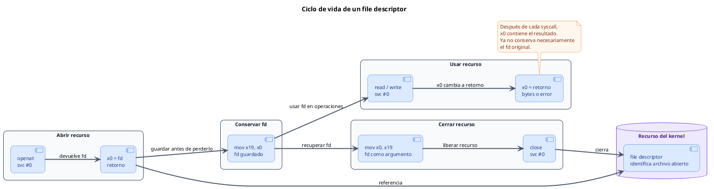

<CoverSlide
  title="Unidad 10 · Linux como API del kernel"
  subtitle="Arquitectura de Computadores y Ensambladores 1"
  note="Escuela de Ingeniería de Ciencias y Sistemas"
/>

---
layout: aarch64-section
---

# Linux como API del kernel

Archivos, errores y recursos usando syscalls AArch64 sin depender de libc.

Unidad práctica: file descriptors, ciclo open/read/write/close, errores, cleanup, lseek, fstat, getpid y nanosleep.

---

# Anuncios importantes

<InfoBox type="warning" title="Anuncios">

- **Anuncio 1**

</InfoBox>

---

# Agenda

<v-clicks>

1. **File descriptors y recursos** — Qué es un fd, stdin/stdout/stderr y ciclo de vida.
2. **Archivos con syscalls** — `openat`, `read`, `write`, `close` en flujo completo.
3. **Errores y cleanup** — Dos rutas de error, `cleanup` y errno conceptual.
4. **Posición y metadatos** — `lseek`, `fstat`, `statx` como mapa inicial.
5. **Procesos y tiempo** — `getpid`, `nanosleep`, `clock_gettime` y menciones.

</v-clicks>

---

# Competencias

<InfoBox type="info" title="Competencia 1">

El estudiante desarrolla soluciones eficientes en sistemas computacionales integrando arquitectura de computadores, programación en bajo nivel y herramientas modernas de análisis y simulación para resolver problemas complejos en sistemas embebidos e IoT.

</InfoBox>

<InfoBox type="info" title="Competencia 2">

Implementa sistemas embebidos orientados a IoT mediante el uso de Raspberry Pi, sensores digitales y comunicación con la nube para resolver problemas reales mediante automatización de procesos.

</InfoBox>

---

# Valor de la semana

<InfoBox type="note" title="Responsabilidad">

Capacidad de gestionar recursos correctamente y asumir las consecuencias de cada decisión técnica.

Cada recurso abierto es responsabilidad del programa. No cerrar un fd, ignorar un error o sobrescribir un retorno sin revisarlo son decisiones con consecuencias reales en sistemas de producción.

</InfoBox>

---

# Qué buscamos hoy

<StepList :steps="[
  'File descriptors: entender fd como handle entero, no como puntero ni dirección',
  'Ciclo de recurso: abrir → usar → revisar → cerrar como disciplina de trabajo',
  'Rutas de error: diseñar cleanup que sabe qué recursos están vivos',
  'Más allá de archivos: reconocer que el mismo contrato sirve para posición, metadatos y tiempo'
]" />

---
layout: aarch64-section
---

# File descriptors y recursos

Un fd es un número que representa un recurso abierto del kernel.

---
layout: aarch64-question
---

## ¿Un file descriptor es un puntero a memoria?

- No. Es un entero pequeño que el kernel asocia con un recurso.
- No puedes hacer `ldr x1, [x0]` con un fd.
- Se pasa como argumento a otras syscalls.

---

# File descriptors iniciales

<CodeBlock title="File descriptors de un proceso" lang="bash">

```bash
proceso
  fd 0 → stdin
  fd 1 → stdout
  fd 2 → stderr
  fd 3 → archivo abierto por openat
```

</CodeBlock>

<v-clicks>

- **fd 0** — stdin — Entrada estándar. `read` lee desde aquí
- **fd 1** — stdout — Salida estándar. `write` escribe aquí
- **fd 2** — stderr — Salida de error. Mensajes de fallo van aquí

</v-clicks>

<InfoBox type="note" title="Concepto clave">

Un fd no es puntero. No puedes hacer `ldr` con un fd. Se pasa como argumento a syscalls.

</InfoBox>

---

# Ciclo de vida de un recurso

<div v-click class="w-full flex justify-center mt-4">

<div class="w-[90%]">



</div>

</div>

<InfoBox v-click type="note" title="x0 cambia de papel">

Antes de `svc #0`, `x0` suele ser argumento. Después de `svc #0`, `x0` contiene el retorno. Por eso debes guardar valores importantes como el file descriptor.

</InfoBox>

<div class="mascot-row mt-4">
<Mascot emotion="leyendo" />
</div>

---
layout: aarch64-section
---

# Archivos con syscalls

openat, read, write, close — el flujo completo de archivo.

---

# Abrir y leer

Primera mitad del flujo: obtener un descriptor y leer bytes.

<CodeAnnotation :annotations="[
  { num: '1', text: 'openat: x0=AT_FDCWD, x1=nombre, x2=O_RDONLY' },
  { num: '2', text: 'Si x0 < 0, error_sin_fd (no hay fd que cerrar)' },
  { num: '3', text: 'Guardar fd en x19 para uso posterior' },
  { num: '4', text: 'read: x0=fd, x1=buffer, x2=128 bytes máximo' }
]">

```asm {1-6|7|9|11-15|16}
mov x0, #AT_FDCWD
ldr x1, =nombre
mov x2, #O_RDONLY
mov x3, #0
mov x8, #56         // openat
svc #0
cmp x0, #0
b.lt error_sin_fd

mov x19, x0         // guardar fd

mov x0, x19
ldr x1, =buffer
mov x2, #128
mov x8, #63         // read
svc #0
cmp x0, #0
b.lt cleanup
```

</CodeAnnotation>

---

# Escribir y cerrar

Segunda mitad del flujo: escribir lo leído y liberar el descriptor.

<CodeAnnotation :annotations="[
  { num: '1', text: 'Guardar bytes leídos en x20 para write' },
  { num: '2', text: 'write: x0=stdout, x1=buffer, x2=bytes leídos' },
  { num: '3', text: 'Si write falla, ir a cleanup' },
  { num: '4', text: 'close(fd) + exit(0): limpieza y salida' }
]">

```asm {1|3-7|8|10-13|15-18}
mov x20, x0         // bytes leídos

mov x0, #1          // stdout
ldr x1, =buffer
mov x2, x20
mov x8, #64         // write
svc #0
cmp x0, #0
b.lt cleanup

mov x0, x19
mov x8, #57         // close
svc #0

mov x0, #0
mov x8, #93         // exit
svc #0
```

</CodeAnnotation>

---

# read no promete llenar el buffer

<CodeBlock title="read: máximo vs real" lang="asm">

```asm
mov x2, #128        // pido hasta 128 bytes
mov x8, #63
svc #0              // x0 = bytes realmente leídos
mov x20, x0         // guardo la cantidad real
```

</CodeBlock>

<InfoBox type="warning" title="Cuidado">

- **Pedir 128** — Es el máximo que aceptas. No garantiza recibir 128.
- **Recibir x0** — Cantidad real leída. `write` debe usar esta cantidad, no 128.

</InfoBox>

---
layout: aarch64-section
---

# Errores y cleanup

Una ruta de error debe saber qué recursos ya están abiertos.

---
layout: aarch64-two-cols
---

# Dos rutas de error

::left::

### error_sin_fd

- No hay fd abierto
- Mensaje a stderr + `exit(1)`
- Usado cuando `openat` falla

::right::

### cleanup

- Hay fd guardado en `x19`
- Primero `close(x19)`
- Luego cae a `error_sin_fd`

<InfoBox type="warning" title="Regla de oro">

No cierres basura. Si no hay fd abierto, no saltes a cleanup.

```bash
openat falla       → error_sin_fd (nada que cerrar)
read/write falla   → cleanup → close(x19) → error_sin_fd
```

</InfoBox>

---

# errno conceptual

<ComparisonTable
  :headers="['Contexto', 'Mecanismo', 'Detección']"
  :rows='[
    ["Con libc", "errno (variable TLS)", "perror(), strerror()"],
    ["Sin libc (nosotros)", "Retorno negativo en x0", "cmp x0, #0 + b.lt error"]
  ]'
/>

<InfoBox type="note" title="Concepto clave">

En assembly sin libc, tu primer contrato es el valor que vuelve en `x0`. No esperes que `errno` aparezca solo.

</InfoBox>

<div class="mascot-row mt-4">
<Mascot emotion="confundido" />
</div>

---
layout: aarch64-section
---

# Posición, metadatos y más allá

El mismo contrato sirve para servicios más allá de archivos.

---

# lseek y fstat

<v-clicks>

- **`lseek` (syscall 62)** — Cambia posición dentro del fd. `SEEK_SET` (0), `SEEK_CUR` (1), `SEEK_END` (2). No aplica a pipes ni terminales
- **`fstat` (syscall 80)** — Consulta metadatos desde un fd abierto. Kernel escribe estructura en buffer que tú preparas. Tamaño, tipo, permisos, tiempos

</v-clicks>

<InfoBox type="note" title="Nota">

Ambas syscalls usan el mismo contrato: argumentos en registros, número en x8, `svc #0`, retorno en x0.

</InfoBox>

---

# Procesos y tiempo (mapa inicial)

<v-clicks>

- **`getpid` (172)** — Devuelve PID. Sin argumentos
- **`nanosleep` (101)** — Pausa el proceso. Recibe puntero a `timespec`
- **`clock_gettime` (113)** — Hora del sistema. Escribe `timespec` en buffer
- **`execve` (221)** — Reemplaza programa. Mención conceptual

</v-clicks>

<InfoBox type="note" title="Patrón común">

Archivos, procesos y tiempo usan el mismo mecanismo: registros, número de syscall, `svc #0`, retorno en `x0`.

</InfoBox>

---
layout: aarch64-checklist
---

# Checklist mental

- <span class="check-icon">✓</span> Puedo explicar qué es un file descriptor
- <span class="check-icon">✓</span> Puedo distinguir fd, dirección y contenido
- <span class="check-icon">✓</span> Puedo usar `openat`, `read`, `write` y `close` en un flujo completo
- <span class="check-icon">✓</span> Puedo guardar el fd antes de sobrescribir `x0`
- <span class="check-icon">✓</span> Puedo diseñar rutas `cleanup` y `error_sin_fd`
- <span class="check-icon">✓</span> Puedo reconocer `lseek`, `fstat`, `getpid` y `nanosleep`

<div class="mascot-row mt-4">
<Mascot emotion="solucionado" />
</div>

---
layout: aarch64-statement
---

# Siguiente paso

Linux como API del kernel dominado → Manejo de recursos y cleanup → Más servicios del kernel → Stack frames, funciones y ABI

---
layout: aarch64-question
---

## Preguntas de repaso

- ¿Un fd es un puntero a memoria?
- ¿Por qué debes guardar el fd antes de llamar `write`?
- ¿Cuándo se salta a `cleanup` y cuándo a `error_sin_fd`?
- ¿Qué pasa si `read` devuelve menos bytes de los pedidos?
- ¿Qué tienen en común archivos, tiempo y procesos a nivel de syscall?

<div class="mascot-row mt-4">
<Mascot emotion="pensando" />
</div>

---

# Ejemplo práctico

Programa que abre `entrada.txt`, lee un bloque, escribe en stdout, cierra fd y maneja errores con cleanup.

<StepList :steps="[
  'openat: abrir archivo y guardar fd en x19',
  'read → write: leer hacia buffer, escribir la cantidad real a stdout',
  'cleanup: si falla después de abrir, cerrar fd antes de salir',
  'Verificar: cat entrada.txt vs salida del programa + echo $?'
]" />

---

# Fuentes

- Página Quarto: `site/courses/aarch64/linux-api-kernel/`
- Arm, *Learn the Architecture - A64 Instruction Set Architecture Guide*
- Larry D. Pyeatt y William Ughetta, *ARM 64-Bit Assembly Language*
- Linux kernel, *syscall table for AArch64*
- `man 2 openat`, `man 2 read`, `man 2 write`, `man 2 close`
- `man 2 lseek`, `man 2 fstat`, `man 2 statx`, `man 2 nanosleep`
- Slidev, documentación oficial

---

<ActivityRegister />

---
layout: aarch64-statement
---

# ¿Dudas?

---

<CoverSlide
  title="Gracias por tu atención"
  subtitle="Arquitectura de Computadores y Ensambladores 1"
/>
