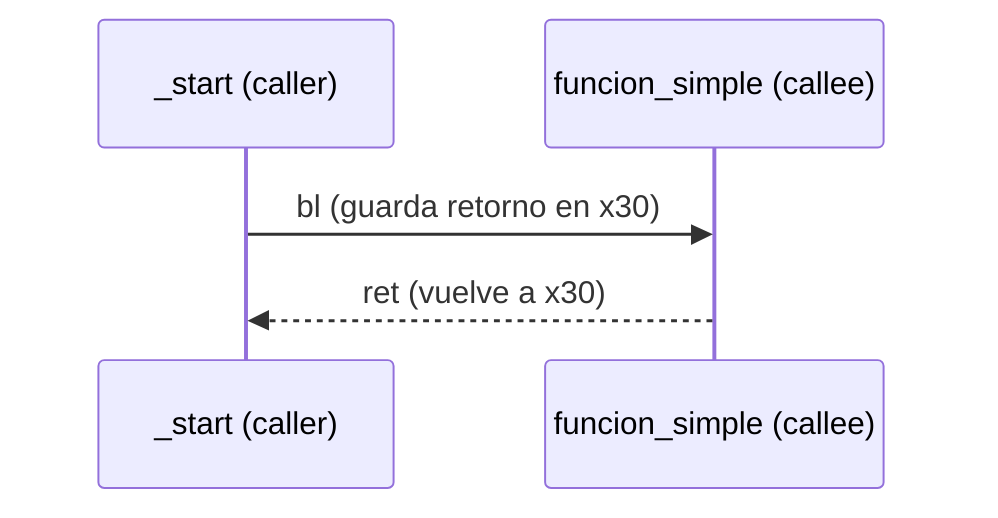
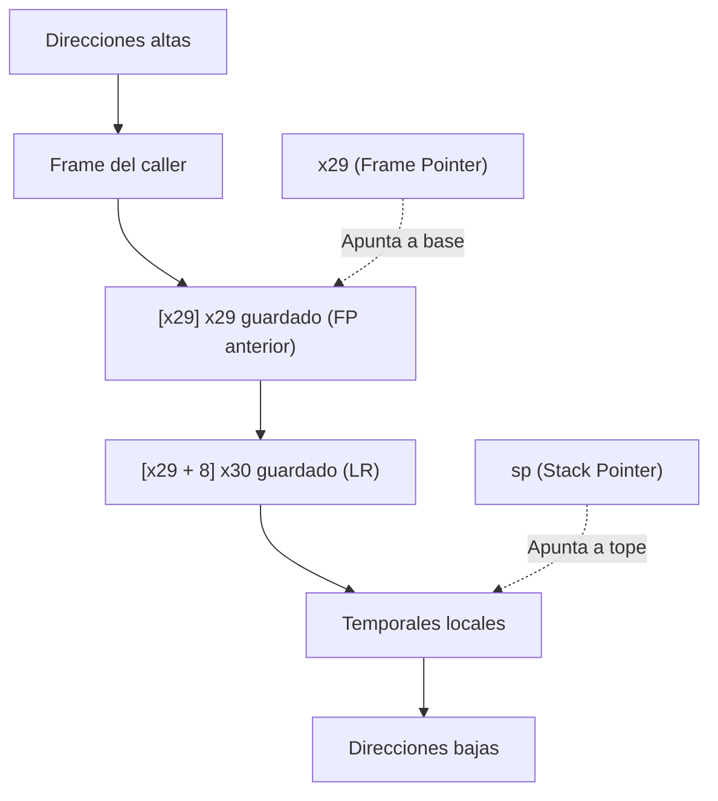
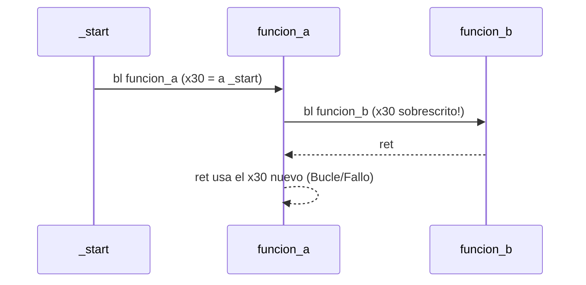

# Arquitectura de Computadores y Ensambladores 1

Escuela de Ingeniería de Ciencias y Sistemas

---
layout: center
---

Arquitectura de Computadores y Ensambladores 1

## Unidad 11
## Stack, funciones y stack frames

Cómo existen las funciones a nivel máquina en AArch64: llamadas, retornos, pila y depuración.

Unidad práctica: bl, ret, SP, x29 (FP), x30 (LR), funciones no hoja, recursión y GDB.

---

# Anuncios importantes

1. **Anuncio 1**

---

# Agenda

1. **Llamadas y retorno** — Caller/callee, `b` vs `bl`, `LR` y `ret`.
2. **Stack básico** — LIFO, crecimiento hacia abajo, `SP` y alineación de 16 bytes.
3. **Stack frames** — Prólogo, epílogo, `FP` (`x29`) y variables locales.
4. **Funciones no hoja** — Guardar `LR` y llamadas anidadas.
5. **Recursión y GDB** — Frames múltiples y lectura de backtrace.

---

# Competencias

### Competencia 1
El estudiante desarrolla soluciones eficientes en sistemas computacionales integrando arquitectura de computadores, programación en bajo nivel y herramientas modernas de análisis y simulación para resolver problemas complejos en sistemas embebidos e IoT.

### Competencia 2
Configura entornos de desarrollo para programación en ensamblador ARM-64 instalando y verificando herramientas en Linux como GAS, GDB y Make para establecer un ambiente funcional de compilación y depuración de código.

---

# Valor de la semana

**Disciplina.** Capacidad de actuar de forma ordenada y perseverante para seguir las reglas y alcanzar un objetivo.

### Aplicación en clase
El stack exige un orden estricto (LIFO). Lo último que reservas debe ser lo primero que liberas. Si rompes el orden u olvidas alinear la pila a 16 bytes, el procesador perderá el control del flujo y el programa fallará.

---

# Qué buscamos hoy

1. **Entender `bl` y `ret`** — Reconocer cómo el procesador recuerda dónde volver (`x30/LR`).
2. **Dominar el Stack** — Manejar `sp` correctamente manteniendo la alineación.
3. **Construir Frames** — Implementar prólogo y epílogo protegiendo `x29` y `x30`.
4. **Depurar con GDB** — Utilizar backtrace (`bt`) para seguir la cadena de llamadas.

---
layout: section
---

# Llamadas y retorno

Una función empieza como un salto que recuerda dónde volver.

---
layout: center
class: text-center
---

### Pregunta de arranque

## ¿Por qué no podemos usar simplemente `b` para llamar funciones?

- Porque el procesador saltaría... y no sabría cómo regresar.
- El código que llama (caller) necesita continuar después.
- Necesitamos guardar la dirección de retorno.

---

# Diferencias: b vs bl

- `b etiqueta` — Cambia el flujo de ejecución. NO guarda el retorno. Útil para loops o if/else.
- `bl etiqueta` — Cambia el flujo de ejecución. SÍ guarda retorno en `x30` (`LR`). Obligatorio para subrutinas.

`bl` no es un `b` con otro nombre. `bl` modifica `x30`. Si ese valor se pierde, `ret` no sabrá volver al lugar correcto.

---

# Caller y Callee

**Caller (quien llama)**
```asm
_start:
    bl funcion_simple
    // PC vuelve aquí
    mov x0, #0
    mov x8, #93
    svc #0
```

**Callee (la función)**
```asm
funcion_simple:
    mov x1, #42
    ret
```



---
layout: section
---

# Stack básico

El stack guarda datos temporales siguiendo disciplina LIFO.

---

# SP y crecimiento hacia abajo

- **LIFO** — Último en entrar, primero en salir. El orden es estricto.
- `sp` (Stack Pointer) — Registro especial que apunta al tope actual del stack.

**Reservar (baja sp)**
```asm
sub sp, sp, #16
```
Mueve el puntero a direcciones más bajas.

**Liberar (sube sp)**
```asm
add sp, sp, #16
```
Mueve el puntero a direcciones más altas.

---

# Alineación de 16 bytes

En AArch64, el stack **debe mantenerse alineado a 16 bytes** cuando se usa para llamadas a funciones.

```asm
sub sp, sp, #16      // Correcto
add sp, sp, #16      // Correcto
```

```asm
sub sp, sp, #8       // PELIGRO: Rompe la alineación
```

Reservar espacio NO inicializa la memoria a ceros. Tú decides qué escribir allí (e.g. `str x0, [sp]`).

---
layout: section
---

# Stack frames

Un frame organiza retorno, frame anterior y espacio local.

---

# Prólogo y epílogo

```asm
funcion:
    stp x29, x30, [sp, #-16]!   // Prólogo 1: guarda y reserva
    mov x29, sp                 // Prólogo 2: fija FP

    // ... variables locales y cuerpo de la función ...

    ldp x29, x30, [sp], #16     // Epílogo: restaura y libera
    ret                         // Vuelve al caller
```

- **Prólogo** — Pre-index (`!`): resta a `sp`, guarda `x29` y `x30` en la nueva posición.
- **Epílogo** — Post-index: carga `x29` y `x30`, luego suma a `sp`.

---

# Forma general de un frame



`x29` se mantiene fijo para ubicar el contexto de la función, mientras `sp` puede moverse para variables locales.

---

# Variables locales y orden de salida

```asm
funcion:
    stp x29, x30, [sp, #-16]!
    mov x29, sp

    sub sp, sp, #16             // Reserva para local
    str x0, [sp]                // Uso de la variable
    ldr x1, [sp]

    add sp, sp, #16             // Libera local
    ldp x29, x30, [sp], #16     // Restaura contexto
    ret
```

El orden de salida importa. Si olvidas `add sp, sp, #16`, el `ldp` buscará a `x29` y `x30` en la dirección equivocada y destruirá tu retorno.

---
layout: section
---

# Funciones no hoja

Una función que llama a otra debe proteger su propio retorno.

---

# El problema del `LR` sobrescrito



- **Función hoja** — No llama a nadie más. `x30` sobrevive intacto. No necesita prólogo si no usa variables locales.
- **Función no hoja** — Hace otro `bl`. Debe guardar obligatoriamente `x30` en el stack (prólogo).

---

# Preservación introductoria

Si llamas a otra función, no asumas que tus registros temporales sobrevivirán.

| Situación | Qué debes hacer |
|---|---|
| Necesitas un valor después de hacer `bl` | Guárdalo en tu stack (variables locales). |
| Eres una función no hoja | Haz el prólogo completo (`stp x29, x30...`). |
| Llamas a otra función | Asume que `x0`-`x7` cambiarán (son argumentos/retorno). |

En ABI real existen registros "caller-saved" y "callee-saved". Por ahora, guarda en tu frame local lo que no quieras perder.

---
layout: section
---

# Recursión y GDB

Cada llamada recursiva necesita su propio frame.

---

# Recursión: frames repetidos

```bash
cuenta(3) -> guarda LR, llama cuenta(2)
  cuenta(2) -> guarda LR, llama cuenta(1)
    cuenta(1) -> guarda LR, llama cuenta(0)
      cuenta(0) -> caso base, retorna!
```

- **¿Por qué usar stack?** — Cada llamada activa tiene un `x30` distinto. Si fuera una variable global, se sobrescribiría en cada paso.
- **Stack Overflow** — Si no hay caso base, el stack sigue creciendo hacia abajo hasta chocar (corrupción / fallo de segmentación).

---

# Debugging de frames con GDB

- `info registers sp x29 x30` — Verifica dónde apunta la pila y qué retornos tienes.
- `bt` (Backtrace) — Muestra la cadena de llamadas: "¿quién me llamó?".
- `x/4gx $sp` — Imprime las 4 palabras de 8 bytes en el tope de la pila.

GDB convierte el stack en evidencia visible. Gracias al uso disciplinado de `x29`, el comando `bt` puede reconstruir la historia de tu programa.

---

# Checklist mental

- Puedo explicar la diferencia entre `b` y `bl`.
- Sé que `ret` utiliza el valor de `x30` (`LR`).
- Entiendo que el stack crece hacia abajo y debo alinear a 16 bytes.
- Puedo escribir el prólogo y epílogo para fijar `x29` y guardar `x30`.
- Entiendo por qué una función no hoja DEBE usar un frame.
- Puedo usar `bt` en GDB para rastrear llamadas.

---

# Siguiente paso

Control de flujo y Syscalls → Subrutinas y Frames Dominados → Convenciones completas (ABI / AAPCS64) → Interoperabilidad con C

---
layout: center
class: text-center
---

### Actividad de cierre

# Preguntas de repaso

- ¿Qué instrucción reserva 16 bytes en el stack?
- ¿Qué pasa si haces `bl` dentro de una función sin guardar `x30`?
- ¿Por qué `x29` es útil si ya tenemos `sp`?
- ¿Por qué el epílogo debe ejecutarse en el orden exacto?
- ¿Qué comando de GDB reconstruye la lista de funciones que están en pausa?

---

### Ejemplo Práctico

Escribir un programa con una función `calcular` (no hoja) que llame a `duplicar` (hoja), pasando parámetros y usando el stack de forma disciplinada.

1. **_start** — Llama a `calcular` usando `bl` y finaliza con `exit(0)`.
2. **calcular (No hoja)** — Prólogo completo. Llama a `duplicar`. Epílogo completo.
3. **duplicar (Hoja)** — Puede no tener prólogo/epílogo si no usa el stack. `add x0, x0, x0` + `ret`.
4. **GDB** — Poner un breakpoint en `duplicar` y verificar el `bt`.

---

# Fuentes

- Página Quarto: `site/courses/aarch64/stack-funciones-frames/`
- Arm, *Learn the Architecture - A64 Instruction Set Architecture Guide*
- Arm, *Procedure Call Standard for the Arm 64-bit Architecture (AAPCS64)*
- Larry D. Pyeatt y William Ughetta, *ARM 64-Bit Assembly Language*
- GDB documentation
- Slidev, documentación oficial

---
layout: statement
---

# Dudas¿?

---
layout: center
---

# Gracias por tu atención
