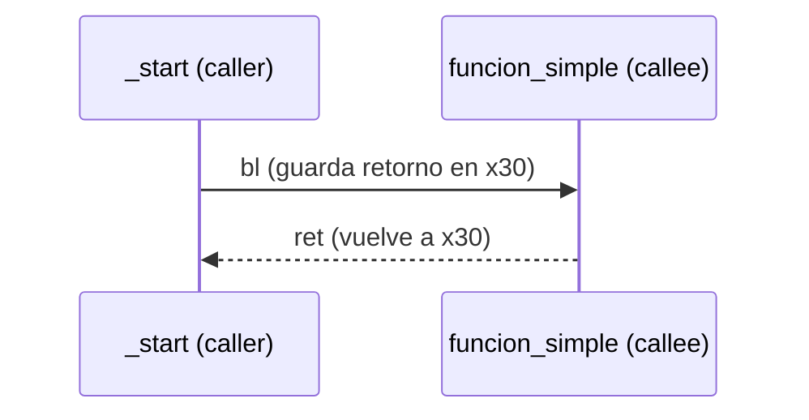
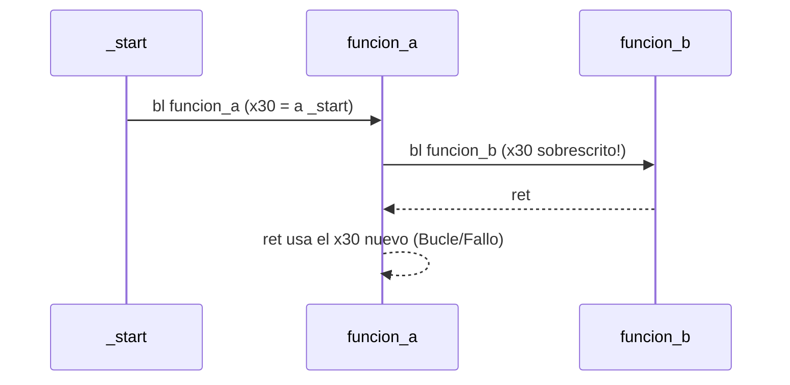

<CoverSlide
  title="Unidad 11 · Stack, funciones y stack frames"
  subtitle="Arquitectura de Computadores y Ensambladores 1"
  note="Escuela de Ingeniería de Ciencias y Sistemas"
/>

---
layout: aarch64-section
---

# Stack, funciones y stack frames

Cómo existen las funciones a nivel máquina en AArch64: llamadas, retornos, pila y depuración.

Unidad práctica: bl, ret, SP, x29 (FP), x30 (LR), funciones no hoja, recursión y GDB.

---

# Anuncios importantes

<InfoBox type="warning" title="Anuncios">

- **Anuncio 1**

</InfoBox>

---

# Agenda

<v-clicks>

1. **Llamadas y retorno** — Caller/callee, `b` vs `bl`, `LR` y `ret`.
2. **Stack básico** — LIFO, crecimiento hacia abajo, `SP` y alineación de 16 bytes.
3. **Stack frames** — Prólogo, epílogo, `FP` (`x29`) y variables locales.
4. **Funciones no hoja** — Guardar `LR` y llamadas anidadas.
5. **Recursión y GDB** — Frames múltiples y lectura de backtrace.

</v-clicks>

---

# Competencias

<InfoBox type="info" title="Competencia 1">

El estudiante desarrolla soluciones eficientes en sistemas computacionales integrando arquitectura de computadores, programación en bajo nivel y herramientas modernas de análisis y simulación para resolver problemas complejos en sistemas embebidos e IoT.

</InfoBox>

<InfoBox type="info" title="Competencia 2">

Configura entornos de desarrollo para programación en ensamblador ARM-64 instalando y verificando herramientas en Linux como GAS, GDB y Make para establecer un ambiente funcional de compilación y depuración de código.

</InfoBox>

---

# Valor de la semana

<InfoBox type="note" title="Disciplina">

Capacidad de actuar de forma ordenada y perseverante para seguir las reglas y alcanzar un objetivo.

El stack exige un orden estricto (LIFO). Lo último que reservas debe ser lo primero que liberas. Si rompes el orden u olvidas alinear la pila a 16 bytes, el procesador perderá el control del flujo y el programa fallará.

</InfoBox>

---

# Qué buscamos hoy

<StepList :steps="[
  'Entender bl y ret: reconocer cómo el procesador recuerda dónde volver (x30/LR)',
  'Dominar el Stack: manejar sp correctamente manteniendo la alineación',
  'Construir Frames: implementar prólogo y epílogo protegiendo x29 y x30',
  'Depurar con GDB: utilizar backtrace (bt) para seguir la cadena de llamadas'
]" />

---
layout: aarch64-section
---

# Llamadas y retorno

Una función empieza como un salto que recuerda dónde volver.

---
layout: aarch64-question
---

## ¿Por qué no podemos usar simplemente `b` para llamar funciones?

- Porque el procesador saltaría... y no sabría cómo regresar.
- El código que llama (caller) necesita continuar después.
- Necesitamos guardar la dirección de retorno.

---

# Diferencias: b vs bl

<v-clicks>

- **`b etiqueta`** — Cambia el flujo de ejecución. NO guarda el retorno. Útil para loops o if/else
- **`bl etiqueta`** — Cambia el flujo de ejecución. SÍ guarda retorno en `x30` (`LR`). Obligatorio para subrutinas

</v-clicks>

<InfoBox type="warning" title="Cuidado">

`bl` no es un `b` con otro nombre. `bl` modifica `x30`. Si ese valor se pierde, `ret` no sabrá volver al lugar correcto.

</InfoBox>

---
layout: aarch64-two-cols
---

# Caller y Callee

::left::

### Caller (quien llama)

```asm
_start:
    bl funcion_simple
    // PC vuelve aquí
    mov x0, #0
    mov x8, #93
    svc #0
```

::right::

### Callee (la función)

```asm
funcion_simple:
    mov x1, #42
    ret
```

<div v-click>



</div>

---
layout: aarch64-section
---

# Stack básico

El stack guarda datos temporales siguiendo disciplina LIFO.

---
layout: aarch64-two-cols
---

# SP y crecimiento hacia abajo

::left::

### Reservar (baja sp)

```asm
sub sp, sp, #16
```

Mueve el puntero a direcciones más bajas. LIFO: último en entrar.

::right::

### Liberar (sube sp)

```asm
add sp, sp, #16
```

Mueve el puntero a direcciones más altas. LIFO: primero en salir.

<InfoBox type="note" title="Concepto clave">

`sp` (Stack Pointer) apunta al tope actual del stack. El orden es estricto.

</InfoBox>

---

# Alineación de 16 bytes

<CodeBlock title="Alineación correcta vs incorrecta" lang="asm">

```asm
// Correcto
sub sp, sp, #16
add sp, sp, #16

// PELIGRO: Rompe la alineación
sub sp, sp, #8
```

</CodeBlock>

<InfoBox type="warning" title="Regla de oro">

En AArch64, el stack **debe mantenerse alineado a 16 bytes** cuando se usa para llamadas a funciones.

Reservar espacio NO inicializa la memoria a ceros. Tú decides qué escribir allí (e.g. `str x0, [sp]`).

</InfoBox>

---
layout: aarch64-section
---

# Stack frames

Un frame organiza retorno, frame anterior y espacio local.

---

# Prólogo y epílogo

<CodeBlock title="Prólogo y epílogo de una función" lang="asm">

```asm
funcion:
    stp x29, x30, [sp, #-16]!   // Prólogo 1: guarda y reserva
    mov x29, sp                 // Prólogo 2: fija FP

    // ... variables locales y cuerpo de la función ...

    ldp x29, x30, [sp], #16     // Epílogo: restaura y libera
    ret                         // Vuelve al caller
```

</CodeBlock>

<v-clicks>

- **Prólogo** — Pre-index (`!`): resta a `sp`, guarda `x29` y `x30` en la nueva posición
- **Epílogo** — Post-index: carga `x29` y `x30`, luego suma a `sp`

</v-clicks>

---

# Forma general de un frame

<div v-click>

<StackFrame :rows="[
  { label: 'Frame del caller', color: 'gray' },
  { split: true, leftLabel: 'x29 guardado', leftSublabel: '[x29]', leftPointer: '← x29 / FP', rightLabel: 'x30 guardado', rightSublabel: '[x29 + 8]', color: 'blue' },
  { label: 'Variables locales', sublabel: '[sp]', color: 'purple', pointer: '← sp', pointerColor: '#9333ea' },
]" />

</div>

<InfoBox type="note" title="Concepto clave">

`x29` se mantiene fijo para ubicar el contexto de la función, mientras `sp` puede moverse para variables locales.

</InfoBox>
---

# Variables locales y orden de salida

<CodeAnnotation :annotations="[
  { num: '1', text: 'Reserva 16 bytes para variable local' },
  { num: '2', text: 'Guarda x0 en stack, luego lo recupera en x1' },
  { num: '3', text: 'Libera espacio local ANTES de restaurar contexto' }
]">

```asm {1-3|5-7|9|10|11}
funcion:
    stp x29, x30, [sp, #-16]!
    mov x29, sp

    sub sp, sp, #16             // Reserva para local
    str x0, [sp]                // Uso de la variable
    ldr x1, [sp]

    add sp, sp, #16             // Libera local
    ldp x29, x30, [sp], #16     // Restaura contexto
    ret
```

</CodeAnnotation>

<InfoBox type="warning" title="Orden estricto">

Si olvidas `add sp, sp, #16`, el `ldp` buscará a `x29` y `x30` en la dirección equivocada y destruirá tu retorno.

</InfoBox>

---
layout: aarch64-section
---

# Funciones no hoja

Una función que llama a otra debe proteger su propio retorno.

---

# El problema del `LR` sobrescrito

<div v-click>



</div>

<v-clicks>

- **Función hoja** — No llama a nadie más. `x30` sobrevive intacto. No necesita prólogo si no usa variables locales
- **Función no hoja** — Hace otro `bl`. Debe guardar obligatoriamente `x30` en el stack (prólogo)

</v-clicks>

---

# Preservación introductoria

Si llamas a otra función, no asumas que tus registros temporales sobrevivirán.

<ComparisonTable
  :headers="['Situación', 'Qué debes hacer']"
  :rows='[
    ["Necesitas valor después de bl", "Guárdalo en tu stack (variables locales)"],
    ["Eres función no hoja", "Haz prólogo completo (stp x29, x30...)"],
    ["Llamas a otra función", "Asume que x0-x7 cambiarán (argumentos/retorno)"]
  ]'
/>

<InfoBox type="note" title="ABI real">

En ABI real existen registros "caller-saved" y "callee-saved". Por ahora, guarda en tu frame local lo que no quieras perder.

</InfoBox>

---
layout: aarch64-section
---

# Recursión y GDB

Cada llamada recursiva necesita su propio frame.

---

# Recursión: frames repetidos

<CodeBlock title="Pila de llamadas recursivas" lang="bash">

```bash
cuenta(3) -> guarda LR, llama cuenta(2)
  cuenta(2) -> guarda LR, llama cuenta(1)
    cuenta(1) -> guarda LR, llama cuenta(0)
      cuenta(0) -> caso base, retorna!
```

</CodeBlock>

<v-clicks>

- **¿Por qué usar stack?** — Cada llamada activa tiene un `x30` distinto. Si fuera una variable global, se sobrescribiría en cada paso
- **Stack Overflow** — Si no hay caso base, el stack sigue creciendo hacia abajo hasta chocar (corrupción / fallo de segmentación)

</v-clicks>

---

# Debugging de frames con GDB

<v-clicks>

- **`info registers sp x29 x30`** — Verifica dónde apunta la pila y qué retornos tienes
- **`bt` (Backtrace)** — Muestra la cadena de llamadas: "¿quién me llamó?"
- **`x/4gx $sp`** — Imprime las 4 palabras de 8 bytes en el tope de la pila

</v-clicks>

<InfoBox type="note" title="GDB como evidencia">

GDB convierte el stack en evidencia visible. Gracias al uso disciplinado de `x29`, el comando `bt` puede reconstruir la historia de tu programa.

</InfoBox>

---
layout: aarch64-checklist
---

# Checklist mental

- <span class="check-icon">✓</span> Puedo explicar la diferencia entre `b` y `bl`
- <span class="check-icon">✓</span> Sé que `ret` utiliza el valor de `x30` (`LR`)
- <span class="check-icon">✓</span> Entiendo que el stack crece hacia abajo y debo alinear a 16 bytes
- <span class="check-icon">✓</span> Puedo escribir el prólogo y epílogo para fijar `x29` y guardar `x30`
- <span class="check-icon">✓</span> Entiendo por qué una función no hoja DEBE usar un frame
- <span class="check-icon">✓</span> Puedo usar `bt` en GDB para rastrear llamadas

<div class="mascot-row mt-4">
<Mascot emotion="solucionado" />
</div>

---
layout: aarch64-statement
---

# Siguiente paso

Control de flujo y Syscalls → Subrutinas y Frames Dominados → Convenciones completas (ABI / AAPCS64) → Interoperabilidad con C

---
layout: aarch64-question
---

## Preguntas de repaso

- ¿Qué instrucción reserva 16 bytes en el stack?
- ¿Qué pasa si haces `bl` dentro de una función sin guardar `x30`?
- ¿Por qué `x29` es útil si ya tenemos `sp`?
- ¿Por qué el epílogo debe ejecutarse en el orden exacto?
- ¿Qué comando de GDB reconstruye la lista de funciones que están en pausa?

<div class="mascot-row mt-4">
<Mascot emotion="pensando" />
</div>

---

# Ejemplo práctico

Escribir un programa con una función `calcular` (no hoja) que llame a `duplicar` (hoja), pasando parámetros y usando el stack de forma disciplinada.

<StepList :steps="[
  '_start: llama a calcular usando bl y finaliza con exit(0)',
  'calcular (No hoja): prólogo completo. Llama a duplicar. Epílogo completo',
  'duplicar (Hoja): puede no tener prólogo/epílogo si no usa stack. add x0, x0, x0 + ret',
  'GDB: poner breakpoint en duplicar y verificar el bt'
]" />

---

# Fuentes

- Página Quarto: `site/courses/aarch64/stack-funciones-frames/`
- Arm, *Learn the Architecture - A64 Instruction Set Architecture Guide*
- Arm, *Procedure Call Standard for the Arm 64-bit Architecture (AAPCS64)*
- Larry D. Pyeatt y William Ughetta, *ARM 64-Bit Assembly Language*
- GDB documentation
- Slidev, documentación oficial

---

<ActivityRegister />

---
layout: aarch64-statement
---

# ¿Dudas?

---

<CoverSlide
  title="Gracias por tu atención"
  subtitle="Arquitectura de Computadores y Ensambladores 1"
/>
