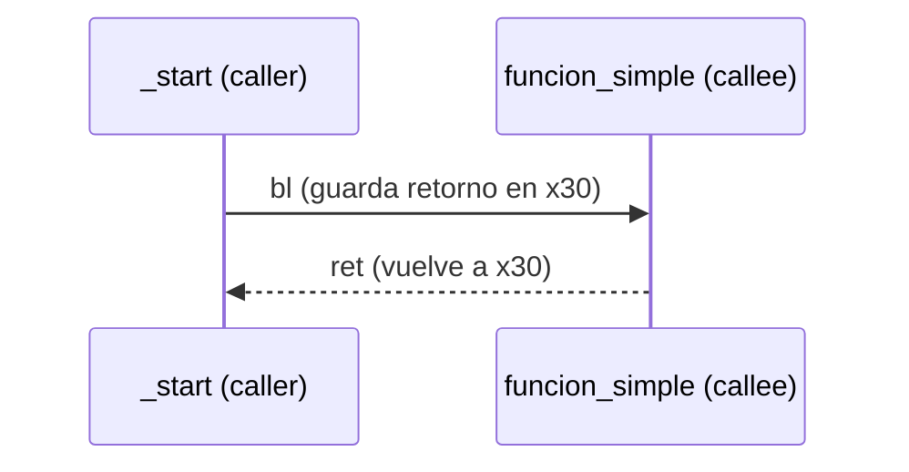
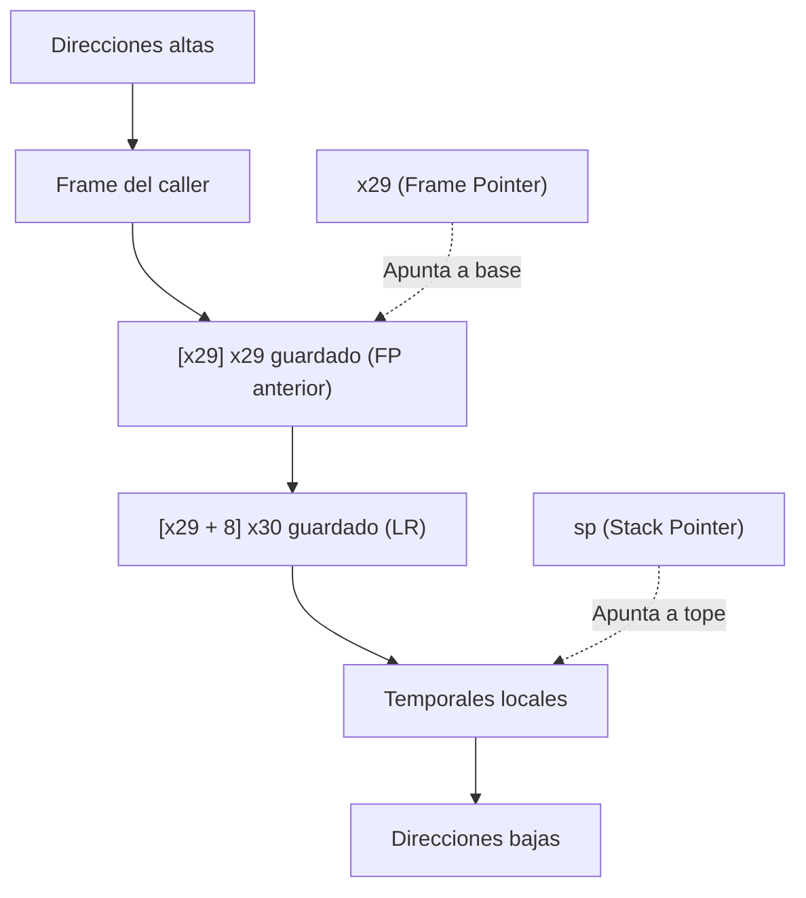
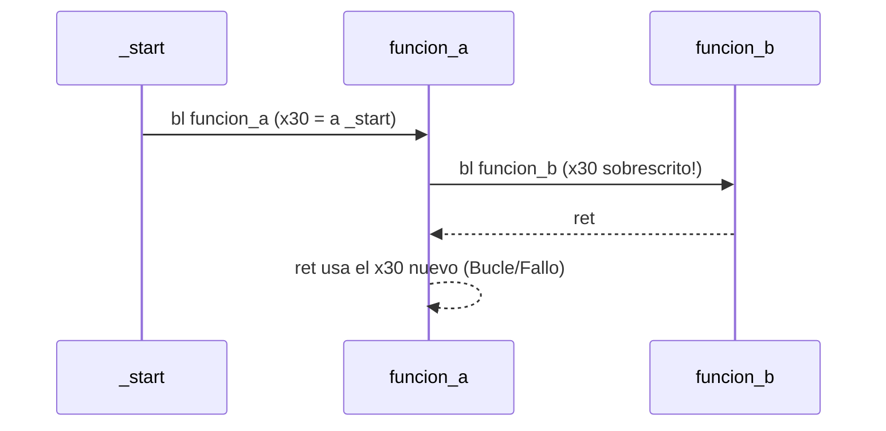

<style>
@import "../styles/index.css";
</style>

<div class="ecys-cover-bg"></div>

<div class="ecys-title-cover">

<div class="muted">Escuela de Ingeniería de Ciencias y Sistemas</div>

# Arquitectura de Computadores y Ensambladores 1

</div>

---
layout: center
---

<div class="muted">Arquitectura de Computadores y Ensambladores 1</div>

## Unidad 11
## Stack, funciones y stack frames

Cómo existen las funciones a nivel máquina en AArch64:
llamadas, retornos, pila y depuración.

<div class="cover-note">
Unidad práctica: bl, ret, SP, x29 (FP), x30 (LR), funciones no hoja, recursión y GDB.
</div>

---

# Anuncios importantes

<div class="numbered-grid">
  <div class="numbered-card">
    <div class="card-number">1</div>
    <h3>Anuncio 1</h3>
    <p></p>
  </div>
</div>

---

# Agenda

<div class="numbered-grid">
  <div class="numbered-card">
    <div class="card-number">1</div>
    <h3>Llamadas y retorno</h3>
    <p>Caller/callee, <code>b</code> vs <code>bl</code>, <code>LR</code> y <code>ret</code>.</p>
  </div>

  <div class="numbered-card">
    <div class="card-number">2</div>
    <h3>Stack básico</h3>
    <p>LIFO, crecimiento hacia abajo, <code>SP</code> y alineación de 16 bytes.</p>
  </div>

  <div class="numbered-card">
    <div class="card-number">3</div>
    <h3>Stack frames</h3>
    <p>Prólogo, epílogo, <code>FP</code> (<code>x29</code>) y variables locales.</p>
  </div>

  <div class="numbered-card">
    <div class="card-number">4</div>
    <h3>Funciones no hoja</h3>
    <p>Guardar <code>LR</code> y llamadas anidadas.</p>
  </div>

  <div class="numbered-card">
    <div class="card-number">5</div>
    <h3>Recursión y GDB</h3>
    <p>Frames múltiples y lectura de backtrace.</p>
  </div>
</div>

---

# Competencias

<div class="concept-grid vertical-center">
  <div class="concept-card">
    <h3>Competencia 1</h3>
    <p>
      El estudiante desarrolla soluciones eficientes en sistemas computacionales
      integrando arquitectura de computadores, programación en bajo nivel y
      herramientas modernas de análisis y simulación para resolver problemas
      complejos en sistemas embebidos e IoT.
    </p>
  </div>

  <div class="concept-card">
    <h3>Competencia 2</h3>
    <p>
      Configura entornos de desarrollo para programación en ensamblador ARM-64
      instalando y verificando herramientas en Linux como GAS, GDB y Make para
      establecer un ambiente funcional de compilación y depuración de código.
    </p>
  </div>
</div>

---

# Valor de la semana

<div class="callout tip">
  <strong>Disciplina.</strong>
  Capacidad de actuar de forma ordenada y perseverante para seguir las reglas y alcanzar un objetivo.
</div>

<div class="concept-grid">
  <div class="concept-card">
    <h3>Aplicación en clase</h3>
    <p>
      El stack exige un orden estricto (LIFO). Lo último que reservas debe ser lo
      primero que liberas. Si rompes el orden u olvidas alinear la pila a 16 bytes,
      el procesador perderá el control del flujo y el programa fallará.
    </p>
  </div>
</div>

---

# Qué buscamos hoy

<div class="slide-center-block">

<div class="objective-grid">
  <div v-click class="objective-item">
    <div class="item-number">1</div>
    <h3>Entender <code>bl</code> y <code>ret</code></h3>
    <p>Reconocer cómo el procesador recuerda dónde volver (<code>x30/LR</code>).</p>
  </div>

  <div v-click class="objective-item">
    <div class="item-number">2</div>
    <h3>Dominar el Stack</h3>
    <p>Manejar <code>sp</code> correctamente manteniendo la alineación.</p>
  </div>

  <div v-click class="objective-item">
    <div class="item-number">3</div>
    <h3>Construir Frames</h3>
    <p>Implementar prólogo y epílogo protegiendo <code>x29</code> y <code>x30</code>.</p>
  </div>

  <div v-click class="objective-item">
    <div class="item-number">4</div>
    <h3>Depurar con GDB</h3>
    <p>Utilizar backtrace (<code>bt</code>) para seguir la cadena de llamadas.</p>
  </div>
</div>

</div>

---
layout: section
---

# Llamadas y retorno

Una función empieza como un salto que recuerda dónde volver.

---
layout: center
class: text-center
---

<div class="big-question">
  <div class="muted">Pregunta de arranque</div>
  <h3>¿Por qué no podemos usar simplemente <code>b</code> para llamar funciones?</h3>
  <div class="question-points">
    <div v-click>Porque el procesador saltaría... y no sabría cómo regresar.</div>
    <div v-click>El código que llama (caller) necesita continuar después.</div>
    <div v-click>Necesitamos guardar la dirección de retorno.</div>
  </div>
</div>

---

###### Diferencias: b vs bl

<div class="slide-center-block">

<div class="compare-grid">
  <div v-click class="compare-card">
    <div class="card-kicker"><code>b etiqueta</code></div>
    <ul>
      <li>Cambia el flujo de ejecución.</li>
      <li>NO guarda el retorno.</li>
      <li>Útil para loops o if/else.</li>
    </ul>
  </div>
  <div v-click class="compare-card">
    <div class="card-kicker"><code>bl etiqueta</code></div>
    <ul>
      <li>Cambia el flujo de ejecución.</li>
      <li>SÍ guarda retorno en <code>x30</code> (<code>LR</code>).</li>
      <li>Obligatorio para subrutinas.</li>
    </ul>
  </div>
</div>

<div v-click class="callout warning centered-narrow">
<code>bl</code> no es un <code>b</code> con otro nombre. <code>bl</code> modifica <code>x30</code>. Si ese valor se pierde, <code>ret</code> no sabrá volver al lugar correcto.
</div>

</div>

---

<div class="slide-center-block">

<div class="content-stack-lg">

<div class="two-column-layout">

<div class="content-stack-md">

<div class="muted centered-narrow">Caller (quien llama)</div>

```asm
_start:
    bl funcion_simple
    // PC vuelve aquí
    mov x0, #0
    mov x8, #93
    svc #0
```

</div>

<div class="content-stack-md">

<div class="muted centered-narrow">Callee (la función)</div>

```asm
funcion_simple:
    mov x1, #42
    ret
```

</div>

</div>

<div class="diagram-block">



</div>

</div>

</div>

---
layout: section
---

# Stack básico

El stack guarda datos temporales siguiendo disciplina LIFO.

---

###### SP y crecimiento hacia abajo

<div class="slide-center-block">

<div class="content-stack-lg">

<div class="concept-grid">
  <div v-click class="concept-card">
    <h3>LIFO</h3>
    <p>Último en entrar, primero en salir. El orden es estricto.</p>
  </div>
  <div v-click class="concept-card">
    <h3><code>sp</code> (Stack Pointer)</h3>
    <p>Registro especial que apunta al tope actual del stack.</p>
  </div>
</div>

<div v-click class="compare-grid">
  <div class="compare-card">
    <div class="card-kicker">Reservar (baja sp)</div>

```asm
sub sp, sp, #16
```

<ul>
  <li>Mueve el puntero a direcciones más bajas.</li>
</ul>
  </div>
  <div class="compare-card">
    <div class="card-kicker">Liberar (sube sp)</div>

```asm
add sp, sp, #16
```

<ul>
  <li>Mueve el puntero a direcciones más altas.</li>
</ul>
  </div>
</div>

</div>

</div>

---

###### Alineación de 16 bytes

<div class="slide-center-block">

<div class="content-stack-lg">

<div class="lead-block">
En AArch64, el stack <strong>debe mantenerse alineado a 16 bytes</strong> cuando se usa para llamadas a funciones.
</div>

```asm
sub sp, sp, #16      // Correcto
add sp, sp, #16      // Correcto
```

```asm
sub sp, sp, #8       // PELIGRO: Rompe la alineación
```

<div v-click class="callout warning centered-narrow">
Reservar espacio NO inicializa la memoria a ceros. Tú decides qué escribir allí (e.g. <code>str x0, [sp]</code>).
</div>

</div>

</div>

---
layout: section
---

# Stack frames

Un frame organiza retorno, frame anterior y espacio local.

---

###### Prólogo y epílogo

<div class="slide-center-block">

<div class="content-stack-lg">

```asm
funcion:
    stp x29, x30, [sp, #-16]!   // Prólogo 1: guarda y reserva
    mov x29, sp                 // Prólogo 2: fija FP

    // ... variables locales y cuerpo de la función ...

    ldp x29, x30, [sp], #16     // Epílogo: restaura y libera
    ret                         // Vuelve al caller
```

<div class="concept-grid">
  <div v-click class="concept-card">
    <h3>Prólogo</h3>
    <p>Pre-index (<code>!</code>): resta a <code>sp</code>, guarda <code>x29</code> y <code>x30</code> en la nueva posición.</p>
  </div>
  <div v-click class="concept-card">
    <h3>Epílogo</h3>
    <p>Post-index: carga <code>x29</code> y <code>x30</code>, luego suma a <code>sp</code>.</p>
  </div>
</div>

</div>

</div>

---

###### Forma general de un frame

<div class="slide-center-block">

<div class="content-stack-lg">

<div class="diagram-block">



</div>

<div v-click class="key-idea centered-narrow">
<code>x29</code> se mantiene fijo para ubicar el contexto de la función, mientras <code>sp</code> puede moverse para variables locales.
</div>

</div>

</div>

---

###### Variables locales y orden de salida

<div class="slide-center-block">

<div class="content-stack-lg">

```asm
funcion:
    stp x29, x30, [sp, #-16]!
    mov x29, sp

    sub sp, sp, #16             // Reserva para local
    str x0, [sp]                // Uso de la variable
    ldr x1, [sp]

    add sp, sp, #16             // Libera local
    ldp x29, x30, [sp], #16     // Restaura contexto
    ret
```

<div v-click class="callout warning centered-narrow">
El orden de salida importa. Si olvidas <code>add sp, sp, #16</code>, el <code>ldp</code> buscará a <code>x29</code> y <code>x30</code> en la dirección equivocada y destruirá tu retorno.
</div>

</div>

</div>

---
layout: section
---

# Funciones no hoja

Una función que llama a otra debe proteger su propio retorno.

---

###### El problema del `LR` sobrescrito

<div class="slide-center-block">

<div class="content-stack-lg">

<div class="diagram-block">



</div>

<div class="compare-grid">
  <div v-click class="compare-card">
    <div class="card-kicker">Función hoja</div>
    <p>No llama a nadie más. <code>x30</code> sobrevive intacto. No necesita prólogo si no usa variables locales.</p>
  </div>
  <div v-click class="compare-card">
    <div class="card-kicker">Función no hoja</div>
    <p>Hace otro <code>bl</code>. Debe guardar obligatoriamente <code>x30</code> en el stack (prólogo).</p>
  </div>
</div>

</div>

</div>

---

###### Preservación introductoria

<div class="slide-center-block">

<div class="content-stack-lg">

<div class="lead-block">
Si llamas a otra función, no asumas que tus registros temporales sobrevivirán.
</div>

| Situación | Qué debes hacer |
|---|---|
| Necesitas un valor después de hacer `bl` | Guárdalo en tu stack (variables locales). |
| Eres una función no hoja | Haz el prólogo completo (<code>stp x29, x30...</code>). |
| Llamas a otra función | Asume que <code>x0</code>-<code>x7</code> cambiarán (son argumentos/retorno). |

<div v-click class="key-idea centered-narrow">
En ABI real existen registros "caller-saved" y "callee-saved". Por ahora, guarda en tu frame local lo que no quieras perder.
</div>

</div>

</div>

---
layout: section
---

# Recursión y GDB

Cada llamada recursiva necesita su propio frame.

---

###### Recursión: frames repetidos

<div class="slide-center-block">

<div class="content-stack-lg">

```bash
cuenta(3) -> guarda LR, llama cuenta(2)
  cuenta(2) -> guarda LR, llama cuenta(1)
    cuenta(1) -> guarda LR, llama cuenta(0)
      cuenta(0) -> caso base, retorna!
```

<div class="compare-grid">
  <div v-click class="compare-card">
    <div class="card-kicker">¿Por qué usar stack?</div>
    <p>Cada llamada activa tiene un <code>x30</code> distinto. Si fuera una variable global, se sobrescribiría en cada paso.</p>
  </div>
  <div v-click class="compare-card">
    <div class="card-kicker">Stack Overflow</div>
    <p>Si no hay caso base, el stack sigue creciendo hacia abajo hasta chocar (corrupción / fallo de segmentación).</p>
  </div>
</div>

</div>

</div>

---

###### Debugging de frames con GDB

<div class="slide-center-block">

<div class="content-stack-lg">

<div class="concept-grid">
  <div v-click class="concept-card">
    <h3><code>info registers sp x29 x30</code></h3>
    <p>Verifica dónde apunta la pila y qué retornos tienes.</p>
  </div>
  <div v-click class="concept-card">
    <h3><code>bt</code> (Backtrace)</h3>
    <p>Muestra la cadena de llamadas: <em>"¿quién me llamó?"</em>.</p>
  </div>
  <div v-click class="concept-card">
    <h3><code>x/4gx $sp</code></h3>
    <p>Imprime las 4 palabras de 8 bytes en el tope de la pila.</p>
  </div>
</div>

<div v-click class="callout info centered-narrow">
GDB convierte el stack en evidencia visible. Gracias al uso disciplinado de <code>x29</code>, el comando <code>bt</code> puede reconstruir la historia de tu programa.
</div>

</div>

</div>

---

# Checklist mental

<div class="slide-center-block">

<div class="reveal-list centered-narrow">
  <div v-click class="reveal-item">Puedo explicar la diferencia entre <code>b</code> y <code>bl</code>.</div>
  <div v-click class="reveal-item">Sé que <code>ret</code> utiliza el valor de <code>x30</code> (<code>LR</code>).</div>
  <div v-click class="reveal-item">Entiendo que el stack crece hacia abajo y debo alinear a 16 bytes.</div>
  <div v-click class="reveal-item">Puedo escribir el prólogo y epílogo para fijar <code>x29</code> y guardar <code>x30</code>.</div>
  <div v-click class="reveal-item">Entiendo por qué una función no hoja DEBE usar un frame.</div>
  <div v-click class="reveal-item">Puedo usar <code>bt</code> en GDB para rastrear llamadas.</div>
</div>

</div>

---

# Siguiente paso

<div class="slide-center-block">

<div class="flow-column">
  <div v-click class="flow-step">Control de flujo y Syscalls</div>
  <div v-click class="flow-arrow">→</div>
  <div v-click class="flow-step">Subrutinas y Frames Dominados</div>
  <div v-click class="flow-arrow">→</div>
  <div v-click class="flow-step">Convenciones completas (ABI / AAPCS64)</div>
  <div v-click class="flow-arrow">→</div>
  <div v-click class="flow-step">Interoperabilidad con C</div>
</div>

</div>

---
layout: center
class: text-center
---

<div class="muted">Actividad de cierre</div>

# Preguntas de repaso

<div class="question-points mx-auto mt-6 max-w-2xl text-left">
  <div v-click>¿Qué instrucción reserva 16 bytes en el stack?</div>
  <div v-click>¿Qué pasa si haces <code>bl</code> dentro de una función sin guardar <code>x30</code>?</div>
  <div v-click>¿Por qué <code>x29</code> es útil si ya tenemos <code>sp</code>?</div>
  <div v-click>¿Por qué el epílogo debe ejecutarse en el orden exacto?</div>
  <div v-click>¿Qué comando de GDB reconstruye la lista de funciones que están en pausa?</div>
</div>

---

###### Ejemplo Práctico

<div class="slide-center-block">

<div class="content-stack-lg">

<div class="key-idea centered-narrow">
  <div class="muted">Actividad guiada</div>
  <p>Escribir un programa con una función <code>calcular</code> (no hoja) que llame a
  <code>duplicar</code> (hoja), pasando parámetros y usando el stack de forma disciplinada.</p>
</div>

<div class="concept-grid concept-grid-4">
  <div v-click class="concept-card">
    <h3>_start</h3>
    <p>Llama a <code>calcular</code> usando <code>bl</code> y finaliza con <code>exit(0)</code>.</p>
  </div>

  <div v-click class="concept-card">
    <h3>calcular (No hoja)</h3>
    <p>Prólogo completo. Llama a <code>duplicar</code>. Epílogo completo.</p>
  </div>

  <div v-click class="concept-card">
    <h3>duplicar (Hoja)</h3>
    <p>Puede no tener prólogo/epílogo si no usa el stack. <code>add x0, x0, x0</code> + <code>ret</code>.</p>
  </div>

  <div v-click class="concept-card">
    <h3>GDB</h3>
    <p>Poner un breakpoint en <code>duplicar</code> y verificar el <code>bt</code>.</p>
  </div>
</div>

</div>

</div>

---

# Fuentes

- Página Quarto: `site/courses/aarch64/stack-funciones-frames/`
- Arm, *Learn the Architecture - A64 Instruction Set Architecture Guide*
- Arm, *Procedure Call Standard for the Arm 64-bit Architecture (AAPCS64)*
- Larry D. Pyeatt y William Ughetta, *ARM 64-Bit Assembly Language*
- GDB documentation
- Slidev, documentación oficial

---
layout: statement
---

# Dudas¿?

---
layout: center
---

# Gracias por tu atención
