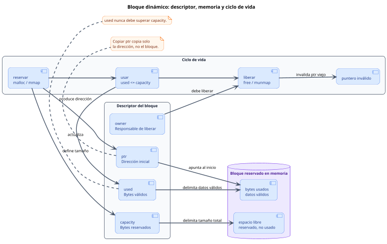

<CoverSlide
  title="Unidad 12 · Heap y memoria dinámica"
  subtitle="Arquitectura de Computadores y Ensambladores 1"
  note="Escuela de Ingeniería de Ciencias y Sistemas"
/>

---
layout: aarch64-section
---

# Heap y memoria dinámica

Vida útil, ownership, bloques dinámicos y errores de memoria.

Unidad teórica y práctica: stack vs heap, leaks, use-after-free y preparación para mmap.

---

# Anuncios importantes

<InfoBox type="warning" title="Anuncios">

- **Anuncio 1**

</InfoBox>

---

# Agenda

<v-clicks>

1. **Stack vs Heap** — Diferencias en vida útil (lifetime) y por qué `.bss` no siempre alcanza.
2. **Bloques y Ownership** — Dirección, capacidad, uso y la responsabilidad de liberar.
3. **Errores críticos** — Memory leaks, use-after-free y double free.
4. **De brk a mmap** — Diferenciar CPU, kernel y bibliotecas (`malloc`/`free`).

</v-clicks>

---

# Competencias

<InfoBox type="info" title="Competencia 1">

El estudiante desarrolla soluciones eficientes en sistemas computacionales integrando arquitectura de computadores, programación en bajo nivel y herramientas modernas de análisis y simulación para resolver problemas complejos en sistemas embebidos e IoT.

</InfoBox>

<InfoBox type="info" title="Competencia 2">

Administra la asignación y liberación de memoria dinámica a bajo nivel, previniendo vulnerabilidades y fallos críticos (leaks, double free) para garantizar la estabilidad e integridad de los sistemas.

</InfoBox>

---

# Valor de la semana

<InfoBox type="note" title="Responsabilidad (Ownership)">

Hacerse cargo del ciclo de vida completo de los recursos que uno solicita y utiliza.

En programación de bajo nivel, no hay un recolector de basura (Garbage Collector) que limpie nuestros errores. Si pides memoria dinámica, tú eres el dueño (owner) y tienes la responsabilidad estricta de liberarla cuando termine su vida útil.

</InfoBox>

---

# Qué buscamos hoy

<StepList :steps="[
  'Diferenciar memorias: reconocer cuándo usar Stack, Heap o .bss según la vida útil',
  'Entender Ownership: separar el concepto de puntero del concepto de dueño del bloque',
  'Reconocer Fallos: identificar qué causa leaks y use-after-free a nivel de diseño',
  'Preparar el terreno: distinguir entre instrucciones de A64, funciones (malloc) y syscalls (mmap)'
]" />

---
layout: aarch64-section
---

# Stack vs Heap

No toda memoria vive lo mismo ni se administra igual.

---

# Tres vidas distintas

La dirección indica dónde está un dato. **La vida útil indica hasta cuándo tiene sentido usarlo.**

<ComparisonTable
  :headers="['Región', 'Cuándo nace', 'Cuándo muere']"
  :rows='[
    [".data / .bss", "Al cargar proceso", "Al terminar proceso"],
    ["Stack", "Al entrar a función", "Al restaurar sp"],
    ["Heap", "Al pedir memoria", "Al liberar explícitamente"]
  ]'
/>

<InfoBox type="warning" title="Cuidado">

El error aparece cuando una dirección se sigue usando **después de que su vida útil terminó**.

</InfoBox>

---
layout: aarch64-two-cols
---

# ¿Por qué no basta .bss o Stack?

::left::

### Límites del `.bss`

```asm
.bss
buffer:
    .skip 64
```

Si el tamaño depende de una entrada (e.g., leer un archivo de tamaño desconocido), fijar un número desperdicia memoria o se queda corto.

::right::

### Límites del Stack

```bash
funcion crea local en stack
  ptr = dirección del local
funcion retorna
  sp se restaura
```

Si devuelves la dirección de una variable local y la función retorna, ese `ptr` ya es inválido. **El frame se destruyó.**

<InfoBox type="note" title="Cuándo usar Heap">

El Heap sirve para datos cuya vida no encaja con una sola llamada o cuyo tamaño se decide al ejecutar.

</InfoBox>

---
layout: aarch64-section
---

# Bloques y Ownership

Un bloque dinámico necesita puntero, capacidad, uso y dueño.

---

# Anatomía de un bloque dinámico

<div v-click class="w-full flex justify-center mt-4">

<div class="w-[92%]">



</div>

</div>

---

<v-clicks>

- **Puntero** — Dirección inicial en memoria. Copiar el puntero no copia el bloque
- **Capacidad** — Cantidad total de bytes reservados. Límite máximo
- **Usados** — Cantidad de bytes que contienen datos válidos actualmente
- **Dueño / Owner** — Módulo responsable de liberar el bloque

</v-clicks>

<div class="mascot-row mt-4">
<Mascot emotion="leyendo" />
</div>

---
layout: aarch64-two-cols
---

# Ownership y Transferencia

Puntero NO equivale a ownership. Puedes tener una copia de la dirección (préstamo) sin ser responsable de liberar el bloque.

::left::

### Préstamo (Borrow)

Función A llama a Función B pasándole el puntero. B lee o escribe, pero **no libera**. A sigue siendo el dueño.

::right::

### Transferencia (Move)

A entrega el ownership a B. B ahora es el responsable de liberar. A ya no debe intentar liberar ese bloque.

---
layout: aarch64-section
---

# Errores críticos de memoria

Leaks, use-after-free y double free son fallos de vida útil.

---

# Memory Leak (Fuga)

<CodeBlock title="Pérdida de referencia" lang="asm">

```asm
ldr x19, =buffer  // Puntero al heap
mov x19, #0       // Referencia local perdida!
// ¿Quién lo libera ahora?
```

</CodeBlock>

<InfoBox type="warning" title="Consecuencia">

- Se pierde la referencia a la memoria reservada
- Nadie tiene el puntero para hacer `free`
- El bloque queda ocupado para siempre, desperdiciando recursos

</InfoBox>

---

# Double Free

<CodeBlock title="Liberación duplicada" lang="bash">

```bash
free(ptr)
free(ptr) // Error crítico, el bloque ya no te pertenece
```

</CodeBlock>

<InfoBox type="warning" title="Causa">

- Se libera **dos veces** el mismo bloque
- Ocurre por ownership confuso (A y B creen ser dueños)
- Corrompe el estado interno del Allocator

</InfoBox>

---

# Use-after-free y Punteros Colgantes

Ocurre cuando el programa usa un puntero **después** de haber liberado el bloque.

<CodeBlock title="Ciclo de vida de un puntero" lang="bash">

```bash
antes:
  x19 -> bloque vivo

liberación:
  allocator recupera bloque (free)

después:
  x19 -> dirección vieja (Puntero colgante / Dangling pointer)
  strb w0, [x19] // ERROR CRÍTICO DE SEGURIDAD
```

</CodeBlock>

<InfoBox type="warning" title="Peligro">

Liberar un bloque **no borra** automáticamente todas las copias del puntero. Las copias viejas quedan peligrosas si alguien las usa.

</InfoBox>

<div class="mascot-row mt-4">
<Mascot emotion="confundido" />
</div>

---
layout: aarch64-section
---

# De brk a mmap

Entendiendo las capas del sistema.

---

# CPU, Kernel y Bibliotecas

Confundir estas capas causa errores de lectura. El Heap no es una instrucción.

<ComparisonTable
  :headers="['Capa', 'Ejemplo', 'Quién lo entiende', 'Qué hace']"
  :rows='[
    ["CPU", "ldr x0, [x1]", "Procesador", "Ejecuta instrucciones A64"],
    ["Kernel", "svc #0 (mmap)", "Linux", "Syscalls para memoria bruta"],
    ["Biblioteca", "malloc, free", "libc", "Administra bloques sobre kernel"]
  ]'
/>

<v-clicks>

- **`brk` (Histórico)** — Syscall antigua para mover el límite final del heap. No la usaremos para allocators modernos
- **`mmap` (Práctico)** — Syscall para mapear regiones explícitas de memoria al kernel. Será nuestra base en la Unidad 13

</v-clicks>

---
layout: aarch64-checklist
---

# Checklist mental

- <span class="check-icon">✓</span> Puedo explicar qué es el heap y diferenciarlo del stack y `.bss`
- <span class="check-icon">✓</span> Entiendo qué es el ciclo de vida de un dato
- <span class="check-icon">✓</span> Sé distinguir entre tener un puntero y tener el ownership
- <span class="check-icon">✓</span> Entiendo la diferencia entre capacidad reservada y bytes usados
- <span class="check-icon">✓</span> Puedo reconocer y explicar qué es un Memory Leak
- <span class="check-icon">✓</span> Entiendo el peligro de un Use-After-Free y de un Double Free
- <span class="check-icon">✓</span> Sé que `malloc` es una función de biblioteca, no una instrucción

<div class="mascot-row mt-4">
<Mascot emotion="solucionado" />
</div>

---
layout: aarch64-statement
---

# Siguiente paso

Heap y bloques conceptuales → Syscalls `mmap` y `munmap` → Permisos de memoria (RWX) y páginas → Implementaciones reales de memoria dinámica

---
layout: aarch64-question
---

## Preguntas de repaso

- ¿Qué región usarías para leer un archivo cuyo tamaño conoces solo en tiempo de ejecución?
- ¿Por qué una dirección del stack deja de ser válida al ejecutar `ret`?
- ¿Qué sucede si dos funciones distintas hacen `free` sobre el mismo puntero?
- ¿Poner un registro en `0` equivale a liberar el bloque de memoria?
- ¿Por qué `malloc` no puede ser interpretado por el CPU AArch64?

<div class="mascot-row mt-4">
<Mascot emotion="pensando" />
</div>

---

# Ejemplo práctico

Antes de usar `mmap`, simularemos el comportamiento de un bloque dinámico usando `.bss` para entender puntero, capacidad y uso.

<CodeAnnotation :annotations="[
  { num: '1', text: 'Puntero: x19 es el dueño conceptual del bloque' },
  { num: '2', text: 'Capacidad máxima reservada: 64 bytes' },
  { num: '3', text: 'Bytes usados: vacío al inicio (0)' },
  { num: '4', text: 'Invalidación defensiva: simulación de free' }
]">

```asm {1-2|4-6|8|10-15}
.bss
buffer: .skip 64            // Simulamos el "Heap"

.text
.global _start
_start:
    ldr x19, =buffer        // 1. Puntero (x19 ahora es el dueño conceptual)
    mov x20, #64            // 2. Capacidad máxima reservada
    mov x21, #0             // 3. Bytes usados (vacío al inicio)

    // Aquí iría la lógica de leer o escribir y actualizar x21

    mov x19, #0             // 4. Invalidación defensiva (simulación de 'free')

    mov x0, #0
    mov x8, #93
    svc #0
```

</CodeAnnotation>

---

# Fuentes

- Página Quarto: `site/courses/aarch64/heap-memoria-dinamica/`
- Arm, *Learn the Architecture - A64 Instruction Set Architecture Guide*
- Linux man pages: `man mmap`, `man brk`
- Documentación de Glibc: *Memory Allocation*
- Slidev, documentación oficial

---
layout: aarch64-statement
---

# ¿Dudas?

---

<CoverSlide
  title="Gracias por tu atención"
  subtitle="Arquitectura de Computadores y Ensambladores 1"
/>
