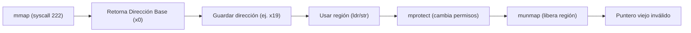
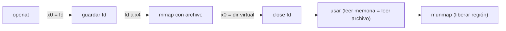

# Arquitectura de Computadores y Ensambladores 1

Escuela de Ingeniería de Ciencias y Sistemas

---
layout: center
---

Arquitectura de Computadores y Ensambladores 1

## Unidad 13
## mmap, munmap, mprotect, páginas y permisos

Memoria virtual en userland antes de MMU y bare metal.

Unidad práctica: mmap (anónimo y con archivo), ciclo de vida, permisos de página y seguridad (W^X).

---

# Anuncios importantes

1. **Anuncio 1**

---

# Agenda

1. **Páginas y Memoria Virtual** — Direcciones virtuales y granularidad de página (ej. 4096 bytes).
2. `mmap` y `munmap` — Pedir regiones al kernel y cerrar el ciclo de vida.
3. **El contrato de Syscall** — Cómo usar los registros `x0` a `x5` para `mmap`.
4. **Permisos y `mprotect`** — Reglas de acceso (R, W, X) y la importancia de W^X.

---

# Competencias

### Competencia 1
El estudiante desarrolla soluciones eficientes en sistemas computacionales integrando arquitectura de computadores, programación en bajo nivel y herramientas modernas de análisis y simulación para resolver problemas complejos en sistemas embebidos e IoT.

### Competencia 2
Aplica políticas de seguridad y protección de memoria a nivel de sistema operativo, utilizando llamadas al sistema (syscalls) para gestionar permisos y mapeos, previniendo vulnerabilidades en arquitecturas ARM-64.

---

# Valor de la semana

**Prudencia y Cumplimiento.** Actuar con cautela y respetar estrictamente los límites, permisos y contratos establecidos.

### Aplicación en clase
En esta unidad, la memoria no es solo un "lugar" para guardar bytes. Es un **contrato** con el Kernel. Dar permisos de ejecución (`PROT_EXEC`) por simple costumbre a un buffer de datos es una imprudencia que abre vulnerabilidades de seguridad. Ser prudente es pedir solo los permisos estrictamente necesarios.

---

# Qué buscamos hoy

1. **Cambiar el modelo mental** — Entender que `mmap` entrega regiones virtuales, no memoria física directa.
2. **Crear memoria dinámica** — Llamar a `mmap` anónimo y proteger la dirección devuelta en `x0`.
3. **Gestionar permisos** — Usar `mprotect` para bloquear escrituras cuando un buffer ya está listo.
4. **Mapear archivos** — Combinar `openat` + `mmap` para acceder a archivos como si fueran memoria RAM.

---
layout: section
---

# Páginas y Memoria Virtual

Userland ve direcciones virtuales organizadas en páginas.

---

# La anatomía de una página

Una página es la **unidad mínima** de memoria virtual que administra el kernel. En esta unidad usaremos **4096 bytes** como el tamaño típico de página.

- **Dirección Virtual** — Un número que tiene sentido dentro del proceso. NO es RAM física pura; Linux y la MMU traducen esta dirección.
- **Granularidad** — Tú puedes pedir un buffer de 64 bytes, pero el kernel protege y administra la memoria en bloques completos de página.

Tres estados que NO son lo mismo: **Reservada** (intención), **Mapeada** (región virtual válida) y **Usada** (bytes con datos reales del programa).

---
layout: section
---

# mmap y munmap

Pedir memoria virtual al kernel y cerrar su ciclo de vida.

---

# Ciclo de vida de una región mapeada



- **¿Por qué guardar x0 en x19?** — Después de `mmap`, `x0` tiene la dirección base. Pero `x0` se usará como argumento para otras syscalls. **¡Si no lo guardas, pierdes el mapeo! (Leak)**.
- **munmap (syscall 215)** — Termina explícitamente el mapeo. Acceder a esa memoria después de usar `munmap` es un error crítico (violación de segmento / UAF).

---

# Contrato de mmap (Anónimo Privado)

Mapeo Anónimo: Sin archivo de respaldo (fd = -1). Mapeo Privado: Región propia del proceso.

| Registro | Argumento | Valor en Anónimo Privado | Lectura |
|---|---|---|---|
| `x0` | `addr` | `0` | El kernel elige la dirección. |
| `x1` | `length` | `4096` | Tamaño en bytes (1 página). |
| `x2` | `prot` | `3` (`READ \| WRITE`) | Permisos de lectura y escritura. |
| `x3` | `flags` | `34` (`PRIVATE \| ANONYMOUS`) | Privado y sin archivo. |
| `x4` | `fd` | `-1` | Sin File Descriptor. |
| `x5` | `offset` | `0` | No aplica. |
| `x8` | `syscall` | `222` | Número de la syscall `mmap`. |

---
layout: section
---

# Permisos y mprotect

Cambiar qué accesos son válidos sobre una región.

---

# Constantes y transiciones (mprotect)

**Permisos (Bits)**
```asm
.equ PROT_NONE,  0
.equ PROT_READ,  1
.equ PROT_WRITE, 2
.equ PROT_EXEC,  4
```

Los permisos se combinan usando OR lógico. `PROT_READ | PROT_WRITE = 3`

**Syscall mprotect (226)**

| Arg | Reg | Uso |
|---|---|---|
| `addr` | `x0` | Dirección base. |
| `length` | `x1` | Tamaño a proteger. |
| `prot` | `x2` | Nuevos permisos. |

`mprotect` no borra ni modifica tus datos. Solo cambia **qué operaciones** (ldr/str) son válidas a partir de ese momento.

---

# La regla de seguridad W^X

**Write XOR Execute (W^X):** Una región de memoria NO debería ser escribible y ejecutable al mismo tiempo.

- **Lo Correcto** — Datos y buffers: `RW`. Tablas constantes listas: `R`. Transiciones: `RW` (escribir datos), luego `mprotect` a `R`.
- **Lo Incorrecto** — Poner `PROT_EXEC` a un buffer por costumbre. Dejar regiones permanentes con `RWX`. Aumenta drásticamente la superficie de ataque para exploits.

---
layout: section
---

# mmap con archivo

Un archivo puede aparecer como región de memoria virtual.

---

# openat + mmap



- `fd` y `offset` — El `fd` obtenido por `openat` se pasa en `x4`. El `offset` (`x5`) indica desde qué byte del archivo se empezará a mapear.
- `MAP_PRIVATE` — Para lectura de archivos, usamos `MAP_PRIVATE` + `PROT_READ`.
- **Cerrar FD** — Después del `mmap`, el mapeo tiene vida propia. Puedes hacer `close` del fd, y el mapeo seguirá vivo hasta `munmap`.

---

# Checklist mental

- Entiendo qué es una dirección virtual y una página (4096 bytes).
- Puedo preparar los 6 argumentos (`x0-x5`) para un `mmap` anónimo.
- Sé que debo respaldar la dirección devuelta en `x0` en un registro seguro (ej. `x19`).
- Entiendo la diferencia entre reservar, mapear y usar memoria.
- Puedo usar `munmap` para destruir la región al finalizar.
- Comprendo el concepto de W^X y por qué `PROT_EXEC` es peligroso.
- Sé cómo mapear el contenido de un archivo usando `openat` + `mmap`.

---

# Siguiente paso

`mmap` y `mprotect` → Bases y formatos binarios → ELF, linking y loading

---
layout: center
class: text-center
---

### Actividad de cierre

# Preguntas de repaso

- ¿Por qué `addr` suele ser `0` en las llamadas a `mmap`?
- Si `mmap` retorna negativo, ¿qué significa?
- ¿Qué pasa si aplicas `mprotect` con solo lectura y luego intentas hacer `strb`?
- ¿Por qué usamos el flag `MAP_ANONYMOUS` y `fd = -1` para buffers de datos?
- ¿El `munmap` se hace automáticamente al cerrar el `fd` de un archivo mapeado?

---

### Ejemplo Práctico

Crear una región dinámica para un mensaje, escribirlo, cambiarlo a solo-lectura con `mprotect` y finalmente destruirlo.

1. **`mmap`** — Pedimos 4096 bytes (RW) Anónimo Privado. Guardamos `x0` en `x19`.
2. **`strb`** — Escribimos la letra 'X' en la dirección apuntada por `x19`.
3. **`mprotect`** — Cambiar los permisos de `x19` a `PROT_READ` (Solo Lectura).
4. **`munmap`** — Pasamos `x19` a `x0` y 4096 a `x1`. Terminamos mapeo.

---

# Fuentes

- Página Quarto: `site/courses/aarch64/mmap-paginas-permisos/`
- Linux man pages: `man 2 mmap`, `man 2 mprotect`, `man 2 munmap`
- Arm, *Learn the Architecture - A64 Instruction Set Architecture Guide*
- Slidev, documentación oficial

---
layout: statement
---

# Dudas¿?

---
layout: center
---

# Gracias por tu atención
