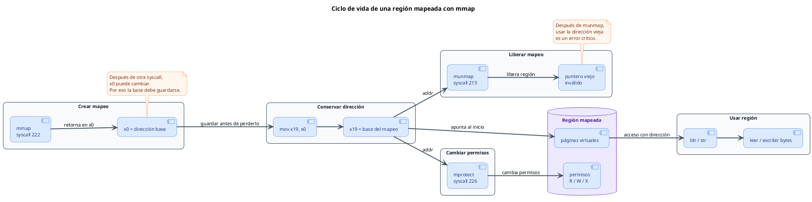

<CoverSlide
  title="Unidad 13 · mmap, páginas y permisos"
  subtitle="Arquitectura de Computadores y Ensambladores 1"
  note="Escuela de Ingeniería de Ciencias y Sistemas"
/>

---
layout: aarch64-section
---

# mmap, munmap, mprotect, páginas y permisos

Memoria virtual en userland antes de MMU y bare metal.

Unidad práctica: mmap (anónimo y con archivo), ciclo de vida, permisos de página y seguridad (W^X).

---

# Anuncios importantes

<InfoBox type="warning" title="Anuncios">

- **Anuncio 1**

</InfoBox>

---

# Agenda

<v-clicks>

1. **Páginas y Memoria Virtual** — Direcciones virtuales y granularidad de página (ej. 4096 bytes).
2. `mmap` y `munmap` — Pedir regiones al kernel y cerrar el ciclo de vida.
3. **El contrato de Syscall** — Cómo usar los registros `x0` a `x5` para `mmap`.
4. **Permisos y `mprotect`** — Reglas de acceso (R, W, X) y la importancia de W^X.

</v-clicks>

---

# Competencias

<InfoBox type="info" title="Competencia 1">

El estudiante desarrolla soluciones eficientes en sistemas computacionales integrando arquitectura de computadores, programación en bajo nivel y herramientas modernas de análisis y simulación para resolver problemas complejos en sistemas embebidos e IoT.

</InfoBox>

<InfoBox type="info" title="Competencia 2">

Aplica políticas de seguridad y protección de memoria a nivel de sistema operativo, utilizando llamadas al sistema (syscalls) para gestionar permisos y mapeos, previniendo vulnerabilidades en arquitecturas ARM-64.

</InfoBox>

---

# Valor de la semana

<InfoBox type="note" title="Prudencia y Cumplimiento">

Actuar con cautela y respetar estrictamente los límites, permisos y contratos establecidos.

En esta unidad, la memoria no es solo un "lugar" para guardar bytes. Es un **contrato** con el Kernel. Dar permisos de ejecución (`PROT_EXEC`) por simple costumbre a un buffer de datos es una imprudencia que abre vulnerabilidades de seguridad. Ser prudente es pedir solo los permisos estrictamente necesarios.

</InfoBox>

---

# Qué buscamos hoy

<StepList :steps="[
  'Cambiar el modelo mental: entender que mmap entrega regiones virtuales, no memoria física directa',
  'Crear memoria dinámica: llamar a mmap anónimo y proteger la dirección devuelta en x0',
  'Gestionar permisos: usar mprotect para bloquear escrituras cuando un buffer ya está listo',
  'Mapear archivos: combinar openat + mmap para acceder a archivos como si fueran memoria RAM'
]" />

---
layout: aarch64-section
---

# Páginas y Memoria Virtual

Userland ve direcciones virtuales organizadas en páginas.

---

# La anatomía de una página

Una página es la **unidad mínima** de memoria virtual que administra el kernel. En esta unidad usaremos **4096 bytes** como el tamaño típico de página.

<v-clicks>

- **Dirección Virtual** — Un número que tiene sentido dentro del proceso. NO es RAM física pura; Linux y la MMU traducen esta dirección
- **Granularidad** — Tú puedes pedir un buffer de 64 bytes, pero el kernel protege y administra la memoria en bloques completos de página

</v-clicks>

<InfoBox type="note" title="Tres estados distintos">

**Reservada** (intención) → **Mapeada** (región virtual válida) → **Usada** (bytes con datos reales del programa).

</InfoBox>

---
layout: aarch64-section
---

# mmap y munmap

Pedir memoria virtual al kernel y cerrar su ciclo de vida.

---

# Ciclo de vida de una región mapeada

<div v-click class="w-full flex justify-center mt-4">

<div class="w-[92%]">



</div>

</div>

<v-clicks>

- **¿Por qué guardar `x0` en `x19`?** — Después de `mmap`, `x0` contiene la dirección base. Pero `x0` se reutiliza como argumento y retorno en otras syscalls. Si no guardas esa dirección, pierdes la referencia al mapeo.
- **`munmap` syscall 215** — Termina explícitamente el mapeo. Acceder a esa memoria después de `munmap` puede provocar una violación de segmento o un caso de use-after-free.

</v-clicks>

<div class="mascot-row mt-4">
<Mascot emotion="leyendo" />
</div>

---

Mapeo Anónimo: Sin archivo de respaldo (fd = -1). Mapeo Privado: Región propia del proceso.

<ComparisonTable
  :headers="['Registro', 'Argumento', 'Valor', 'Lectura']"
  :rows='[
    ["x0", "addr", "0", "El kernel elige la dirección"],
    ["x1", "length", "4096", "Tamaño en bytes (1 página)"],
    ["x2", "prot", "3 (READ | WRITE)", "Permisos de lectura y escritura"],
    ["x3", "flags", "34 (PRIVATE | ANONYMOUS)", "Privado y sin archivo"],
    ["x4", "fd", "-1", "Sin File Descriptor"],
    ["x5", "offset", "0", "No aplica"],
    ["x8", "syscall", "222", "Número de la syscall mmap"]
  ]'
/>

<InfoBox type="warning" title="Cuidado">
Si no guardas el retorno de `x0` antes de hacer otra syscall, pierdes la dirección del mapeo y generas un **memory leak**.
</InfoBox>

---
layout: aarch64-section
---

# Permisos y mprotect

Cambiar qué accesos son válidos sobre una región.

---
layout: aarch64-two-cols
---

# Constantes y transiciones

::left::

### Permisos (Bits)

```asm
.equ PROT_NONE,  0
.equ PROT_READ,  1
.equ PROT_WRITE, 2
.equ PROT_EXEC,  4
```

Los permisos se combinan usando OR lógico. `PROT_READ | PROT_WRITE = 3`

::right::

### Syscall mprotect (226)

| Arg | Reg | Uso |
|---|---|---|
| `addr` | `x0` | Dirección base |
| `length` | `x1` | Tamaño a proteger |
| `prot` | `x2` | Nuevos permisos |

<InfoBox type="note" title="Nota">

`mprotect` no borra ni modifica tus datos. Solo cambia **qué operaciones** (ldr/str) son válidas a partir de ese momento.

</InfoBox>

---
layout: aarch64-two-cols
---

# La regla de seguridad W^X

**Write XOR Execute (W^X):** Una región de memoria NO debería ser escribible y ejecutable al mismo tiempo.

::left::

### Lo Correcto

- Datos y buffers: `RW`
- Tablas constantes listas: `R`
- Transiciones: `RW` (escribir datos), luego `mprotect` a `R`

::right::

### Lo Incorrecto

- Poner `PROT_EXEC` a un buffer por costumbre
- Dejar regiones permanentes con `RWX`
- Aumenta drásticamente la superficie de ataque para exploits

<div class="mascot-row mt-4">
<Mascot emotion="confundido" />
</div>

---
layout: aarch64-section
---

# mmap con archivo

Un archivo puede aparecer como región de memoria virtual.

---

# openat + mmap

```plantuml
@startuml

title openat + mmap: del archivo a memoria virtual

left to right direction

skinparam backgroundColor transparent
skinparam shadowing false
skinparam roundcorner 14
skinparam defaultFontName Arial
skinparam defaultFontSize 11

skinparam rectangle {
  BorderColor #334155
  BackgroundColor #f8fafc
  FontColor #0f172a
}

skinparam component {
  BorderColor #2563eb
  BackgroundColor #dbeafe
  FontColor #1e3a8a
}

skinparam database {
  BorderColor #7c3aed
  BackgroundColor #ede9fe
  FontColor #4c1d95
}

skinparam note {
  BorderColor #f97316
  BackgroundColor #fff7ed
  FontColor #7c2d12
}

skinparam arrow {
  Color #475569
  Thickness 2
}

rectangle "Abrir archivo" as OPEN_STAGE {
  component "openat" as OPENAT
  component "x0 = fd" as FD
}

rectangle "Preparar mmap" as PREPARE {
  component "guardar fd" as SAVEFD
  component "x4 = fd" as X4
  component "x5 = offset" as X5
}

rectangle "Crear mapeo" as MAP_STAGE {
  component "mmap" as MMAP
  component "x0 = dirección virtual" as VADDR
}

database "Región mapeada" as REGION {
  component "bytes del archivo\nvisibles como memoria" as BYTES
}

rectangle "Cerrar fd" as CLOSE_STAGE {
  component "close(fd)" as CLOSE
}

rectangle "Usar memoria" as USE_STAGE {
  component "ldr / str" as LDST
  component "leer memoria\n= leer archivo mapeado" as READMEM
}

rectangle "Liberar región" as UNMAP_STAGE {
  component "munmap" as MUNMAP
  component "puntero inválido" as INVALID
}

OPENAT --> FD : retorna
FD --> SAVEFD : conservar
SAVEFD --> X4 : argumento mmap
X5 --> MMAP : offset del archivo
X4 --> MMAP : fd del archivo
MMAP --> VADDR : retorna base
VADDR --> REGION : apunta a
FD --> CLOSE : fd ya puede cerrarse
REGION --> LDST : acceso normal
LDST --> READMEM
REGION --> MUNMAP : liberar mapeo
MUNMAP --> INVALID

note bottom of CLOSE
Cerrar el fd no destruye
el mapeo ya creado.
end note

note bottom of REGION
El mapeo vive hasta munmap.
No hasta close(fd).
end note

@enduml
```

<div v-click class="w-full flex justify-center mt-4">

<div class="w-[92%]">



</div>

</div>

<v-clicks>

- **`fd` y `offset`** — El `fd` obtenido por `openat` se pasa a `mmap` en `x4`. El `offset` en `x5` indica desde qué byte del archivo inicia el mapeo.
- **`MAP_PRIVATE`** — Para lectura de archivos, usamos normalmente `MAP_PRIVATE` junto con `PROT_READ`.
- **Cerrar FD** — Después de `mmap`, el mapeo tiene vida propia. Puedes hacer `close(fd)` y la región seguirá viva hasta `munmap`.

</v-clicks>

---
layout: aarch64-checklist
---

# Checklist mental

- <span class="check-icon">✓</span> Entiendo qué es una dirección virtual y una página (4096 bytes)
- <span class="check-icon">✓</span> Puedo preparar los 6 argumentos (`x0-x5`) para un `mmap` anónimo
- <span class="check-icon">✓</span> Sé que debo respaldar la dirección devuelta en `x0` en un registro seguro (ej. `x19`)
- <span class="check-icon">✓</span> Entiendo la diferencia entre reservar, mapear y usar memoria
- <span class="check-icon">✓</span> Puedo usar `munmap` para destruir la región al finalizar
- <span class="check-icon">✓</span> Comprendo el concepto de W^X y por qué `PROT_EXEC` es peligroso
- <span class="check-icon">✓</span> Sé cómo mapear el contenido de un archivo usando `openat` + `mmap`

<div class="mascot-row mt-4">
<Mascot emotion="solucionado" />
</div>

---
layout: aarch64-statement
---

# Siguiente paso

`mmap` y `mprotect` → Bases y formatos binarios → ELF, linking y loading

---
layout: aarch64-question
---

## Preguntas de repaso

- ¿Por qué `addr` suele ser `0` en las llamadas a `mmap`?
- Si `mmap` retorna negativo, ¿qué significa?
- ¿Qué pasa si aplicas `mprotect` con solo lectura y luego intentas hacer `strb`?
- ¿Por qué usamos el flag `MAP_ANONYMOUS` y `fd = -1` para buffers de datos?
- ¿El `munmap` se hace automáticamente al cerrar el `fd` de un archivo mapeado?

<div class="mascot-row mt-4">
<Mascot emotion="pensando" />
</div>

---

# Ejemplo práctico

Crear una región dinámica para un mensaje, escribirlo, cambiarlo a solo-lectura con `mprotect` y finalmente destruirlo.

<StepList :steps="[
  'mmap: pedir 4096 bytes (RW) Anónimo Privado. Guardamos x0 en x19',
  'strb: escribimos la letra X en la dirección apuntada por x19',
  'mprotect: cambiar los permisos de x19 a PROT_READ (Solo Lectura)',
  'munmap: pasamos x19 a x0 y 4096 a x1. Terminamos mapeo'
]" />

---

# Fuentes

- Página Quarto: `site/courses/aarch64/mmap-paginas-permisos/`
- Linux man pages: `man 2 mmap`, `man 2 mprotect`, `man 2 munmap`
- Arm, *Learn the Architecture - A64 Instruction Set Architecture Guide*
- Slidev, documentación oficial

---
layout: aarch64-statement
---

# ¿Dudas?

---

<CoverSlide
  title="Gracias por tu atención"
  subtitle="Arquitectura de Computadores y Ensambladores 1"
/>
