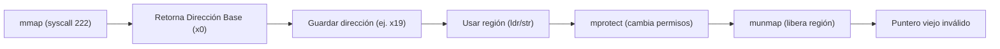
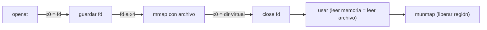

<style>
@import "../styles/index.css";
</style>

<div class="ecys-cover-bg"></div>

<div class="ecys-title-cover">

<div class="muted">Escuela de Ingeniería de Ciencias y Sistemas</div>

# Arquitectura de Computadores y Ensambladores 1

</div>

---
layout: center
---

<div class="muted">Arquitectura de Computadores y Ensambladores 1</div>

## Unidad 13
## mmap, munmap, mprotect, páginas y permisos

Memoria virtual en userland antes de MMU y bare metal.

<div class="cover-note">
Unidad práctica: mmap (anónimo y con archivo), ciclo de vida, permisos de página y seguridad (W^X).
</div>

---

# Anuncios importantes

<div class="numbered-grid">
  <div class="numbered-card">
    <div class="card-number">1</div>
    <h3>Anuncio 1</h3>
    <p></p>
  </div>
</div>

---

# Agenda

<div class="numbered-grid">
  <div class="numbered-card">
    <div class="card-number">1</div>
    <h3>Páginas y Memoria Virtual</h3>
    <p>Direcciones virtuales y granularidad de página (ej. 4096 bytes).</p>
  </div>

  <div class="numbered-card">
    <div class="card-number">2</div>
    <h3><code>mmap</code> y <code>munmap</code></h3>
    <p>Pedir regiones al kernel y cerrar el ciclo de vida.</p>
  </div>

  <div class="numbered-card">
    <div class="card-number">3</div>
    <h3>El contrato de Syscall</h3>
    <p>Cómo usar los registros <code>x0</code> a <code>x5</code> para <code>mmap</code>.</p>
  </div>

  <div class="numbered-card">
    <div class="card-number">4</div>
    <h3>Permisos y <code>mprotect</code></h3>
    <p>Reglas de acceso (R, W, X) y la importancia de W^X.</p>
  </div>
</div>

---

# Competencias

<div class="concept-grid vertical-center">
  <div class="concept-card">
    <h3>Competencia 1</h3>
    <p>
      El estudiante desarrolla soluciones eficientes en sistemas computacionales
      integrando arquitectura de computadores, programación en bajo nivel y
      herramientas modernas de análisis y simulación para resolver problemas
      complejos en sistemas embebidos e IoT.
    </p>
  </div>

  <div class="concept-card">
    <h3>Competencia 2</h3>
    <p>
      Aplica políticas de seguridad y protección de memoria a nivel de sistema operativo, 
      utilizando llamadas al sistema (syscalls) para gestionar permisos y mapeos, 
      previniendo vulnerabilidades en arquitecturas ARM-64.
    </p>
  </div>
</div>

---

# Valor de la semana

<div class="callout tip">
  <strong>Prudencia y Cumplimiento.</strong>
  Actuar con cautela y respetar estrictamente los límites, permisos y contratos establecidos.
</div>

<div class="concept-grid">
  <div class="concept-card">
    <h3>Aplicación en clase</h3>
    <p>
      En esta unidad, la memoria no es solo un "lugar" para guardar bytes. Es un <strong>contrato</strong> 
      con el Kernel. Dar permisos de ejecución (<code>PROT_EXEC</code>) por simple costumbre a un buffer de datos 
      es una imprudencia que abre vulnerabilidades de seguridad. Ser prudente es pedir solo los permisos 
      estrictamente necesarios.
    </p>
  </div>
</div>

---

# Qué buscamos hoy

<div class="slide-center-block">

<div class="objective-grid">
  <div v-click class="objective-item">
    <div class="item-number">1</div>
    <h3>Cambiar el modelo mental</h3>
    <p>Entender que <code>mmap</code> entrega regiones virtuales, no memoria física directa.</p>
  </div>

  <div v-click class="objective-item">
    <div class="item-number">2</div>
    <h3>Crear memoria dinámica</h3>
    <p>Llamar a <code>mmap</code> anónimo y proteger la dirección devuelta en <code>x0</code>.</p>
  </div>

  <div v-click class="objective-item">
    <div class="item-number">3</div>
    <h3>Gestionar permisos</h3>
    <p>Usar <code>mprotect</code> para bloquear escrituras cuando un buffer ya está listo.</p>
  </div>

  <div v-click class="objective-item">
    <div class="item-number">4</div>
    <h3>Mapear archivos</h3>
    <p>Combinar <code>openat</code> + <code>mmap</code> para acceder a archivos como si fueran memoria RAM.</p>
  </div>
</div>

</div>

---
layout: section
---

# Páginas y Memoria Virtual

Userland ve direcciones virtuales organizadas en páginas.

---

###### La anatomía de una página

<div class="slide-center-block">

<div class="content-stack-lg">

<div class="lead-block">
Una página es la <strong>unidad mínima</strong> de memoria virtual que administra el kernel.
En esta unidad usaremos <strong>4096 bytes</strong> como el tamaño típico de página.
</div>

<div class="concept-grid mt-4">
  <div v-click class="concept-card">
    <h3>Dirección Virtual</h3>
    <p>Un número que tiene sentido dentro del proceso. NO es RAM física pura; Linux y la MMU traducen esta dirección.</p>
  </div>
  <div v-click class="concept-card">
    <h3>Granularidad</h3>
    <p>Tú puedes pedir un buffer de 64 bytes, pero el kernel protege y administra la memoria en bloques completos de página.</p>
  </div>
</div>

<div v-click class="callout warning centered-narrow mt-6">
Tres estados que NO son lo mismo: <strong>Reservada</strong> (intención), <strong>Mapeada</strong> (región virtual válida) y <strong>Usada</strong> (bytes con datos reales del programa).
</div>

</div>

</div>

---
layout: section
---

# mmap y munmap

Pedir memoria virtual al kernel y cerrar su ciclo de vida.

---

###### Ciclo de vida de una región mapeada

<div class="slide-center-block">

<div class="content-stack-lg">

<div class="diagram-block">



</div>

<div class="compare-grid mt-4">
  <div v-click class="compare-card">
    <div class="card-kicker">¿Por qué guardar x0 en x19?</div>
    <p>Después de <code>mmap</code>, <code>x0</code> tiene la dirección base. Pero <code>x0</code> se usará como argumento para otras syscalls. <strong>¡Si no lo guardas, pierdes el mapeo! (Leak)</strong>.</p>
  </div>
  <div v-click class="compare-card">
    <div class="card-kicker">munmap (syscall 215)</div>
    <p>Termina explícitamente el mapeo. Acceder a esa memoria después de usar <code>munmap</code> es un error crítico (violación de segmento / UAF).</p>
  </div>
</div>

</div>

</div>

---

###### Contrato de mmap (Anónimo Privado)

<div class="slide-center-block">

<div class="content-stack-lg">

<div class="key-idea centered-narrow">
Mapeo Anónimo: Sin archivo de respaldo (fd = -1).<br>
Mapeo Privado: Región propia del proceso.
</div>

| Registro | Argumento | Valor en Anónimo Privado | Lectura |
|---|---|---|---|
| `x0` | `addr` | `0` | El kernel elige la dirección. |
| `x1` | `length` | `4096` | Tamaño en bytes (1 página). |
| `x2` | `prot` | `3` (`READ \| WRITE`) | Permisos de lectura y escritura. |
| `x3` | `flags` | `34` (`PRIVATE \| ANONYMOUS`) | Privado y sin archivo. |
| `x4` | `fd` | `-1` | Sin File Descriptor. |
| `x5` | `offset` | `0` | No aplica. |
| `x8` | `syscall` | `222` | Número de la syscall `mmap`. |

</div>

</div>

---
layout: section
---

# Permisos y mprotect

Cambiar qué accesos son válidos sobre una región.

---

###### Constantes y transiciones (mprotect)

<div class="slide-center-block">

<div class="two-column-layout">

<div class="content-stack-md">

<div class="muted centered-narrow">Permisos (Bits)</div>

```asm
.equ PROT_NONE,  0
.equ PROT_READ,  1
.equ PROT_WRITE, 2
.equ PROT_EXEC,  4
```

<p>
Los permisos se combinan usando OR lógico. <br>
<code>PROT_READ | PROT_WRITE = 3</code>
</p>

</div>

<div class="content-stack-md">

<div class="muted centered-narrow">Syscall mprotect (226)</div>

| Arg | Reg | Uso |
|---|---|---|
| `addr` | `x0` | Dirección base. |
| `length` | `x1` | Tamaño a proteger. |
| `prot` | `x2` | Nuevos permisos. |

<p v-click>
<strong>¡Ojo!</strong> <code>mprotect</code> no borra ni modifica tus datos. Solo cambia <strong>qué operaciones</strong> (ldr/str) son válidas a partir de ese momento.
</p>

</div>

</div>

</div>

---

###### La regla de seguridad W^X

<div class="slide-center-block">

<div class="content-stack-lg">

<div class="lead-block">
<strong>Write XOR Execute (W^X):</strong> Una región de memoria NO debería ser escribible y ejecutable al mismo tiempo.
</div>

<div class="compare-grid mt-4">
  <div v-click class="compare-card">
    <div class="card-kicker">Lo Correcto</div>
    <ul>
      <li>Datos y buffers: <code>RW</code></li>
      <li>Tablas constantes listas: <code>R</code></li>
      <li>Transiciones: <code>RW</code> (escribir datos), luego <code>mprotect</code> a <code>R</code>.</li>
    </ul>
  </div>
  <div v-click class="compare-card">
    <div class="card-kicker">Lo Incorrecto</div>
    <ul>
      <li>Poner <code>PROT_EXEC</code> a un buffer por costumbre.</li>
      <li>Dejar regiones permanentes con <code>RWX</code>. Aumenta drásticamente la superficie de ataque para exploits.</li>
    </ul>
  </div>
</div>

</div>

</div>

---
layout: section
---

# mmap con archivo

Un archivo puede aparecer como región de memoria virtual.

---

###### openat + mmap

<div class="slide-center-block">

<div class="content-stack-lg">

<div class="diagram-block">



</div>

<div class="concept-grid concept-grid-3 mt-4">
  <div v-click class="concept-card">
    <h3><code>fd</code> y <code>offset</code></h3>
    <p>El <code>fd</code> obtenido por <code>openat</code> se pasa en <code>x4</code>. El <code>offset</code> (<code>x5</code>) indica desde qué byte del archivo se empezará a mapear.</p>
  </div>
  <div v-click class="concept-card">
    <h3><code>MAP_PRIVATE</code></h3>
    <p>Para lectura de archivos, usamos <code>MAP_PRIVATE</code> + <code>PROT_READ</code>.</p>
  </div>
  <div v-click class="concept-card">
    <h3>Cerrar FD</h3>
    <p>Después del <code>mmap</code>, el mapeo tiene vida propia. Puedes hacer <code>close</code> del fd, y el mapeo seguirá vivo hasta <code>munmap</code>.</p>
  </div>
</div>

</div>

</div>

---

# Checklist mental

<div class="slide-center-block">

<div class="reveal-list centered-narrow">
  <div v-click class="reveal-item">Entiendo qué es una dirección virtual y una página (4096 bytes).</div>
  <div v-click class="reveal-item">Puedo preparar los 6 argumentos (<code>x0-x5</code>) para un <code>mmap</code> anónimo.</div>
  <div v-click class="reveal-item">Sé que debo respaldar la dirección devuelta en <code>x0</code> en un registro seguro (ej. <code>x19</code>).</div>
  <div v-click class="reveal-item">Entiendo la diferencia entre reservar, mapear y usar memoria.</div>
  <div v-click class="reveal-item">Puedo usar <code>munmap</code> para destruir la región al finalizar.</div>
  <div v-click class="reveal-item">Comprendo el concepto de W^X y por qué <code>PROT_EXEC</code> es peligroso.</div>
  <div v-click class="reveal-item">Sé cómo mapear el contenido de un archivo usando <code>openat</code> + <code>mmap</code>.</div>
</div>

</div>

---

# Siguiente paso

<div class="slide-center-block">

<div class="flow-column">
  <div v-click class="flow-step"><code>mmap</code> y <code>mprotect</code></div>
  <div v-click class="flow-arrow">→</div>
  <div v-click class="flow-step">Bases y formatos binarios</div>
  <div v-click class="flow-arrow">→</div>
  <div v-click class="flow-step">ELF, linking y loading</div>
</div>

</div>

---
layout: center
class: text-center
---

<div class="muted">Actividad de cierre</div>

# Preguntas de repaso

<div class="question-points mx-auto mt-6 max-w-2xl text-left">
  <div v-click>¿Por qué <code>addr</code> suele ser <code>0</code> en las llamadas a <code>mmap</code>?</div>
  <div v-click>Si <code>mmap</code> retorna negativo, ¿qué significa?</div>
  <div v-click>¿Qué pasa si aplicas <code>mprotect</code> con solo lectura y luego intentas hacer <code>strb</code>?</div>
  <div v-click>¿Por qué usamos el flag <code>MAP_ANONYMOUS</code> y <code>fd = -1</code> para buffers de datos?</div>
  <div v-click>¿El <code>munmap</code> se hace automáticamente al cerrar el <code>fd</code> de un archivo mapeado?</div>
</div>

---

###### Ejemplo Práctico

<div class="slide-center-block">

<div class="content-stack-lg">

<div class="key-idea centered-narrow">
  <div class="muted">Actividad guiada</div>
  <p>Crear una región dinámica para un mensaje, escribirlo, cambiarlo a solo-lectura con <code>mprotect</code> y finalmente destruirlo.</p>
</div>

<div class="concept-grid concept-grid-4">
  <div v-click class="concept-card">
    <h3>1. <code>mmap</code></h3>
    <p>Pedimos 4096 bytes (RW) Anónimo Privado. Guardamos <code>x0</code> en <code>x19</code>.</p>
  </div>

  <div v-click class="concept-card">
    <h3>2. <code>strb</code></h3>
    <p>Escribimos la letra 'X' en la dirección apuntada por <code>x19</code>.</p>
  </div>

  <div v-click class="concept-card">
    <h3>3. <code>mprotect</code></h3>
    <p>Cambiar los permisos de <code>x19</code> a <code>PROT_READ</code> (Solo Lectura).</p>
  </div>

  <div v-click class="concept-card">
    <h3>4. <code>munmap</code></h3>
    <p>Pasamos <code>x19</code> a <code>x0</code> y 4096 a <code>x1</code>. Terminamos mapeo.</p>
  </div>
</div>

</div>

</div>

---

# Fuentes

- Página Quarto: `site/courses/aarch64/mmap-paginas-permisos/`
- Linux man pages: `man 2 mmap`, `man 2 mprotect`, `man 2 munmap`
- Arm, *Learn the Architecture - A64 Instruction Set Architecture Guide*
- Slidev, documentación oficial

---
layout: statement
---

# Dudas¿?

---
layout: center
---

# Gracias por tu atención
