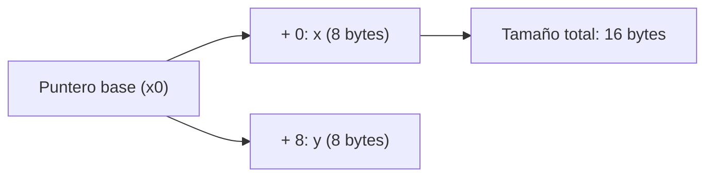

# Arquitectura de Computadores y Ensambladores 1

Escuela de Ingeniería de Ciencias y Sistemas

---
layout: center
---

Arquitectura de Computadores y Ensambladores 1

## Unidad 14
## Layout de datos, structs, ADTs y objetos manuales

Diseñar datos complejos como bloques de memoria con offsets, invariantes y funciones.

Unidad práctica: pasar de "tengo una dirección de memoria" a "tengo una estructura de datos estructurada y segura".

---

# Anuncios importantes

1. **Anuncio 1**

---

# Agenda

1. **Structs y Layout** — Calcular campos, offsets, alignment, padding y size.
2. **ADTs e Invariantes** — Operaciones seguras que respetan el estado de la memoria.
3. **Objetos Manuales** — Cómo usar `self` en Assembly (`x0`), constructores y destructores.
4. **Descriptores** — Modelar Buffers, Strings, Matrices y Wrappers de archivos.

---

# Competencias

### Competencia 1
El estudiante desarrolla soluciones eficientes en sistemas computacionales integrando arquitectura de computadores, programación en bajo nivel y herramientas modernas de análisis y simulación para resolver problemas complejos en sistemas embebidos e IoT.

### Competencia 2
Modela e implementa estructuras de datos complejas (ADTs) y objetos manuales en lenguaje ensamblador, administrando explícitamente el layout de memoria, el paso de punteros (`self`) y la garantía de invariantes lógicos.

---

# Valor de la semana

**Coherencia y Rigor.** Mantener la integridad lógica y estructural de la información a través de reglas invariantes.

### Aplicación en clase
En alto nivel, el compilador protege tus estructuras. En bajo nivel, un `strb` mal calculado puede destruir el campo vecino. Diseñar datos con **rigor** (offsets definidos, padding, inicialización correcta) y mantener **coherencia** (invariantes como `len <= cap`) es la única defensa contra la corrupción de memoria.

---

# Qué buscamos hoy

1. **Diseño Espacial** — Saber ubicar variables complejas contiguas usando un "puntero base" y "offsets".
2. **Entender Padding** — Comprender por qué la memoria se "rellena" para respetar el Alignment del procesador.
3. **Orientación a Objetos** — Aprender cómo funciona el paradigma OO por debajo: funciones que reciben `self` en `x0`.
4. **Construir Abstracciones** — Crear estructuras como `Buffer`, `String` o `Matrix` para no manejar bytes al azar.

---
layout: section
---

# Structs y Layout Manual

Un struct en assembly es una convención de offsets dentro de bytes.

---

# Diseño antes de código

En assembly no existe la palabra mágica `struct`. Lo que existe es memoria y una **convención estricta** de cómo usarla.



El objeto se interpreta según offsets fijos dentro de un bloque de memoria.

---

# Diseño conceptual del objeto

Layout del bloque en memoria

| Campo  | Offset | Tamaño |
| ------ | -----: | -----: |
| `x`    |    `0` |    `8` |
| `y`    |    `8` |    `8` |
| `SIZE` |   `16` |      - |

El layout define dónde empieza cada campo y cuánto ocupa el objeto completo.

---

# Pasar el diseño a assembly

Definir offsets y usarlos en accesos a memoria

```asm
// Definir "nombres" a los offsets
.equ POINT_X, 0
.equ POINT_Y, 8
.equ POINT_SIZE, 16

// Uso
ldr x1, [x0, #POINT_X]
ldr x2, [x0, #POINT_Y]
```

`x0` apunta al objeto. Los offsets permiten leer cada campo sin memorizar números mágicos.

---

# Alignment y Padding

El procesador prefiere leer datos en direcciones que son múltiplos de su tamaño. Para mantener esto, se insertan bytes de "relleno" o **Padding**.

**Ejemplo de Layout con Padding**

| Campo | Offset | Tamaño | Nota |
|---|---|---|---|
| `flag` | `0` | `1` | Byte |
| *padding* | *1* | *7* | *Relleno inútil* |
| `value` | `8` | `8` | Alineado a 8 |
| `SIZE` | `16` | - | Alineación final |

**Reglas del Padding**
- El padding son bytes inútiles. NO guardes información allí.
- Sirve para que el siguiente campo quede alineado.
- También existe Padding final para alinear elementos si usas Arreglos de Structs.
- El orden de declaración de campos importa (cambiarlo puede ahorrar bytes).

---
layout: section
---

# ADTs e Invariantes

Un ADT junta layout, operaciones y reglas que deben cumplirse.

---

# Abstract Data Types (ADT)

Un Layout solo dice dónde están los campos. Un ADT añade las funciones autorizadas para tocarlos y las reglas lógicas que siempre deben cumplirse (**Invariantes**).

- **Datos (Layout)** — Los offsets: `data`, `len`, `cap`.
- **Operaciones** — Funciones que reciben el puntero base y ejecutan lógica (ej. `push_byte`).
- **Invariantes** — Promesas de estado. Ej: `0 <= len <= cap`. Si `len` supera `cap`, la invariante se rompe y el programa falla.

El procesador NO sabe qué es válido. Tú debes programar los `cmp` y `b.ge` en tus operaciones para proteger la invariante. Si modificas campos manualmente desde afuera, rompes la coherencia.

---
layout: section
---

# Objetos Manuales y `self`

Constructor, destructor y métodos en bajo nivel.

---

# Programación Orientada a Objetos en Ensamblador

En bajo nivel, un **objeto** es solo un bloque de memoria. Un **método** es una función normal que recibe un puntero hacia ese bloque.

- **Objeto** — Datos agrupados en memoria con campos definidos por offsets.
- **Método** — Función que opera sobre ese bloque usando un puntero al objeto.

---

# La convención `self`

- **Entrada del método** — `x0` = `self`, puntero al objeto. `x1` = argumento 1. `x2` = argumento 2.
- **Idea clave** — El método no necesita una clase especial: recibe la dirección del bloque y trabaja sobre sus campos.

Como `x0` también se usa para devolver resultados, si el método llama a otra función y aún necesita `self`, debe guardarlo antes en un registro preservado como `x19` o en la pila.

---

# Método manual: `buffer_push_byte`

```asm
// x0 = self (Buffer)
// w1 = byte a escribir
buffer_push_byte:
    ldr x3, [x0, #BUF_LEN]
    ldr x4, [x0, #BUF_CAP]

    // Proteger invariante
    cmp x3, x4
    b.hs buffer_full

    // ... lógica para escribir ...
```

El método usa `x0` como base del objeto y accede a sus campos mediante offsets como `BUF_LEN` y `BUF_CAP`.

---

# Constructores y Destructores

- **Constructor (`init`)** — No crea magia, ni aparta la memoria del heap. Se encarga de llenar el bloque recién reservado con el **Estado Válido Inicial** (Invariantes listas). Ejemplo: Guardar el puntero de `data`, setear `len` a `0`, y `cap` a un límite.
- **Destructor (`destroy`)** — Libera los recursos **si el objeto es el verdadero Dueño (Owner)**. Si el campo `data` fue creado por `mmap`, el destructor debe llamar a `munmap`. Si el objeto solo tenía un puntero prestado, no lo libera.

---

# Checklist mental

- Puedo explicar qué es un Struct y cómo convertirlo en Offsets constantes con `.equ`.
- Entiendo qué es el Alignment y por qué es necesario el Padding.
- Conozco la fórmula del Tamaño: offset del último campo + su tamaño (+ padding final).
- Comprendo qué es un ADT: Layout + Operaciones + Invariantes.
- Entiendo qué es la invariante `len <= cap`.
- Entiendo que en POO en bajo nivel, `self` suele pasarse en el registro `x0`.
- Reconozco la importancia de guardar `x0` si el método llama a otras funciones.

---

# Siguiente paso

Layouts manuales y POO → ABI Oficial y Funciones Complejas → Integración y llamadas a C

---
layout: center
class: text-center
---

### Actividad de cierre

# Preguntas de repaso

- Si defino dos variables seguidas de tamaño 1 byte y 8 bytes, ¿por qué el offset de la segunda no es 1?
- ¿Qué es una "Invariante" en una estructura de datos?
- En código de alto nivel como Java usamos la palabra reservada `this`. ¿Cuál es su equivalente en la convención de AArch64?
- Si el campo `data` apunta a un buffer global en el `.bss`, ¿el destructor debe llamar a `munmap`?
- ¿Por qué NO deberías cambiar campos lógicos como `len` directamente desde fuera de las funciones del ADT?

---

### Ejemplo Práctico

Diseño y uso de un **Punto** 2D en memoria.

**1. Layout**
```asm
.equ P_X, 0
.equ P_Y, 8
.equ P_SIZE, 16
```

**2. Constructor**
```asm
// x0 = self, x1 = X, x2 = Y
punto_init:
  str x1, [x0, #P_X]
  str x2, [x0, #P_Y]
  ret
```

**3. Método Getter**
```asm
// x0 = self
punto_get_x:
  ldr x0, [x0, #P_X]
  ret
```

---

# Fuentes

- Página Quarto: `site/courses/aarch64/layout-datos-structs/`
- Arm, *Learn the Architecture - A64 Instruction Set Architecture Guide*
- Slidev, documentación oficial

---
layout: statement
---

# Dudas¿?

---
layout: center
---

# Gracias por tu atención
