<CoverSlide
  title="Unidad 14 · Layout de datos, structs, ADTs y objetos manuales"
  subtitle="Arquitectura de Computadores y Ensambladores 1"
  note="Escuela de Ingeniería de Ciencias y Sistemas"
/>

---
layout: aarch64-section
---

# Layout de datos, structs, ADTs y objetos manuales

Diseñar datos complejos como bloques de memoria con offsets, invariantes y funciones.

Unidad práctica: pasar de "tengo una dirección de memoria" a "tengo una estructura de datos estructurada y segura".

---

# Anuncios importantes

<InfoBox type="warning" title="Anuncios">

- **Anuncio 1**

</InfoBox>

---

# Agenda

<v-clicks>

1. **Structs y Layout** — Calcular campos, offsets, alignment, padding y size.
2. **ADTs e Invariantes** — Operaciones seguras que respetan el estado de la memoria.
3. **Objetos Manuales** — Cómo usar `self` en Assembly (`x0`), constructores y destructores.
4. **Descriptores** — Modelar Buffers, Strings, Matrices y Wrappers de archivos.

</v-clicks>

---

# Competencias

<InfoBox type="info" title="Competencia 1">

El estudiante desarrolla soluciones eficientes en sistemas computacionales integrando arquitectura de computadores, programación en bajo nivel y herramientas modernas de análisis y simulación para resolver problemas complejos en sistemas embebidos e IoT.

</InfoBox>

<InfoBox type="info" title="Competencia 2">

Modela e implementa estructuras de datos complejas (ADTs) y objetos manuales en lenguaje ensamblador, administrando explícitamente el layout de memoria, el paso de punteros (`self`) y la garantía de invariantes lógicos.

</InfoBox>

---

# Valor de la semana

<InfoBox type="note" title="Coherencia y Rigor">

Mantener la integridad lógica y estructural de la información a través de reglas invariantes.

En alto nivel, el compilador protege tus estructuras. En bajo nivel, un `strb` mal calculado puede destruir el campo vecino. Diseñar datos con **rigor** (offsets definidos, padding, inicialización correcta) y mantener **coherencia** (invariantes como `len <= cap`) es la única defensa contra la corrupción de memoria.

</InfoBox>

---

# Qué buscamos hoy

<StepList :steps="[
  'Diseño Espacial: saber ubicar variables complejas contiguas usando un puntero base y offsets',
  'Entender Padding: comprender por qué la memoria se rellena para respetar el Alignment del procesador',
  'Orientación a Objetos: aprender cómo funciona el paradigma OO por debajo: funciones que reciben self en x0',
  'Construir Abstracciones: crear estructuras como Buffer, String o Matrix para no manejar bytes al azar'
]" />

---
layout: aarch64-section
---

# Structs y Layout Manual

Un struct en assembly es una convención de offsets dentro de bytes.

---

# Diseño antes de código

En assembly no existe la palabra mágica `struct`. Lo que existe es memoria y una **convención estricta** de cómo usarla.

```plantuml
@startuml
scale 0.60

title Layout manual de un objeto Point

left to right direction

skinparam backgroundColor transparent
skinparam shadowing false
skinparam roundcorner 14
skinparam defaultFontName Arial
skinparam defaultFontSize 11

skinparam rectangle {
  BorderColor #334155
  BackgroundColor #f8fafc
  FontColor #0f172a
}

skinparam component {
  BorderColor #2563eb
  BackgroundColor #dbeafe
  FontColor #1e3a8a
}

skinparam note {
  BorderColor #f97316
  BackgroundColor #fff7ed
  FontColor #7c2d12
}

skinparam arrow {
  Color #475569
  Thickness 2
}

rectangle "Registro" as REG {
  component "x0\npuntero base" as X0
}

rectangle "Bloque de memoria\nPoint = 16 bytes" as MEM {
  component "+0\nx\n8 bytes" as FIELD_X
  component "+8\ny\n8 bytes" as FIELD_Y
}

X0 --> FIELD_X : apunta al inicio
FIELD_X -[hidden]right- FIELD_Y

note bottom of MEM
No existe struct en hardware.
Existe un bloque de memoria
interpretado por offsets.
end note

@enduml
```

<div v-click class="w-full flex justify-center mt-4">

<div class="w-[82%]">



</div>

</div>

<InfoBox v-click type="note" title="Concepto clave">

El objeto se interpreta según offsets fijos dentro de un bloque de memoria: `x0 + 0` para `x`, `x0 + 8` para `y`, y tamaño total de `16` bytes.

</InfoBox>

---

# Diseño conceptual del objeto

<ComparisonTable
  :headers="['Campo', 'Offset', 'Tamaño']"
  :rows='[
    ["x", "0", "8"],
    ["y", "8", "8"],
    ["SIZE", "16", "-"]
  ]'
/>

<InfoBox type="note" title="Nota">

El layout define dónde empieza cada campo y cuánto ocupa el objeto completo.

</InfoBox>

---

# Pasar el diseño a assembly

<CodeBlock title="Definir offsets y usarlos en accesos" lang="asm">

```asm
// Definir "nombres" a los offsets
.equ POINT_X, 0
.equ POINT_Y, 8
.equ POINT_SIZE, 16

// Uso
ldr x1, [x0, #POINT_X]
ldr x2, [x0, #POINT_Y]
```

</CodeBlock>

<InfoBox type="note" title="Convención">

`x0` apunta al objeto. Los offsets permiten leer cada campo sin memorizar números mágicos.

</InfoBox>

---

# Alignment y Padding

El procesador prefiere leer datos en direcciones que son múltiplos de su tamaño. Para mantener esto, se insertan bytes de "relleno" o **Padding**.

<ComparisonTable
  :headers="['Campo', 'Offset', 'Tamaño', 'Nota']"
  :rows='[
    ["flag", "0", "1", "Byte"],
    ["padding", "1", "7", "Relleno inútil"],
    ["value", "8", "8", "Alineado a 8"],
    ["SIZE", "16", "-", "Alineación final"]
  ]'
/>

<v-clicks>

- El padding son bytes inútiles. NO guardes información allí
- Sirve para que el siguiente campo quede alineado
- También existe Padding final para alinear elementos si usas Arreglos de Structs
- El orden de declaración de campos importa (cambiarlo puede ahorrar bytes)

</v-clicks>

<div class="mascot-row mt-4">
<Mascot emotion="confundido" />
</div>

---
layout: aarch64-section
---

# ADTs e Invariantes

Un ADT junta layout, operaciones y reglas que deben cumplirse.

---

# Abstract Data Types (ADT)

Un Layout solo dice dónde están los campos. Un ADT añade las funciones autorizadas para tocarlos y las reglas lógicas que siempre deben cumplirse (**Invariantes**).

<v-clicks>

- **Datos (Layout)** — Los offsets: `data`, `len`, `cap`
- **Operaciones** — Funciones que reciben el puntero base y ejecutan lógica (ej. `push_byte`)
- **Invariantes** — Promesas de estado. Ej: `0 <= len <= cap`. Si `len` supera `cap`, la invariante se rompe y el programa falla

</v-clicks>

<InfoBox type="warning" title="Cuidado">

El procesador NO sabe qué es válido. Tú debes programar los `cmp` y `b.ge` en tus operaciones para proteger la invariante. Si modificas campos manualmente desde afuera, rompes la coherencia.

</InfoBox>

---
layout: aarch64-section
---

# Objetos Manuales y `self`

Constructor, destructor y métodos en bajo nivel.

---

# Programación Orientada a Objetos en Ensamblador

En bajo nivel, un **objeto** es solo un bloque de memoria. Un **método** es una función normal que recibe un puntero hacia ese bloque.

<v-clicks>

- **Objeto** — Datos agrupados en memoria con campos definidos por offsets
- **Método** — Función que opera sobre ese bloque usando un puntero al objeto

</v-clicks>

---

# La convención `self`

<v-clicks>

- **Entrada del método** — `x0` = `self`, puntero al objeto. `x1` = argumento 1. `x2` = argumento 2
- **Idea clave** — El método no necesita una clase especial: recibe la dirección del bloque y trabaja sobre sus campos

</v-clicks>

<InfoBox type="note" title="Importante">

Como `x0` también se usa para devolver resultados, si el método llama a otra función y aún necesita `self`, debe guardarlo antes en un registro preservado como `x19` o en la pila.

</InfoBox>

---

# Método manual: `buffer_push_byte`

<CodeBlock title="Método con invariante" lang="asm">

```asm
// x0 = self (Buffer)
// w1 = byte a escribir
buffer_push_byte:
    ldr x3, [x0, #BUF_LEN]
    ldr x4, [x0, #BUF_CAP]

    // Proteger invariante
    cmp x3, x4
    b.hs buffer_full

    // ... lógica para escribir ...
```

</CodeBlock>

<InfoBox type="note" title="Nota">

El método usa `x0` como base del objeto y accede a sus campos mediante offsets como `BUF_LEN` y `BUF_CAP`.

</InfoBox>

---
layout: aarch64-two-cols
---

# Constructores y Destructores

::left::

### Constructor (`init`)

- No crea magia, ni aparta la memoria del heap
- Se encarga de llenar el bloque recién reservado con el **Estado Válido Inicial**
- Ejemplo: Guardar el puntero de `data`, setear `len` a `0`, y `cap` a un límite

::right::

### Destructor (`destroy`)

- Libera los recursos **si el objeto es el verdadero Dueño (Owner)**
- Si el campo `data` fue creado por `mmap`, el destructor debe llamar a `munmap`
- Si el objeto solo tenía un puntero prestado, no lo libera

---
layout: aarch64-checklist
---

# Checklist mental

- <span class="check-icon">✓</span> Puedo explicar qué es un Struct y cómo convertirlo en Offsets constantes con `.equ`
- <span class="check-icon">✓</span> Entiendo qué es el Alignment y por qué es necesario el Padding
- <span class="check-icon">✓</span> Conozco la fórmula del Tamaño: offset del último campo + su tamaño (+ padding final)
- <span class="check-icon">✓</span> Comprendo qué es un ADT: Layout + Operaciones + Invariantes
- <span class="check-icon">✓</span> Entiendo qué es la invariante `len <= cap`
- <span class="check-icon">✓</span> Entiendo que en POO en bajo nivel, `self` suele pasarse en el registro `x0`
- <span class="check-icon">✓</span> Reconozco la importancia de guardar `x0` si el método llama a otras funciones

<div class="mascot-row mt-4">
<Mascot emotion="solucionado" />
</div>

---
layout: aarch64-statement
---

# Siguiente paso

Layouts manuales y POO → ABI Oficial y Funciones Complejas → Integración y llamadas a C

---
layout: aarch64-question
---

## Preguntas de repaso

- Si defino dos variables seguidas de tamaño 1 byte y 8 bytes, ¿por qué el offset de la segunda no es 1?
- ¿Qué es una "Invariante" en una estructura de datos?
- En código de alto nivel como Java usamos la palabra reservada `this`. ¿Cuál es su equivalente en la convención de AArch64?
- Si el campo `data` apunta a un buffer global en el `.bss`, ¿el destructor debe llamar a `munmap`?
- ¿Por qué NO deberías cambiar campos lógicos como `len` directamente desde fuera de las funciones del ADT?

<div class="mascot-row mt-4">
<Mascot emotion="pensando" />
</div>

---

# Ejemplo práctico

Diseño y uso de un **Punto** 2D en memoria.

<CodeAnnotation :annotations="[
  { num: '1', text: 'Layout: offsets para x (0), y (8) y tamaño total (16)' },
  { num: '2', text: 'Constructor: x0=self, x1=X, x2=Y. Guarda en offsets' },
  { num: '3', text: 'Getter: x0=self, retorna valor en x0' }
]">

```asm {1-3|5-10|12-16}
.equ P_X, 0
.equ P_Y, 8
.equ P_SIZE, 16

// Constructor
// x0 = self, x1 = X, x2 = Y
punto_init:
  str x1, [x0, #P_X]
  str x2, [x0, #P_Y]
  ret

// Getter
// x0 = self
punto_get_x:
  ldr x0, [x0, #P_X]
  ret
```

</CodeAnnotation>

---

# Fuentes

- Página Quarto: `site/courses/aarch64/layout-datos-structs/`
- Arm, *Learn the Architecture - A64 Instruction Set Architecture Guide*
- Slidev, documentación oficial

---

<ActivityRegister />

---
layout: aarch64-statement
---

# ¿Dudas?

---

<CoverSlide
  title="Gracias por tu atención"
  subtitle="Arquitectura de Computadores y Ensambladores 1"
/>
