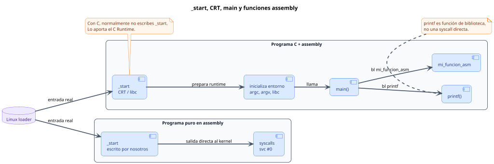

<CoverSlide
  title="Unidad 15 · ABI, AAPCS64 e interoperabilidad con C"
  subtitle="Arquitectura de Computadores y Ensambladores 1"
  note="Escuela de Ingeniería de Ciencias y Sistemas"
/>

---
layout: aarch64-section
---

# ABI, AAPCS64 e interoperabilidad con C

Calling convention formal para escribir assembly compatible con C, libc y el linker.

Unidad práctica: entender el contrato que permite que programas en C y Assembly trabajen juntos sin romperse mutuamente.

---

# Anuncios importantes

<InfoBox type="warning" title="Anuncios">

- **Anuncio 1**

</InfoBox>

---

# Agenda

<v-clicks>

1. **ABI vs ISA** — Diferencia entre instrucciones válidas y convenciones correctas.
2. **AAPCS64** — El estándar de llamadas a procedimientos de ARM64.
3. **Caller vs Callee saved** — Responsabilidad compartida: ¿quién guarda qué registro?
4. **Integración con C y libc** — Llamar a C desde Assembly, y viceversa.

</v-clicks>

---

# Competencias

<InfoBox type="info" title="Competencia 1">

El estudiante desarrolla soluciones eficientes en sistemas computacionales integrando arquitectura de computadores, programación en bajo nivel y herramientas modernas de análisis y simulación para resolver problemas complejos en sistemas embebidos e IoT.

</InfoBox>

<InfoBox type="info" title="Competencia 2">

Desarrolla programas mixtos (C y ensamblador) aplicando la Application Binary Interface (ABI) y el estándar AAPCS64 para garantizar la correcta interoperabilidad, el paso de argumentos y la preservación del estado de los registros.

</InfoBox>

---

# Valor de la semana

<InfoBox type="note" title="Colaboración y Responsabilidad compartida">

Respetar las convenciones comunes para que diferentes componentes puedan trabajar en equipo.

Una función en ensamblador puede hacer la suma matemática perfecta, pero si en el proceso destruye un registro que el programa en C necesitaba, la función entera es considerada **mala**. Trabajar con la ABI (Application Binary Interface) enseña que tu código no vive aislado; debe **colaborar** respetando el entorno del que lo llama (caller) y a los que llama (callee).

</InfoBox>

---

# Qué buscamos hoy

<StepList :steps="[
  'Identificar Roles de Registros: entender que un registro no es solo un lugar temporal, sino que tiene un propósito en la llamada',
  'Preservar el Entorno: aprender a restaurar los registros vitales que usamos dentro de nuestra función',
  'Llamar Bibliotecas Reales: comprender cómo usar herramientas como printf de libc en lugar de syscalls directas',
  'Unir C y Assembly: configurar el compilador GCC para enlazar archivos .c y .s en un solo ejecutable'
]" />

---
layout: aarch64-section
---

# ABI, AAPCS64 y Mapa de Registros

La calling convention no agrega instrucciones: agrega reglas compartidas.

---

# ISA vs ABI

<v-clicks>

- **ISA (Instruction Set Architecture)** — Describe instrucciones, registros, formatos y operaciones que el procesador entiende
- **ABI (Application Binary Interface)** — Define convenciones compartidas: argumentos, retorno, registros preservados, stack y llamadas entre funciones

</v-clicks>

<InfoBox type="note" title="Diferencia clave">

La ISA dice **qué puede hacer** el procesador. La ABI dice **cómo debe hacerlo** para colaborar con otros.

</InfoBox>

---
layout: aarch64-two-cols
---

# Por qué importa la ABI

::left::

### Sin seguir la ABI

Puedes escribir una función que reciba el primer argumento en `x9` y devuelva el resultado en `x22`. El procesador puede ejecutarla.

::right::

### Con AAPCS64

El código interoperable espera argumentos en `x0-x7` y resultados en `x0`. Así C y assembly pueden entenderse.

<InfoBox type="warning" title="Cuidado">

Romper la ABI no produce un error de sintaxis. El programa puede compilar y aun así fallar en ejecución porque las piezas no comparten la misma convención.

</InfoBox>

---

# Mapa simplificado de AAPCS64

¿Qué rol tiene cada registro según el estándar ARM64?

<ComparisonTable
  :headers="['Rango', 'Rol inicial', 'Qué significa en la práctica']"
  :rows='[
    ["x0-x7", "Argumentos y Retornos", "Datos entran aquí, respuesta sale por x0"],
    ["x9-x15", "Temporales", "Libre uso, pueden ser destruidos al llamar otra función"],
    ["x19-x28", "Callee-saved", "Si los modificas, DEBES restaurarlos antes del ret"],
    ["x29", "Frame Pointer (FP)", "Apunta a la base del stack frame actual"],
    ["x30", "Link Register (LR)", "Guarda a dónde regresar"]
  ]'
/>

<InfoBox type="note" title="Nota">

Los registros `x8`, `x16-x18` tienen roles especiales (syscall number, IP0-IP2) que veremos en contexto avanzado.

</InfoBox>

<div class="mascot-row mt-4">
<Mascot emotion="leyendo" />
</div>

---
layout: aarch64-section
---

# Caller-saved y Callee-saved

No basta con que el resultado sea correcto, el entorno debe quedar limpio.

---
layout: aarch64-two-cols
---

# Dos responsabilidades distintas

::left::

### Caller-saved (x9-x15, x0-x7)

Responsabilidad del **Caller (quien llama)**.

Si yo necesito un valor importante en `x10`, sé que si llamo a `bl funcion_rara`, es probable que la función me lo sobrescriba.

**Debo guardarlo en la pila ANTES del `bl`.**

::right::

### Callee-saved (x19-x28)

Responsabilidad del **Callee (quien es llamado)**.

Si alguien me llama, ellos confían ciegamente en que yo no tocaré esos registros.

**Si los uso, debo hacerles push en mi prólogo y pop en mi epílogo.**

---
layout: aarch64-section
---

# Integración con C y libc

El programa no siempre empieza directo en `_start`.

---

# main vs _start

<div v-click class="w-full flex justify-center mt-4">

<div class="w-[92%]">



</div>

</div>

<v-clicks>

- **`_start`** — Es el punto de entrada real que recibe el control desde el loader del sistema operativo. En programas puros de assembly lo escribíamos nosotros.
- **CRT / libc** — En programas C, el *C Runtime* define `_start`, prepara el entorno de ejecución y luego invoca `main`.
- **`main`** — No es la entrada real del SO; es la función que llama el runtime después de inicializar el programa.
- **`printf` no es syscall** — Se llama como función normal con `bl printf`; los argumentos siguen la convención AAPCS64, por ejemplo `x0` para el formato y `x1`, `x2`, etc. para valores adicionales.

</v-clicks>

---
layout: aarch64-checklist
---

# Checklist mental

- <span class="check-icon">✓</span> Entiendo que AAPCS64 define el contrato de comunicación entre lenguajes
- <span class="check-icon">✓</span> Sé que `x0-x7` son los parámetros que recibo desde C
- <span class="check-icon">✓</span> Sé que si uso `x19-x28`, DEBO restaurarlos antes de salir
- <span class="check-icon">✓</span> Comprendo la diferencia entre Callee-Saved (quien es llamado protege) y Caller-Saved (quien llama protege)
- <span class="check-icon">✓</span> Sé que `printf` es una función invocada con `bl`, no una interrupción del sistema `svc`
- <span class="check-icon">✓</span> Sé usar `gcc` para compilar código C y Assembly juntos

<div class="mascot-row mt-4">
<Mascot emotion="solucionado" />
</div>

---
layout: aarch64-statement
---

# Siguiente paso

ABI, C y Assembly → Compilación y Linker avanzado → Librerías estáticas y dinámicas

---
layout: aarch64-question
---

## Preguntas de repaso

- Si en C declaro `int sumar(int a, int b, int c)`, ¿En qué registros estarán `b` y `c` al entrar a Assembly?
- ¿Qué pasa si mi función en Assembly altera `x19` y no lo restaura, pero retorna el valor matemático correcto en `x0`?
- ¿Por qué `x30` (Link Register) debe guardarse en la pila si mi función llama a un `printf`?
- Si C maneja su propio `_start`, ¿Cómo debo nombrar el punto de inicio principal de mi programa en C?

<div class="mascot-row mt-4">
<Mascot emotion="pensando" />
</div>

---
layout: aarch64-two-cols
---

# Ejemplo práctico

Llamando desde C a una función en ensamblador que respeta la ABI y preserva `x19`.

::left::

### main.c

```c
#include <stdio.h>

// Prometemos que la función existe
extern long asm_procesar(long a);

int main() {
    long result = asm_procesar(10);
    printf("Resultado: %ld\n", result);
    return 0;
}
```

::right::

### asm_procesar.s

```asm
.global asm_procesar
.type asm_procesar, %function
asm_procesar:
    // x0 trae el "10"
    stp x29, x30, [sp, #-32]!
    str x19, [sp, #16]

    mov x19, #5
    add x0, x0, x19

    ldr x19, [sp, #16]
    ldp x29, x30, [sp], #32
    ret
```

---

# Fuentes

- Página Quarto: `site/courses/aarch64/abi-aapcs64-c/`
- Arm, *Learn the Architecture - A64 Instruction Set Architecture Guide*
- Procedure Call Standard for the Arm 64-bit Architecture (AAPCS64)
- Slidev, documentación oficial

---
layout: aarch64-statement
---

# ¿Dudas?

---

<CoverSlide
  title="Gracias por tu atención"
  subtitle="Arquitectura de Computadores y Ensambladores 1"
/>
