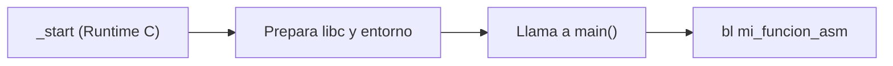

# Arquitectura de Computadores y Ensambladores 1

Escuela de Ingeniería de Ciencias y Sistemas

---
layout: center
---

Arquitectura de Computadores y Ensambladores 1

## Unidad 15
## ABI, AAPCS64 e interoperabilidad con C

Calling convention formal para escribir assembly compatible con C, libc y el linker.

Unidad práctica: entender el contrato que permite que programas en C y Assembly trabajen juntos sin romperse mutuamente.

---

# Anuncios importantes

1. **Anuncio 1**

---

# Agenda

1. **ABI vs ISA** — Diferencia entre instrucciones válidas y convenciones correctas.
2. **AAPCS64** — El estándar de llamadas a procedimientos de ARM64.
3. **Caller vs Callee saved** — Responsabilidad compartida: ¿quién guarda qué registro?
4. **Integración con C y libc** — Llamar a C desde Assembly, y viceversa.

---

# Competencias

### Competencia 1
El estudiante desarrolla soluciones eficientes en sistemas computacionales integrando arquitectura de computadores, programación en bajo nivel y herramientas modernas de análisis y simulación para resolver problemas complejos en sistemas embebidos e IoT.

### Competencia 2
Desarrolla programas mixtos (C y ensamblador) aplicando la Application Binary Interface (ABI) y el estándar AAPCS64 para garantizar la correcta interoperabilidad, el paso de argumentos y la preservación del estado de los registros.

---

# Valor de la semana

**Colaboración y Responsabilidad compartida.** Respetar las convenciones comunes para que diferentes componentes puedan trabajar en equipo.

### Aplicación en clase
Una función en ensamblador puede hacer la suma matemática perfecta, pero si en el proceso destruye un registro que el programa en C necesitaba, la función entera es considerada **mala**. Trabajar con la ABI (Application Binary Interface) enseña que tu código no vive aislado; debe **colaborar** respetando el entorno del que lo llama (caller) y a los que llama (callee).

---

# Qué buscamos hoy

1. **Identificar Roles de Registros** — Entender que un registro no es solo un "lugar temporal", sino que tiene un propósito en la llamada.
2. **Preservar el Entorno** — Aprender a restaurar los registros vitales que usamos dentro de nuestra función.
3. **Llamar Bibliotecas Reales** — Comprender cómo usar herramientas como `printf` de `libc` en lugar de syscalls directas.
4. **Unir C y Assembly** — Configurar el compilador GCC para enlazar archivos `.c` y `.s` en un solo ejecutable.

---
layout: section
---

# ABI, AAPCS64 y Mapa de Registros

La calling convention no agrega instrucciones: agrega reglas compartidas.

---

# ISA vs ABI

La **ISA (Instruction Set Architecture)** define qué instrucciones existen. La **ABI (Application Binary Interface)** define cómo deben usarse para que distintos programas puedan colaborar correctamente.

- **ISA** — Describe instrucciones, registros, formatos y operaciones que el procesador entiende.
- **ABI** — Define convenciones compartidas: argumentos, retorno, registros preservados, stack y llamadas entre funciones.

---

# Por qué importa la ABI

- **Sin seguir la ABI** — Puedes escribir una función que reciba el primer argumento en `x9` y devuelva el resultado en `x22`. El procesador puede ejecutarla.
- **Con AAPCS64** — El código interoperable espera argumentos en `x0-x7` y resultados en `x0`. Así C y assembly pueden entenderse.

Romper la ABI no produce un error de sintaxis. El programa puede compilar y aun así fallar en ejecución porque las piezas no comparten la misma convención.

---

# Mapa simplificado de AAPCS64

¿Qué rol tiene cada registro según el estándar ARM64?

| Rango | Rol inicial | ¿Qué significa en la práctica? |
|---|---|---|
| `x0` - `x7` | Argumentos y Retornos | Los datos entran por aquí, la respuesta sale por `x0`. |
| `x9` - `x15` | Temporales | Puedes usarlos libremente, pero pueden ser destruidos al llamar otra función. |
| `x19` - `x28` | **Callee-saved** | Si tu función los modifica, **DEBE** restaurarlos antes del `ret`. |
| `x29` | Frame Pointer (FP) | Apunta a la base del stack frame actual. |
| `x30` | Link Register (LR) | Guarda a dónde regresar. |

---
layout: section
---

# Caller-saved y Callee-saved

No basta con que el resultado sea correcto, el entorno debe quedar limpio.

---

# Dos responsabilidades distintas

- **Caller-saved (ej. x9-x15, x0-x7)** — Responsabilidad del **Caller (quien llama)**. Si yo necesito un valor importante en `x10`, sé que si llamo a `bl funcion_rara`, es probable que la función me lo sobrescriba. **Debo guardarlo en la pila ANTES del `bl`.**
- **Callee-saved (ej. x19-x28)** — Responsabilidad del **Callee (quien es llamado)**. Si alguien me llama, ellos confían ciegamente en que yo no tocaré esos registros. **Si los uso, debo hacerles push en mi prólogo y pop en mi epílogo.**

---
layout: section
---

# Integración con C y libc

El programa no siempre empieza directo en `_start`.

---

# main vs _start



- `_start` — El punto de entrada real del SO. En programas puros lo escribíamos nosotros.
- `libc` — Con C, enlazamos el *C Runtime (CRT)*. Él define `_start`, inicializa la librería estándar y luego invoca `main`.
- `printf` NO es syscall — No se usa `svc #0`. Se llama como una función normal: argumentos en `x0` (puntero a formato) y `x1`... y luego `bl printf`.

---

# Checklist mental

- Entiendo que AAPCS64 define el contrato de comunicación entre lenguajes.
- Sé que `x0-x7` son los parámetros que recibo desde C.
- Sé que si uso `x19-x28`, DEBO restaurarlos antes de salir.
- Comprendo la diferencia entre Callee-Saved (quien es llamado protege) y Caller-Saved (quien llama protege).
- Sé que `printf` es una función invocada con `bl`, no una interrupción del sistema `svc`.
- Sé usar `gcc` para compilar código C y Assembly juntos.

---

# Siguiente paso

ABI, C y Assembly → Compilación y Linker avanzado → Librerías estáticas y dinámicas

---
layout: center
class: text-center
---

### Actividad de cierre

# Preguntas de repaso

- Si en C declaro `int sumar(int a, int b, int c)`, ¿En qué registros estarán `b` y `c` al entrar a Assembly?
- ¿Qué pasa si mi función en Assembly altera `x19` y no lo restaura, pero retorna el valor matemático correcto en `x0`?
- ¿Por qué `x30` (Link Register) debe guardarse en la pila si mi función llama a un `printf`?
- Si C maneja su propio `_start`, ¿Cómo debo nombrar el punto de inicio principal de mi programa en C?

---

### Ejemplo Práctico

Llamando desde C a una función en ensamblador que respeta la ABI y preserva `x19`.

**main.c**
```c
#include <stdio.h>

// Prometemos que la función existe (y devuelve algo)
extern long asm_procesar(long a);

int main() {
    long result = asm_procesar(10);
    printf("Resultado: %ld\n", result);
    return 0;
}
```

**asm_procesar.s**
```asm
.global asm_procesar
.type asm_procesar, %function
asm_procesar:
    // x0 trae el "10"
    stp x29, x30, [sp, #-32]!  // Prólogo
    str x19, [sp, #16]         // Protegemos callee-saved

    mov x19, #5                // Usamos x19
    add x0, x0, x19            // x0 = 10 + 5 = 15

    ldr x19, [sp, #16]         // Restauramos callee-saved
    ldp x29, x30, [sp], #32    // Epílogo
    ret
```

---

# Fuentes

- Página Quarto: `site/courses/aarch64/abi-aapcs64-c/`
- Arm, *Learn the Architecture - A64 Instruction Set Architecture Guide*
- Procedure Call Standard for the Arm 64-bit Architecture (AAPCS64)
- Slidev, documentación oficial

---
layout: statement
---

# Dudas¿?

---
layout: center
---

# Gracias por tu atención
