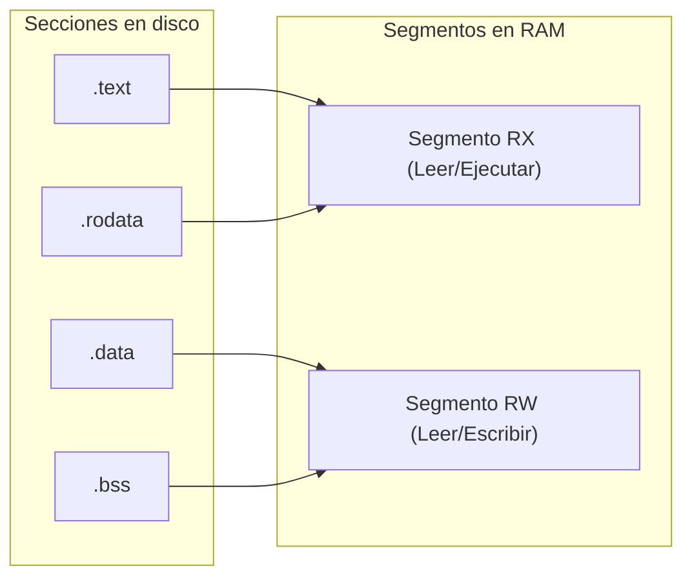

<CoverSlide
  title="Unidad 16 · ELF, linking, loading y binarios"
  subtitle="Arquitectura de Computadores y Ensambladores 1"
  note="Escuela de Ingeniería de Ciencias y Sistemas"
/>

---
layout: aarch64-section
---

# ELF, linking, loading y binarios

Entiende el binario como objeto técnico: fuente, objeto, ejecutable y proceso.

Unidad práctica: abrir la "caja negra" del binario y descubrir cómo interactúan el Assembler, Linker, Loader y Linux.

---

# Anuncios importantes

<InfoBox type="warning" title="Anuncios">

- **Anuncio 1**

</InfoBox>

---

# Agenda

<v-clicks>

1. **Flujo completo** — El camino desde el archivo `.s` hasta el proceso en memoria.
2. **Secciones vs Segmentos** — Diferencia entre organizar código (Linker) y cargar memoria (Loader).
3. **Símbolos y Relocations** — Cómo conecta el linker las piezas separadas usando `nm`.
4. **Linking Dinámico** — Entendiendo `libc`, GOT, PLT y PIE sin magia.

</v-clicks>

---

# Competencias

<InfoBox type="info" title="Competencia 1">

El estudiante desarrolla soluciones eficientes en sistemas computacionales integrando arquitectura de computadores, programación en bajo nivel y herramientas modernas de análisis y simulación para resolver problemas complejos en sistemas embebidos e IoT.

</InfoBox>

<InfoBox type="info" title="Competencia 2">

Inspecciona y comprende la estructura interna de los archivos ejecutables (ELF) aplicando herramientas de análisis binario (`readelf`, `objdump`, `nm`) para diagnosticar procesos de ensamblado, enlazado y carga en memoria.

</InfoBox>

---

# Valor de la semana

<InfoBox type="note" title="Transparencia Técnica y Claridad">

Desmitificar las cajas negras para dominar la herramienta desde su fundamento.

Un archivo ejecutable no cobra vida por arte de magia; tiene un **contrato estructurado (ELF)**. Entender que un bug de *"undefined reference"* no es culpa del procesador sino del Linker, o que un error de *"Segmentation fault"* lo lanza el Loader/SO, te da la **claridad** necesaria para no programar a ciegas.

</InfoBox>

---

# Qué buscamos hoy

<StepList :steps="[
  'Separar responsabilidades: distinguir qué hace el Assembler (.o), el Linker (ELF) y el Loader/Kernel',
  'Leer binarios: aprender a usar readelf y nm para ver secciones y símbolos, no solo código',
  'Distinguir Sección y Segmento: entender por qué el Linker usa secciones (.text, .data) y el Loader usa segmentos (R, RX, RW)',
  'Llamadas Dinámicas: visualizar conceptualmente cómo funciona printf usando la GOT y la PLT'
]" />

---
layout: aarch64-section
---

# Flujo de ejecución completo

Un archivo en disco no ejecuta nada por sí mismo.

---

# Del código fuente al proceso en memoria

```plantuml
@startuml
scale 0.90

title Del código fuente al proceso en memoria

left to right direction

skinparam backgroundColor transparent
skinparam shadowing false
skinparam roundcorner 14
skinparam defaultFontName Arial
skinparam defaultFontSize 11

skinparam artifact {
  BorderColor #334155
  BackgroundColor #f8fafc
  FontColor #0f172a
}

skinparam rectangle {
  BorderColor #2563eb
  BackgroundColor #dbeafe
  FontColor #1e3a8a
}

skinparam database {
  BorderColor #7c3aed
  BackgroundColor #ede9fe
  FontColor #4c1d95
}

skinparam arrow {
  Color #475569
  Thickness 2
}

artifact "main.s\nCódigo fuente" as SRC
rectangle "Assembler\nas" as AS
artifact "main.o\nObjeto relocatable" as OBJ
rectangle "Linker\nld" as LD
database "main\nEjecutable ELF" as ELF
rectangle "Loader\nLinux" as LOADER
database "Proceso\nen memoria" as PROC

SRC --> AS : ensambla
AS --> OBJ : produce
OBJ --> LD : enlaza
LD --> ELF : genera
ELF --> LOADER : carga
LOADER --> PROC : ejecuta

@enduml
```

<div v-click class="w-full flex justify-center mt-4">

<div class="w-[86%]">



</div>

</div>

<v-clicks>

- **Assembler** — Convierte `main.s` en un archivo objeto `main.o`
- **Linker** — Convierte uno o varios `.o` en un ejecutable ELF
- **Loader** — Carga el ELF en memoria y transfiere el control al punto de entrada

</v-clicks>

---
layout: aarch64-section
---

# Secciones, Símbolos y Relocations

El trabajo de organizar y unir piezas sueltas.

---

# Secciones: La organización del Linker

Las **Secciones** organizan el contenido del archivo por "intención" y visibilidad. Las puede leer el compilador, linker y depurador.

<v-clicks>

- **`.text`** — Instrucciones ejecutables
- **`.rodata`** — Datos de solo lectura (Strings)
- **`.data`** — Variables inicializadas modificables
- **`.bss`** — Promesa de memoria en ceros (no ocupa todo ese espacio en disco)

</v-clicks>

<InfoBox type="note" title="Símbolos (nm)">

Un símbolo es un nombre asociado a una dirección (`_start`, `msg`, `printf`).
- `T` = en `.text`
- `D` = en `.data`
- `U` = Undefined (Aún no se sabe dónde está)

</InfoBox>

---

# Relocations (Reubicaciones)

<InfoBox type="warning" title="Analogía del Post-it">

Una **Relocation** es un "post-it" que deja el Assembler para el Linker: *"En esta línea dejé un espacio vacío, rellénalo con la dirección de `msg` cuando sepas dónde va a quedar"*.

</InfoBox>

<v-clicks>

- **En el archivo `.o`** — Si uso `adrp x0, msg` y `msg` está en otro archivo, el Assembler no puede resolverlo. Pone ceros y crea un registro de *relocation*
- **En el Linker** — El Linker junta los `.o`, calcula las posiciones finales, y "parchea" todas las instrucciones que tenían post-its

</v-clicks>

<div class="mascot-row mt-4">
<Mascot emotion="confundido" />
</div>

---
layout: aarch64-section
---

# Secciones vs Segmentos

De la organización en disco al mapeo en RAM.

---

# Diferencia vital: Linker vs Loader

<ComparisonTable
  :headers="['Concepto', 'Uso principal', 'Lo ve principalmente', 'Comando']"
  :rows='[
    ["Sección", "Organizar código y datos para construir", "Assembler, Linker, GDB", "readelf -S"],
    ["Segmento", "Mapear bloques en memoria con permisos", "Kernel, Loader", "readelf -l"]
  ]'
/>

<div v-click>



</div>

<InfoBox type="note" title="Concepto clave">

El Loader agrupa múltiples Secciones compatibles en un solo Segmento de memoria.

</InfoBox>

---
layout: aarch64-section
---

# Linking Dinámico

Llamando a `libc` sin saber dónde está.

---

# GOT, PLT y PIE (Conceptos)

Si usamos **Librerías Compartidas (Dinámicas)**, no sabemos la dirección de `printf` hasta que el programa se ejecuta y se carga `libc` en RAM.

<v-clicks>

- **PLT (Procedure Linkage)** — Es un **puente**. Tu código llama a un *stub* llamado `printf@plt`. Ese puente redirige la llamada usando la GOT
- **GOT (Global Offset)** — Es una **tabla de punteros**. El *Dynamic Loader* la llena en tiempo de ejecución con la dirección real de `printf` en la RAM
- **PIE (Position Independent)** — Tu programa entero puede ser cargado en cualquier dirección base (ASLR). Por eso, todo debe usar saltos y cálculos **relativos**, no absolutos

</v-clicks>

<InfoBox type="note" title="Nota">

La combinación PLT + GOT permite que `libc` se comparta entre múltiples procesos sin duplicar código en memoria.

</InfoBox>

---
layout: aarch64-checklist
---

# Checklist mental

- <span class="check-icon">✓</span> Puedo explicar el flujo completo: `.s` → `.o` → `ELF Executable` → Proceso
- <span class="check-icon">✓</span> Puedo distinguir entre objeto *relocatable* (pieza) y ejecutable (final)
- <span class="check-icon">✓</span> Sé que `readelf -h` muestra la cabecera ELF y el *Entry Point*
- <span class="check-icon">✓</span> Entiendo la diferencia entre Sección (para el Linker) y Segmento (para el Loader)
- <span class="check-icon">✓</span> Sé usar `nm` para ver los símbolos de mi programa y sé qué significa `U` (Undefined)
- <span class="check-icon">✓</span> Puedo explicar que `.bss` promete memoria que iniciará en ceros, sin inflar el disco
- <span class="check-icon">✓</span> Entiendo el propósito de la PLT y GOT para no hardcodear la dirección de `libc`

<div class="mascot-row mt-4">
<Mascot emotion="solucionado" />
</div>

---
layout: aarch64-statement
---

# Siguiente paso

Análisis del Binario ELF → Uso de herramientas (`readelf`, `objdump`) → **Laboratorio:** Integración y Reproducibilidad

---
layout: aarch64-question
---

## Preguntas de repaso

- ¿Qué es un archivo `.o` (Relocatable) y por qué el Sistema Operativo rechaza ejecutarlo directamente?
- Si un símbolo de tu código aparece marcado con la letra `U` en `nm`, ¿Qué problema tendrás al intentar hacer el *Linking*?
- ¿Por qué el *Loader* carga la sección `.text` y `.rodata` en un segmento que tiene permisos `RX` en lugar de `RW`?
- ¿Qué ventaja tiene que la sección `.bss` NO guarde todos sus "ceros" directamente dentro del archivo guardado en el disco duro?

<div class="mascot-row mt-4">
<Mascot emotion="pensando" />
</div>

---
layout: aarch64-two-cols
---

# Ejemplo práctico: Análisis Binario

El uso correcto de `readelf` y `objdump`.

::left::

### 1. Ver el Entry Point y el Tipo

```bash
$ aarch64-linux-gnu-readelf -h main
ELF Header:
  Type:   EXEC (Executable file)
  Machine: AArch64
  Entry point address: 0x4000b0
```

::right::

### 2. Ver Segmentos que irán a RAM

```bash
$ aarch64-linux-gnu-readelf -l main
Program Headers:
  Type    Offset   VirtAddr   MemSiz  Flg
  LOAD    0x0000   0x400000   0x15c   R E (RX)
  LOAD    0x015c   0x41015c   0x008   RW  (RW)
```

---

# Fuentes

- Página Quarto: `site/courses/aarch64/elf-linking-loading/`
- Toolchain GNU: `readelf`, `objdump`, `nm`
- Linux System API and Executable and Linkable Format (ELF) Standard
- Slidev, documentación oficial

---
layout: aarch64-statement
---

# ¿Dudas?

---

<CoverSlide
  title="Gracias por tu atención"
  subtitle="Arquitectura de Computadores y Ensambladores 1"
/>
