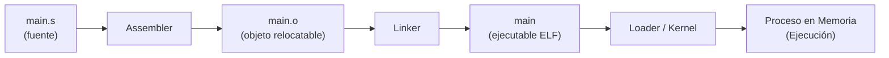
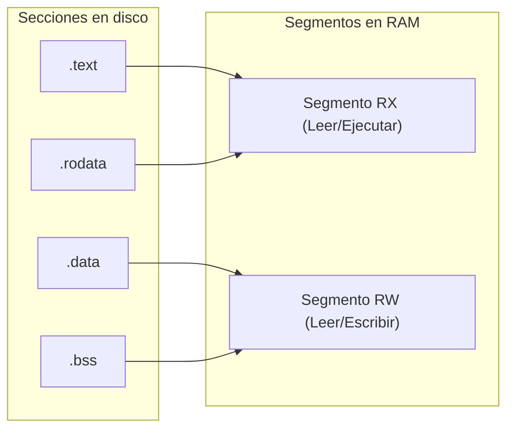

# Arquitectura de Computadores y Ensambladores 1

Escuela de Ingeniería de Ciencias y Sistemas

---
layout: center
---

Arquitectura de Computadores y Ensambladores 1

## Unidad 16
## ELF, linking, loading y binarios

Entiende el binario como objeto técnico: fuente, objeto, ejecutable y proceso.

Unidad práctica: abrir la "caja negra" del binario y descubrir cómo interactúan el Assembler, Linker, Loader y Linux.

---

# Anuncios importantes

1. **Anuncio 1**

---

# Agenda

1. **Flujo completo** — El camino desde el archivo `.s` hasta el proceso en memoria.
2. **Secciones vs Segmentos** — Diferencia entre organizar código (Linker) y cargar memoria (Loader).
3. **Símbolos y Relocations** — Cómo conecta el linker las piezas separadas usando `nm`.
4. **Linking Dinámico** — Entendiendo `libc`, GOT, PLT y PIE sin magia.

---

# Competencias

### Competencia 1
El estudiante desarrolla soluciones eficientes en sistemas computacionales integrando arquitectura de computadores, programación en bajo nivel y herramientas modernas de análisis y simulación para resolver problemas complejos en sistemas embebidos e IoT.

### Competencia 2
Inspecciona y comprende la estructura interna de los archivos ejecutables (ELF) aplicando herramientas de análisis binario (`readelf`, `objdump`, `nm`) para diagnosticar procesos de ensamblado, enlazado y carga en memoria.

---

# Valor de la semana

**Transparencia Técnica y Claridad.** Desmitificar las cajas negras para dominar la herramienta desde su fundamento.

### Aplicación en clase
Un archivo ejecutable no cobra vida por arte de magia; tiene un **contrato estructurado (ELF)**. Entender que un bug de *"undefined reference"* no es culpa del procesador sino del Linker, o que un error de *"Segmentation fault"* lo lanza el Loader/SO, te da la **claridad** necesaria para no programar a ciegas.

---

# Qué buscamos hoy

1. **Separar responsabilidades** — Distinguir qué hace el Assembler (`.o`), el Linker (`ELF`) y el Loader/Kernel.
2. **Leer binarios** — Aprender a usar `readelf` y `nm` para ver secciones y símbolos, no solo código.
3. **Distinguir Sección y Segmento** — Entender por qué el Linker usa secciones (`.text`, `.data`) y el Loader usa segmentos (R, RX, RW).
4. **Llamadas Dinámicas** — Visualizar conceptualmente cómo funciona `printf` usando la GOT y la PLT.

---
layout: section
---

# Flujo de ejecución completo

Un archivo en disco no ejecuta nada por sí mismo.

---

# Del código fuente al proceso en memoria



- **Assembler** — Traduce instrucciones locales y produce un objeto (pieza de lego). Aún no sabe dónde vivirá todo en memoria.
- **Linker** — Une todos los `.o`, resuelve direcciones cruzadas (símbolos) y empaqueta un Ejecutable con *Entry Point*.
- **Loader** — El SO lee el ELF, mapea los segmentos en RAM, asigna permisos y pasa el control al `_start`.

---
layout: section
---

# Secciones, Símbolos y Relocations

El trabajo de organizar y unir piezas sueltas.

---

# Secciones: La organización del Linker

Las **Secciones** organizan el contenido del archivo por "intención" y visibilidad. Las puede leer el compilador, linker y depurador.

- **Secciones Comunes (`readelf -S`)** — `.text`: Instrucciones ejecutables. `.rodata`: Datos de solo lectura (Strings). `.data`: Variables inicializadas modificables. `.bss`: Promesa de memoria en ceros (no ocupa todo ese espacio en disco).
- **Símbolos (`nm`)** — Un símbolo es un nombre asociado a una dirección (`_start`, `msg`, `printf`). `T` = en `.text`. `D` = en `.data`. `U` = Undefined (Aún no se sabe dónde está).

---

# Relocations (Reubicaciones)

Una **Relocation** es un "post-it" que deja el Assembler para el Linker: *"En esta línea dejé un espacio vacío, rellénalo con la dirección de `msg` cuando sepas dónde va a quedar"*.

- **En el archivo `.o`** — Si uso `adrp x0, msg` y `msg` está en otro archivo, el Assembler no puede resolverlo. Pone ceros y crea un registro de *relocation*.
- **En el Linker** — El Linker junta los `.o`, calcula las posiciones finales, y "parchea" todas las instrucciones que tenían post-its.

---
layout: section
---

# Secciones vs Segmentos

De la organización en disco al mapeo en RAM.

---

# Diferencia vital: Linker vs Loader

| Concepto | Uso principal | Lo ve principalmente | Comando |
|---|---|---|---|
| **Sección** | Organizar código y datos para construir. | Assembler, Linker, GDB | `readelf -S` |
| **Segmento** | Mapear bloques en memoria con permisos. | Kernel, Loader | `readelf -l` |



El Loader agrupa múltiples Secciones compatibles en un solo Segmento de memoria.

---
layout: section
---

# Linking Dinámico

Llamando a `libc` sin saber dónde está.

---

# GOT, PLT y PIE (Conceptos)

Si usamos **Librerías Compartidas (Dinámicas)**, no sabemos la dirección de `printf` hasta que el programa se ejecuta y se carga `libc` en RAM.

- **PLT (Procedure Linkage)** — Es un **puente**. Tu código llama a un *stub* llamado `printf@plt`. Ese puente redirige la llamada usando la GOT.
- **GOT (Global Offset)** — Es una **tabla de punteros**. El *Dynamic Loader* la llena en tiempo de ejecución con la dirección real de `printf` en la RAM.
- **PIE (Position Independent)** — Tu programa entero puede ser cargado en cualquier dirección base (ASLR). Por eso, todo debe usar saltos y cálculos **relativos**, no absolutos.

---

# Checklist mental

- Puedo explicar el flujo completo: `.s` → `.o` → `ELF Executable` → Proceso.
- Puedo distinguir entre objeto *relocatable* (pieza) y ejecutable (final).
- Sé que `readelf -h` muestra la cabecera ELF y el *Entry Point*.
- Entiendo la diferencia entre Sección (para el Linker) y Segmento (para el Loader).
- Sé usar `nm` para ver los símbolos de mi programa y sé qué significa `U` (Undefined).
- Puedo explicar que `.bss` promete memoria que iniciará en ceros, sin inflar el disco.
- Entiendo el propósito de la PLT y GOT para no hardcodear la dirección de `libc`.

---

# Siguiente paso

Análisis del Binario ELF → Uso de herramientas (`readelf`, `objdump`) → **Laboratorio:** Integración y Reproducibilidad

---
layout: center
class: text-center
---

### Actividad de cierre

# Preguntas de repaso

- ¿Qué es un archivo `.o` (Relocatable) y por qué el Sistema Operativo rechaza ejecutarlo directamente?
- Si un símbolo de tu código aparece marcado con la letra `U` en `nm`, ¿Qué problema tendrás al intentar hacer el *Linking*?
- ¿Por qué el *Loader* carga la sección `.text` y `.rodata` en un segmento que tiene permisos `RX` en lugar de `RW`?
- ¿Qué ventaja tiene que la sección `.bss` NO guarde todos sus "ceros" directamente dentro del archivo guardado en el disco duro?

---

### Ejemplo Práctico: Análisis Binario

El uso correcto de `readelf` y `objdump`.

**1. Ver el Entry Point y el Tipo**
```bash
$ aarch64-linux-gnu-readelf -h main
ELF Header:
  Type:   EXEC (Executable file)
  Machine: AArch64
  Entry point address: 0x4000b0
```

**2. Ver Segmentos que irán a RAM**
```bash
$ aarch64-linux-gnu-readelf -l main
Program Headers:
  Type    Offset   VirtAddr   MemSiz  Flg
  LOAD    0x0000   0x400000   0x15c   R E (RX)
  LOAD    0x015c   0x41015c   0x008   RW  (RW)
```

---

# Fuentes

- Página Quarto: `site/courses/aarch64/elf-linking-loading/`
- Toolchain GNU: `readelf`, `objdump`, `nm`
- Linux System API and Executable and Linkable Format (ELF) Standard
- Slidev, documentación oficial

---
layout: statement
---

# Dudas¿?

---
layout: center
---

# Gracias por tu atención
