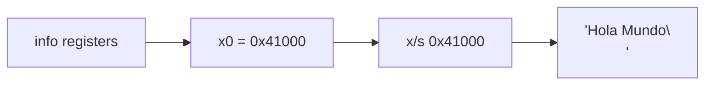
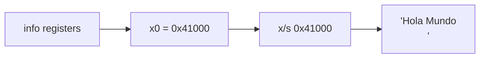

<style>
@import "../styles/index.css";
</style>

<div class="ecys-cover-bg"></div>

<div class="ecys-title-cover">

<div class="muted">Escuela de Ingeniería de Ciencias y Sistemas</div>

# Arquitectura de Computadores y Ensambladores 1

</div>

---
layout: center
---

<div class="muted">Arquitectura de Computadores y Ensambladores 1</div>

## Unidad 17
## Debugging: GDB, QEMU y strace

Leer el estado real del programa mientras se ejecuta.

<div class="cover-note">
Unidad práctica: dejar de adivinar por qué falló el programa y aprender a mirar directamente los registros, la memoria y las llamadas al kernel.
</div>

---

# Anuncios importantes

<div class="numbered-grid">
  <div class="numbered-card">
    <div class="card-number">1</div>
    <h3>Anuncio 1</h3>
    <p></p>
  </div>
</div>

---

# Agenda

<div class="numbered-grid">
  <div class="numbered-card">
    <div class="card-number">1</div>
    <h3>Flujo de Control</h3>
    <p>Cómo usar breakpoints, <code>stepi</code> y <code>nexti</code> para dominar el tiempo.</p>
  </div>

  <div class="numbered-card">
    <div class="card-number">2</div>
    <h3>Mirar el Estado</h3>
    <p>Leer registros e inspeccionar direcciones de memoria directamente (<code>x/x</code>, <code>x/s</code>).</p>
  </div>

  <div class="numbered-card">
    <div class="card-number">3</div>
    <h3>Stack Frames</h3>
    <p>Usar <code>sp</code>, <code>x29</code>, <code>x30</code> y <code>bt</code> para entender dónde estamos.</p>
  </div>

  <div class="numbered-card">
    <div class="card-number">4</div>
    <h3>El Kernel no miente</h3>
    <p>Verificar con <code>strace</code> la comunicación exacta (Syscalls) con Linux.</p>
  </div>
</div>

---

# Competencias

<div class="concept-grid vertical-center">
  <div class="concept-card">
    <h3>Competencia 1</h3>
    <p>
      El estudiante desarrolla soluciones eficientes en sistemas computacionales
      integrando arquitectura de computadores, programación en bajo nivel y
      herramientas modernas de análisis y simulación para resolver problemas
      complejos en sistemas embebidos e IoT.
    </p>
  </div>

  <div class="concept-card">
    <h3>Competencia 2</h3>
    <p>
      Diagnostica y depura programas a nivel de código máquina utilizando herramientas
      (GDB, QEMU y strace) para analizar interactivamente el estado de los registros,
      la memoria, los frames en el stack y las interacciones con el SO.
    </p>
  </div>
</div>

---

# Valor de la semana

<div class="callout tip">
  <strong>Rigor Analítico y Evidencia Empírica.</strong>
  No adivinar dónde está el error; observar la máquina para encontrarlo.
</div>

<div class="concept-grid">
  <div class="concept-card">
    <h3>Aplicación en clase</h3>
    <p>
      En alto nivel puedes usar `print("Llegó aquí")`. En Ensamblador, el programa puede
      suicidarse silenciosamente (Segmentation Fault) si calculas mal un puntero.
      Depurar exige <strong>Rigor</strong>: formular una hipótesis (<em>"creo que x0 tiene el fd"</em>),
      pausar el código, y recolectar la <strong>evidencia</strong> leyendo la memoria real antes de culpar a la instrucción.
    </p>
  </div>
</div>

---

###### Qué buscamos hoy

<div class="slide-center-block">

<div class="objective-grid">
  <div v-click class="objective-item">
    <div class="item-number">1</div>
    <h3>Navegar el código</h3>
    <p>Detener el proceso, avanzar instrucción por instrucción y entender la diferencia entre <code>stepi</code> y <code>nexti</code>.</p>
  </div>

  <div v-click class="objective-item">
    <div class="item-number">2</div>
    <h3>Inspeccionar Memoria</h3>
    <p>Traducir una dirección de memoria a valores legibles: Hexadecimales, Strings o Instrucciones.</p>
  </div>

  <div v-click class="objective-item">
    <div class="item-number">3</div>
    <h3>Depurar el Pila (Stack)</h3>
    <p>Ver cómo se construyen los marcos de función y usar Backtrace (<code>bt</code>) para no perderte.</p>
  </div>

  <div v-click class="objective-item">
    <div class="item-number">4</div>
    <h3>Auditar al Kernel</h3>
    <p>Saber exactamente si una lectura/escritura falló porque el Kernel te devolvió un <code>ENOENT</code> en <code>strace</code>.</p>
  </div>
</div>

</div>

---
layout: section
---

# Flujo de Control en GDB

El ciclo es simple: detener, observar, avanzar e interpretar.

---

###### Breakpoints y avance

<div class="slide-center-block">

<div class="content-stack-lg">

<div class="key-idea centered-narrow">
GDB permite detener el programa y observarlo con calma. Si todo ocurre demasiado rápido, el error puede pasar sin que lo veas.
</div>

<div class="compare-grid">
  <div v-click class="compare-card">
    <div class="card-kicker">Detener</div>
    <ul>
      <li><code>break _start</code></li>
      <li>Pone un punto de parada en una etiqueta o función.</li>
    </ul>
  </div>

  <div v-click class="compare-card">
    <div class="card-kicker">Continuar</div>
    <ul>
      <li><code>continue</code></li>
      <li>Deja correr el programa hasta el siguiente breakpoint.</li>
    </ul>
  </div>
</div>

<div v-click class="callout warning centered-narrow">
Usa <code>-g</code> al ensamblar, por ejemplo <code>as -g</code>, para que GDB pueda leer etiquetas y nombres.
</div>

</div>

</div>

---

###### Avanzar instrucción por instrucción

<div class="slide-center-block">

<div class="content-stack-lg">

<div class="compare-grid">
  <div v-click class="compare-card">
    <div class="card-kicker"><code>stepi</code></div>
    <p>Avanza una instrucción. Si encuentra un <code>bl</code>, <strong>entra</strong> a la subrutina.</p>
  </div>

  <div v-click class="compare-card">
    <div class="card-kicker"><code>nexti</code></div>
    <p>Avanza una instrucción. Si encuentra un <code>bl</code>, <strong>no entra</strong>; ejecuta la llamada completa y sigue después.</p>
  </div>
</div>

<div v-click class="callout info centered-narrow">
Usa <code>stepi</code> cuando quieras inspeccionar la llamada. Usa <code>nexti</code> cuando solo te interese su resultado.
</div>

</div>

</div>

---

## layout: section

# Mirar el estado

El CPU no miente: o el registro tiene el valor correcto o no lo tiene.

---

###### Registros y memoria

<div class="slide-center-block">

<div class="content-stack-lg">

<div class="muted centered-narrow">Comandos para preguntar: “¿qué hay aquí?”</div>

<div class="concept-grid">
  <div v-click class="concept-card">
    <h3>Ver registros</h3>
    <p><code>info registers</code></p>
    <p>Muestra <code>x0-x30</code>, <code>sp</code> y <code>pc</code>.</p>
  </div>

  <div v-click class="concept-card">
    <h3>Ver memoria</h3>
    <p><code>x/10x $sp</code></p>
    <p>Examina 10 valores en hexadecimal desde la dirección de <code>sp</code>.</p>
  </div>

  <div v-click class="concept-card">
    <h3>Ver texto</h3>
    <p><code>x/s 0x400000</code></p>
    <p>Intenta leer una cadena ASCII desde esa dirección.</p>
  </div>
</div>

</div>

</div>

---

###### Del registro a la memoria

<div class="slide-center-block">

<div class="content-stack-lg">

<div class="diagram-block">



<div class="diagram-caption">
Flujo típico: primero miras un registro; luego inspeccionas la dirección a la que apunta.
</div>

</div>

<div v-click class="callout info centered-narrow">
Un registro puede contener un valor o una dirección. GDB te permite seguir esa relación paso a paso.
</div>

</div>

</div>


---
layout: section
---

# Mirar el Estado

El CPU no miente: o el registro tiene el valor correcto o no lo tiene.

---

###### Registros y Memoria

<div class="slide-center-block">

<div class="content-stack-lg">

<div class="muted centered-narrow">Los comandos para preguntar "¿Qué hay aquí?"</div>

<div class="concept-grid concept-grid-3">
  <div v-click class="concept-card">
    <h3>Ver Registros</h3>
    <code>info registers</code>
    <p>Muestra <code>x0-x30</code>, <code>sp</code>, <code>pc</code>. Puedes pedir específicos: <code>info registers x0 x1</code>.</p>
  </div>
  <div v-click class="concept-card">
    <h3>Ver Hexadecimal</h3>
    <code>x/10x $sp</code>
    <p>Examina 10 bloques de la memoria en la dirección de <code>sp</code>, formato Hexadecimal.</p>
  </div>
  <div v-click class="concept-card">
    <h3>Ver Strings</h3>
    <code>x/s 0x400000</code>
    <p>Examina e intenta imprimir caracteres legibles ASCII (String) desde esa dirección.</p>
  </div>
</div>

<div v-click class="diagram-block mt-4">



<div class="diagram-caption">Flujo típico: miras un registro y luego inspeccionas la dirección a la que apunta.</div>

</div>

</div>

</div>

---
layout: section
---

# Stack Frames

¿Quién me llamó y cómo regreso?

---

###### Backtrace y Registros Especiales

<div class="slide-center-block">

<div class="content-stack-lg">

<div class="compare-grid">
  <div v-click class="compare-card">
    <div class="card-kicker">Las piezas de AAPCS64</div>
    <ul>
      <li><code>sp</code> (Stack Pointer): Dónde está la cima actual.</li>
      <li><code>x29</code> (Frame Pointer): Base de mi marco actual.</li>
      <li><code>x30</code> (Link Register): A dónde debo regresar.</li>
    </ul>
    <p class="mt-2 text-sm text-gray-400">Si un programa colapsa, ver estos 3 te dirá qué función estaba corriendo.</p>
  </div>
  <div v-click class="compare-card">
    <div class="card-kicker">Comando <code>bt</code> (Backtrace)</div>
    <p>Imprime la ruta de funciones llamadas. Ejemplo:</p>
    <code>#0 funcion_c ()</code><br>
    <code>#1 funcion_b ()</code><br>
    <code>#2 main ()</code>
    <p class="mt-2 text-sm text-gray-400">GDB usa <code>x29</code> y <code>x30</code> para reconstruir este historial automáticamente.</p>
  </div>
</div>

</div>

</div>

---
layout: section
---

# `strace` y el Kernel

La verdad sobre las Syscalls.

---
###### Leyendo la salida de strace

<div class="slide-center-block">

<div class="content-stack-lg">

<div class="key-idea centered-narrow">
<code>strace</code> observa lo que tu programa le pide al kernel.
No corrige tu código, pero muestra con claridad qué syscall se hizo, con qué argumentos y qué valor devolvió.
</div>

<div class="concept-grid">
  <div v-click class="concept-card">
    <h3>Qué muestra</h3>
    <p>Nombre de la syscall, argumentos enviados y valor de retorno.</p>
  </div>

  <div v-click class="concept-card">
    <h3>Para qué sirve</h3>
    <p>Verificar si el programa pidió lo correcto al sistema operativo.</p>
  </div>
</div>

</div>

</div>

---

###### Lectura básica y errores

<div class="slide-center-block">

<div class="content-stack-lg">

<div class="compare-grid">
  <div v-click class="compare-card">
    <div class="card-kicker">Ejemplo correcto</div>
    <p><code>write(1, "Hola\n", 5) = 5</code></p>
    <ul>
      <li>Syscall: <code>write</code></li>
      <li>Fd: <code>1</code></li>
      <li>Buffer: <code>"Hola\n"</code></li>
      <li>Pidió 5 bytes y devolvió 5</li>
    </ul>
  </div>

  <div v-click class="compare-card">
    <div class="card-kicker">Ejemplo con error</div>
    <p><code>openat(AT_FDCWD, "no-existe.txt", O_RDONLY) = -1 ENOENT</code></p>
    <ul>
      <li>La syscall falló</li>
      <li>El archivo no existe</li>
      <li>En assembly, ese error se refleja en <code>x0</code></li>
    </ul>
  </div>
</div>

<div v-click class="callout warning centered-narrow">
Al usar <code>strace qemu-aarch64 ./prog</code>, pueden mezclarse syscalls del emulador con las de tu programa.
</div>

</div>

</div>


---

###### Checklist mental

<div class="slide-center-block">

<div class="reveal-list centered-narrow">
  <div v-click class="reveal-item">Sé cómo iniciar un binario cruzado (QEMU) esperando a GDB: <code>qemu-aarch64 -g 1234 ./prog</code>.</div>
  <div v-click class="reveal-item">Puedo conectarme a ese proceso desde GDB: <code>target remote :1234</code>.</div>
  <div v-click class="reveal-item">Sé poner un tope: <code>break _start</code>.</div>
  <div v-click class="reveal-item">Entiendo cuándo usar <code>stepi</code> (entrar a todo) y <code>nexti</code> (pasar de largo funciones completas).</div>
  <div v-click class="reveal-item">Sé ver el contenido de los registros con <code>info registers</code>.</div>
  <div v-click class="reveal-item">Sé inspeccionar punteros a memoria para ver Hexadecimal (<code>x/x</code>) o Letras (<code>x/s</code>).</div>
  <div v-click class="reveal-item">Sé usar <code>strace</code> para descubrir si un archivo no abrió por falta de permisos o error en el path.</div>
</div>

</div>

---

# Siguiente paso

<div class="slide-center-block">

<div class="flow-column">
  <div v-click class="flow-step">Ejecución con QEMU -g</div>
  <div v-click class="flow-arrow">→</div>
  <div v-click class="flow-step">Conexión con GDB Multiarch</div>
  <div v-click class="flow-arrow">→</div>
  <div v-click class="flow-step">Paso a Paso e Inspección</div>
</div>

</div>

---
layout: center
class: text-center
---

<div class="muted">Actividad de cierre</div>

# Preguntas de repaso

<div class="question-points mx-auto mt-6 max-w-2xl text-left">
  <div v-click>Si en GDB ves un registro antes de ejecutar la instrucción de asignación, ¿Qué vas a leer?</div>
  <div v-click>Tienes un <code>bl imprimir_pantalla</code>, y sabes que la función funciona perfecto, solo quieres pasar a la siguiente línea. ¿Usas <code>stepi</code> o <code>nexti</code>?</div>
  <div v-click>Si en <code>info registers</code> ves que <code>x0</code> tiene la dirección <code>0x4000b0</code>, ¿qué comando de GDB usas para ver si ahí hay una frase (String)?</div>
  <div v-click>¿Qué herramienta te confirma que el Kernel realmente rechazó tu archivo con <code>ENOENT</code> (No such file)?</div>
</div>

---

###### Ejemplo Práctico: Conexión Remota

<div class="slide-center-block">

<div class="content-stack-lg">

<div class="key-idea centered-narrow">
  <div class="muted">GDB Multiarch + QEMU</div>
  <p>Para depurar un binario AArch64 desde una computadora <code>x86_64</code>, QEMU ejecuta el programa y GDB se conecta de forma remota.</p>
</div>

<div class="flow-row">
  <div v-click class="flow-step">QEMU ejecuta el binario</div>
  <div v-click class="flow-arrow">→</div>
  <div v-click class="flow-step">QEMU espera en el puerto <code>1234</code></div>
  <div v-click class="flow-arrow">→</div>
  <div v-click class="flow-step">GDB se conecta y controla la ejecución</div>
</div>

</div>

</div>

---

###### Terminal 1: lanzar QEMU

<div class="slide-center-block">

<div class="content-stack-lg">

<div class="muted centered-narrow">El host compila el programa y deja a QEMU esperando a GDB.</div>

```bash
# Compilar con información de depuración
$ aarch64-linux-gnu-as -g p.s -o p.o
$ aarch64-linux-gnu-ld p.o -o prog

# Ejecutar el binario y esperar conexión remota
$ qemu-aarch64 -g 1234 ./prog
```

<div v-click class="callout info centered-narrow">
Después de ejecutar <code>qemu-aarch64 -g 1234 ./prog</code>, el programa queda detenido hasta que GDB se conecte.
</div>

</div>

</div>

---

###### Terminal 2: conectar GDB

<div class="slide-center-block">

<div class="content-stack-lg">

<div class="muted centered-narrow">GDB abre el binario local y se conecta al puerto donde espera QEMU.</div>

```bash
# Abrir GDB con el binario
$ gdb-multiarch ./prog

# Conectarse a QEMU
(gdb) target remote :1234
(gdb) break _start
(gdb) continue

# Inspeccionar la ejecución
(gdb) stepi
(gdb) info registers x0
```

<div v-click class="callout info centered-narrow">
QEMU ejecuta el programa; GDB lo observa, lo detiene y permite inspeccionarlo instrucción por instrucción.
</div>

</div>

</div>

---

# Fuentes

* Página Quarto: `site/courses/aarch64/debugging-gdb-qemu-strace/`
* Toolchain GNU: documentación oficial de GDB
* Proyecto strace: documentación
* Slidev: documentación oficial

---
layout: statement
---

# ¿Dudas?

---
layout: center
---

# Gracias por tu atención
