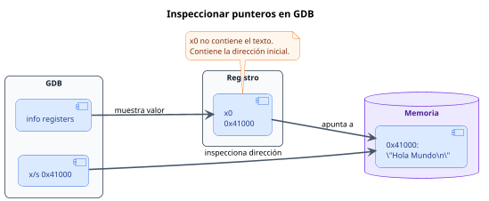

<CoverSlide
  title="Unidad 17 · Debugging con GDB, QEMU y strace"
  subtitle="Arquitectura de Computadores y Ensambladores 1"
  note="Escuela de Ingeniería de Ciencias y Sistemas"
/>

---
layout: aarch64-section
---

# Debugging: GDB, QEMU y strace

Leer el estado real del programa mientras se ejecuta.

Unidad práctica: dejar de adivinar por qué falló el programa y aprender a mirar directamente los registros, la memoria y las llamadas al kernel.

---

# Anuncios importantes

<InfoBox type="warning" title="Anuncios">

- **Anuncio 1**

</InfoBox>

---

# Agenda

<v-clicks>

1. **Flujo de Control** — Cómo usar breakpoints, `stepi` y `nexti` para dominar el tiempo.
2. **Mirar el Estado** — Leer registros e inspeccionar direcciones de memoria directamente (`x/x`, `x/s`).
3. **Stack Frames** — Usar `sp`, `x29`, `x30` y `bt` para entender dónde estamos.
4. **El Kernel no miente** — Verificar con `strace` la comunicación exacta (Syscalls) con Linux.

</v-clicks>

---

# Competencias

<InfoBox type="info" title="Competencia 1">

El estudiante desarrolla soluciones eficientes en sistemas computacionales integrando arquitectura de computadores, programación en bajo nivel y herramientas modernas de análisis y simulación para resolver problemas complejos en sistemas embebidos e IoT.

</InfoBox>

<InfoBox type="info" title="Competencia 2">

Diagnostica y depura programas a nivel de código máquina utilizando herramientas (GDB, QEMU y strace) para analizar interactivamente el estado de los registros, la memoria, los frames en el stack y las interacciones con el SO.

</InfoBox>

---

# Valor de la semana

<InfoBox type="note" title="Rigor Analítico y Evidencia Empírica">

No adivinar dónde está el error; observar la máquina para encontrarlo.

En alto nivel puedes usar `print("Llegó aquí")`. En Ensamblador, el programa puede suicidarse silenciosamente (Segmentation Fault) si calculas mal un puntero. Depurar exige **Rigor**: formular una hipótesis (*"creo que x0 tiene el fd"*), pausar el código, y recolectar la **evidencia** leyendo la memoria real antes de culpar a la instrucción.

</InfoBox>

---

# Qué buscamos hoy

<StepList :steps="[
  'Navegar el código: detener el proceso, avanzar instrucción por instrucción y entender la diferencia entre stepi y nexti',
  'Inspeccionar Memoria: traducir una dirección de memoria a valores legibles: Hexadecimales, Strings o Instrucciones',
  'Depurar la Pila (Stack): ver cómo se construyen los marcos de función y usar Backtrace (bt) para no perderte',
  'Auditar al Kernel: saber exactamente si una lectura/escritura falló porque el Kernel te devolvió un ENOENT en strace'
]" />

---
layout: aarch64-section
---

# Flujo de Control en GDB

El ciclo es simple: detener, observar, avanzar e interpretar.

---

# Breakpoints y avance

GDB permite detener el programa y observarlo con calma. Si todo ocurre demasiado rápido, el error puede pasar sin que lo veas.

<v-clicks>

- **Detener** — `break _start`. Pone un punto de parada en una etiqueta o función
- **Continuar** — `continue`. Deja correr el programa hasta el siguiente breakpoint

</v-clicks>

<InfoBox type="note" title="Importante">

Usa `-g` al ensamblar, por ejemplo `as -g`, para que GDB pueda leer etiquetas y nombres.

</InfoBox>

---
layout: aarch64-two-cols
---

# Avanzar instrucción por instrucción

::left::

### `stepi`

Avanza una instrucción. Si encuentra un `bl`, **entra** a la subrutina.

Úsalo cuando quieras inspeccionar la llamada.

::right::

### `nexti`

Avanza una instrucción. Si encuentra un `bl`, **no entra**; ejecuta la llamada completa y sigue después.

Úsalo cuando solo te interese su resultado.

---
layout: aarch64-section
---

# Mirar el estado

El CPU no miente: o el registro tiene el valor correcto o no lo tiene.

---

# Registros y memoria

Comandos para preguntar: "¿qué hay aquí?"

<v-clicks>

- **Ver registros** — `info registers`. Muestra `x0-x30`, `sp` y `pc`
- **Ver memoria** — `x/10x $sp`. Examina 10 valores en hexadecimal desde la dirección de `sp`
- **Ver texto** — `x/s 0x400000`. Intenta leer una cadena ASCII desde esa dirección

</v-clicks>

<InfoBox type="note" title="Nota">

Un registro puede contener un valor o una dirección. GDB te permite seguir esa relación paso a paso.

</InfoBox>

---

# Del registro a la memoria

<div v-click class="w-full flex justify-center mt-4">

<div class="w-[84%]">



</div>

</div>

<InfoBox v-click type="note" title="Flujo típico">

Primero miras el valor de un registro. Si ese valor es una dirección, luego inspeccionas la memoria a la que apunta.

</InfoBox>

<div class="mascot-row mt-4">
<Mascot emotion="leyendo" />
</div>

---
layout: aarch64-section
---

# Stack Frames

¿Quién me llamó y cómo regreso?

---

# Backtrace y Registros Especiales

<v-clicks>

- **Las piezas de AAPCS64** — `sp` (Stack Pointer): Dónde está la cima actual. `x29` (Frame Pointer): Base de mi marco actual. `x30` (Link Register): A dónde debo regresar. Si un programa colapsa, ver estos 3 te dirá qué función estaba corriendo
- **Comando `bt` (Backtrace)** — Imprime la ruta de funciones llamadas. Ejemplo: `#0 funcion_c ()`, `#1 funcion_b ()`, `#2 main ()`. GDB usa `x29` y `x30` para reconstruir este historial automáticamente

</v-clicks>

<InfoBox type="note" title="Concepto clave">

GDB usa `x29` y `x30` para reconstruir el historial de llamadas automáticamente.

</InfoBox>

---
layout: aarch64-section
---

# `strace` y el Kernel

La verdad sobre las Syscalls.

---

# Leyendo la salida de strace

`strace` observa lo que tu programa le pide al kernel. No corrige tu código, pero muestra con claridad qué syscall se hizo, con qué argumentos y qué valor devolvió.

<v-clicks>

- **Qué muestra** — Nombre de la syscall, argumentos enviados y valor de retorno
- **Para qué sirve** — Verificar si el programa pidió lo correcto al sistema operativo

</v-clicks>

---
layout: aarch64-two-cols
---

# Lectura básica y errores

::left::

### Ejemplo correcto

```
write(1, "Hola\n", 5) = 5
```

- Syscall: `write`
- Fd: `1`
- Buffer: `"Hola\n"`
- Pidió 5 bytes y devolvió 5

::right::

### Ejemplo con error

```
openat(AT_FDCWD, "no-existe.txt", O_RDONLY) = -1 ENOENT
```

- La syscall falló
- El archivo no existe
- En assembly, ese error se refleja en `x0`

<InfoBox type="warning" title="Nota sobre QEMU">

Al usar `strace qemu-aarch64 ./prog`, pueden mezclarse syscalls del emulador con las de tu programa.

</InfoBox>

---
layout: aarch64-checklist
---

# Checklist mental

- <span class="check-icon">✓</span> Sé cómo iniciar un binario cruzado (QEMU) esperando a GDB: `qemu-aarch64 -g 1234 ./prog`
- <span class="check-icon">✓</span> Puedo conectarme a ese proceso desde GDB: `target remote :1234`
- <span class="check-icon">✓</span> Sé poner un tope: `break _start`
- <span class="check-icon">✓</span> Entiendo cuándo usar `stepi` (entrar a todo) y `nexti` (pasar de largo funciones completas)
- <span class="check-icon">✓</span> Sé ver el contenido de los registros con `info registers`
- <span class="check-icon">✓</span> Sé inspeccionar punteros a memoria para ver Hexadecimal (`x/x`) o Letras (`x/s`)
- <span class="check-icon">✓</span> Sé usar `strace` para descubrir si un archivo no abrió por falta de permisos o error en el path

<div class="mascot-row mt-4">
<Mascot emotion="solucionado" />
</div>

---
layout: aarch64-statement
---

# Siguiente paso

Ejecución con QEMU -g → Conexión con GDB Multiarch → Paso a Paso e Inspección

---
layout: aarch64-question
---

## Preguntas de repaso

- Si en GDB ves un registro antes de ejecutar la instrucción de asignación, ¿Qué vas a leer?
- Tienes un `bl imprimir_pantalla`, y sabes que la función funciona perfecto, solo quieres pasar a la siguiente línea. ¿Usas `stepi` o `nexti`?
- Si en `info registers` ves que `x0` tiene la dirección `0x4000b0`, ¿qué comando de GDB usas para ver si ahí hay una frase (String)?
- ¿Qué herramienta te confirma que el Kernel realmente rechazó tu archivo con `ENOENT` (No such file)?

<div class="mascot-row mt-4">
<Mascot emotion="pensando" />
</div>

---

# Ejemplo práctico: Conexión Remota

Para depurar un binario AArch64 desde una computadora `x86_64`, QEMU ejecuta el programa y GDB se conecta de forma remota.

<StepList :steps="[
  'QEMU ejecuta el binario',
  'QEMU espera en el puerto 1234',
  'GDB se conecta y controla la ejecución'
]" />

---
layout: aarch64-two-cols
---

# Terminal 1: lanzar QEMU

El host compila el programa y deja a QEMU esperando a GDB.

::left::

### Compilar con debug

```bash
$ aarch64-linux-gnu-as -g p.s -o p.o
$ aarch64-linux-gnu-ld p.o -o prog
```

::right::

### Ejecutar y esperar

```bash
$ qemu-aarch64 -g 1234 ./prog
```

Después de ejecutar `qemu-aarch64 -g 1234 ./prog`, el programa queda detenido hasta que GDB se conecte.

---

# Terminal 2: conectar GDB

GDB abre el binario local y se conecta al puerto donde espera QEMU.

<CodeBlock title="Conexión GDB" lang="bash">

```bash
# Abrir GDB con el binario
$ gdb-multiarch ./prog

# Conectarse a QEMU
(gdb) target remote :1234
(gdb) break _start
(gdb) continue

# Inspeccionar la ejecución
(gdb) stepi
(gdb) info registers x0
```

</CodeBlock>

<InfoBox type="note" title="Flujo">

QEMU ejecuta el programa; GDB lo observa, lo detiene y permite inspeccionarlo instrucción por instrucción.

</InfoBox>

---

# Fuentes

- Página Quarto: `site/courses/aarch64/debugging-gdb-qemu-strace/`
- Toolchain GNU: documentación oficial de GDB
- Proyecto strace: documentación
- Slidev: documentación oficial

---
layout: aarch64-statement
---

# ¿Dudas?

---

<CoverSlide
  title="Gracias por tu atención"
  subtitle="Arquitectura de Computadores y Ensambladores 1"
/>
