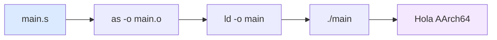
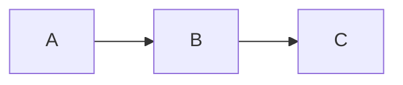
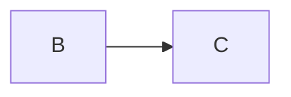
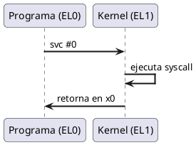
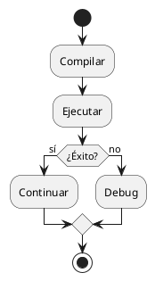
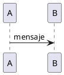

# Guía de Componentes y Features — AArch64 Slidev

Documentación completa de todos los componentes custom, layouts, animaciones y features disponibles para las presentaciones del curso de Arquitectura de Computadores y Ensambladores 1.

---

## 1. Componentes Custom

Todos los componentes están en `site/slides/aarch64/components/`.

### 1.1 CoverSlide

**Archivo:** `CoverSlide.vue`

Portada institucional con imagen de fondo y texto negro forzado.

**Props:**

| Prop | Tipo | Requerido | Default | Descripción |
|------|------|-----------|---------|-------------|
| `title` | String | Sí | — | Título principal de la presentación |
| `subtitle` | String | No | `''` | Subtítulo o institución |
| `note` | String | No | `''` | Nota contextual (semestre, profesor, aula) |

**Uso:**
```html
<CoverSlide
  title="Arquitectura de Computadores y Ensambladores 1"
  subtitle="Escuela de Ingeniería de Ciencias y Sistemas"
  note="Semestre 2026-I · Prof. Nombre · Aula ECYS-101"
/>
```

**Notas:**
- Usar como **primera slide** de cada presentación (sin layout)
- Texto siempre negro (`#000 !important`), sin importar tema light/dark
- Imagen de fondo: `site/slides/assets/Fondo_ECYS.png`
- No usar overlays ni rectángulos adicionales

---

### 1.2 InfoBox

**Archivo:** `InfoBox.vue`

Caja de información con 4 variantes de color.

**Props:**

| Prop | Tipo | Requerido | Default | Descripción |
|------|------|-----------|---------|-------------|
| `type` | String | No | `'info'` | `'info'`, `'warning'`, `'success'`, `'note'` |
| `title` | String | No | `''` | Título de la caja |

**Slot:** `default` — contenido de la caja

**Uso:**
```html
<InfoBox type="info" title="Información">
Este es un cuadro de información general.
</InfoBox>

<InfoBox type="warning" title="Precaución">
No uses `printf` en estos programas.
</InfoBox>

<InfoBox type="success" title="Correcto">
`echo $?` muestra el código de salida.
</InfoBox>

<InfoBox type="note" title="Nota">
Los registros `x0` y `w0` son el mismo registro.
</InfoBox>
```

**Con animación:**
```html
<v-click>
<InfoBox type="info" title="Paso 1">
Prepara los argumentos en x0–x5.
</InfoBox>
</v-click>
```

---

### 1.3 Register

**Archivo:** `Register.vue`

Resaltado inline de registros AArch64 con tooltip.

**Props:**

| Prop | Tipo | Requerido | Default | Descripción |
|------|------|-----------|---------|-------------|
| `name` | String | Sí | — | Nombre del registro (ej: `x0`, `sp`, `pc`) |
| `bits` | String | No | `'64'` | Tamaño en bits |
| `description` | String | No | `''` | Texto del tooltip al hacer hover |

**Uso:**
```html
- <Register name="x0" bits="64" description="Argumento 1 / retorno" /> — Argumento 1
- <Register name="x8" bits="64" description="Número de syscall" /> — Syscall number
- <Register name="sp" bits="64" description="Stack pointer" /> — Stack pointer
- <Register name="w0" bits="32" description="Parte baja de x0" /> — 32 bits
```

**Notas:**
- Se usa inline dentro de párrafos o listas
- El `description` aparece como tooltip nativo del navegador

---

### 1.4 SyscallCard

**Archivo:** `SyscallCard.vue`

Tarjeta que documenta una syscall con sus argumentos.

**Props:**

| Prop | Tipo | Requerido | Default | Descripción |
|------|------|-----------|---------|-------------|
| `number` | String/Number | Sí | — | Número de syscall (ej: `64`, `93`) |
| `name` | String | Sí | — | Nombre de la syscall |
| `args` | Array | No | `[]` | Lista de argumentos para x0, x1, x2... |
| `description` | String | No | `''` | Descripción breve |

**Uso:**
```html
<div class="grid grid-cols-2 gap-4">

<SyscallCard
  number="64"
  name="write"
  :args="['fd (stdout=1)', 'dirección del buffer', 'cantidad de bytes']"
  description="Escribe bytes a un file descriptor."
/>

<SyscallCard
  number="93"
  name="exit"
  :args="['código de salida']"
  description="Termina el proceso."
/>

</div>
```

**Con animación:**
```html
<v-click>
<SyscallCard number="64" name="write" :args="['fd', 'buffer', 'len']" description="..." />
</v-click>
```

---

### 1.5 StepList

**Archivo:** `StepList.vue`

Lista de pasos numerados con círculos.

**Props:**

| Prop | Tipo | Requerido | Default | Descripción |
|------|------|-----------|---------|-------------|
| `steps` | Array | No | `[]` | Array de strings con cada paso |

**Slot:** `default` — contenido adicional después de la lista

**Uso:**
```html
<StepList :steps="[
  'Preparar argumentos en x0, x1, x2...',
  'Poner número de syscall en x8',
  'Ejecutar svc #0',
  'El kernel lee x8 y ejecuta la syscall'
]" />
```

---

### 1.6 InstructionCard

**Archivo:** `InstructionCard.vue`

Desglose completo de una instrucción assembly.

**Props:**

| Prop | Tipo | Requerido | Default | Descripción |
|------|------|-----------|---------|-------------|
| `mnemonic` | String | Sí | — | Mnemónico (ej: `MOV`, `ADDS`, `B.EQ`) |
| `name` | String | Sí | — | Nombre completo |
| `syntax` | String | Sí | — | Sintaxis formal |
| `description` | String | No | `''` | Descripción de la instrucción |
| `flagsAffected` | Array | No | `[]` | Flags NZCV afectados |
| `example` | Object | No | `{}` | `{ code: '...', explanation: '...' }` |
| `notes` | Array | No | `[]` | Lista de notas adicionales |

**Uso:**
```html
<InstructionCard
  mnemonic="ADDS"
  name="Add with Flags"
  syntax="ADDS Xd, Xn, Xm"
  description="Suma Xn + Xm, guarda en Xd y actualiza flags NZCV."
  :flags-affected="['N', 'Z', 'C', 'V']"
  :example="{ code: 'adds x0, x1, x2', explanation: 'x0 = x1 + x2, flags actualizados' }"
  :notes="[
    'La S al final indica que actualiza flags',
    'C = carry (unsigned overflow)',
    'V = overflow (signed overflow)'
  ]"
/>
```

---

### 1.7 MemoryMap

**Archivo:** `MemoryMap.vue`

Visualización del layout de memoria de un proceso.

**Props:**

| Prop | Tipo | Requerido | Default | Descripción |
|------|------|-----------|---------|-------------|
| `regions` | Array | No | `[]` | Array de `{ label, start, end, color }` |
| `animate` | Boolean | No | `false` | Si `true`, cada región aparece con un click |

**Colores disponibles:** `red`, `blue`, `green`, `yellow`, `gray`, `purple`

**Estructura de region:**
```js
{
  label: 'Stack',
  start: '0x7FFF...FFFF',
  end: 'crece hacia abajo',
  color: 'blue'
}
```

**Uso sin animación:**
```html
<MemoryMap :regions="[
  { label: 'Kernel Space', start: '0xFFFF...FFFF', end: '0xFFFF...0000', color: 'red' },
  { label: 'Stack', start: '0x7FFF...FFFF', end: 'crece ↓', color: 'blue' },
  { label: 'Heap', start: 'fin .bss', end: 'crece ↑', color: 'green' },
  { label: '.text', start: '0x00400000', end: 'código', color: 'purple' }
]" />
```

**Uso con animación:**
```html
<MemoryMap :animate="true" :regions="[
  { label: 'Kernel Space', start: '0xFFFF...FFFF', color: 'red' },
  { label: 'Stack', start: '0x7FFF...FFFF', color: 'blue' },
  { label: 'Heap', start: 'fin .bss', color: 'green' },
  { label: '.text', start: '0x00400000', color: 'purple' }
]" />
```

**Notas:**
- Con `:animate="true"`, cada región aparece secuencialmente con cada click
- Los colores se adaptan automáticamente a light/dark mode

---

### 1.8 StepByStep

**Archivo:** `StepByStep.vue`

Ejecución paso a paso con estado de registros.

**Props:**

| Prop | Tipo | Requerido | Default | Descripción |
|------|------|-----------|---------|-------------|
| `steps` | Array | No | `[]` | Array de pasos |
| `animate` | Boolean | No | `false` | Si `true`, cada paso aparece con un click |

**Estructura de step:**
```js
{
  label: 'mov x0, #1',
  registers: { x0: '1 (stdout)', x1: '?', x8: '?' },
  note: 'File descriptor = stdout'
}
```

**Uso sin animación:**
```html
<StepByStep :steps="[
  {
    label: 'mov x0, #1',
    registers: { x0: '1', x1: '?', x8: '?' },
    note: 'File descriptor = stdout'
  },
  {
    label: 'mov x8, #64',
    registers: { x0: '1', x1: '?', x8: '64' },
    note: 'Syscall write lista'
  }
]" />
```

**Uso con animación:**
```html
<StepByStep :animate="true" :steps="[
  { label: 'mov x0, #1', registers: { x0: '1', x8: '?' }, note: 'fd = stdout' },
  { label: 'mov x8, #64', registers: { x0: '1', x8: '64' }, note: 'syscall write' },
  { label: 'svc #0', registers: { x0: '14', x8: '64' }, note: '14 bytes escritos' }
]" />
```

---

### 1.9 Timeline

**Archivo:** `Timeline.vue`

Secuencia de ejecución con marcadores visuales.

**Props:**

| Prop | Tipo | Requerido | Default | Descripción |
|------|------|-----------|---------|-------------|
| `events` | Array | No | `[]` | Array de eventos |
| `animate` | Boolean | No | `false` | Si `true`, cada evento aparece con un click |

**Estructura de event:**
```js
{
  step: 1,
  label: 'Carga',
  desc: 'El loader carga el ELF en memoria',
  detail: 'Se mapean .text, .data, .bss'
}
```

**Uso sin animación:**
```html
<Timeline :events="[
  { step: 1, label: 'Carga', desc: 'El loader carga el ELF', detail: '.text, .data, .bss' },
  { step: 2, label: 'Entry Point', desc: 'PC salta a _start', detail: 'Primera instrucción' },
  { step: 3, label: 'Setup', desc: 'Registros configurados', detail: 'x0, x1, x2, x8' }
]" />
```

**Uso con animación:**
```html
<Timeline :animate="true" :events="[
  { step: 1, label: 'Setup', desc: 'x0=1, x1=msg, x2=len, x8=64', detail: 'Argumentos listos' },
  { step: 2, label: 'svc #0', desc: 'Trap al kernel EL0→EL1', detail: 'Cambio de privilege' },
  { step: 3, label: 'Kernel', desc: 'Linux ejecuta write()', detail: 'Escribe bytes a stdout' },
  { step: 4, label: 'Retorno', desc: 'x0 = bytes escritos', detail: 'Vuelve a EL0' }
]" />
```

---

### 1.10 ComparisonTable

**Archivo:** `ComparisonTable.vue`

Tabla de comparación con primera columna destacada.

**Props:**

| Prop | Tipo | Requerido | Default | Descripción |
|------|------|-----------|---------|-------------|
| `headers` | Array | Sí | — | Encabezados de columnas |
| `rows` | Array | Sí | — | Array de arrays (filas) |

**Uso:**
```html
<ComparisonTable
  :headers="['Característica', 'Raspberry Pi ARM64', 'x86_64 + QEMU']"
  :rows="[
    ['Arquitectura', 'aarch64 nativo', 'x86_64 host'],
    ['Compilador', 'as / gcc', 'aarch64-linux-gnu-as'],
    ['Ejecución', './main directo', 'qemu-aarch64 ./main'],
    ['Debugger', 'gdb', 'gdb-multiarch']
  ]"
/>
```

**Notas:**
- La primera columna de cada fila se renderiza en negrita automáticamente
- Scroll horizontal si la tabla es muy ancha

---

### 1.11 CodeAnnotation

**Archivo:** `CodeAnnotation.vue`

Código assembly con anotaciones numeradas al lado.

**Props:**

| Prop | Tipo | Requerido | Default | Descripción |
|------|------|-----------|---------|-------------|
| `annotations` | Array | No | `[]` | Array de `{ num, text }` |

**Slot:** `default` — bloque de código assembly

**Uso:**
```html
<CodeAnnotation :annotations="[
  { num: '1', text: 'x0 = 1 → file descriptor stdout' },
  { num: '2', text: 'x1 = dirección del mensaje' },
  { num: '3', text: 'x2 = longitud del mensaje' },
  { num: '4', text: 'x8 = 64 → syscall write' },
  { num: '5', text: 'svc #0 → trap al kernel' }
]">

```asm
.global _start
.text
_start:
    mov x0, #1
    ldr x1, =msg
    mov x2, #len
    mov x8, #64
    svc #0
```

</CodeAnnotation>
```

**Notas:**
- Layout grid de 2 columnas: código a la izquierda, anotaciones a la derecha
- Scroll automático si el contenido excede la altura de la slide

---

### 1.12 CodeBlock

**Archivo:** `CodeBlock.vue`

Bloque de código con caption opcional.

**Props:**

| Prop | Tipo | Requerido | Default | Descripción |
|------|------|-----------|---------|-------------|
| `title` | String | No | `''` | Caption del bloque |
| `lang` | String | No | `'asm'` | Lenguaje para syntax highlighting |

**Slot:** `default` — contenido del código

**Uso:**
```html
<CodeBlock title="main.s — Hello World" lang="asm">

```asm
.global _start
.text
_start:
    mov x0, #1
    mov x8, #64
    svc #0
```

</CodeBlock>
```

---

## 2. Layouts Custom

Todos los layouts están en `site/slides/aarch64/layouts/`.

### 2.1 aarch64-section

Separador visual entre temas con gradiente sutil.

**Uso:**
```yaml
---
layout: aarch64-section
---

# Título del tema

Breve descripción del contenido
```

**Slots:**
- `default` — título y descripción
- `name="icon"` — icono opcional (usar con UnoCSS classes)

**Características:**
- Fondo con gradiente sutil (`--aa-section-gradient-start` → `--aa-section-gradient-end`)
- Texto centrado
- Icono opcional arriba del título

---

### 2.2 aarch64-statement

Afirmación o concepto clave centrado y grande.

**Uso:**
```yaml
---
layout: aarch64-statement
---

# Las syscalls son el puente entre tu programa y el kernel de Linux
```

**Características:**
- Fondo `--aa-bg-secondary`
- Bordes superior e inferior con `--aa-border-color`
- Texto centrado vertical y horizontalmente

---

### 2.3 aarch64-code

Diapositiva centrada en código assembly.

**Uso:**
```yaml
---
layout: aarch64-code
---

# Programa mínimo

```asm
.global _start
.text
_start:
    mov x0, #0
    mov x8, #93
    svc #0
```
```

**Características:**
- Padding especial para código
- Fondo `--aa-bg-primary`

---

### 2.4 aarch64-two-cols

Dos columnas con separador visual.

**Uso:**
```yaml
---
layout: aarch64-two-cols
---

# Título de la slide

::left::

### Columna izquierda

Contenido de la izquierda.

::right::

### Columna derecha

Contenido de la derecha con separador.
```

**Características:**
- Grid de 2 columnas iguales
- Separador vertical en la columna derecha (`border-left: 2px`)
- Gap de 2rem entre columnas

---

### 2.5 aarch64-question

Pregunta de arranque para activar pensamiento crítico.

**Uso:**
```yaml
---
layout: aarch64-question
---

## ¿Qué pasa cuando ejecutas `svc #0`?

- El procesador cambia de EL0 a EL1
- El kernel lee `x8` para saber qué syscall ejecutar
- Los argumentos están en `x0`–`x7`
- El resultado vuelve en `x0`
```

**Características:**
- Fondo `--aa-bg-secondary`
- Label "PREGUNTA" en azul arriba del h2
- Texto centrado, lista alineada a la izquierda

---

### 2.6 aarch64-checklist

Lista de verificación para cierre de presentación.

**Uso:**
```yaml
---
layout: aarch64-checklist
---

### Checklist mental

- <span class="check-icon">✓</span> Puedo escribir un programa con `exit` y `write`
- <span class="check-icon">✓</span> Puedo explicar la diferencia entre `x0` y `w0`
- <span class="check-icon">✓</span> Puedo identificar los registros de syscall
```

**Características:**
- Sin bullets de lista (list-style: none)
- Icono ✓ verde al inicio de cada item
- Padding generoso

---

### 2.7 aarch64-cover

Portada con fondo institucional. **No usar directamente** — preferir `<CoverSlide>` componente.

### 2.8 aarch64-cover-minimal

Portada minimalista sin imagen de fondo.

### 2.9 aarch64-cover-notes

Portada con espacio para notas adicionales.

---

## 3. Animaciones

### 3.1 v-click

Elemento invisible hasta que se presiona "next".

**Uso básico:**
```md
<div v-click>

Este texto aparece al hacer click.

</div>
```

**Hide después de click:**
```md
<div v-click>Visible al click 1</div>
<div v-click.hide>Desaparece al click 2</div>
```

**Posicionamiento relativo:**
```md
<div v-click>Click 1 (default +1)</div>
<v-click at="+2">Click 3 (salta uno)</v-click>
<div v-click="'-1'">Click 1 también (mismo click)</div>
```

**Posicionamiento absoluto:**
```md
<div v-click="3">Aparece en click 3</div>
<v-click at="2">Aparece en click 2</v-click>
<div v-click.hide="1">Desaparece en click 1</div>
```

**Enter & Leave (visibilidad temporal):**
```md
<div v-click.hide="[2, 4]">
  Oculto en clicks 2 y 3, visible en los demás.
</div>

<div v-click="['+1', '+1']">
  Solo visible en click 2.
</div>
```

---

### 3.2 v-after

Aparece automáticamente cuando el `v-click` anterior se activa.

```md
<div v-click>Paso 1</div>
<div v-after>Paso 1b (automático)</div>
<div v-after>Paso 1c (automático)</div>
```

**Equivalencia:**
```md
<!-- Estas dos formas son equivalentes -->
<div v-after />

```

---

### 3.3 v-clicks

Aplica `v-click` a todos los hijos. Ideal para listas.

```md
<v-clicks>

- Item 1
- Item 2
- Item 3

</v-clicks>
```

**Props:**
- `depth` — para listas anidadas
- `every` — items por click

```md
<v-clicks every="2">

- Item 1.1
- Item 1.2
- Item 2.1
- Item 2.2

</v-clicks>
```

---

### 3.4 v-switch

Alterna contenido según el número de click.

```md
<v-switch>
  <template #1>Estado inicial: x0 = ?</template>
  <template #2>Después de mov: x0 = 1</template>
  <template #3>Después de svc: x0 = 14</template>
</v-switch>
```

**Props:**
- `unmount` — desmontar contenido anterior (default: `false`)
- `tag` — tag del contenedor (default: `div`)
- `transition` — efecto de transición

---

### 3.5 v-motion

Animaciones de movimiento con @vueuse/motion.

```md
<div
  v-motion
  :initial="{ x: -80, opacity: 0 }"
  :enter="{ x: 0, opacity: 1 }"
  :leave="{ x: 80, opacity: 0 }"
>

### Título

Contenido que se desliza desde la izquierda.

</div>
```

**Con clicks:**
```md
<div
  v-motion
  :initial="{ x: -50, opacity: 0 }"
  :enter="{ x: 0, opacity: 1 }"
  :click-1="{ y: 0 }"
  :click-2="{ y: 20 }"
  :leave="{ x: 50, opacity: 0 }"
>

Contenido animado por clicks.

</div>
```

**Variantes:**
- `initial` — estado antes de entrar a la slide
- `enter` — estado al entrar
- `click-x` — estado cuando `$clicks >= x`
- `click-x-y` — estado cuando `x <= $clicks < y`
- `leave` — estado al salir de la slide

---

### 3.6 clickAnimation Presets

Definir en frontmatter:
```yaml
---
clickAnimation: up
---
```

**Presets disponibles:**

| Preset | Efecto |
|--------|--------|
| `fade` | Opacidad 0.5 → 1 |
| `fade-in` | Opacidad 0 → 1 |
| `up` | Translate 20px arriba |
| `down` | Translate 20px abajo |
| `left` | Translate 20px izquierda |
| `right` | Translate 20px derecha |
| `scale` | Scale a 0.9 |
| `none` | Sin animación |

**Modificadores por elemento:**
```md
<div v-click>Usa preset del frontmatter</div>
<div v-click.scale>Escala al aparecer</div>
<div v-click.fade.right>Fade + deslizamiento</div>
<div v-click.none>Sin animación</div>
```

---

### 3.7 Componentes con :animate="true"

Tres componentes soportan animación interna por item:

```html
<Timeline :animate="true" :events="[...]" />
<StepByStep :animate="true" :steps="[...]" />
<MemoryMap :animate="true" :regions="[...]" />
```

Cada item (evento, paso, región) aparece secuencialmente con cada click.

---

## 4. Código Avanzado

### 4.1 Shiki Magic Move

Transición suave entre versiones de código. Requiere 4 backticks.

**Uso básico:**
````md
````md magic-move [main.s]
```asm
.global _start
.text
_start:
```
```asm
.global _start
.text
_start:
    mov x0, #1
    mov x8, #64
    svc #0
```
```asm
.global _start
.text
_start:
    mov x0, #1
    mov x8, #64
    svc #0
    mov x0, #0
    mov x8, #93
    svc #0
```
````
````

**Con line highlighting:**
````md
````md magic-move {at: 2}
```asm {*|1-2|3-4|5-6}
mov x0, #5
mov x1, #10
adds x0, x0, x1
b.eq done
mov x8, #93
svc #0
```

Comentario entre pasos (se ignora).

```asm {*}{lines: false}
mov x0, #5
mov x1, #10
adds x0, x0, x1
```
````
````

**Opciones en frontmatter:**
```yaml
---
magicMoveCopy: 'final'   # 'true' | 'false' | 'always' | 'final'
magicMoveDuration: 500   # duración en ms (default: 800)
---
```

**Opciones por bloque:**
````md
````md magic-move {duration: 500}
```asm
...
```
```asm
...
```
````
````

---

### 4.2 Code Groups

Tabs para múltiples variantes de código. Requiere `comark: true`.

```md
::code-group

```bash [Raspberry Pi]
as main.s -o main.o
ld main.o -o main
./main
```

```bash [x86_64 + QEMU]
aarch64-linux-gnu-as main.s -o main.o
aarch64-linux-gnu-ld main.o -o main
qemu-aarch64 ./main
```

```bash [Makefile]
make
make run
make clean
```

::
```

**Iconos automáticos:** Se匹配ean por nombre (npm, yarn, pnpm, vue, ts, etc.)

**Iconos custom:**
```md
```js [GitHub ~i-uil:github~]
console.log('Hello!')
```
```

---

### 4.3 maxHeight para código largo

**Por bloque:**
```md
```asm {maxHeight: '350px'}
...código largo...
```
```

**Global (CSS):** Todos los bloques de código tienen `max-height: calc(100vh - 160px)` con scroll automático.

---

### 4.4 Import Code Snippets

Importar código desde archivos del repositorio.

**Uso básico:**
```md
```asm src/00-hello-minimo/src/main.s```
```

**Con opciones:**
```md
```asm src/00-hello-minimo/src/main.s{1-10, lineNumbers: true, title: 'main.s'}```
```

**Opciones:**
- `{1-5}` — rango de líneas
- `{1,3,7-10}` — líneas específicas
- `{lineNumbers: true}` — mostrar números
- `{maxHeight: '300px'}` — scroll
- `{title: 'main.s'}` — título

---

## 5. Diagramas

### 5.1 Mermaid

**Flowchart:**
```md

```

**Con v-click:**
```md
<div v-click>



</div>
```

**Múltiples diagramas por slide:**
```md
<div v-click>

**Paso 1:**


</div>

<div v-click>

**Paso 2:**



</div>
```

**Opciones:**
- `theme`: `'default'`, `'dark'`, `'neutral'`, `'forest'`
- `scale`: factor de escala (0.5–1.0 recomendado)

---

### 5.2 PlantUML

**Sequence diagram:**
```md

```

**Activity diagram:**
```md

```

**Con v-click:**
```md
<div v-click>



</div>
```

---

## 6. LaTeX / KaTeX

### 6.1 Inline

```md
Rango de Wn: $0$ a $2^{32} - 1$
Dirección de stack: $SP_{new} = SP_{old} - 16$
```

### 6.2 Block

```md
$$
\begin{aligned}
\text{write}(fd, buf, len) &\rightarrow \text{bytes escritos} \\
\text{exit}(code) &\rightarrow \text{termina proceso}
\end{aligned}
$$
```

### 6.3 Line Highlighting

```md
$$ {1|2|3|all}
\begin{aligned}
\text{EL0} &\rightarrow \text{User mode} \\
\text{EL1} &\rightarrow \text{Kernel mode} \\
\text{EL2} &\rightarrow \text{Hypervisor} \\
\text{EL3} &\rightarrow \text{Secure monitor}
\end{aligned}
$$
```

---

## 7. Videos

### 7.1 SlidevVideo

Video local embebido.

```md
<SlidevVideo controls autoplay="once">
  <source src="/video-demo.mp4" type="video/mp4" />
  Tu navegador no soporta videos.
</SlidevVideo>
```

**Props:**

| Prop | Tipo | Default | Descripción |
|------|------|---------|-------------|
| `controls` | Boolean | `false` | Mostrar controles |
| `autoplay` | Boolean/'once' | `false` | Auto-reproducir |
| `autoreset` | 'slide'/'click' | — | Reiniciar en slide/click |
| `poster` | String | — | Imagen antes de reproducir |
| `timestamp` | Number | `0` | Segundo de inicio |

### 7.2 YouTube

```md
<Youtube id="g1lBSDKzVeM" />

<Youtube id="g1lBSDKzVeM?start=120" />
```

**Props:**
- `id` (requerido) — ID del video
- `?start=120` — empezar en segundo 120
- `width`, `height` — dimensiones opcionales

---

## 8. Navegación y Presenter

### 8.1 Link

Navegación interna entre slides.

```md
<Link to="5" title="Ir a slide 5" />

<Link to="solutions" title="Ir a soluciones" />
```

**Con routeAlias:**
```yaml
---
routeAlias: solutions
---

# Soluciones
```

### 8.2 Toc

Tabla de contenidos automática.

```md
<Toc />
<Toc columns="2" maxDepth="1" />
<Toc columns="2" mode="onlyCurrentTree" />
```

**Props:**

| Prop | Tipo | Default | Descripción |
|------|------|---------|-------------|
| `columns` | Number | `1` | Columnas |
| `maxDepth` | Number | `Infinity` | Profundidad máxima |
| `minDepth` | Number | `1` | Profundidad mínima |
| `mode` | String | `'all'` | `'all'`, `'onlyCurrentTree'`, `'onlySiblings'` |
| `listClass` | String | `''` | Clases adicionales |

**Ocultar slide del Toc:**
```yaml
---
hideInToc: true
---
```

### 8.3 RenderWhen

Contenido condicional según contexto.

```md
<RenderWhen context="presenter">

**Nota para el tutor:** Demo de GDB aquí.

</RenderWhen>
```

**Contextos:**

| Contexto | Descripción |
|----------|-------------|
| `main` | Slide + presenter |
| `visible` | Cuando es visible |
| `print` | Al imprimir/exportar |
| `slide` | Solo slide principal |
| `overview` | Vista de resumen |
| `presenter` | Solo vista presenter |
| `previewNext` | Preview siguiente slide |

---

## 9. CSS y Estilos

### 9.1 Variables de tema

**Definidas en:** `styles/theme.css`

**Light mode:**
```css
--aa-bg-primary: #ffffff
--aa-bg-secondary: #f8fafc
--aa-bg-card: #ffffff
--aa-bg-code: #f1f5f9
--aa-text-primary: #0f172a
--aa-text-secondary: #334155
--aa-text-muted: #64748b
--aa-border-color: #e2e8f0
--aa-border-strong: #cbd5e1
--aa-accent-blue: #3b82f6
--aa-accent-green: #22c55e
--aa-accent-amber: #f59e0b
--aa-accent-purple: #a855f7
--aa-accent-red: #ef4444
--aa-accent-blue-light: #dbeafe
--aa-accent-green-light: #dcfce7
--aa-accent-amber-light: #fef3c7
--aa-accent-purple-light: #f3e8ff
--aa-accent-red-light: #fee2e2
```

**Dark mode (pure black):**
```css
--aa-bg-primary: #000000
--aa-bg-secondary: #0a0a0a
--aa-bg-card: #111111
--aa-bg-code: #1a1a1a
--aa-text-primary: #e5e5e5
--aa-text-secondary: #a3a3a3
--aa-text-muted: #737373
--aa-border-color: #262626
--aa-border-strong: #404040
--aa-accent-blue: #60a5fa
--aa-accent-green: #4ade80
--aa-accent-amber: #fbbf24
--aa-accent-purple: #c084fc
--aa-accent-red: #f87171
--aa-accent-blue-light: #1e3a5f
--aa-accent-green-light: #0a2e1a
--aa-accent-amber-light: #451a03
--aa-accent-purple-light: #2e1065
--aa-accent-red-light: #450a0a
```

**Memory map colors (dark mode):**
```css
--aa-mm-red-bg: #450a0a      --aa-mm-red-text: #fca5a5
--aa-mm-blue-bg: #172554     --aa-mm-blue-text: #93c5fd
--aa-mm-green-bg: #052e16    --aa-mm-green-text: #86efac
--aa-mm-yellow-bg: #451a03   --aa-mm-yellow-text: #fcd34d
--aa-mm-gray-bg: #262626     --aa-mm-gray-text: #d4d4d4
--aa-mm-purple-bg: #3b0764   --aa-mm-purple-text: #d8b4fe
```

### 9.2 Clases de resaltado inline

| Clase | Uso | Color |
|-------|-----|-------|
| `.reg` | Registros: `<span class="reg">x0</span>` | Azul con fondo |
| `.syscall` | Syscalls: `<span class="syscall">write (64)</span>` | Verde con fondo |
| `.instr` | Instrucciones: `<span class="instr">mov</span>` | Ámbar con fondo |
| `.addr` | Direcciones: `<span class="addr">0x00400000</span>` | Púrpura con fondo |

### 9.3 Transiciones de click

**CSS overrides en `styles/base.css`:**
```css
.slidev-vclick-target {
  transition: all 300ms cubic-bezier(0.4, 0, 0.2, 1);
}

.slidev-vclick-hidden {
  transform: translateY(12px);
  opacity: 0;
  pointer-events: none;
}

/* Mermaid + PlantUML */
.slidev-layout .mermaid.slidev-vclick-hidden {
  transform: translateY(20px);
  opacity: 0;
}

.slidev-layout .plantuml.slidev-vclick-hidden {
  transform: translateY(20px);
  opacity: 0;
}
```

---

## 10. Configuración Global

### 10.1 Headmatter (frontmatter de la primera slide)

```yaml
---
theme: default
highlighter: shiki
lineNumbers: true
drawings:
  persist: false
transition: slide-left
mdc: true
comark: true
clickAnimation: up
magicMoveCopy: 'final'
title: "Título de la presentación"
info: "Descripción"
author: "ARM RISC-V Lab"
---
```

**Campos clave:**

| Campo | Valor | Descripción |
|-------|-------|-------------|
| `theme` | `default` | Tema base de Slidev |
| `highlighter` | `shiki` | Syntax highlighter |
| `lineNumbers` | `true` | Números de línea en código |
| `transition` | `slide-left` | Transición entre slides |
| `mdc` | `true` | Markdown Components syntax |
| `comark` | `true` | Comark syntax (code groups) |
| `clickAnimation` | `up` | Preset de animación por defecto |
| `magicMoveCopy` | `'final'` | Copy button en Magic Move |

### 10.2 Estructura de archivos

```
site/slides/aarch64/
├── components/
│   ├── CoverSlide.vue
│   ├── InfoBox.vue
│   ├── Register.vue
│   ├── SyscallCard.vue
│   ├── StepList.vue
│   ├── InstructionCard.vue
│   ├── MemoryMap.vue
│   ├── StepByStep.vue
│   ├── Timeline.vue
│   ├── ComparisonTable.vue
│   ├── CodeAnnotation.vue
│   └── CodeBlock.vue
├── layouts/
│   ├── aarch64-section.vue
│   ├── aarch64-statement.vue
│   ├── aarch64-code.vue
│   ├── aarch64-two-cols.vue
│   ├── aarch64-question.vue
│   ├── aarch64-checklist.vue
│   ├── aarch64-cover.vue
│   ├── aarch64-cover-minimal.vue
│   └── aarch64-cover-notes.vue
├── styles/
│   ├── theme.css       # Variables CSS light/dark
│   ├── base.css        # Estilos base + transiciones
│   ├── code.css        # Estilos de código
│   └── layouts.css     # Estilos de layouts
└── 00-reference.md     # Presentación de referencia
```

**Assets:**
```
site/slides/assets/
└── Fondo_ECYS.png      # Imagen de fondo institucional
```

---

## 11. Checklist por Presentación

### 11.1 Obligatorio

- [ ] `<CoverSlide>` como primera slide (sin layout)
- [ ] Estilos importados automáticamente (en `styles/`)
- [ ] `clickAnimation: up` en frontmatter
- [ ] `comark: true` en frontmatter (para code groups)
- [ ] Transición definida (`transition: slide-left`)

### 11.2 Recomendado

- [ ] `<v-clicks>` en listas (agenda, checklist, bullets)
- [ ] `:animate="true"` en Timeline, StepByStep, MemoryMap
- [ ] `<div v-click>` alrededor de Mermaid/PlantUML
- [ ] `maxHeight` en bloques de código > 15 líneas
- [ ] `<InfoBox>` para notas, warnings, tips
- [ ] `<Register>` para resaltar registros inline
- [ ] `<InstructionCard>` para instrucciones nuevas
- [ ] `<SyscallCard>` para documentar syscalls
- [ ] `layout: aarch64-section` entre temas
- [ ] `layout: aarch64-question` para preguntas de arranque
- [ ] `layout: aarch64-checklist` para cierre
- [ ] `<Link>` para navegación a ejercicios
- [ ] `<RenderWhen context="presenter">` para notas del tutor

### 11.3 Estructura típica de una presentación

```md
---
...headmatter...
---

<CoverSlide title="..." subtitle="..." />

---
layout: aarch64-section
---

# Título de la unidad

Descripción

---

# Agenda

<v-clicks>

1. Tema 1
2. Tema 2
3. Tema 3

</v-clicks>

---
layout: aarch64-section
---

# Tema 1

---

# Pregunta de arranque

<v-click>

Contenido

</v-click>

---
layout: aarch64-question
---

## ¿Pregunta?

- Opción 1
- Opción 2

---
layout: aarch64-checklist
---

### Checklist

- <span class="check-icon">✓</span> Item 1
- <span class="check-icon">✓</span> Item 2

---
layout: aarch64-statement
---

# Dudas?

---

<CoverSlide title="Gracias por tu atención" subtitle="..." />
```
