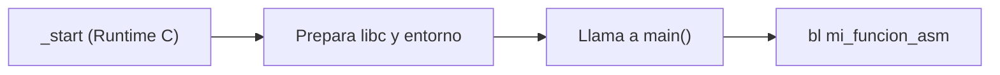

<style>
@import "../../../../styles/index.css";
</style>

<div class="ecys-cover-bg"></div>

<div class="ecys-title-cover">

<div class="muted">Escuela de Ingeniería de Ciencias y Sistemas</div>

# Arquitectura de Computadores y Ensambladores 1

</div>

---
layout: center
---

<div class="muted">Arquitectura de Computadores y Ensambladores 1</div>

## Unidad 15
## ABI, AAPCS64 e interoperabilidad con C

Calling convention formal para escribir assembly compatible con C, libc y el linker.

<div class="cover-note">
Unidad práctica: entender el contrato que permite que programas en C y Assembly trabajen juntos sin romperse mutuamente.
</div>

---

# Anuncios importantes

<div class="numbered-grid">
  <div class="numbered-card">
    <div class="card-number">1</div>
    <h3>Anuncio 1</h3>
    <p></p>
  </div>
</div>

---

# Agenda

<div class="numbered-grid">
  <div class="numbered-card">
    <div class="card-number">1</div>
    <h3>ABI vs ISA</h3>
    <p>Diferencia entre instrucciones válidas y convenciones correctas.</p>
  </div>

  <div class="numbered-card">
    <div class="card-number">2</div>
    <h3>AAPCS64</h3>
    <p>El estándar de llamadas a procedimientos de ARM64.</p>
  </div>

  <div class="numbered-card">
    <div class="card-number">3</div>
    <h3>Caller vs Callee saved</h3>
    <p>Responsabilidad compartida: ¿quién guarda qué registro?</p>
  </div>

  <div class="numbered-card">
    <div class="card-number">4</div>
    <h3>Integración con C y libc</h3>
    <p>Llamar a C desde Assembly, y viceversa.</p>
  </div>
</div>

---

# Competencias

<div class="concept-grid vertical-center">
  <div class="concept-card">
    <h3>Competencia 1</h3>
    <p>
      El estudiante desarrolla soluciones eficientes en sistemas computacionales
      integrando arquitectura de computadores, programación en bajo nivel y
      herramientas modernas de análisis y simulación para resolver problemas
      complejos en sistemas embebidos e IoT.
    </p>
  </div>

  <div class="concept-card">
    <h3>Competencia 2</h3>
    <p>
      Desarrolla programas mixtos (C y ensamblador) aplicando la Application Binary
      Interface (ABI) y el estándar AAPCS64 para garantizar la correcta interoperabilidad,
      el paso de argumentos y la preservación del estado de los registros.
    </p>
  </div>
</div>

---

# Valor de la semana

<div class="callout tip">
  <strong>Colaboración y Responsabilidad compartida.</strong>
  Respetar las convenciones comunes para que diferentes componentes puedan trabajar en equipo.
</div>

<div class="concept-grid">
  <div class="concept-card">
    <h3>Aplicación en clase</h3>
    <p>
      Una función en ensamblador puede hacer la suma matemática perfecta, pero si en el proceso
      destruye un registro que el programa en C necesitaba, la función entera es considerada <strong>mala</strong>.
      Trabajar con la ABI (Application Binary Interface) enseña que tu código no vive aislado;
      debe <strong>colaborar</strong> respetando el entorno del que lo llama (caller) y a los que llama (callee).
    </p>
  </div>
</div>

---

# Qué buscamos hoy

<div class="slide-center-block">

<div class="objective-grid">
  <div v-click class="objective-item">
    <div class="item-number">1</div>
    <h3>Identificar Roles de Registros</h3>
    <p>Entender que un registro no es solo un "lugar temporal", sino que tiene un propósito en la llamada.</p>
  </div>

  <div v-click class="objective-item">
    <div class="item-number">2</div>
    <h3>Preservar el Entorno</h3>
    <p>Aprender a restaurar los registros vitales que usamos dentro de nuestra función.</p>
  </div>

  <div v-click class="objective-item">
    <div class="item-number">3</div>
    <h3>Llamar Bibliotecas Reales</h3>
    <p>Comprender cómo usar herramientas como <code>printf</code> de <code>libc</code> en lugar de syscalls directas.</p>
  </div>

  <div v-click class="objective-item">
    <div class="item-number">4</div>
    <h3>Unir C y Assembly</h3>
    <p>Configurar el compilador GCC para enlazar archivos <code>.c</code> y <code>.s</code> en un solo ejecutable.</p>
  </div>
</div>

</div>

---
layout: section
---

# ABI, AAPCS64 y Mapa de Registros

La calling convention no agrega instrucciones: agrega reglas compartidas.

---

###### ISA vs ABI

<div class="slide-center-block">

<div class="content-stack-lg">

<div class="key-idea centered-narrow">
La <strong>ISA (Instruction Set Architecture)</strong> define qué instrucciones existen.
La <strong>ABI (Application Binary Interface)</strong> define cómo deben usarse para que distintos programas puedan colaborar correctamente.
</div>

<div class="compare-grid">
  <div v-click class="compare-card">
    <div class="card-kicker">ISA</div>
    <p>Describe instrucciones, registros, formatos y operaciones que el procesador entiende.</p>
  </div>

  <div v-click class="compare-card">
    <div class="card-kicker">ABI</div>
    <p>Define convenciones compartidas: argumentos, retorno, registros preservados, stack y llamadas entre funciones.</p>
  </div>
</div>

</div>

</div>

---

###### Por qué importa la ABI

<div class="slide-center-block">

<div class="content-stack-lg">

<div class="compare-grid">
  <div v-click class="compare-card">
    <div class="card-kicker">Sin seguir la ABI</div>
    <p>Puedes escribir una función que reciba el primer argumento en <code>x9</code> y devuelva el resultado en <code>x22</code>. El procesador puede ejecutarla.</p>
  </div>

  <div v-click class="compare-card">
    <div class="card-kicker">Con AAPCS64</div>
    <p>El código interoperable espera argumentos en <code>x0-x7</code> y resultados en <code>x0</code>. Así C y assembly pueden entenderse.</p>
  </div>
</div>

<div v-click class="callout warning centered-narrow">
Romper la ABI no produce un error de sintaxis. El programa puede compilar y aun así fallar en ejecución porque las piezas no comparten la misma convención.
</div>

</div>

</div>

---

###### Mapa simplificado de AAPCS64

<div class="slide-center-block">

<div class="content-stack-lg">

<div class="muted centered-narrow">¿Qué rol tiene cada registro según el estándar ARM64?</div>

| Rango | Rol inicial | ¿Qué significa en la práctica? |
|---|---|---|
| `x0` - `x7` | Argumentos y Retornos | Los datos entran por aquí, la respuesta sale por `x0`. |
| `x9` - `x15` | Temporales | Puedes usarlos libremente, pero pueden ser destruidos al llamar otra función. |
| `x19` - `x28` | **Callee-saved** | Si tu función los modifica, **DEBE** restaurarlos antes del `ret`. |
| `x29` | Frame Pointer (FP) | Apunta a la base del stack frame actual. |
| `x30` | Link Register (LR) | Guarda a dónde regresar. |

</div>

</div>

---
layout: section
---

# Caller-saved y Callee-saved

No basta con que el resultado sea correcto, el entorno debe quedar limpio.

---

###### Dos responsabilidades distintas

<div class="slide-center-block">

<div class="content-stack-lg">

<div class="compare-grid">
  <div v-click class="compare-card">
    <div class="card-kicker">Caller-saved (ej. x9-x15, x0-x7)</div>
    <ul>
      <li>Responsabilidad del <strong>Caller (quien llama)</strong>.</li>
      <li>Si yo necesito un valor importante en <code>x10</code>, sé que si llamo a <code>bl funcion_rara</code>, es probable que la función me lo sobrescriba.</li>
      <li><strong>Debo guardarlo en la pila ANTES del <code>bl</code>.</strong></li>
    </ul>
  </div>
  <div v-click class="compare-card">
    <div class="card-kicker">Callee-saved (ej. x19-x28)</div>
    <ul>
      <li>Responsabilidad del <strong>Callee (quien es llamado)</strong>.</li>
      <li>Si alguien me llama, ellos confían ciegamente en que yo no tocaré esos registros.</li>
      <li><strong>Si los uso, debo hacerles push en mi prólogo y pop en mi epílogo.</strong></li>
    </ul>
  </div>
</div>

</div>

</div>

---
layout: section
---

# Integración con C y libc

El programa no siempre empieza directo en `_start`.

---

###### main vs _start

<div class="slide-center-block">

<div class="content-stack-lg">

<div class="diagram-block">



</div>

<div class="concept-grid concept-grid-3 mt-4">
  <div v-click class="concept-card">
    <h3><code>_start</code></h3>
    <p>El punto de entrada real del SO. En programas puros lo escribíamos nosotros.</p>
  </div>
  <div v-click class="concept-card">
    <h3><code>libc</code></h3>
    <p>Con C, enlazamos el <em>C Runtime (CRT)</em>. Él define <code>_start</code>, inicializa la librería estándar y luego invoca <code>main</code>.</p>
  </div>
  <div v-click class="concept-card">
    <h3><code>printf</code> NO es syscall</h3>
    <p>No se usa <code>svc #0</code>. Se llama como una función normal: argumentos en <code>x0</code> (puntero a formato) y <code>x1</code>... y luego <code>bl printf</code>.</p>
  </div>
</div>

</div>

</div>

---

# Checklist mental

<div class="slide-center-block">

<div class="reveal-list centered-narrow">
  <div v-click class="reveal-item">Entiendo que AAPCS64 define el contrato de comunicación entre lenguajes.</div>
  <div v-click class="reveal-item">Sé que <code>x0-x7</code> son los parámetros que recibo desde C.</div>
  <div v-click class="reveal-item">Sé que si uso <code>x19-x28</code>, DEBO restaurarlos antes de salir.</div>
  <div v-click class="reveal-item">Comprendo la diferencia entre Callee-Saved (quien es llamado protege) y Caller-Saved (quien llama protege).</div>
  <div v-click class="reveal-item">Sé que <code>printf</code> es una función invocada con <code>bl</code>, no una interrupción del sistema <code>svc</code>.</div>
  <div v-click class="reveal-item">Sé usar <code>gcc</code> para compilar código C y Assembly juntos.</div>
</div>

</div>

---

# Siguiente paso

<div class="slide-center-block">

<div class="flow-column">
  <div v-click class="flow-step">ABI, C y Assembly</div>
  <div v-click class="flow-arrow">→</div>
  <div v-click class="flow-step">Compilación y Linker avanzado</div>
  <div v-click class="flow-arrow">→</div>
  <div v-click class="flow-step">Librerías estáticas y dinámicas</div>
</div>

</div>

---
layout: center
class: text-center
---

<div class="muted">Actividad de cierre</div>

# Preguntas de repaso

<div class="question-points mx-auto mt-6 max-w-2xl text-left">
  <div v-click>Si en C declaro <code>int sumar(int a, int b, int c)</code>, ¿En qué registros estarán <code>b</code> y <code>c</code> al entrar a Assembly?</div>
  <div v-click>¿Qué pasa si mi función en Assembly altera <code>x19</code> y no lo restaura, pero retorna el valor matemático correcto en <code>x0</code>?</div>
  <div v-click>¿Por qué <code>x30</code> (Link Register) debe guardarse en la pila si mi función llama a un <code>printf</code>?</div>
  <div v-click>Si C maneja su propio <code>_start</code>, ¿Cómo debo nombrar el punto de inicio principal de mi programa en C?</div>
</div>

---

###### Ejemplo Práctico

<div class="slide-center-block">

<div class="content-stack-lg">

<div class="key-idea centered-narrow">
  <div class="muted">C y Assembly colaborando</div>
  <p>Llamando desde C a una función en ensamblador que respeta la ABI y preserva <code>x19</code>.</p>
</div>

<div class="concept-grid">
  <div v-click class="concept-card">
    <h3>main.c</h3>

```c
#include <stdio.h>

// Prometemos que la función existe (y devuelve algo)
extern long asm_procesar(long a);

int main() {
    long result = asm_procesar(10);
    printf("Resultado: %ld\n", result);
    return 0;
}
```

  </div>

  <div v-click class="concept-card">
    <h3>asm_procesar.s</h3>

```asm
.global asm_procesar
.type asm_procesar, %function
asm_procesar:
    // x0 trae el "10"
    stp x29, x30, [sp, #-32]!  // Prólogo
    str x19, [sp, #16]         // Protegemos callee-saved

    mov x19, #5                // Usamos x19
    add x0, x0, x19            // x0 = 10 + 5 = 15

    ldr x19, [sp, #16]         // Restauramos callee-saved
    ldp x29, x30, [sp], #32    // Epílogo
    ret
```

  </div>
</div>

</div>

</div>

---

# Fuentes

- Página Quarto: `site/courses/aarch64/abi-aapcs64-c/`
- Arm, *Learn the Architecture - A64 Instruction Set Architecture Guide*
- Procedure Call Standard for the Arm 64-bit Architecture (AAPCS64)
- Slidev, documentación oficial

---
layout: statement
---

# Dudas¿?

---
layout: center
---

# Gracias por tu atención
