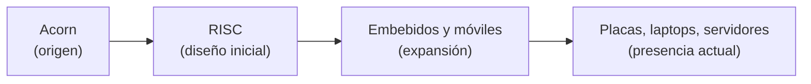
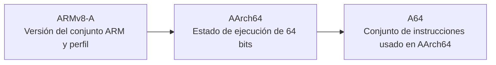
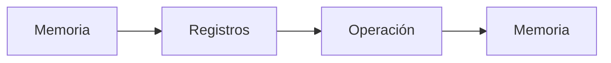
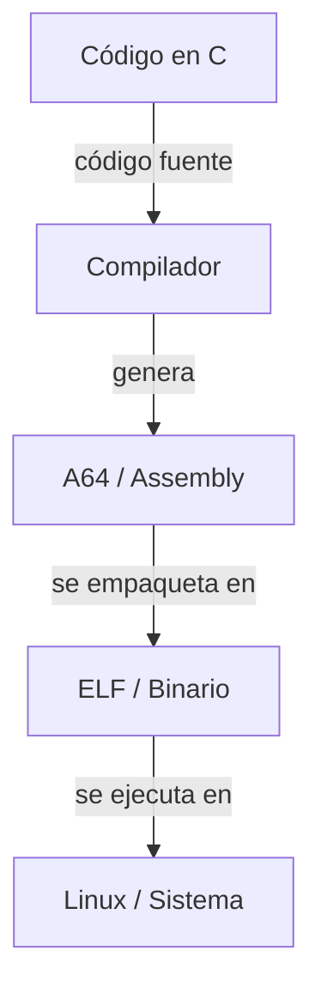

<style>
@import "../styles/index.css";
</style>

<div class="ecys-cover-bg"></div>

<div class="ecys-title-cover">

<div class="muted">Escuela de Ingeniería de Ciencias y Sistemas</div>

# Arquitectura de Computadores y Ensambladores 1

</div>

---
layout: center
---

<div class="muted">Arquitectura de Computadores y Ensambladores 1</div>

## Unidad 00
## Contexto, historia y objetivos

Antes de escribir instrucciones, hace falta entender qué estudiamos cuando
hablamos de ARM64 / AArch64 bajo Linux.

<div class="cover-note">
Unidad de apertura: vocabulario, mapa conceptual y razón de ser del curso.
</div>

---

# Anuncios importantes


<div class="numbered-grid">
  <div class="numbered-card">
    <div class="card-number">1</div>
    <h3>Anuncio 1</h3>
    <p></p>
  </div>
</div>

---

# Agenda

<div class="numbered-grid">
  <div class="numbered-card">
    <div class="card-number">1</div>
    <h3>Punto de agenda 1</h3>
    <p></p>
  </div>

</div>

---

# Competencias

<div class="concept-grid vertical-center">
  <div class="concept-card">
    <h3>Competencia 1</h3>
    <p>
      El estudiante desarrolla soluciones eficientes en sistemas computacionales
      integrando arquitectura de computadores, programación en bajo nivel y
      herramientas modernas de análisis y simulación para resolver problemas
      complejos en sistemas embebidos e IoT.
    </p>
  </div>

  <div class="concept-card">
    <h3>Competencia 2</h3>
    <p>
      Analiza el comportamiento de arquitecturas modernas, como ARM y RISC-V,
      utilizando simuladores como Gem5 y QEMU, registros e instrucciones para
      optimizar programas a bajo nivel en microprocesadores.
    </p>
  </div>
</div>

---

# Valor de la semana

<div class="callout tip">
  <strong>Curiosidad.</strong>
  Interés por comprender cómo funcionan los sistemas computacionales más allá
  de su uso superficial, explorando su estructura interna y comportamiento.
</div>

<div class="concept-grid">
  <div class="concept-card">
    <h3>Aplicación en clase</h3>
    <p>
      Permite al estudiante cuestionarse cómo interactúan el hardware y el
      software, motivándolo a comprender la arquitectura del computador como
      base para el aprendizaje del ensamblador.
    </p>
  </div>
</div>

---

# Qué buscamos hoy

<div class="slide-center-block">

<div class="objective-grid">
  <div v-click class="objective-item">
    <div class="item-number">1</div>
    <h3>Assembly en la ruta</h3>
    <p>Ubicar qué significa estudiar assembly en esta ruta.</p>
  </div>

  <div v-click class="objective-item">
    <div class="item-number">2</div>
    <h3>Nombres que se mezclan</h3>
    <p>Diferenciar términos que suelen aparecer juntos pero no significan lo mismo.</p>
  </div>

  <div v-click class="objective-item">
    <div class="item-number">3</div>
    <h3>Qué observaremos primero</h3>
    <p>Entender qué parte del sistema observaremos primero.</p>
  </div>

  <div v-click class="objective-item">
    <div class="item-number">4</div>
    <h3>Por qué AArch64</h3>
    <p>Ver por qué es una base clara para estudiar bajo nivel.</p>
  </div>
</div>

</div>

---
layout: section
---

# Assembly e ISA

Primero: lenguaje visible, contrato visible y punto de observación.

---
layout: center
class: text-center
---

<div class="big-question">
  <div class="muted">Pregunta de arranque</div>
  <h3>¿Qué estamos estudiando realmente cuando decimos "assembly ARM64"?</h3>
  <div class="question-points">
    <div v-click>No solo sintaxis.</div>
    <div v-click>No solo nombres de registros.</div>
    <div v-click>Relación entre programa, binario, Linux y procesador.</div>
  </div>
</div>

---
layout: statement
---

# Assembly es forma textual de hablar con arquitectura concreta

---

# Qué es assembly

<div class="slide-center-block">

<div class="content-stack-lg">

<div class="key-idea">
  <div class="muted">Idea central</div>
  <p>
    Assembly describe instrucciones cercanas al procesador con menos capas
    intermedias que C o Python.
  </p>
</div>

<div class="concept-grid">
  <div v-click class="concept-card">
    <h3>Cercano al hardware</h3>
    <p>Hace visibles registros, memoria y saltos.</p>
  </div>
  <div v-click class="concept-card">
    <h3>No es binario puro</h3>
    <p>Usa mnemónicos que luego transforma ensamblador.</p>
  </div>
  <div v-click class="concept-card">
    <h3>Sirve para observar</h3>
    <p>No solo para escribir programas completos.</p>
  </div>
</div>

</div>

</div>

---

# Assembly no es lenguaje de máquina

<div class="slide-center-block">

<div class="compare-grid">
  <div v-click class="compare-card">
    <div class="card-kicker">Assembly</div>
    <ul>
      <li>Usa <code>mov</code>, <code>add</code>, <code>ldr</code>.</li>
      <li>Lo escribe persona.</li>
      <li>Lo procesa ensamblador.</li>
    </ul>
  </div>
  <div v-click class="compare-card">
    <div class="card-kicker">Lenguaje de máquina</div>
    <ul>
      <li>Valores binarios reales.</li>
      <li>Lo ejecuta procesador.</li>
      <li>No suele leerse directo.</li>
    </ul>
  </div>
</div>

</div>

---

# Cada arquitectura tiene su propio assembly

<div class="slide-center-block">

<div class="content-stack-lg">

<div class="concept-grid">
  <div v-click class="concept-card">
    <h3>AArch64</h3>
    <p>Registros e instrucciones propios.</p>
  </div>
  <div v-click class="concept-card">
    <h3>x86-64</h3>
    <p>Sintaxis y convenciones distintas.</p>
  </div>
  <div v-click class="concept-card">
    <h3>RISC-V / MIPS</h3>
    <p>Cambian formatos y modelo visible.</p>
  </div>
</div>

<div v-click class="callout info centered-narrow">
Aprender assembly siempre implica aprender contexto de arquitectura.
</div>

</div>

</div>

---
layout: statement
---

# Aprender assembly no significa escribir todo en assembly

---

# Qué es una ISA

<div class="slide-center-block">

<div class="content-stack-lg">

<div class="key-idea centered-narrow">
  <div class="muted">Idea clave</div>
  <p>La ISA es el contrato visible entre software y hardware.</p>
</div>

<div class="reveal-list centered-narrow">
  <div v-click class="reveal-item">Define instrucciones disponibles.</div>
  <div v-click class="reveal-item">Define registros y formatos visibles.</div>
  <div v-click class="reveal-item">Define comportamiento observable que el programa puede asumir.</div>
</div>

</div>

</div>

---

# Pensar ISA como contrato

<div class="slide-center-block">

<div class="concept-grid">
  <div v-click class="concept-card">
    <h3>Reglas estables</h3>
    <p>El programa necesita reglas claras para poder confiar en ellas.</p>
  </div>
  <div v-click class="concept-card">
    <h3>Lo que asume software</h3>
    <p>La ISA dice qué puede asumir el software sobre hardware.</p>
  </div>
  <div v-click class="concept-card">
    <h3>Compatibilidad</h3>
    <p>Si el procesador respeta la ISA, el programa compatible puede correr.</p>
  </div>
  <div v-click class="concept-card">
    <h3>Implementación libre</h3>
    <p>La parte interna puede cambiar sin romper el contrato visible.</p>
  </div>
</div>

</div>

---

# ISA vs implementación

<div class="slide-center-block">

<div class="compare-grid">
  <div v-click class="compare-card">
    <div class="card-kicker">ISA</div>
    <ul>
      <li>Instrucciones.</li>
      <li>Registros.</li>
      <li>Formatos visibles.</li>
      <li>Comportamiento estable para programa.</li>
    </ul>
  </div>
  <div v-click class="compare-card">
    <div class="card-kicker">Implementación</div>
    <ul>
      <li>Pipeline.</li>
      <li>Cachés.</li>
      <li>Predicción de saltos.</li>
      <li>Ejecución fuera de orden e internals.</li>
    </ul>
  </div>
</div>

</div>

---

# Por qué empezamos por lado visible

<div class="slide-center-block">

<div class="content-stack-lg centered-narrow">

<div class="callout info">
Al inicio importa entender qué ve programa. Microarquitectura viene después.
</div>

<div class="reveal-list">
  <div v-click class="reveal-item">Sin mapa base, detalles de rendimiento meten ruido.</div>
  <div v-click class="reveal-item">Esta ruta empieza por reglas visibles.</div>
  <div v-click class="reveal-item">Luego conectaremos esas reglas con herramientas reales.</div>
</div>

</div>

</div>

---
layout: section
---

# Familia ARM

Qué es ARM, por qué importa y cómo se organizan nombres.

---

# Qué es ARM

<div class="slide-center-block">

<div class="concept-grid">
  <div v-click class="concept-card">
    <h3>Familia RISC</h3>
    <p>Modelo regular y extendido.</p>
  </div>
  <div v-click class="concept-card">
    <h3>Uso masivo</h3>
    <p>Teléfonos, embebidos, Raspberry Pi.</p>
  </div>
  <div v-click class="concept-card">
    <h3>También hoy</h3>
    <p>Laptops, servidores e IoT.</p>
  </div>
</div>

</div>

---

# Por qué ARM sirve para este curso

<div class="slide-center-block">

<div class="concept-grid">
  <div v-click class="concept-card">
    <h3>Actual</h3>
    <p>ISA vigente y documentada.</p>
  </div>
  <div v-click class="concept-card">
    <h3>Conecta capas</h3>
    <p>Arquitectura, compiladores, Linux y hardware.</p>
  </div>
  <div v-click class="concept-card">
    <h3>Buena base</h3>
    <p>Bajo nivel sin empezar por una ISA muy irregular.</p>
  </div>
  <div v-click class="concept-card">
    <h3>Cercana al estudiante</h3>
    <p>Aparece en plataformas conocidas.</p>
  </div>
</div>

</div>

---

# Contexto histórico breve

<div class="slide-center-block">

<div class="diagram-block">



<div class="diagram-caption">
La familia ARM pasó de un origen académico/comercial temprano a una presencia amplia en sistemas modernos.
</div>

</div>

</div>

---

# Qué es ARMv8-A

<div class="slide-center-block">

<div class="content-stack-lg">

<div class="key-idea centered-narrow">
  <p>ARMv8-A es versión y perfil de arquitectura, no todavía modo específico de ejecución.</p>
</div>

<div class="concept-grid">
  <div v-click class="concept-card">
    <h3>Perfil A</h3>
    <p>Sistemas de aplicación.</p>
  </div>
  <div v-click class="concept-card">
    <h3>Linux</h3>
    <p>Pensado para entornos capaces de correr Linux.</p>
  </div>
  <div v-click class="concept-card">
    <h3>32 y 64 bits</h3>
    <p>Puede describir ambos mundos dentro del mismo marco.</p>
  </div>
</div>

</div>

</div>

---

# Qué es AArch64

<div class="slide-center-block">

<div class="content-stack-lg">

<div class="key-idea centered-narrow">
  <p>AArch64 es estado de ejecución de 64 bits introducido con ARMv8-A.</p>
</div>

<div class="concept-grid">
  <div v-click class="concept-card">
    <h3>64 bits</h3>
    <p>Registros y reglas de ese estado.</p>
  </div>
  <div v-click class="concept-card">
    <h3>Centro del curso</h3>
    <p>Será foco principal de estudio.</p>
  </div>
  <div v-click class="concept-card">
    <h3>Linux moderno</h3>
    <p>Base práctica de ARM64 actual.</p>
  </div>
</div>

</div>

</div>

---

# Qué es A64

<div class="slide-center-block">

<div class="content-stack-lg">

<div class="key-idea centered-narrow">
  <p>A64 es conjunto de instrucciones usado cuando procesador ejecuta en AArch64.</p>
</div>

<div class="concept-grid">
  <div v-click class="concept-card">
    <h3>Lo que leemos</h3>
    <p>Es lo que escribimos y leemos en assembly AArch64.</p>
  </div>
  <div v-click class="concept-card">
    <h3>No es toda la arquitectura</h3>
    <p>No nombra por sí solo una arquitectura completa.</p>
  </div>
  <div v-click class="concept-card">
    <h3>No es el estado</h3>
    <p>Describe instrucciones, no el estado de ejecución.</p>
  </div>
</div>

</div>

</div>

---

# ARMv8-A, AArch64 y A64 no son lo mismo

<div class="slide-center-block">

<div class="diagram-block">



<div class="diagram-caption">
Perfil, estado de ejecución e instrucciones son niveles distintos del vocabulario ARM.
</div>

</div>

</div>

---
layout: fact
---

# Regla práctica

En esta ruta: ARM64 suele apuntar a contexto AArch64, pero nombre preciso cambia según hablemos de perfil, estado o instrucciones.

---

# ARM32 vs ARM64

<div class="slide-center-block">

<div class="compare-grid">
  <div v-click class="compare-card">
    <div class="card-kicker">ARM32</div>
    <ul>
      <li>Mundo de 32 bits.</li>
      <li>Suele vincularse con AArch32.</li>
      <li>Puede usar A32 o T32.</li>
    </ul>
  </div>
  <div v-click class="compare-card">
    <div class="card-kicker">ARM64</div>
    <ul>
      <li>Mundo de 64 bits.</li>
      <li>En práctica moderna: AArch64.</li>
      <li>Usa conjunto A64.</li>
    </ul>
  </div>
</div>

</div>

---

# AArch32 vs AArch64

<div class="slide-center-block">

<div class="content-stack-lg">

<div class="compare-grid">
  <div v-click class="compare-card">
    <div class="card-kicker">AArch32</div>
    <p>Estado de ejecución de 32 bits.</p>
  </div>
  <div v-click class="compare-card">
    <div class="card-kicker">AArch64</div>
    <p>Estado de ejecución de 64 bits.</p>
  </div>
</div>

<div v-click class="callout warning centered-narrow">
No cambia solo tamaño de dato. Cambian modelo visible, registros y conjunto de instrucciones.
</div>

</div>

</div>

---

# A32, T32 y A64

<div class="slide-center-block">

<div class="concept-grid">
  <div v-click class="concept-card">
    <h3>A32</h3>
    <p>Conjunto tradicional del mundo ARM de 32 bits.</p>
  </div>
  <div v-click class="concept-card">
    <h3>T32</h3>
    <p>Thumb / Thumb-2, también en mundo de 32 bits.</p>
  </div>
  <div v-click class="concept-card">
    <h3>A64</h3>
    <p>Conjunto usado en AArch64.</p>
  </div>
</div>

</div>

---

# Qué haremos con ARM32 en este curso

<div class="slide-center-block">

<div class="concept-grid">
  <div v-click class="concept-card">
    <h3>No será la ruta principal</h3>
    <p>Aparece solo como contraste breve o contexto histórico.</p>
  </div>

  <div v-click class="concept-card">
    <h3>Foco del curso</h3>
    <p>No mezclaremos Thumb, Cortex-M o ARM32 como centro. El foco queda en AArch64.</p>
  </div>
</div>

</div>

---
layout: section
---

# Modelo de arquitectura

RISC, CISC y por qué esa etiqueta importa solo hasta cierto punto.

---

# RISC vs CISC

<div class="slide-center-block">

<div class="compare-grid">
  <div v-click class="compare-card">
    <div class="card-kicker">RISC</div>
    <ul>
      <li>Más regularidad visible.</li>
      <li>Trabajo fuerte sobre registros.</li>
      <li>Load/store como idea central.</li>
    </ul>
  </div>
  <div v-click class="compare-card">
    <div class="card-kicker">CISC</div>
    <ul>
      <li>Más variedad histórica de instrucciones.</li>
      <li>Formatos y comportamientos menos uniformes.</li>
      <li>Sirve como contraste conceptual.</li>
    </ul>
  </div>
</div>

</div>

---

# Qué suele significar RISC aquí

<div class="slide-center-block">

<div class="concept-grid">
  <div v-click class="concept-card">
    <h3>Regularidad</h3>
    <p>Instrucciones relativamente regulares.</p>
  </div>
  <div v-click class="concept-card">
    <h3>Registros</h3>
    <p>Trabajo fuerte sobre registros.</p>
  </div>
  <div v-click class="concept-card">
    <h3>Load/store</h3>
    <p>Acceso a memoria concentrado en <code>load</code> y <code>store</code>.</p>
  </div>
  <div v-click class="concept-card">
    <h3>Modelo limpio</h3>
    <p>Buen punto de partida para estudiar paso a paso.</p>
  </div>
</div>

</div>

---

# Idea de load/store

<div class="slide-center-block">

<div class="diagram-block">



<div class="diagram-caption">
En un modelo load/store, las operaciones trabajan principalmente sobre registros.
</div>

</div>

<div v-click class="callout tip centered-narrow">
Primero cargas, luego operas, luego guardas.
</div>

</div>

---

# Cuidado con simplificación excesiva

<div class="slide-center-block">

<div class="content-stack-lg centered-narrow">

<div class="callout warning">
RISC no significa “automáticamente mejor”. Procesadores modernos mezclan muchas técnicas internas.
</div>

<div class="reveal-list">
  <div v-click class="reveal-item">Aquí etiqueta importa como orientación conceptual.</div>
  <div v-click class="reveal-item">No como juicio absoluto sobre arquitectura.</div>
</div>

</div>

</div>

---
layout: section
---

# Por qué importa hoy

Uso real, valor educativo y conexión con resto del curso.

---

# Dónde se usa ARM64

<div class="slide-center-block">

<div class="concept-grid">
  <div v-click class="concept-card">
    <h3>Teléfonos y tablets</h3>
    <p>Presencia masiva.</p>
  </div>
  <div v-click class="concept-card">
    <h3>Raspberry Pi y placas</h3>
    <p>Muy útil para laboratorio.</p>
  </div>
  <div v-click class="concept-card">
    <h3>Computadoras personales</h3>
    <p>Más visibles cada año.</p>
  </div>
  <div v-click class="concept-card">
    <h3>Servidores, IoT y embebidos</h3>
    <p>Más allá de móviles.</p>
  </div>
</div>

</div>

---

# Por qué eso vuelve útil a AArch64

<div class="slide-center-block">

<div class="reveal-list centered-narrow">
  <div v-click class="reveal-item">No estudiamos arquitectura obsoleta.</div>
  <div v-click class="reveal-item">Estudiamos ISA actual, relevante y visible.</div>
  <div v-click class="reveal-item">Conecta teoría con herramientas concretas.</div>
  <div v-click class="reveal-item">Hace que bajo nivel no se sienta separado del mundo real.</div>
</div>

</div>

---

# Por qué aprender assembly hoy

<div class="slide-center-block">

<div class="key-idea centered-narrow">
  <p>Assembly muestra punto de encuentro entre programa, compilador, sistema operativo y hardware.</p>
</div>

</div>

---

# Qué problemas te ayuda a entender

<div class="slide-center-block">

<div class="concept-grid">
  <div v-click class="concept-card">
    <h3>Compilador</h3>
    <p>Cómo traduce programa a instrucciones.</p>
  </div>

  <div v-click class="concept-card">
    <h3>Memoria</h3>
    <p>Punteros, stack y acceso a datos.</p>
  </div>

  <div v-click class="concept-card">
    <h3>ABI y binarios</h3>
    <p>Llamadas, argumentos y formato ejecutable.</p>
  </div>

  <div v-click class="concept-card">
    <h3>Depuración</h3>
    <p>Errores difíciles y código generado.</p>
  </div>
</div>

</div>

---

# No es solo para especialistas

<div class="slide-center-block">

<div class="content-stack-lg">

<div class="callout info centered-narrow">
No todos escribirán sistemas completos en assembly. Casi todos se benefician de entender qué pasa debajo.
</div>

<div class="concept-grid">
  <div v-click class="concept-card">
    <h3>Lectura de C</h3>
    <p>Mejora la lectura de código en C.</p>
  </div>
  <div v-click class="concept-card">
    <h3>Debugging</h3>
    <p>Mejora la depuración.</p>
  </div>
  <div v-click class="concept-card">
    <h3>Modelo mental</h3>
    <p>Mejora el modelo mental del sistema.</p>
  </div>
</div>

</div>

</div>

---

###### Relación con C, Linux y compiladores

<div class="diagram-block">



<div class="diagram-caption">
Assembly permite mirar esa frontera con precisión.
</div>

</div>

---

# Relación con hardware y sistemas

<div class="slide-center-block">

<div class="concept-grid">
  <div v-click class="concept-card">
    <h3>Registros</h3>
    <p>Estado inmediato del programa.</p>
  </div>
  <div v-click class="concept-card">
    <h3>Memoria</h3>
    <p>Datos, direcciones y stack.</p>
  </div>
  <div v-click class="concept-card">
    <h3>Binario</h3>
    <p>Cómo quedó codificado programa.</p>
  </div>
  <div v-click class="concept-card">
    <h3>Herramientas</h3>
    <p>Conectan software con comportamiento observable.</p>
  </div>
</div>

</div>

---

# Herramientas que aparecerán más adelante

<div class="slide-center-block">

<div class="tool-grid">
  <div v-click class="tool-card">
    <h3>Inspección</h3>
    <p><code>readelf</code></p>
    <p><code>objdump</code></p>
    <p><code>nm</code></p>
  </div>
  <div v-click class="tool-card">
    <h3>Ejecución</h3>
    <p><code>gdb</code></p>
    <p><code>strace</code></p>
    <p><code>qemu</code></p>
  </div>
</div>

</div>

---

# Ejemplo mínimo de contrato con Linux

<div class="lead-text">
Aunque aún no estudiemos syscalls en detalle, ya podemos leer intención básica.
</div>

```asm {1|2|3|4|5}
.global _start
_start:
    mov x0, #0
    mov x8, #93
    svc #0
```

<div class="concept-grid">
  <div v-click class="concept-card">
    <h3><code>x0</code></h3>
    <p>Código de salida.</p>
  </div>
  <div v-click class="concept-card">
    <h3><code>x8</code></h3>
    <p>Número de syscall.</p>
  </div>
  <div v-click class="concept-card">
    <h3><code>svc #0</code></h3>
    <p>Entrega control al kernel.</p>
  </div>
</div>

---

# Qué podrás hacer al avanzar

<div class="numbered-grid">
  <div v-click class="numbered-card">
    <div class="card-number">1</div>
    <h3>Leer</h3>
    <p>Programas AArch64 simples.</p>
  </div>

  <div v-click class="numbered-card">
    <div class="card-number">2</div>
    <h3>Escribir</h3>
    <p>Programas mínimos en Linux.</p>
  </div>

  <div v-click class="numbered-card">
    <div class="card-number">3</div>
    <h3>Observar</h3>
    <p>Registros, memoria y ejecución con <code>gdb</code>.</p>
  </div>

  <div v-click class="numbered-card">
    <div class="card-number">4</div>
    <h3>Inspeccionar</h3>
    <p>Binarios con <code>objdump</code> y <code>readelf</code>.</p>
  </div>

  <div v-click class="numbered-card">
    <div class="card-number">5</div>
    <h3>Entender</h3>
    <p>Stack, funciones y ABI.</p>
  </div>

  <div v-click class="numbered-card">
    <div class="card-number">6</div>
    <h3>Conectar</h3>
    <p>Compilador, sistema operativo y hardware.</p>
  </div>
</div>

---

# Checklist mental

<div class="slide-center-block">

<div class="reveal-list centered-narrow">
  <div v-click class="reveal-item">Puedo explicar qué es assembly.</div>
  <div v-click class="reveal-item">Puedo definir qué es una ISA.</div>
  <div v-click class="reveal-item">Puedo distinguir ISA de implementación.</div>
  <div v-click class="reveal-item">Puedo diferenciar ARMv8-A, AArch64 y A64.</div>
  <div v-click class="reveal-item">Puedo decir por qué esta ruta empieza con fundamentos.</div>
</div>

</div>

---

# Siguiente paso

<div class="slide-center-block">

<div class="flow-column">
  <div v-click class="flow-step">Entorno Linux ARM64</div>
  <div v-click class="flow-arrow">→</div>
  <div v-click class="flow-step">Toolchain</div>
  <div v-click class="flow-arrow">→</div>
  <div v-click class="flow-step">Primer binario</div>
  <div v-click class="flow-arrow">→</div>
  <div v-click class="flow-step">Inspección y debugging inicial</div>
</div>

</div>

---
layout: center
class: text-center
---

<div class="muted">Actividad de cierre</div>

# Preguntas de repaso

<div class="question-points mx-auto mt-6 max-w-2xl text-left">
  <div v-click>¿Qué contrato define una ISA?</div>
  <div v-click>¿Qué diferencia hay entre AArch64 y A64?</div>
  <div v-click>¿Por qué ARM64 es buena arquitectura educativa hoy?</div>
  <div v-click>¿Qué relación tiene assembly con C, Linux y compiladores?</div>
</div>

---

# Fuentes

- Página Quarto: `site/courses/aarch64/fundamentos/contexto-historia-objetivos.qmd`
- Arm, *Learn the Architecture - A-profile*
- Arm, *Armv8-A Instruction Set Architecture*
- Arm, *Arm Architecture Reference Manual Supplement: Armv8, for R-profile AArch64 architecture*
- Larry D. Pyeatt y William Ughetta, *ARM 64-Bit Assembly Language*
- Slidev, documentación oficial

---
layout: center
---

# Ejemplo Práctico

---
layout: statement
---

# Dudas¿?

---
layout: center
---

# Gracias por tu atención
