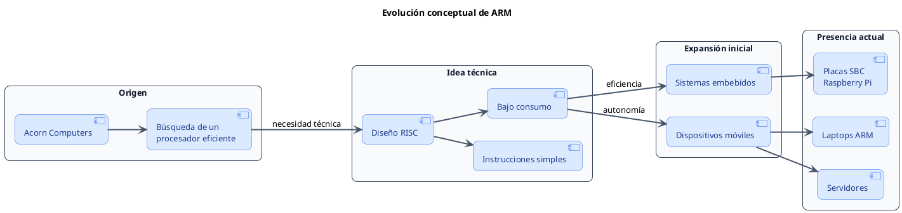
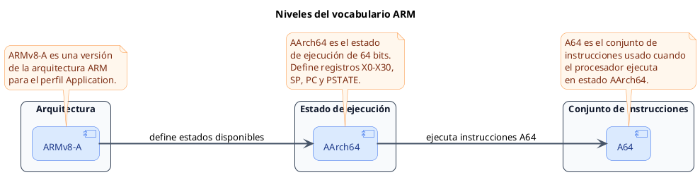
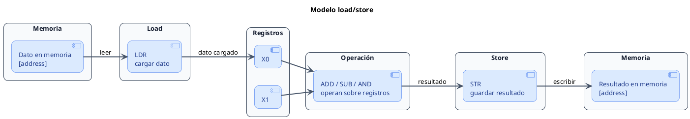

<CoverSlide
  title="Unidad 00 · Contexto, historia y objetivos"
  subtitle="Arquitectura de Computadores y Ensambladores 1"
  note="Escuela de Ingeniería de Ciencias y Sistemas"
/>

---
layout: aarch64-section
---

# Bienvenidos a la Unidad 00

Antes de escribir instrucciones, hace falta entender qué estudiamos

---

# Contexto, historia y objetivos

Unidad de apertura: vocabulario, mapa conceptual y razón de ser del curso.

### Agenda

<v-clicks>

1. **Assembly e ISA** — Lenguaje visible, contrato visible y punto de observación
2. **Familia ARM** — Qué es ARM, por qué importa y cómo se organizan nombres
3. **Modelo de arquitectura** — RISC, CISC y por qué esa etiqueta importa solo hasta cierto punto
4. **Por qué importa hoy** — Uso real, valor educativo y conexión con resto del curso

</v-clicks>

---

# Anuncios importantes

<InfoBox type="warning" title="Anuncios">

- **Anuncio 1** — Pendiente por definir

</InfoBox>

---

# Competencias del curso

<InfoBox type="info" title="Competencia 1">

El estudiante desarrolla soluciones eficientes en sistemas computacionales integrando arquitectura de computadores, programación en bajo nivel y herramientas modernas de análisis y simulación para resolver problemas complejos en sistemas embebidos e IoT.

</InfoBox>

<InfoBox type="info" title="Competencia 2">

Analiza el comportamiento de arquitecturas modernas, como ARM y RISC-V, utilizando simuladores como Gem5 y QEMU, registros e instrucciones para optimizar programas a bajo nivel en microprocesadores.

</InfoBox>

---

# Valor de la semana

<InfoBox type="note" title="Curiosidad">

Interés por comprender cómo funcionan los sistemas computacionales más allá de su uso superficial, explorando su estructura interna y comportamiento.

</InfoBox>

### Aplicación en clase

Permite al estudiante cuestionarse cómo interactúan el hardware y el software, motivándolo a comprender la arquitectura del computador como base para el aprendizaje del ensamblador.

---

# Qué buscamos hoy

<StepList :steps="[
  'Assembly en la ruta — Ubicar qué significa estudiar assembly en esta ruta',
  'Nombres que se mezclan — Diferenciar términos que suelen aparecer juntos pero no significan lo mismo',
  'Qué observaremos primero — Entender qué parte del sistema observaremos primero',
  'Por qué AArch64 — Ver por qué es una base clara para estudiar bajo nivel'
]" />

---
layout: aarch64-section
---

# Assembly e ISA

Lenguaje visible, contrato visible y punto de observación

---
layout: aarch64-question
---

## ¿Qué estamos estudiando realmente cuando decimos "assembly ARM64"?

<v-clicks>

- No solo sintaxis
- No solo nombres de registros
- Relación entre programa, binario, Linux y procesador

</v-clicks>

<Mascot emotion="pensando" />

---
layout: aarch64-statement
---

# Assembly es forma textual de hablar con arquitectura concreta

---

# Qué es assembly

<div class="mascot-row">

<div class="mascot-content">

Assembly describe instrucciones cercanas al procesador con menos capas intermedias que C o Python.

<v-clicks>

- **Cercano al hardware** — Hace visibles registros, memoria y saltos
- **No es binario puro** — Usa mnemónicos que luego transforma ensamblador
- **Sirve para observar** — No solo para escribir programas completos

</v-clicks>

</div>


</div>

---
layout: aarch64-two-cols
---

# Assembly vs Lenguaje de máquina

::left::

### Assembly

- Usa `mov`, `add`, `ldr`
- Lo escribe persona
- Lo procesa ensamblador

::right::

### Lenguaje de máquina

- Valores binarios reales
- Lo ejecuta procesador
- No suele leerse directo

<Mascot emotion="idea" />

---

# Cada arquitectura tiene su propio assembly

<v-clicks>

- **AArch64** — Registros e instrucciones propios
- **x86-64** — Sintaxis y convenciones distintas
- **RISC-V / MIPS** — Cambian formatos y modelo visible

</v-clicks>

<InfoBox type="note" title="Importante">

Aprender assembly siempre implica aprender contexto de arquitectura.

</InfoBox>

---
layout: aarch64-statement
---

# Aprender assembly no significa escribir todo en assembly

---

# Qué es una ISA

<div class="mascot-row">

<div class="mascot-content">

La ISA es el contrato visible entre software y hardware.

<v-clicks>

- Define instrucciones disponibles
- Define registros y formatos visibles
- Define comportamiento observable que el programa puede asumir

</v-clicks>

</div>


</div>

---

# Pensar ISA como contrato

<v-clicks>

- **Reglas estables** — El programa necesita reglas claras para poder confiar en ellas
- **Lo que asume software** — La ISA dice qué puede asumir el software sobre hardware
- **Compatibilidad** — Si el procesador respeta la ISA, el programa compatible puede correr
- **Implementación libre** — La parte interna puede cambiar sin romper el contrato visible

</v-clicks>

---
layout: aarch64-two-cols
---

# ISA vs Implementación

::left::

### ISA (contrato visible)

- Instrucciones
- Registros
- Formatos visibles
- Comportamiento estable para programa

::right::

### Implementación (interno)

- Pipeline
- Cachés
- Predicción de saltos
- Ejecución fuera de orden e internals

---

# Por qué empezamos por lado visible

Al inicio importa entender qué ve programa. Microarquitectura viene después.

<v-clicks>

- Sin mapa base, detalles de rendimiento meten ruido
- Esta ruta empieza por reglas visibles
- Luego conectaremos esas reglas con herramientas reales

</v-clicks>

---
layout: aarch64-section
---

# Familia ARM

Qué es ARM, por qué importa y cómo se organizan nombres

---

# Qué es ARM

<div class="mascot-row">

<div class="mascot-content">

<v-clicks>

- **Familia RISC** — Modelo regular y extendido
- **Uso masivo** — Teléfonos, embebidos, Raspberry Pi
- **También hoy** — Laptops, servidores e IoT

</v-clicks>

</div>


</div>

---

# Por qué ARM sirve para este curso

<v-clicks>

- **Actual** — ISA vigente y documentada
- **Conecta capas** — Arquitectura, compiladores, Linux y hardware
- **Buena base** — Bajo nivel sin empezar por una ISA muy irregular
- **Cercana al estudiante** — Aparece en plataformas conocidas

</v-clicks>

---

# Contexto histórico breve

<div v-click>



</div>

<div v-click class="mt-4 text-lg leading-relaxed">

La familia ARM no debe entenderse solo como una lista de procesadores, sino como una evolución:
nace en el contexto de **Acorn**, adopta principios **RISC** para lograr eficiencia, se consolida en
**sistemas embebidos y móviles**, y actualmente aparece también en **placas, laptops y servidores**.

</div>

---

# Qué es ARMv8-A

ARMv8-A es versión y perfil de arquitectura, no todavía modo específico de ejecución.

<v-clicks>

- **Perfil A** — Sistemas de aplicación
- **Linux** — Pensado para entornos capaces de correr Linux
- **32 y 64 bits** — Puede describir ambos mundos dentro del mismo marco

</v-clicks>

---

# Qué es AArch64

AArch64 es estado de ejecución de 64 bits introducido con ARMv8-A.

<v-clicks>

- **64 bits** — Registros y reglas de ese estado
- **Centro del curso** — Será foco principal de estudio
- **Linux moderno** — Base práctica de ARM64 actual

</v-clicks>

---

# Qué es A64

A64 es conjunto de instrucciones usado cuando procesador ejecuta en AArch64.

<v-clicks>

- **Lo que leemos** — Es lo que escribimos y leemos en assembly AArch64
- **No es toda la arquitectura** — No nombra por sí solo una arquitectura completa
- **No es el estado** — Describe instrucciones, no el estado de ejecución

</v-clicks>

---

# ARMv8-A, AArch64 y A64 no son lo mismo

<div v-click>



</div>

<div v-click class="mt-4 text-lg leading-relaxed">

**ARMv8-A**, **AArch64** y **A64** pertenecen a niveles distintos.
ARMv8-A describe la arquitectura y el perfil; AArch64 describe el modo o estado de ejecución de 64 bits;
A64 describe las instrucciones que se ejecutan dentro de ese estado.

</div>

<Mascot emotion="confundido" />

---
layout: aarch64-statement
---

# Regla práctica: ARM64 suele apuntar a AArch64, pero el nombre preciso cambia según hablemos de perfil, estado o instrucciones

---
layout: aarch64-two-cols
---

# ARM32 vs ARM64

::left::

### ARM32

- Mundo de 32 bits
- Suele vincularse con AArch32
- Puede usar A32 o T32

::right::

### ARM64

- Mundo de 64 bits
- En práctica moderna: AArch64
- Usa conjunto A64

---

# AArch32 vs AArch64

<ComparisonTable
  :headers="['Aspecto', 'AArch32', 'AArch64']"
  :rows="[
    ['Estado', 'Ejecución 32 bits', 'Ejecución 64 bits'],
    ['Conjunto', 'A32 / T32', 'A64'],
    ['Registros', 'Modelo 32 bits', 'Modelo 64 bits'],
    ['Instrucciones', 'Formatos 32 bits', 'Formatos 64 bits']
  ]"
/>

<InfoBox type="note" title="Nota">

No cambia solo tamaño de dato. Cambian modelo visible, registros y conjunto de instrucciones.

</InfoBox>

---

# A32, T32 y A64

<v-clicks>

- **A32** — Conjunto tradicional del mundo ARM de 32 bits
- **T32** — Thumb / Thumb-2, también en mundo de 32 bits
- **A64** — Conjunto usado en AArch64

</v-clicks>

---

# Qué haremos con ARM32 en este curso

<InfoBox type="warning" title="Foco del curso">

- **No será la ruta principal** — Aparece solo como contraste breve o contexto histórico
- **Foco del curso** — No mezclaremos Thumb, Cortex-M o ARM32 como centro. El foco queda en AArch64

</InfoBox>

---
layout: aarch64-section
---

# Modelo de arquitectura

RISC, CISC y por qué esa etiqueta importa solo hasta cierto punto

---
layout: aarch64-two-cols
---

# RISC vs CISC

::left::

### RISC

- Más regularidad visible
- Trabajo fuerte sobre registros
- Load/store como idea central

::right::

### CISC

- Más variedad histórica de instrucciones
- Formatos y comportamientos menos uniformes
- Sirve como contraste conceptual

---

# Qué suele significar RISC aquí

<v-clicks>

- **Regularidad** — Instrucciones relativamente regulares
- **Registros** — Trabajo fuerte sobre registros
- **Load/store** — Acceso a memoria concentrado en `load` y `store`
- **Modelo limpio** — Buen punto de partida para estudiar paso a paso

</v-clicks>

---

# Idea de load/store

<div v-click>



</div>

<div v-click class="mt-4 text-lg leading-relaxed">

En una arquitectura **load/store**, la memoria no se usa directamente en la mayoría de operaciones aritméticas o lógicas.
Primero se cargan los datos desde memoria hacia registros, luego la CPU opera sobre registros, y finalmente el resultado se guarda de vuelta en memoria.

</div>

<InfoBox v-click type="note" title="Secuencia">

Primero cargas con `LDR`, luego operas con instrucciones como `ADD`, `SUB` o `AND`, y finalmente guardas con `STR`.

</InfoBox>


---

# Cuidado con simplificación excesiva

RISC no significa "automáticamente mejor". Procesadores modernos mezclan muchas técnicas internas.

<v-clicks>

- Aquí etiqueta importa como orientación conceptual
- No como juicio absoluto sobre arquitectura

</v-clicks>

---
layout: aarch64-section
---

# Por qué importa hoy

Uso real, valor educativo y conexión con resto del curso

---

# Dónde se usa ARM64

<div class="mascot-row">

<div class="mascot-content">

<v-clicks>

- **Teléfonos y tablets** — Presencia masiva
- **Raspberry Pi y placas** — Muy útil para laboratorio
- **Computadoras personales** — Más visibles cada año
- **Servidores, IoT y embebidos** — Más allá de móviles

</v-clicks>

</div>


</div>

---

# Por qué eso vuelve útil a AArch64

<v-clicks>

- No estudiamos arquitectura obsoleta
- Estudiamos ISA actual, relevante y visible
- Conecta teoría con herramientas concretas
- Hace que bajo nivel no se sienta separado del mundo real

</v-clicks>

---
layout: aarch64-statement
---

# Assembly muestra el punto de encuentro entre programa, compilador, sistema operativo y hardware

---

# Qué problemas te ayuda a entender

<div class="mascot-row">

<div class="mascot-content">

<v-clicks>

- **Compilador** — Cómo traduce programa a instrucciones
- **Memoria** — Punteros, stack y acceso a datos
- **ABI y binarios** — Llamadas, argumentos y formato ejecutable
- **Depuración** — Errores difíciles y código generado

</v-clicks>

</div>


</div>

---

# No es solo para especialistas

No todos escribirán sistemas completos en assembly. Casi todos se benefician de entender qué pasa debajo.

<v-clicks>

- **Lectura de C** — Mejora la lectura de código en C
- **Debugging** — Mejora la depuración
- **Modelo mental** — Mejora el modelo mental del sistema

</v-clicks>

---

# Relación con C, Linux y compiladores

```plantuml
@startuml
title De C a ejecución en Linux

left to right direction

skinparam backgroundColor transparent
skinparam shadowing false
skinparam roundcorner 16
skinparam defaultFontName Arial
skinparam defaultFontSize 12

skinparam rectangle {
  BorderColor #334155
  BackgroundColor #f8fafc
  FontColor #0f172a
}

skinparam component {
  BorderColor #2563eb
  BackgroundColor #dbeafe
  FontColor #1e3a8a
}

skinparam database {
  BorderColor #7c3aed
  BackgroundColor #ede9fe
  FontColor #4c1d95
}

skinparam arrow {
  Color #475569
  Thickness 2
}

rectangle "Código fuente" as SRC {
  component "C\nmain.c" as C
}

rectangle "Traducción" as BUILD {
  component "Compilador\nGCC / Clang" as COMP
  component "A64 Assembly\n.s" as ASM
  component "Objeto\n.o" as OBJ
}

database "ELF\nbinario ejecutable" as ELF

rectangle "Linux" as OS {
  component "Loader" as LOADER
  component "Proceso" as PROC
  component "Syscalls" as SYSCALLS
}

C --> COMP : compila
COMP --> ASM : genera
ASM --> OBJ : ensambla
OBJ --> ELF : enlaza
ELF --> LOADER : carga
LOADER --> PROC : inicia
PROC --> SYSCALLS : solicita servicios

@enduml
```

<div v-click>



</div>

<div v-click class="mt-4 text-lg leading-relaxed">

Assembly permite observar la frontera entre el código generado por el compilador, el formato binario **ELF** y la interacción con **Linux** mediante **syscalls**.

</div>

---

# Relación con hardware y sistemas

<div class="mascot-row">

<div class="mascot-content">

<v-clicks>

- **Registros** — Estado inmediato del programa
- **Memoria** — Datos, direcciones y stack
- **Binario** — Cómo quedó codificado programa
- **Herramientas** — Conectan software con comportamiento observable

</v-clicks>

</div>


</div>

---
layout: aarch64-two-cols
---

# Herramientas que aparecerán más adelante

::left::

### Inspección

- `readelf`
- `objdump`
- `nm`

::right::

### Ejecución

- `gdb`
- `strace`
- `qemu`

---

# Ejemplo mínimo de contrato con Linux

Aunque aún no estudiemos syscalls en detalle, ya podemos leer intención básica.

<CodeAnnotation :annotations="[
  { num: '1', text: 'Punto de entrada del programa' },
  { num: '2', text: 'x0 = 0 → código de salida exitoso' },
  { num: '3', text: 'x8 = 93 → número de syscall exit' },
  { num: '4', text: 'svc #0 → entrega control al kernel' }
]">

```asm
.global _start
_start:
    mov x0, #0
    mov x8, #93
    svc #0
```

</CodeAnnotation>

<Mascot emotion="leyendo" />

---

# Qué podrás hacer al avanzar

<StepList :steps="[
  'Leer — Programas AArch64 simples',
  'Escribir — Programas mínimos en Linux',
  'Observar — Registros, memoria y ejecución con gdb',
  'Inspeccionar — Binarios con objdump y readelf',
  'Entender — Stack, funciones y ABI',
  'Conectar — Compilador, sistema operativo y hardware'
]" />

---
layout: aarch64-checklist
---

### Checklist mental

<div class="mascot-row">

<div class="mascot-content">

- <span class="check-icon">✓</span> Puedo explicar qué es assembly
- <span class="check-icon">✓</span> Puedo definir qué es una ISA
- <span class="check-icon">✓</span> Puedo distinguir ISA de implementación
- <span class="check-icon">✓</span> Puedo diferenciar ARMv8-A, AArch64 y A64
- <span class="check-icon">✓</span> Puedo decir por qué esta ruta empieza con fundamentos

</div>


</div>

---
layout: aarch64-statement
---

# Siguiente paso: Entorno Linux ARM64 → Toolchain → Primer binario → Inspección y debugging inicial

---
layout: aarch64-question
---

## Preguntas de repaso

<div class="mascot-row">

<div class="mascot-content">

<v-clicks>

- ¿Qué contrato define una ISA?
- ¿Qué diferencia hay entre AArch64 y A64?
- ¿Por qué ARM64 es buena arquitectura educativa hoy?
- ¿Qué relación tiene assembly con C, Linux y compiladores?

</v-clicks>

</div>


</div>

---

# Fuentes

- Página Quarto: `site/courses/aarch64/fundamentos/contexto-historia-objetivos.qmd`
- Arm, *Learn the Architecture - A-profile*
- Arm, *Armv8-A Instruction Set Architecture*
- Arm, *Arm Architecture Reference Manual Supplement: Armv8, for R-profile AArch64 architecture*
- Larry D. Pyeatt y William Ughetta, *ARM 64-Bit Assembly Language*
- Slidev, documentación oficial

---
layout: aarch64-statement
---

# ¿Dudas?

---

<CoverSlide
  title="Gracias por tu atención"
  subtitle="Arquitectura de Computadores y Ensambladores 1"
/>
