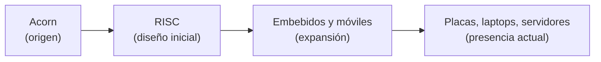
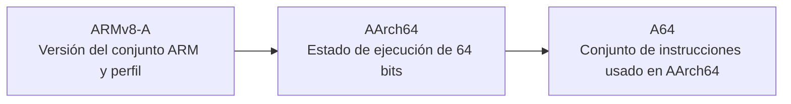
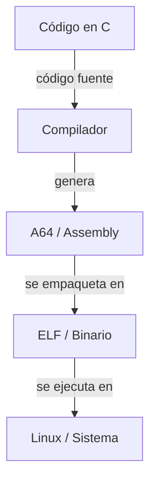

# Arquitectura de Computadores y Ensambladores 1

Escuela de Ingeniería de Ciencias y Sistemas

---
layout: center
---

Arquitectura de Computadores y Ensambladores 1

## Unidad 00
## Contexto, historia y objetivos

Antes de escribir instrucciones, hace falta entender qué estudiamos cuando hablamos de ARM64 / AArch64 bajo Linux.

Unidad de apertura: vocabulario, mapa conceptual y razón de ser del curso.

---

# Anuncios importantes

1. **Anuncio 1**

---

# Agenda

1. **Assembly e ISA** — Lenguaje visible, contrato visible y punto de observación.
2. **Familia ARM** — Qué es ARM, por qué importa y cómo se organizan nombres.
3. **Modelo de arquitectura** — RISC, CISC y por qué esa etiqueta importa solo hasta cierto punto.
4. **Por qué importa hoy** — Uso real, valor educativo y conexión con resto del curso.

---

# Competencias

### Competencia 1
El estudiante desarrolla soluciones eficientes en sistemas computacionales integrando arquitectura de computadores, programación en bajo nivel y herramientas modernas de análisis y simulación para resolver problemas complejos en sistemas embebidos e IoT.

### Competencia 2
Analiza el comportamiento de arquitecturas modernas, como ARM y RISC-V, utilizando simuladores como Gem5 y QEMU, registros e instrucciones para optimizar programas a bajo nivel en microprocesadores.

---

# Valor de la semana

**Curiosidad.** Interés por comprender cómo funcionan los sistemas computacionales más allá de su uso superficial, explorando su estructura interna y comportamiento.

### Aplicación en clase
Permite al estudiante cuestionarse cómo interactúan el hardware y el software, motivándolo a comprender la arquitectura del computador como base para el aprendizaje del ensamblador.

---

# Qué buscamos hoy

1. **Assembly en la ruta** — Ubicar qué significa estudiar assembly en esta ruta.
2. **Nombres que se mezclan** — Diferenciar términos que suelen aparecer juntos pero no significan lo mismo.
3. **Qué observaremos primero** — Entender qué parte del sistema observaremos primero.
4. **Por qué AArch64** — Ver por qué es una base clara para estudiar bajo nivel.

---
layout: section
---

# Assembly e ISA

Primero: lenguaje visible, contrato visible y punto de observación.

---
layout: center
class: text-center
---

### Pregunta de arranque

## ¿Qué estamos estudiando realmente cuando decimos "assembly ARM64"?

- No solo sintaxis.
- No solo nombres de registros.
- Relación entre programa, binario, Linux y procesador.

---
layout: statement
---

# Assembly es forma textual de hablar con arquitectura concreta

---

# Qué es assembly

Assembly describe instrucciones cercanas al procesador con menos capas intermedias que C o Python.

- **Cercano al hardware** — Hace visibles registros, memoria y saltos.
- **No es binario puro** — Usa mnemónicos que luego transforma ensamblador.
- **Sirve para observar** — No solo para escribir programas completos.

---

# Assembly no es lenguaje de máquina

**Assembly**
- Usa `mov`, `add`, `ldr`.
- Lo escribe persona.
- Lo procesa ensamblador.

**Lenguaje de máquina**
- Valores binarios reales.
- Lo ejecuta procesador.
- No suele leerse directo.

---

# Cada arquitectura tiene su propio assembly

- **AArch64** — Registros e instrucciones propios.
- **x86-64** — Sintaxis y convenciones distintas.
- **RISC-V / MIPS** — Cambian formatos y modelo visible.

> Aprender assembly siempre implica aprender contexto de arquitectura.

---
layout: statement
---

# Aprender assembly no significa escribir todo en assembly

---

# Qué es una ISA

La ISA es el contrato visible entre software y hardware.

- Define instrucciones disponibles.
- Define registros y formatos visibles.
- Define comportamiento observable que el programa puede asumir.

---

# Pensar ISA como contrato

- **Reglas estables** — El programa necesita reglas claras para poder confiar en ellas.
- **Lo que asume software** — La ISA dice qué puede asumir el software sobre hardware.
- **Compatibilidad** — Si el procesador respeta la ISA, el programa compatible puede correr.
- **Implementación libre** — La parte interna puede cambiar sin romper el contrato visible.

---

# ISA vs implementación

**ISA**
- Instrucciones.
- Registros.
- Formatos visibles.
- Comportamiento estable para programa.

**Implementación**
- Pipeline.
- Cachés.
- Predicción de saltos.
- Ejecución fuera de orden e internals.

---

# Por qué empezamos por lado visible

Al inicio importa entender qué ve programa. Microarquitectura viene después.

- Sin mapa base, detalles de rendimiento meten ruido.
- Esta ruta empieza por reglas visibles.
- Luego conectaremos esas reglas con herramientas reales.

---
layout: section
---

# Familia ARM

Qué es ARM, por qué importa y cómo se organizan nombres.

---

# Qué es ARM

- **Familia RISC** — Modelo regular y extendido.
- **Uso masivo** — Teléfonos, embebidos, Raspberry Pi.
- **También hoy** — Laptops, servidores e IoT.

---

# Por qué ARM sirve para este curso

- **Actual** — ISA vigente y documentada.
- **Conecta capas** — Arquitectura, compiladores, Linux y hardware.
- **Buena base** — Bajo nivel sin empezar por una ISA muy irregular.
- **Cercana al estudiante** — Aparece en plataformas conocidas.

---

# Contexto histórico breve



La familia ARM pasó de un origen académico/comercial temprano a una presencia amplia en sistemas modernos.

---

# Qué es ARMv8-A

ARMv8-A es versión y perfil de arquitectura, no todavía modo específico de ejecución.

- **Perfil A** — Sistemas de aplicación.
- **Linux** — Pensado para entornos capaces de correr Linux.
- **32 y 64 bits** — Puede describir ambos mundos dentro del mismo marco.

---

# Qué es AArch64

AArch64 es estado de ejecución de 64 bits introducido con ARMv8-A.

- **64 bits** — Registros y reglas de ese estado.
- **Centro del curso** — Será foco principal de estudio.
- **Linux moderno** — Base práctica de ARM64 actual.

---

# Qué es A64

A64 es conjunto de instrucciones usado cuando procesador ejecuta en AArch64.

- **Lo que leemos** — Es lo que escribimos y leemos en assembly AArch64.
- **No es toda la arquitectura** — No nombra por sí solo una arquitectura completa.
- **No es el estado** — Describe instrucciones, no el estado de ejecución.

---

# ARMv8-A, AArch64 y A64 no son lo mismo



Perfil, estado de ejecución e instrucciones son niveles distintos del vocabulario ARM.

---
layout: fact
---

# Regla práctica

En esta ruta: ARM64 suele apuntar a contexto AArch64, pero nombre preciso cambia según hablemos de perfil, estado o instrucciones.

---

# ARM32 vs ARM64

**ARM32**
- Mundo de 32 bits.
- Suele vincularse con AArch32.
- Puede usar A32 o T32.

**ARM64**
- Mundo de 64 bits.
- En práctica moderna: AArch64.
- Usa conjunto A64.

---

# AArch32 vs AArch64

- **AArch32** — Estado de ejecución de 32 bits.
- **AArch64** — Estado de ejecución de 64 bits.

> No cambia solo tamaño de dato. Cambian modelo visible, registros y conjunto de instrucciones.

---

# A32, T32 y A64

- **A32** — Conjunto tradicional del mundo ARM de 32 bits.
- **T32** — Thumb / Thumb-2, también en mundo de 32 bits.
- **A64** — Conjunto usado en AArch64.

---

# Qué haremos con ARM32 en este curso

- **No será la ruta principal** — Aparece solo como contraste breve o contexto histórico.
- **Foco del curso** — No mezclaremos Thumb, Cortex-M o ARM32 como centro. El foco queda en AArch64.

---
layout: section
---

# Modelo de arquitectura

RISC, CISC y por qué esa etiqueta importa solo hasta cierto punto.

---

# RISC vs CISC

**RISC**
- Más regularidad visible.
- Trabajo fuerte sobre registros.
- Load/store como idea central.

**CISC**
- Más variedad histórica de instrucciones.
- Formatos y comportamientos menos uniformes.
- Sirve como contraste conceptual.

---

# Qué suele significar RISC aquí

- **Regularidad** — Instrucciones relativamente regulares.
- **Registros** — Trabajo fuerte sobre registros.
- **Load/store** — Acceso a memoria concentrado en `load` y `store`.
- **Modelo limpio** — Buen punto de partida para estudiar paso a paso.

---

# Idea de load/store


En un modelo load/store, las operaciones trabajan principalmente sobre registros.

> Primero cargas, luego operas, luego guardas.

---

# Cuidado con simplificación excesiva

RISC no significa "automáticamente mejor". Procesadores modernos mezclan muchas técnicas internas.

- Aquí etiqueta importa como orientación conceptual.
- No como juicio absoluto sobre arquitectura.

---
layout: section
---

# Por qué importa hoy

Uso real, valor educativo y conexión con resto del curso.

---

# Dónde se usa ARM64

- **Teléfonos y tablets** — Presencia masiva.
- **Raspberry Pi y placas** — Muy útil para laboratorio.
- **Computadoras personales** — Más visibles cada año.
- **Servidores, IoT y embebidos** — Más allá de móviles.

---

# Por qué eso vuelve útil a AArch64

- No estudiamos arquitectura obsoleta.
- Estudiamos ISA actual, relevante y visible.
- Conecta teoría con herramientas concretas.
- Hace que bajo nivel no se sienta separado del mundo real.

---

# Por qué aprender assembly hoy

Assembly muestra punto de encuentro entre programa, compilador, sistema operativo y hardware.

---

# Qué problemas te ayuda a entender

- **Compilador** — Cómo traduce programa a instrucciones.
- **Memoria** — Punteros, stack y acceso a datos.
- **ABI y binarios** — Llamadas, argumentos y formato ejecutable.
- **Depuración** — Errores difíciles y código generado.

---

# No es solo para especialistas

No todos escribirán sistemas completos en assembly. Casi todos se benefician de entender qué pasa debajo.

- **Lectura de C** — Mejora la lectura de código en C.
- **Debugging** — Mejora la depuración.
- **Modelo mental** — Mejora el modelo mental del sistema.

---

# Relación con C, Linux y compiladores



Assembly permite mirar esa frontera con precisión.

---

# Relación con hardware y sistemas

- **Registros** — Estado inmediato del programa.
- **Memoria** — Datos, direcciones y stack.
- **Binario** — Cómo quedó codificado programa.
- **Herramientas** — Conectan software con comportamiento observable.

---

# Herramientas que aparecerán más adelante

**Inspección**
- `readelf`
- `objdump`
- `nm`

**Ejecución**
- `gdb`
- `strace`
- `qemu`

---

# Ejemplo mínimo de contrato con Linux

Aunque aún no estudiemos syscalls en detalle, ya podemos leer intención básica.

```asm {1|2|3|4|5}
.global _start
_start:
    mov x0, #0
    mov x8, #93
    svc #0
```

- **`x0`** — Código de salida.
- **`x8`** — Número de syscall.
- **`svc #0`** — Entrega control al kernel.

---

# Qué podrás hacer al avanzar

1. **Leer** — Programas AArch64 simples.
2. **Escribir** — Programas mínimos en Linux.
3. **Observar** — Registros, memoria y ejecución con `gdb`.
4. **Inspeccionar** — Binarios con `objdump` y `readelf`.
5. **Entender** — Stack, funciones y ABI.
6. **Conectar** — Compilador, sistema operativo y hardware.

---

# Checklist mental

- Puedo explicar qué es assembly.
- Puedo definir qué es una ISA.
- Puedo distinguir ISA de implementación.
- Puedo diferenciar ARMv8-A, AArch64 y A64.
- Puedo decir por qué esta ruta empieza con fundamentos.

---

# Siguiente paso

Entorno Linux ARM64 → Toolchain → Primer binario → Inspección y debugging inicial

---
layout: center
class: text-center
---

### Actividad de cierre

# Preguntas de repaso

- ¿Qué contrato define una ISA?
- ¿Qué diferencia hay entre AArch64 y A64?
- ¿Por qué ARM64 es buena arquitectura educativa hoy?
- ¿Qué relación tiene assembly con C, Linux y compiladores?

---

# Fuentes

- Página Quarto: `site/courses/aarch64/fundamentos/contexto-historia-objetivos.qmd`
- Arm, *Learn the Architecture - A-profile*
- Arm, *Armv8-A Instruction Set Architecture*
- Arm, *Arm Architecture Reference Manual Supplement: Armv8, for R-profile AArch64 architecture*
- Larry D. Pyeatt y William Ughetta, *ARM 64-Bit Assembly Language*
- Slidev, documentación oficial

---
layout: center
---

# Ejemplo Práctico

---
layout: statement
---

# Dudas¿?

---
layout: center
---

# Gracias por tu atención
