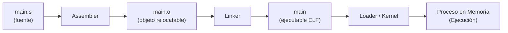
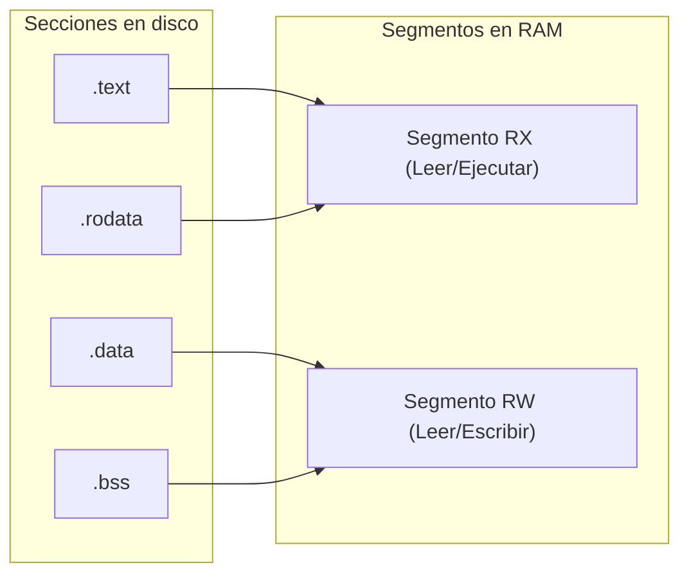

<style>
@import "../../../../styles/index.css";
</style>

<div class="ecys-cover-bg"></div>

<div class="ecys-title-cover">

<div class="muted">Escuela de Ingeniería de Ciencias y Sistemas</div>

# Arquitectura de Computadores y Ensambladores 1

</div>

---
layout: center
---

<div class="muted">Arquitectura de Computadores y Ensambladores 1</div>

## Unidad 16
## ELF, linking, loading y binarios

Entiende el binario como objeto técnico: fuente, objeto, ejecutable y proceso.

<div class="cover-note">
Unidad práctica: abrir la "caja negra" del binario y descubrir cómo interactúan el Assembler, Linker, Loader y Linux.
</div>

---

# Anuncios importantes

<div class="numbered-grid">
  <div class="numbered-card">
    <div class="card-number">1</div>
    <h3>Anuncio 1</h3>
    <p></p>
  </div>
</div>

---

# Agenda

<div class="numbered-grid">
  <div class="numbered-card">
    <div class="card-number">1</div>
    <h3>Flujo completo</h3>
    <p>El camino desde el archivo <code>.s</code> hasta el proceso en memoria.</p>
  </div>

  <div class="numbered-card">
    <div class="card-number">2</div>
    <h3>Secciones vs Segmentos</h3>
    <p>Diferencia entre organizar código (Linker) y cargar memoria (Loader).</p>
  </div>

  <div class="numbered-card">
    <div class="card-number">3</div>
    <h3>Símbolos y Relocations</h3>
    <p>Cómo conecta el linker las piezas separadas usando <code>nm</code>.</p>
  </div>

  <div class="numbered-card">
    <div class="card-number">4</div>
    <h3>Linking Dinámico</h3>
    <p>Entendiendo <code>libc</code>, GOT, PLT y PIE sin magia.</p>
  </div>
</div>

---

# Competencias

<div class="concept-grid vertical-center">
  <div class="concept-card">
    <h3>Competencia 1</h3>
    <p>
      El estudiante desarrolla soluciones eficientes en sistemas computacionales
      integrando arquitectura de computadores, programación en bajo nivel y
      herramientas modernas de análisis y simulación para resolver problemas
      complejos en sistemas embebidos e IoT.
    </p>
  </div>

  <div class="concept-card">
    <h3>Competencia 2</h3>
    <p>
      Inspecciona y comprende la estructura interna de los archivos ejecutables (ELF)
      aplicando herramientas de análisis binario (<code>readelf</code>, <code>objdump</code>, <code>nm</code>)
      para diagnosticar procesos de ensamblado, enlazado y carga en memoria.
    </p>
  </div>
</div>

---

# Valor de la semana

<div class="callout tip">
  <strong>Transparencia Técnica y Claridad.</strong>
  Desmitificar las cajas negras para dominar la herramienta desde su fundamento.
</div>

<div class="concept-grid">
  <div class="concept-card">
    <h3>Aplicación en clase</h3>
    <p>
      Un archivo ejecutable no cobra vida por arte de magia; tiene un <strong>contrato estructurado (ELF)</strong>.
      Entender que un bug de <em>"undefined reference"</em> no es culpa del procesador sino del Linker,
      o que un error de <em>"Segmentation fault"</em> lo lanza el Loader/SO,
      te da la <strong>claridad</strong> necesaria para no programar a ciegas.
    </p>
  </div>
</div>

---

# Qué buscamos hoy

<div class="slide-center-block">

<div class="objective-grid">
  <div v-click class="objective-item">
    <div class="item-number">1</div>
    <h3>Separar responsabilidades</h3>
    <p>Distinguir qué hace el Assembler (<code>.o</code>), el Linker (<code>ELF</code>) y el Loader/Kernel.</p>
  </div>

  <div v-click class="objective-item">
    <div class="item-number">2</div>
    <h3>Leer binarios</h3>
    <p>Aprender a usar <code>readelf</code> y <code>nm</code> para ver secciones y símbolos, no solo código.</p>
  </div>

  <div v-click class="objective-item">
    <div class="item-number">3</div>
    <h3>Distinguir Sección y Segmento</h3>
    <p>Entender por qué el Linker usa secciones (<code>.text</code>, <code>.data</code>) y el Loader usa segmentos (R, RX, RW).</p>
  </div>

  <div v-click class="objective-item">
    <div class="item-number">4</div>
    <h3>Llamadas Dinámicas</h3>
    <p>Visualizar conceptualmente cómo funciona <code>printf</code> usando la GOT y la PLT.</p>
  </div>
</div>

</div>

---
layout: section
---

# Flujo de ejecución completo

Un archivo en disco no ejecuta nada por sí mismo.

---

###### Del código fuente al proceso en memoria

<div class="slide-center-block">

<div class="content-stack-lg">

<div class="diagram-block">



</div>

<div class="concept-grid concept-grid-3 mt-4">
  <div v-click class="concept-card">
    <h3>Assembler</h3>
    <p>Traduce instrucciones locales y produce un objeto (pieza de lego). Aún no sabe dónde vivirá todo en memoria.</p>
  </div>
  <div v-click class="concept-card">
    <h3>Linker</h3>
    <p>Une todos los <code>.o</code>, resuelve direcciones cruzadas (símbolos) y empaqueta un Ejecutable con <em>Entry Point</em>.</p>
  </div>
  <div v-click class="concept-card">
    <h3>Loader</h3>
    <p>El SO lee el ELF, mapea los segmentos en RAM, asigna permisos y pasa el control al <code>_start</code>.</p>
  </div>
</div>

</div>

</div>

---
layout: section
---

# Secciones, Símbolos y Relocations

El trabajo de organizar y unir piezas sueltas.

---

###### Secciones: La organización del Linker

<div class="slide-center-block">

<div class="content-stack-lg">

<div class="key-idea centered-narrow">
Las <strong>Secciones</strong> organizan el contenido del archivo por "intención" y visibilidad. Las puede leer el compilador, linker y depurador.
</div>

<div class="compare-grid mt-4">
  <div v-click class="compare-card">
    <div class="card-kicker">Secciones Comunes (<code>readelf -S</code>)</div>
    <ul>
      <li><code>.text</code>: Instrucciones ejecutables.</li>
      <li><code>.rodata</code>: Datos de solo lectura (Strings).</li>
      <li><code>.data</code>: Variables inicializadas modificables.</li>
      <li><code>.bss</code>: Promesa de memoria en ceros (no ocupa todo ese espacio en disco).</li>
    </ul>
  </div>
  <div v-click class="compare-card">
    <div class="card-kicker">Símbolos (<code>nm</code>)</div>
    <ul>
      <li>Un símbolo es un nombre asociado a una dirección (<code>_start</code>, <code>msg</code>, <code>printf</code>).</li>
      <li><code>T</code> = en <code>.text</code></li>
      <li><code>D</code> = en <code>.data</code></li>
      <li><code>U</code> = Undefined (Aún no se sabe dónde está).</li>
    </ul>
  </div>
</div>

</div>

</div>

---

###### Relocations (Reubicaciones)

<div class="slide-center-block">

<div class="content-stack-lg">

<div class="key-idea centered-narrow">
Una <strong>Relocation</strong> es un "post-it" que deja el Assembler para el Linker: <br>
<em>"En esta línea dejé un espacio vacío, rellénalo con la dirección de <code>msg</code> cuando sepas dónde va a quedar"</em>.
</div>

<div class="concept-grid mt-4">
  <div v-click class="concept-card">
    <h3>En el archivo <code>.o</code></h3>
    <p>Si uso <code>adrp x0, msg</code> y <code>msg</code> está en otro archivo, el Assembler no puede resolverlo. Pone ceros y crea un registro de <em>relocation</em>.</p>
  </div>
  <div v-click class="concept-card">
    <h3>En el Linker</h3>
    <p>El Linker junta los <code>.o</code>, calcula las posiciones finales, y "parchea" todas las instrucciones que tenían post-its.</p>
  </div>
</div>

</div>

</div>

---
layout: section
---

# Secciones vs Segmentos

De la organización en disco al mapeo en RAM.

---

###### Diferencia vital: Linker vs Loader

<div class="slide-center-block">

<div class="content-stack-lg">

| Concepto | Uso principal | Lo ve principalmente | Comando |
|---|---|---|---|
| **Sección** | Organizar código y datos para construir. | Assembler, Linker, GDB | `readelf -S` |
| **Segmento** | Mapear bloques en memoria con permisos. | Kernel, Loader | `readelf -l` |

<div class="diagram-block mt-4">



<div class="diagram-caption">El Loader agrupa múltiples Secciones compatibles en un solo Segmento de memoria.</div>

</div>

</div>

</div>

---
layout: section
---

# Linking Dinámico

Llamando a `libc` sin saber dónde está.

---

###### GOT, PLT y PIE (Conceptos)

<div class="slide-center-block">

<div class="content-stack-lg">

<div class="key-idea centered-narrow">
Si usamos <strong>Librerías Compartidas (Dinámicas)</strong>, no sabemos la dirección de <code>printf</code> hasta que el programa se ejecuta y se carga <code>libc</code> en RAM.
</div>

<div class="concept-grid concept-grid-3 mt-4">
  <div v-click class="concept-card">
    <h3>PLT (Procedure Linkage)</h3>
    <p>Es un <strong>puente</strong>. Tu código llama a un <em>stub</em> llamado <code>printf@plt</code>. Ese puente redirige la llamada usando la GOT.</p>
  </div>
  <div v-click class="concept-card">
    <h3>GOT (Global Offset)</h3>
    <p>Es una <strong>tabla de punteros</strong>. El <em>Dynamic Loader</em> la llena en tiempo de ejecución con la dirección real de <code>printf</code> en la RAM.</p>
  </div>
  <div v-click class="concept-card">
    <h3>PIE (Position Independent)</h3>
    <p>Tu programa entero puede ser cargado en cualquier dirección base (ASLR). Por eso, todo debe usar saltos y cálculos <strong>relativos</strong>, no absolutos.</p>
  </div>
</div>

</div>

</div>

---

###### Checklist mental

<div class="slide-center-block">

<div class="reveal-list centered-narrow">
  <div v-click class="reveal-item">Puedo explicar el flujo completo: <code>.s</code> → <code>.o</code> → <code>ELF Executable</code> → Proceso.</div>
  <div v-click class="reveal-item">Puedo distinguir entre objeto <em>relocatable</em> (pieza) y ejecutable (final).</div>
  <div v-click class="reveal-item">Sé que <code>readelf -h</code> muestra la cabecera ELF y el <em>Entry Point</em>.</div>
  <div v-click class="reveal-item">Entiendo la diferencia entre Sección (para el Linker) y Segmento (para el Loader).</div>
  <div v-click class="reveal-item">Sé usar <code>nm</code> para ver los símbolos de mi programa y sé qué significa <code>U</code> (Undefined).</div>
  <div v-click class="reveal-item">Puedo explicar que <code>.bss</code> promete memoria que iniciará en ceros, sin inflar el disco.</div>
  <div v-click class="reveal-item">Entiendo el propósito de la PLT y GOT para no hardcodear la dirección de <code>libc</code>.</div>
</div>

</div>

---

# Siguiente paso

<div class="slide-center-block">

<div class="flow-column">
  <div v-click class="flow-step">Análisis del Binario ELF</div>
  <div v-click class="flow-arrow">→</div>
  <div v-click class="flow-step">Uso de herramientas (<code>readelf</code>, <code>objdump</code>)</div>
  <div v-click class="flow-arrow">→</div>
  <div v-click class="flow-step"><strong>Laboratorio:</strong> Integración y Reproducibilidad</div>
</div>

</div>

---
layout: center
class: text-center
---

<div class="muted">Actividad de cierre</div>

# Preguntas de repaso

<div class="question-points mx-auto mt-6 max-w-2xl text-left">
  <div v-click>¿Qué es un archivo <code>.o</code> (Relocatable) y por qué el Sistema Operativo rechaza ejecutarlo directamente?</div>
  <div v-click>Si un símbolo de tu código aparece marcado con la letra <code>U</code> en <code>nm</code>, ¿Qué problema tendrás al intentar hacer el <em>Linking</em>?</div>
  <div v-click>¿Por qué el <em>Loader</em> carga la sección <code>.text</code> y <code>.rodata</code> en un segmento que tiene permisos <code>RX</code> en lugar de <code>RW</code>?</div>
  <div v-click>¿Qué ventaja tiene que la sección <code>.bss</code> NO guarde todos sus "ceros" directamente dentro del archivo guardado en el disco duro?</div>
</div>

---

###### Ejemplo Práctico: Análisis Binario

<div class="slide-center-block">

<div class="content-stack-lg">

<div class="key-idea centered-narrow">
  <div class="muted">Manejando Herramientas</div>
  <p>El uso correcto de <code>readelf</code> y <code>objdump</code>.</p>
</div>

<div class="concept-grid">
  <div v-click class="concept-card">
    <h3>1. Ver el Entry Point y el Tipo</h3>
```bash
$ aarch64-linux-gnu-readelf -h main
ELF Header:
  Type:   EXEC (Executable file)
  Machine: AArch64
  Entry point address: 0x4000b0
```
  </div>

  <div v-click class="concept-card">
    <h3>2. Ver Segmentos que irán a RAM</h3>
```bash
$ aarch64-linux-gnu-readelf -l main
Program Headers:
  Type    Offset   VirtAddr   MemSiz  Flg
  LOAD    0x0000   0x400000   0x15c   R E (RX)
  LOAD    0x015c   0x41015c   0x008   RW  (RW)
```
  </div>
</div>

</div>

</div>

---

# Fuentes

- Página Quarto: `site/courses/aarch64/elf-linking-loading/`
- Toolchain GNU: `readelf`, `objdump`, `nm`
- Linux System API and Executable and Linkable Format (ELF) Standard
- Slidev, documentación oficial

---
layout: statement
---

# Dudas¿?

---
layout: center
---

# Gracias por tu atención
