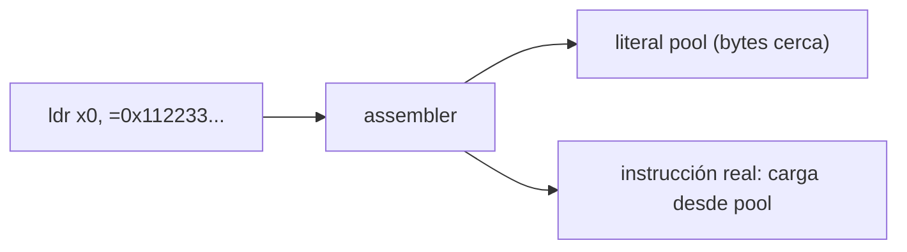
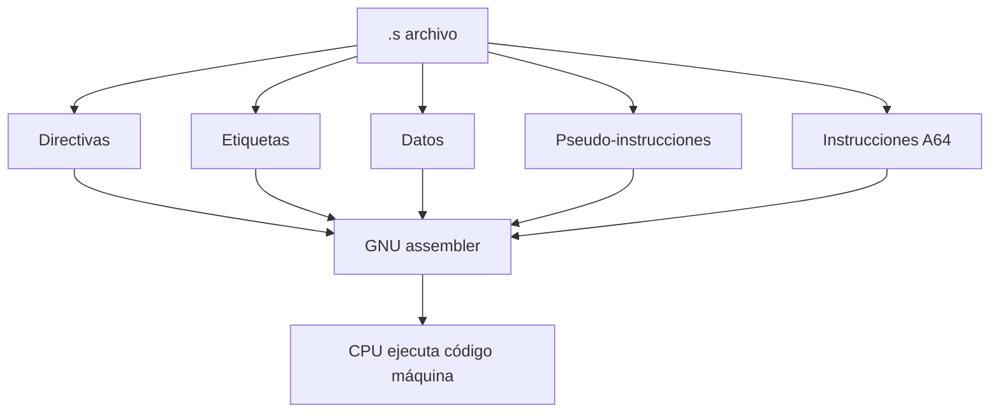

<style>
@import "../../../../styles/index.css";
</style>

<div class="ecys-cover-bg"></div>

<div class="ecys-title-cover">

<div class="muted">Escuela de Ingeniería de Ciencias y Sistemas</div>

# Arquitectura de Computadores y Ensambladores 1

</div>

---
layout: center
---

<div class="muted">Arquitectura de Computadores y Ensambladores 1</div>

## Unidad 04
## GNU Assembly, directivas y pseudo-instrucciones

No todo lo que aparece en un archivo `.s` llega al procesador como
instrucción A64. Separar capas es la clave.

<div class="cover-note">
Unidad práctica: archivo .s, secciones, directivas, datos, pseudo-instrucciones y lectura integrada.
</div>

---

# Anuncios importantes

<div class="numbered-grid">
  <div class="numbered-card">
    <div class="card-number">1</div>
    <h3>Anuncio 1</h3>
    <p></p>
  </div>
</div>

---

# Agenda

<div class="numbered-grid">
  <div class="numbered-card">
    <div class="card-number">1</div>
    <h3>Estructura de un archivo .s</h3>
    <p>Comentarios, etiquetas, símbolos y punto de entrada.</p>
  </div>

  <div class="numbered-card">
    <div class="card-number">2</div>
    <h3>Secciones y directivas</h3>
    <p><code>.text</code>, <code>.data</code>, <code>.rodata</code>, <code>.bss</code>, <code>.global</code>, <code>.equ</code>.</p>
  </div>

  <div class="numbered-card">
    <div class="card-number">3</div>
    <h3>Definición de datos</h3>
    <p><code>.byte</code>, <code>.word</code>, <code>.quad</code>, <code>.ascii</code>, <code>.asciz</code>, <code>.skip</code>.</p>
  </div>

  <div class="numbered-card">
    <div class="card-number">4</div>
    <h3>Pseudo-instrucciones y macros</h3>
    <p><code>ldr =symbol</code>, <code>adr</code>, <code>adrp + add</code>, <code>.include</code>, <code>.macro</code>.</p>
  </div>

  <div class="numbered-card">
    <div class="card-number">5</div>
    <h3>Lectura integrada</h3>
    <p>Clasificar un <code>.s</code> completo línea por línea.</p>
  </div>
</div>

---

# Competencias

<div class="concept-grid vertical-center">
  <div class="concept-card">
    <h3>Competencia 1</h3>
    <p>
      El estudiante desarrolla soluciones eficientes en sistemas computacionales
      integrando arquitectura de computadores, programación en bajo nivel y
      herramientas modernas de análisis y simulación para resolver problemas
      complejos en sistemas embebidos e IoT.
    </p>
  </div>

  <div class="concept-card">
    <h3>Competencia 2</h3>
    <p>
      Implementa sistemas embebidos orientados a IoT mediante el uso de
      Raspberry Pi, sensores digitales y comunicación con la nube para resolver
      problemas reales mediante automatización de procesos.
    </p>
  </div>
</div>

---

# Valor de la semana

<div class="callout tip">
  <strong>Aplicación.</strong>
  Capacidad de llevar teoría a la práctica.
</div>

<div class="concept-grid">
  <div class="concept-card">
    <h3>Aplicación en clase</h3>
    <p>
      Relacionar arquitectura con sistemas reales. Permite al estudiante
      conectar directivas, secciones y pseudo-instrucciones con el binario
      final que ejecuta el procesador.
    </p>
  </div>
</div>

---

# Qué buscamos hoy

<div class="slide-center-block">

<div class="objective-grid">
  <div v-click class="objective-item">
    <div class="item-number">1</div>
    <h3>Leer un archivo .s</h3>
    <p>Reconocer comentarios, etiquetas, directivas e instrucciones A64.</p>
  </div>

  <div v-click class="objective-item">
    <div class="item-number">2</div>
    <h3>Separar capas</h3>
    <p>Distinguir qué procesa el assembler y qué ejecuta el CPU.</p>
  </div>

  <div v-click class="objective-item">
    <div class="item-number">3</div>
    <h3>Declarar datos</h3>
    <p>Usar directivas para colocar bytes, words, strings y espacio reservado.</p>
  </div>

  <div v-click class="objective-item">
    <div class="item-number">4</div>
    <h3>Entender atajos</h3>
    <p>Saber que pseudo-instrucciones y macros se resuelven antes de ejecutar.</p>
  </div>
</div>

</div>

---
layout: section
---

# Estructura de un archivo .s

Comentarios, etiquetas, símbolos y punto de entrada.

---
layout: center
class: text-center
---

<div class="big-question">
  <div class="muted">Pregunta de arranque</div>
  <h3>¿Todo lo que escribes en un .s llega al procesador?</h3>
  <div class="question-points">
    <div v-click>Algunas líneas son para el assembler.</div>
    <div v-click>Otras nombran direcciones.</div>
    <div v-click>Solo las instrucciones A64 terminan como código máquina.</div>
  </div>
</div>

---

# Archivo mínimo

<div class="lead-text">
Un programa AArch64 con lo esencial: directivas, etiqueta e instrucciones.
</div>

```asm {1-2|4-5|7-9|11}
.global _start
.type _start, %function

.text
_start:
    mov x0, #0          // código de salida
    mov x8, #93         // syscall exit
    svc #0              // entrar al kernel

.size _start, . - _start
```

---

# Clasificar cada línea

<div class="slide-center-block">

<div class="concept-grid">
  <div v-click class="concept-card">
    <h3><code>.global _start</code></h3>
    <p>Directiva: hace visible el símbolo.</p>
  </div>
  <div v-click class="concept-card">
    <h3><code>.text</code></h3>
    <p>Directiva: cambia a sección de código.</p>
  </div>
  <div v-click class="concept-card">
    <h3><code>_start:</code></h3>
    <p>Etiqueta: nombra una dirección.</p>
  </div>
  <div v-click class="concept-card">
    <h3><code>mov x0, #0</code></h3>
    <p>Instrucción A64: el CPU la ejecuta.</p>
  </div>
  <div v-click class="concept-card">
    <h3><code>.size _start, . - _start</code></h3>
    <p>Directiva: calcula tamaño del símbolo.</p>
  </div>
</div>

</div>

---

# Etiquetas y símbolos

<div class="slide-center-block">

<div class="content-stack-lg">

<div class="key-idea centered-narrow">

Etiqueta = nombre de una dirección. No es una variable de alto nivel.

</div>

```asm
.equ SYS_exit, 93       // símbolo constante

_start:                  // símbolo de dirección
    mov x8, #SYS_exit   // el assembler resuelve el nombre
```

<div class="compare-grid">
  <div v-click class="compare-card">
    <div class="card-kicker">Etiqueta</div>
    <ul>
      <li>Termina con <code>:</code></li>
      <li>Nombra dirección de código o datos.</li>
    </ul>
  </div>
  <div v-click class="compare-card">
    <div class="card-kicker">Constante .equ</div>
    <ul>
      <li>Crea símbolo con valor fijo.</li>
      <li>Resuelta por el assembler.</li>
    </ul>
  </div>
</div>

</div>

</div>

---
layout: section
---

# Secciones

Dónde colocar código, datos y espacio reservado.

---

# Cuatro secciones principales

<div class="slide-center-block">

<div class="concept-grid">
  <div v-click class="concept-card">
    <h3><code>.text</code></h3>
    <p>Instrucciones. Código ejecutable.</p>
  </div>
  <div v-click class="concept-card">
    <h3><code>.data</code></h3>
    <p>Datos inicializados modificables.</p>
  </div>
  <div v-click class="concept-card">
    <h3><code>.rodata</code></h3>
    <p>Datos de solo lectura. Mensajes, tablas constantes.</p>
  </div>
  <div v-click class="concept-card">
    <h3><code>.bss</code></h3>
    <p>Espacio reservado. No escribe bytes en el archivo.</p>
  </div>
</div>

<div v-click class="callout info centered-narrow">
Las secciones no son decoración. Le dicen al assembler y al linker dónde va cada cosa.
</div>

</div>

---

# Ejemplo integrado de secciones

```asm {1-4|6-9|11-13|15-17}
.text
_start:
    mov x0, #0
    svc #0

.data
contador:
    .word 10

.section .rodata
mensaje:
    .asciz "Hola AArch64\n"

.bss
buffer:
    .skip 64
```

---
layout: section
---

# Directivas básicas

Instrucciones para el assembler, no para el CPU.

---

# Directivas de visibilidad y metadatos

<div class="slide-center-block">

<div class="concept-grid">
  <div v-click class="concept-card">
    <h3><code>.global</code></h3>
    <p>Hace visible un símbolo fuera del archivo objeto.</p>
  </div>
  <div v-click class="concept-card">
    <h3><code>.type</code></h3>
    <p>Marca tipo del símbolo para herramientas (<code>%function</code>).</p>
  </div>
  <div v-click class="concept-card">
    <h3><code>.size</code></h3>
    <p>Calcula tamaño: <code>. - _start</code> = distancia en bytes.</p>
  </div>
  <div v-click class="concept-card">
    <h3><code>.equ</code> / <code>.set</code></h3>
    <p>Nombres simbólicos. <code>.equ SYS_exit, 93</code></p>
  </div>
</div>

</div>

---

# Alineación

<div class="slide-center-block">

<div class="content-stack-lg">

```asm
.balign 4
numero:
    .word 10
```

<div class="concept-grid">
  <div v-click class="concept-card">
    <h3><code>.balign 4</code></h3>
    <p>Avanza posición hasta múltiplo de 4 bytes.</p>
  </div>
  <div v-click class="concept-card">
    <h3><code>.balign 8</code></h3>
    <p>Para doublewords de 8 bytes.</p>
  </div>
</div>

<div v-click class="callout tip centered-narrow">
Usaremos <code>.balign</code> porque el número expresa bytes directamente. Es más clara que <code>.align</code> para empezar.
</div>

</div>

</div>

---
layout: section
---

# Definición de datos

Bytes, words, strings y espacio reservado.

---

# Directivas de datos por tamaño

<div class="slide-center-block">

<div class="tool-grid">
  <div v-click class="tool-card">
    <h3>Enteros</h3>
    <p><code>.byte</code> — 1 byte</p>
    <p><code>.hword</code> — 2 bytes</p>
    <p><code>.word</code> — 4 bytes</p>
    <p><code>.quad</code> — 8 bytes</p>
  </div>
  <div v-click class="tool-card">
    <h3>Texto</h3>
    <p><code>.ascii</code> — sin terminador</p>
    <p><code>.asciz</code> — con byte cero</p>
  </div>
  <div v-click class="tool-card">
    <h3>Espacio</h3>
    <p><code>.skip N</code> — reserva N bytes</p>
    <p><code>.space N</code> — equivalente</p>
  </div>
</div>

</div>

---

# .ascii vs .asciz

<div class="slide-center-block">

<div class="compare-grid">
  <div v-click class="compare-card">
    <div class="card-kicker">.ascii "ABC"</div>
    <ul>
      <li>Bytes: <code>41 42 43</code></li>
      <li>Sin terminador automático.</li>
    </ul>
  </div>
  <div v-click class="compare-card">
    <div class="card-kicker">.asciz "ABC"</div>
    <ul>
      <li>Bytes: <code>41 42 43 00</code></li>
      <li>Agrega byte cero al final.</li>
    </ul>
  </div>
</div>

<div v-click class="callout warning centered-narrow">
No asumas que <code>.ascii</code> termina el string. Si necesitas byte cero, usa <code>.asciz</code>.
</div>

</div>

---
layout: section
---

# Pseudo-instrucciones y direcciones

Atajos que el assembler resuelve antes de ejecutar.

---

# Tres formas de obtener una dirección

<div class="slide-center-block">

<div class="concept-grid">
  <div v-click class="concept-card">
    <h3><code>adr x0, sym</code></h3>
    <p>Dirección cercana al PC. Instrucción real.</p>
  </div>
  <div v-click class="concept-card">
    <h3><code>adrp + add</code></h3>
    <p>Construye dirección por página y offset. Dos instrucciones reales.</p>
  </div>
  <div v-click class="concept-card">
    <h3><code>ldr x0, =sym</code></h3>
    <p>Pseudo-instrucción. El assembler elige la estrategia.</p>
  </div>
</div>

<div v-click class="callout warning centered-narrow">
<code>ldr x0, =mensaje</code> no carga contenido de memoria. Es un atajo para obtener un valor o dirección.
</div>

</div>

---

# Literal pools

<div class="slide-center-block">

<div class="content-stack-lg">

<div class="key-idea centered-narrow">

Algunas constantes no caben en una instrucción. El assembler coloca un literal cerca y genera una carga.

</div>

<div class="diagram-block">



<div class="diagram-caption">
El CPU ejecuta una instrucción de carga. El literal pool es trabajo previo del assembler.
</div>

</div>

</div>

</div>

---
layout: section
---

# Include y macros

Reutilizar sin esconder lo que el assembler hace.

---

# .include y .macro

<div class="slide-center-block">

<div class="compare-grid">
  <div v-click class="compare-card">
    <div class="card-kicker">.include</div>

```asm
// constantes.inc
.equ SYS_exit, 93
.equ EXIT_OK, 0
```

  </div>
  <div v-click class="compare-card">
    <div class="card-kicker">.macro</div>

```asm
.macro salir codigo
    mov x0, #\codigo
    mov x8, #93
    svc #0
.endm
```

  </div>
</div>

<div v-click class="callout info centered-narrow">
Una macro se expande durante ensamblado. No hay llamada, retorno ni stack frame. No es función.
</div>

</div>

---
layout: section
---

# Lectura integrada

Clasificar un archivo .s completo línea por línea.

---

# Archivo completo

```asm {1-4|6-7|9-10|11-15|17-19|21-24}
.equ SYS_write, 64
.equ SYS_exit, 93
.equ STDOUT, 1
.equ EXIT_OK, 0

.global _start
.type _start, %function

.text
_start:
    mov x0, #STDOUT
    ldr x1, =mensaje
    mov x2, #mensaje_len
    mov x8, #SYS_write
    svc #0

    mov x0, #EXIT_OK
    mov x8, #SYS_exit
    svc #0

.section .rodata
mensaje:
    .ascii "Hola GNU Assembly\n"
mensaje_len = . - mensaje
```

---

# Qué ejecuta el CPU vs qué procesa el assembler

<div class="slide-center-block">

<div class="diagram-block">



<div class="diagram-caption">
El assembler procesa todo. Solo las instrucciones A64 terminan como código que ejecuta el procesador.
</div>

</div>

</div>

---

# Checklist mental

<div class="slide-center-block">

<div class="reveal-list centered-narrow">
  <div v-click class="reveal-item">Puedo distinguir directiva de instrucción A64.</div>
  <div v-click class="reveal-item">Puedo reconocer etiquetas y símbolos.</div>
  <div v-click class="reveal-item">Puedo explicar <code>.text</code>, <code>.data</code>, <code>.rodata</code> y <code>.bss</code>.</div>
  <div v-click class="reveal-item">Puedo declarar datos con <code>.byte</code>, <code>.word</code>, <code>.ascii</code>, <code>.asciz</code>.</div>
  <div v-click class="reveal-item">Puedo explicar por qué <code>ldr x0, =symbol</code> es pseudo-instrucción.</div>
  <div v-click class="reveal-item">Puedo leer un <code>.s</code> completo y clasificar cada línea.</div>
</div>

</div>

---

# Siguiente paso

<div class="slide-center-block">

<div class="flow-column">
  <div v-click class="flow-step">Archivo .s leído y clasificado</div>
  <div v-click class="flow-arrow">→</div>
  <div v-click class="flow-step">Secciones y directivas dominadas</div>
  <div v-click class="flow-arrow">→</div>
  <div v-click class="flow-step">Datos declarados y pseudo-instrucciones claras</div>
  <div v-click class="flow-arrow">→</div>
  <div v-click class="flow-step">Registros, instrucciones y modelo de ejecución</div>
</div>

</div>

---
layout: center
class: text-center
---

<div class="muted">Actividad de cierre</div>

# Preguntas de repaso

<div class="question-points mx-auto mt-6 max-w-2xl text-left">
  <div v-click>¿Qué diferencia hay entre directiva e instrucción A64?</div>
  <div v-click>¿Para qué sirve <code>.global _start</code>?</div>
  <div v-click>¿Qué diferencia hay entre <code>.ascii</code> y <code>.asciz</code>?</div>
  <div v-click>¿Por qué <code>ldr x0, =symbol</code> puede no ser una instrucción real única?</div>
  <div v-click>¿Qué sección usarías para un buffer de 64 bytes?</div>
</div>

---

###### Ejemplo Práctico

<div class="slide-center-block">

<div class="content-stack-lg">

<div class="key-idea centered-narrow">
  <div class="muted">Actividad guiada</div>
  <p>Ensamblar, inspeccionar y clasificar líneas de un archivo .s real.</p>
</div>

<div class="concept-grid concept-grid-4">
  <div v-click class="concept-card">
    <h3>Ensamblar</h3>
    <p><code>aarch64-linux-gnu-as main.s -o main.o</code></p>
  </div>

  <div v-click class="concept-card">
    <h3>Enlazar</h3>
    <p><code>aarch64-linux-gnu-ld main.o -o main</code></p>
  </div>

  <div v-click class="concept-card">
    <h3>Inspeccionar</h3>
    <p><code>objdump -d main</code> y <code>objdump -s -j .rodata main</code></p>
  </div>

  <div v-click class="concept-card">
    <h3>Clasificar</h3>
    <p>Marcar directivas, etiquetas, datos e instrucciones.</p>
  </div>
</div>

</div>

</div>

---

# Fuentes

- Página Quarto: `site/courses/aarch64/gnu-assembly/`
- Larry D. Pyeatt y William Ughetta, *ARM 64-Bit Assembly Language*
- Arm, *Learn the Architecture - A64 Instruction Set Architecture Guide*
- William Hohl y Christopher Hinds, *ARM Assembly Language: Fundamentals and Techniques*
- `man as`, `info as` — GNU assembler
- Slidev, documentación oficial

---
layout: statement
---

# Dudas¿?

---
layout: center
---

# Gracias por tu atención
