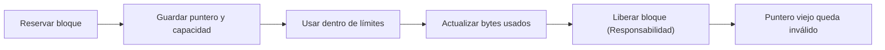

<style>
@import "../../../../styles/index.css";
</style>

<div class="ecys-cover-bg"></div>

<div class="ecys-title-cover">

<div class="muted">Escuela de Ingeniería de Ciencias y Sistemas</div>

# Arquitectura de Computadores y Ensambladores 1

</div>

---
layout: center
---

<div class="muted">Arquitectura de Computadores y Ensambladores 1</div>

## Unidad 12
## Heap y memoria dinámica

Vida útil, ownership, bloques dinámicos y errores de memoria.

<div class="cover-note">
Unidad teórica y práctica: stack vs heap, leaks, use-after-free y preparación para mmap.
</div>

---

# Anuncios importantes

<div class="numbered-grid">
  <div class="numbered-card">
    <div class="card-number">1</div>
    <h3>Anuncio 1</h3>
    <p></p>
  </div>
</div>

---

# Agenda

<div class="numbered-grid">
  <div class="numbered-card">
    <div class="card-number">1</div>
    <h3>Stack vs Heap</h3>
    <p>Diferencias en vida útil (lifetime) y por qué <code>.bss</code> no siempre alcanza.</p>
  </div>

  <div class="numbered-card">
    <div class="card-number">2</div>
    <h3>Bloques y Ownership</h3>
    <p>Dirección, capacidad, uso y la responsabilidad de liberar.</p>
  </div>

  <div class="numbered-card">
    <div class="card-number">3</div>
    <h3>Errores críticos</h3>
    <p>Memory leaks, use-after-free y double free.</p>
  </div>

  <div class="numbered-card">
    <div class="card-number">4</div>
    <h3>De brk a mmap</h3>
    <p>Diferenciar CPU, kernel y bibliotecas (<code>malloc</code>/<code>free</code>).</p>
  </div>
</div>

---

# Competencias

<div class="concept-grid vertical-center">
  <div class="concept-card">
    <h3>Competencia 1</h3>
    <p>
      El estudiante desarrolla soluciones eficientes en sistemas computacionales
      integrando arquitectura de computadores, programación en bajo nivel y
      herramientas modernas de análisis y simulación para resolver problemas
      complejos en sistemas embebidos e IoT.
    </p>
  </div>

  <div class="concept-card">
    <h3>Competencia 2</h3>
    <p>
      Administra la asignación y liberación de memoria dinámica a bajo nivel, 
      previniendo vulnerabilidades y fallos críticos (leaks, double free) 
      para garantizar la estabilidad e integridad de los sistemas.
    </p>
  </div>
</div>

---

# Valor de la semana

<div class="callout tip">
  <strong>Responsabilidad (Ownership).</strong>
  Hacerse cargo del ciclo de vida completo de los recursos que uno solicita y utiliza.
</div>

<div class="concept-grid">
  <div class="concept-card">
    <h3>Aplicación en clase</h3>
    <p>
      En programación de bajo nivel, no hay un recolector de basura (Garbage Collector) 
      que limpie nuestros errores. Si pides memoria dinámica, tú eres el dueño (owner) 
      y tienes la responsabilidad estricta de liberarla cuando termine su vida útil.
    </p>
  </div>
</div>

---

# Qué buscamos hoy

<div class="slide-center-block">

<div class="objective-grid">
  <div v-click class="objective-item">
    <div class="item-number">1</div>
    <h3>Diferenciar memorias</h3>
    <p>Reconocer cuándo usar Stack, Heap o <code>.bss</code> según la vida útil.</p>
  </div>

  <div v-click class="objective-item">
    <div class="item-number">2</div>
    <h3>Entender Ownership</h3>
    <p>Separar el concepto de <em>puntero</em> del concepto de <em>dueño</em> del bloque.</p>
  </div>

  <div v-click class="objective-item">
    <div class="item-number">3</div>
    <h3>Reconocer Fallos</h3>
    <p>Identificar qué causa leaks y use-after-free a nivel de diseño.</p>
  </div>

  <div v-click class="objective-item">
    <div class="item-number">4</div>
    <h3>Preparar el terreno</h3>
    <p>Distinguir entre instrucciones de A64, funciones (<code>malloc</code>) y syscalls (<code>mmap</code>).</p>
  </div>
</div>

</div>

---
layout: section
---

# Stack vs Heap

No toda memoria vive lo mismo ni se administra igual.

---

###### Tres vidas distintas

<div class="slide-center-block">

<div class="content-stack-lg">

<div class="lead-block">
La dirección indica dónde está un dato. <strong>La vida útil indica hasta cuándo tiene sentido usarlo.</strong>
</div>

| Región | Cuándo nace | Cuándo deja de servir |
|---|---|---|
| `.data` / `.bss` | Al cargar el proceso | Al terminar el proceso |
| Stack | Al entrar a función o reservar | Al liberar frame o restaurar `sp` |
| Heap | Cuando el programa pide memoria | Cuando el programa la libera |

<div v-click class="callout warning centered-narrow">
El error aparece cuando una dirección se sigue usando <strong>después de que su vida útil terminó</strong>.
</div>

</div>

</div>

---

###### ¿Por qué no basta .bss o Stack?

<div class="slide-center-block">

<div class="two-column-layout">

<div class="content-stack-md">

<div class="muted centered-narrow">Límites del <code>.bss</code></div>

```asm
.bss
buffer:
    .skip 64
```

<p>
Si el tamaño depende de una entrada (e.g., leer un archivo de tamaño desconocido), 
fijar un número desperdicia memoria o se queda corto.
</p>

</div>

<div class="content-stack-md">

<div class="muted centered-narrow">Límites del Stack</div>

```bash
funcion crea local en stack
  ptr = dirección del local
funcion retorna
  sp se restaura
```

<p>
Si devuelves la dirección de una variable local y la función retorna, ese <code>ptr</code> ya es inválido. <strong>El frame se destruyó.</strong>
</p>

</div>

</div>

<div v-click class="key-idea centered-narrow mt-6">
<strong>El Heap sirve para datos cuya vida no encaja con una sola llamada o cuyo tamaño se decide al ejecutar.</strong>
</div>

</div>

---
layout: section
---

# Bloques y Ownership

Un bloque dinámico necesita puntero, capacidad, uso y dueño.

---

###### Anatomía de un bloque dinámico

<div class="slide-center-block">

<div class="content-stack-lg">

<div class="diagram-block">



</div>

<div class="concept-grid concept-grid-4">
  <div v-click class="concept-card">
    <h3>Puntero</h3>
    <p>Dirección inicial en memoria. Copiar el puntero NO copia el bloque.</p>
  </div>
  <div v-click class="concept-card">
    <h3>Capacidad</h3>
    <p>Cantidad total de bytes reservados. Límite máximo.</p>
  </div>
  <div v-click class="concept-card">
    <h3>Usados</h3>
    <p>Cantidad de bytes que contienen <strong>datos válidos</strong> actualmente.</p>
  </div>
  <div v-click class="concept-card">
    <h3>Dueño (Owner)</h3>
    <p>Módulo responsable de asegurar que el bloque se libere.</p>
  </div>
</div>

</div>

</div>

---

###### Ownership y Transferencia

<div class="slide-center-block">

<div class="content-stack-lg">

<div class="lead-block">
Puntero NO equivale a ownership. Puedes tener una copia de la dirección (préstamo) sin ser responsable de liberar el bloque.
</div>

<div class="compare-grid">
  <div v-click class="compare-card">
    <div class="card-kicker">Préstamo (Borrow)</div>
    <ul>
      <li>Función A llama a Función B pasándole el puntero.</li>
      <li>B lee o escribe, pero <strong>no libera</strong>.</li>
      <li>A sigue siendo el dueño.</li>
    </ul>
  </div>
  <div v-click class="compare-card">
    <div class="card-kicker">Transferencia (Move)</div>
    <ul>
      <li>A entrega el ownership a B.</li>
      <li>B ahora es el responsable de liberar.</li>
      <li>A ya no debe intentar liberar ese bloque.</li>
    </ul>
  </div>
</div>

</div>

</div>

---
layout: section
---

# Errores críticos de memoria

Leaks, use-after-free y double free son fallos de vida útil.

---

###### Memory Leak y Double Free

<div class="slide-center-block">

<div class="two-column-layout">

<div class="content-stack-md">

<div class="muted centered-narrow">Memory Leak (Fuga)</div>

<ul>
  <li>Se pierde la referencia a la memoria reservada.</li>
  <li>Nadie tiene el puntero para hacer <code>free</code>.</li>
  <li>El bloque queda ocupado para siempre, desperdiciando recursos.</li>
</ul>

```asm
ldr x19, =buffer  // Puntero al heap
mov x19, #0       // Referencia local perdida!
// ¿Quién lo libera ahora?
```

</div>

<div class="content-stack-md">

<div class="muted centered-narrow">Double Free</div>

<ul>
  <li>Se libera <strong>dos veces</strong> el mismo bloque.</li>
  <li>Ocurre por ownership confuso (A y B creen ser dueños).</li>
  <li>Corrompe el estado interno del Allocator.</li>
</ul>

```bash
free(ptr)
free(ptr) // Error crítico, el bloque ya no te pertenece
```

</div>

</div>

</div>

---

###### Use-after-free y Punteros Colgantes

<div class="slide-center-block">

<div class="content-stack-lg">

<div class="lead-block">
Ocurre cuando el programa usa un puntero <strong>después</strong> de haber liberado el bloque.
</div>

```bash
antes:
  x19 -> bloque vivo

liberación:
  allocator recupera bloque (free)

después:
  x19 -> dirección vieja (Puntero colgante / Dangling pointer)
  strb w0, [x19] // ERROR CRÍTICO DE SEGURIDAD
```

<div v-click class="callout warning centered-narrow">
Liberar un bloque <strong>no borra</strong> automáticamente todas las copias del puntero. Las copias viejas quedan peligrosas si alguien las usa.
</div>

</div>

</div>

---
layout: section
---

# De brk a mmap

Entendiendo las capas del sistema.

---

###### CPU, Kernel y Bibliotecas

<div class="slide-center-block">

<div class="content-stack-lg">

<div class="key-idea centered-narrow">
Confundir estas capas causa errores de lectura. El Heap no es una instrucción.
</div>

| Capa | Ejemplo | Quién la entiende | Qué hace |
|---|---|---|---|
| CPU | `ldr x0, [x1]` | Procesador | Ejecuta instrucciones A64 |
| Kernel | `svc #0` (mmap) | Sistema Operativo (Linux) | Ofrece syscalls para memoria bruta |
| Biblioteca | `malloc`, `free` | Código (e.g., `libc`) | Administra bloques pequeños sobre el kernel |

<div class="concept-grid mt-6">
  <div v-click class="concept-card">
    <h3><code>brk</code> (Histórico)</h3>
    <p>Syscall antigua para mover el límite final del heap. No la usaremos para allocators modernos.</p>
  </div>
  <div v-click class="concept-card">
    <h3><code>mmap</code> (Práctico)</h3>
    <p>Syscall para mapear regiones explícitas de memoria al kernel. Será nuestra base en la Unidad 13.</p>
  </div>
</div>

</div>

</div>

---

# Checklist mental

<div class="slide-center-block">

<div class="reveal-list centered-narrow">
  <div v-click class="reveal-item">Puedo explicar qué es el heap y diferenciarlo del stack y <code>.bss</code>.</div>
  <div v-click class="reveal-item">Entiendo qué es el ciclo de vida de un dato.</div>
  <div v-click class="reveal-item">Sé distinguir entre tener un puntero y tener el ownership.</div>
  <div v-click class="reveal-item">Entiendo la diferencia entre capacidad reservada y bytes usados.</div>
  <div v-click class="reveal-item">Puedo reconocer y explicar qué es un Memory Leak.</div>
  <div v-click class="reveal-item">Entiendo el peligro de un Use-After-Free y de un Double Free.</div>
  <div v-click class="reveal-item">Sé que <code>malloc</code> es una función de biblioteca, no una instrucción.</div>
</div>

</div>

---

# Siguiente paso

<div class="slide-center-block">

<div class="flow-column">
  <div v-click class="flow-step">Heap y bloques conceptuales</div>
  <div v-click class="flow-arrow">→</div>
  <div v-click class="flow-step">Syscalls <code>mmap</code> y <code>munmap</code></div>
  <div v-click class="flow-arrow">→</div>
  <div v-click class="flow-step">Permisos de memoria (RWX) y páginas</div>
  <div v-click class="flow-arrow">→</div>
  <div v-click class="flow-step">Implementaciones reales de memoria dinámica</div>
</div>

</div>

---
layout: center
class: text-center
---

<div class="muted">Actividad de cierre</div>

# Preguntas de repaso

<div class="question-points mx-auto mt-6 max-w-2xl text-left">
  <div v-click>¿Qué región usarías para leer un archivo cuyo tamaño conoces solo en tiempo de ejecución?</div>
  <div v-click>¿Por qué una dirección del stack deja de ser válida al ejecutar <code>ret</code>?</div>
  <div v-click>¿Qué sucede si dos funciones distintas hacen <code>free</code> sobre el mismo puntero?</div>
  <div v-click>¿Poner un registro en <code>0</code> equivale a liberar el bloque de memoria?</div>
  <div v-click>¿Por qué <code>malloc</code> no puede ser interpretado por el CPU AArch64?</div>
</div>

---

###### Ejemplo Práctico

<div class="slide-center-block">

<div class="content-stack-lg">

<div class="key-idea centered-narrow">
  <div class="muted">Simulación conceptual</div>
  <p>Antes de usar <code>mmap</code>, simularemos el comportamiento de un bloque dinámico usando <code>.bss</code> para entender puntero, capacidad y uso.</p>
</div>

```asm
.bss
buffer: .skip 64            // Simulamos el "Heap"

.text
.global _start
_start:
    ldr x19, =buffer        // 1. Puntero (x19 ahora es el dueño conceptual)
    mov x20, #64            // 2. Capacidad máxima reservada
    mov x21, #0             // 3. Bytes usados (vacío al inicio)

    // Aquí iría la lógica de leer o escribir y actualizar x21
    
    mov x19, #0             // Invalidación defensiva (simulación de 'free')

    mov x0, #0
    mov x8, #93
    svc #0
```

</div>

</div>

---

# Fuentes

- Página Quarto: `site/courses/aarch64/heap-memoria-dinamica/`
- Arm, *Learn the Architecture - A64 Instruction Set Architecture Guide*
- Linux man pages: `man mmap`, `man brk`
- Documentación de Glibc: *Memory Allocation*
- Slidev, documentación oficial

---
layout: statement
---

# Dudas¿?

---
layout: center
---

# Gracias por tu atención
