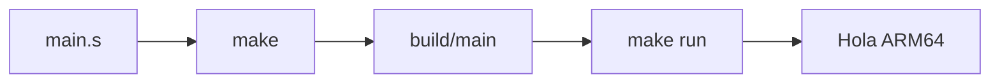
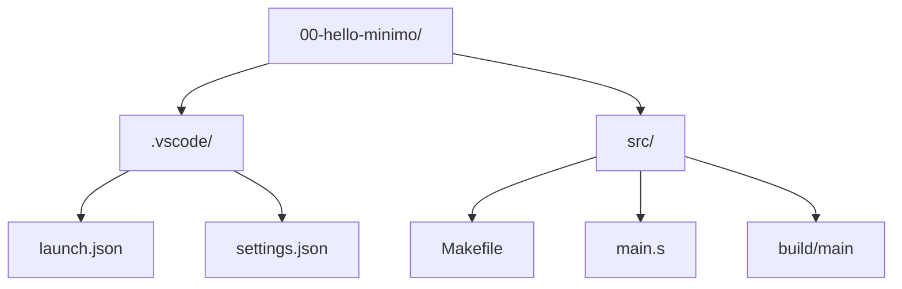

<style>
@import "../../../../styles/index.css";
</style>

<div class="ecys-cover-bg"></div>

<div class="ecys-title-cover">

<div class="muted">Escuela de Ingeniería de Ciencias y Sistemas</div>

# Arquitectura de Computadores y Ensambladores 1

</div>

---
layout: center
---

<div class="muted">Arquitectura de Computadores y Ensambladores 1</div>

## Unidad 01
## Laboratorio ARM64 reproducible

Antes de estudiar instrucciones y registros, necesitamos un entorno que
compile, ejecute y depure un programa AArch64 mínimo.

<div class="cover-note">
Unidad práctica: entorno, toolchain, primer binario, inspección y debugging inicial.
</div>

---

# Anuncios importantes

<div class="numbered-grid">
  <div class="numbered-card">
    <div class="card-number">1</div>
    <h3>Anuncio 1</h3>
    <p></p>
  </div>
</div>

---

# Agenda

<div class="numbered-grid">
  <div class="numbered-card">
    <div class="card-number">1</div>
    <h3>Entorno Linux ARM64</h3>
    <p>Raspberry Pi real o x86_64 con QEMU user mode.</p>
  </div>

  <div class="numbered-card">
    <div class="card-number">2</div>
    <h3>Toolchain y herramientas</h3>
    <p>Qué instalar según tu ruta.</p>
  </div>

  <div class="numbered-card">
    <div class="card-number">3</div>
    <h3>Primer programa</h3>
    <p>Compilar y ejecutar un binario AArch64 mínimo.</p>
  </div>

  <div class="numbered-card">
    <div class="card-number">4</div>
    <h3>Inspección y debugging</h3>
    <p>Mirar el binario por dentro y detenerte en <code>_start</code>.</p>
  </div>

  <div class="numbered-card">
    <div class="card-number">5</div>
    <h3>Estructura del repositorio</h3>
    <p>Cómo organizar carpetas, Makefiles y VS Code.</p>
  </div>
</div>

---

# Competencias

<div class="concept-grid vertical-center">
  <div class="concept-card">
    <h3>Competencia 1</h3>
    <p>
      El estudiante desarrolla soluciones eficientes en sistemas computacionales
      integrando arquitectura de computadores, programación en bajo nivel y
      herramientas modernas de análisis y simulación para resolver problemas
      complejos en sistemas embebidos e IoT.
    </p>
  </div>

  <div class="concept-card">
    <h3>Competencia 2</h3>
    <p>
      Analiza el comportamiento de arquitecturas modernas (ARM y RISC-V)
      utilizando simuladores como Gem5, QEMU, registros e instrucciones
      optimizando programas a bajo nivel en microprocesadores.
    </p>
  </div>
</div>

---

# Valor de la semana

<div class="callout tip">
  <strong>Análisis.</strong>
  Capacidad de interpretar información técnica y comprender el funcionamiento
  interno de un sistema.
</div>

<div class="concept-grid">
  <div class="concept-card">
    <h3>Aplicación en clase</h3>
    <p>
      Permite al estudiante analizar cómo se representan y almacenan los datos
      dentro del computador, base fundamental para entender instrucciones a bajo
      nivel y el flujo completo desde el código fuente hasta el binario ejecutable.
    </p>
  </div>
</div>

---

# Qué buscamos hoy

<div class="slide-center-block">

<div class="objective-grid">
  <div v-click class="objective-item">
    <div class="item-number">1</div>
    <h3>Elegir ruta de ejecución</h3>
    <p>Saber si usaremos Raspberry Pi real o x86_64 con QEMU user mode.</p>
  </div>

  <div v-click class="objective-item">
    <div class="item-number">2</div>
    <h3>Instalar el toolchain</h3>
    <p>Tener las herramientas mínimas listas para compilar AArch64.</p>
  </div>

  <div v-click class="objective-item">
    <div class="item-number">3</div>
    <h3>Ejecutar el primer binario</h3>
    <p>Correr <code>make</code> y <code>make run</code> y ver la salida esperada.</p>
  </div>

  <div v-click class="objective-item">
    <div class="item-number">4</div>
    <h3>Inspeccionar y depurar</h3>
    <p>Usar herramientas básicas para mirar el binario y detenernos en <code>_start</code>.</p>
  </div>
</div>

</div>

---
layout: section
---

# Entorno Linux ARM64

Linux como base, dos rutas y un flujo reproducible.

---
layout: center
class: text-center
---

<div class="big-question">
  <div class="muted">Pregunta de arranque</div>
  <h3>¿Dónde va a correr tu programa AArch64?</h3>
  <div class="question-points">
    <div v-click>No siempre tenemos hardware ARM64 real.</div>
    <div v-click>QEMU user mode ejecuta un binario ARM64 sobre x86_64.</div>
    <div v-click>En ambos casos el código fuente es el mismo.</div>
  </div>
</div>

---
layout: statement
---

# Linux será el entorno principal del curso

---

# Por qué Linux

<div class="slide-center-block">

<div class="content-stack-lg">

<div class="key-idea centered-narrow">
  <div class="muted">Idea central</div>
  <p>
    Linux permite estudiar AArch64 desde userland: procesos, binarios, syscalls
    y herramientas de inspección sin entrar todavía a bare metal.
  </p>
</div>

<div class="concept-grid">
  <div v-click class="concept-card">
    <h3>Herramientas estándar</h3>
    <p><code>gcc</code>, <code>as</code>, <code>ld</code>, <code>gdb</code>, <code>objdump</code>, <code>readelf</code>.</p>
  </div>
  <div v-click class="concept-card">
    <h3>Entorno reproducible</h3>
    <p>Mismo flujo en Raspberry Pi, QEMU o Docker.</p>
  </div>
  <div v-click class="concept-card">
    <h3>Acceso real al sistema</h3>
    <p>Syscalls, procesos, archivos y depuración directa.</p>
  </div>
</div>

</div>

</div>

---

# Dos rutas, un mismo flujo

<div class="slide-center-block">

<div class="compare-grid">
  <div v-click class="compare-card">
    <div class="card-kicker">Raspberry Pi ARM64</div>
    <ul>
      <li><code>uname -m</code> muestra <code>aarch64</code>.</li>
      <li>Compilas y ejecutas directo.</li>
      <li>Depuras con <code>gdb</code>.</li>
    </ul>
  </div>
  <div v-click class="compare-card">
    <div class="card-kicker">x86_64 + QEMU user mode</div>
    <ul>
      <li><code>uname -m</code> muestra <code>x86_64</code>.</li>
      <li>Cross-compilas con <code>aarch64-linux-gnu-gcc</code>.</li>
      <li>Ejecutas con <code>qemu-aarch64</code>.</li>
      <li>Depuras con <code>gdb-multiarch</code>.</li>
    </ul>
  </div>
</div>

</div>

---

# QEMU user mode vs system mode

<div class="slide-center-block">

<div class="compare-grid">
  <div v-click class="compare-card">
    <div class="card-kicker">User mode</div>
    <ul>
      <li>Emula un proceso AArch64.</li>
      <li>Ruta principal en x86_64.</li>
      <li>Rápido y ligero.</li>
    </ul>
  </div>
  <div v-click class="compare-card">
    <div class="card-kicker">System mode</div>
    <ul>
      <li>Emula una máquina ARM completa.</li>
      <li>Kernel, firmware, bare metal.</li>
      <li>Solo mención en esta unidad.</li>
    </ul>
  </div>
</div>

<div v-click class="callout info centered-narrow">
Si solo quieres correr <code>build/main</code>, usa QEMU user mode.
</div>

</div>

---
layout: section
---

# Toolchain e instalación

Solo lo necesario para compilar, ejecutar e inspeccionar.

---

# Herramientas por función

<div class="slide-center-block">

<div class="tool-grid">
  <div v-click class="tool-card">
    <h3>Construir</h3>
    <p><code>make</code></p>
    <p><code>gcc</code> / <code>aarch64-linux-gnu-gcc</code></p>
    <p><code>as</code> · <code>ld</code></p>
  </div>
  <div v-click class="tool-card">
    <h3>Ejecutar</h3>
    <p><code>./build/main</code> (nativo)</p>
    <p><code>qemu-aarch64</code> (cross)</p>
  </div>
  <div v-click class="tool-card">
    <h3>Inspeccionar</h3>
    <p><code>file</code> · <code>readelf</code></p>
    <p><code>objdump</code> · <code>nm</code></p>
    <p><code>strace</code></p>
  </div>
  <div v-click class="tool-card">
    <h3>Depurar</h3>
    <p><code>gdb</code> (nativo)</p>
    <p><code>gdb-multiarch</code> (cross)</p>
  </div>
</div>

</div>

---

# Instalación rápida

<div class="slide-center-block">

<div class="compare-grid">
  <div v-click class="compare-card">
    <div class="card-kicker">Raspberry Pi ARM64</div>

```bash {1|2-3}
sudo apt update
sudo apt install -y build-essential \
  binutils gdb make file xxd strace
```

  </div>
  <div v-click class="compare-card">
    <div class="card-kicker">x86_64 + QEMU</div>

```bash {1|2-5}
sudo apt update
sudo apt install -y build-essential \
  gcc-aarch64-linux-gnu \
  binutils-aarch64-linux-gnu \
  qemu-user gdb-multiarch make file
```
  </div>
</div>

</div>

---

# Verificación mínima

<div class="slide-center-block">

<div class="content-stack-lg">

<div class="reveal-list centered-narrow">
  <div v-click class="reveal-item"><code>uname -m</code> → confirma tu arquitectura.</div>
  <div v-click class="reveal-item"><code>gcc --version</code> o <code>aarch64-linux-gnu-gcc --version</code> → compilador listo.</div>
  <div v-click class="reveal-item"><code>qemu-aarch64 --version</code> → emulador disponible (solo x86_64).</div>
  <div v-click class="reveal-item"><code>gdb --version</code> o <code>gdb-multiarch --version</code> → depurador funcional.</div>
</div>

<div v-click class="callout tip centered-narrow">
Si algo no responde, revisa que instalaste los paquetes de tu ruta.
</div>

</div>

</div>

---
layout: section
---

# Primer programa

Compilar, ejecutar y confirmar que el laboratorio funciona.

---

# Estructura del ejemplo

<div class="slide-center-block">

<div class="content-stack-lg">

```bash
00-hello-minimo/
|- .vscode/
|  |- launch.json
|  `- settings.json
`- src/
   |- Makefile
   `- main.s
```

<div class="concept-grid">
  <div v-click class="concept-card">
    <h3><code>main.s</code></h3>
    <p>Código assembly AArch64.</p>
  </div>
  <div v-click class="concept-card">
    <h3><code>Makefile</code></h3>
    <p>Flujo de compilación según la ruta.</p>
  </div>
  <div v-click class="concept-card">
    <h3><code>.vscode/</code></h3>
    <p>Configuración para debugging visual.</p>
  </div>
</div>

</div>

</div>

---

# Código mínimo

<div class="lead-text">
Un programa que imprime "Hola ARM64" y termina limpiamente.
</div>

```asm {1-2|4-5|7-11|13-15}
.section .data
msg:    .ascii "Hola ARM64\n"
msg_len = . - msg

.section .text
.global _start

_start:
    mov x0, #1          // fd = stdout
    adr x1, msg         // dirección del mensaje
    mov x2, msg_len     // longitud
    mov x8, #64         // syscall write
    svc #0

    mov x0, #0          // código de salida
    mov x8, #93         // syscall exit
    svc #0
```

---

# Compilar y ejecutar

<div class="slide-center-block">

<div class="content-stack-lg">

<div class="diagram-block">



<div class="diagram-caption">
Flujo completo: entra a <code>src/</code>, compila con <code>make</code>, ejecuta con <code>make run</code>.
</div>

</div>

<div class="concept-grid">
  <div v-click class="concept-card">
    <h3><code>make</code></h3>
    <p>Genera <code>build/main</code>.</p>
  </div>
  <div v-click class="concept-card">
    <h3><code>make run</code></h3>
    <p>Ejecuta el binario (QEMU o nativo).</p>
  </div>
  <div v-click class="concept-card">
    <h3><code>make clean</code></h3>
    <p>Borra <code>build/</code> para reconstruir.</p>
  </div>
</div>

</div>

</div>

---
layout: section
---

# Inspección del binario

El binario no es una caja negra: herramientas para mirarlo por dentro.

---

# Primera mirada al binario

<div class="slide-center-block">

<div class="tool-grid">
  <div v-click class="tool-card">
    <h3><code>file</code></h3>
    <p>Confirma que es ELF AArch64.</p>
  </div>
  <div v-click class="tool-card">
    <h3><code>readelf -h</code></h3>
    <p>Muestra clase ELF64, máquina y entry point.</p>
  </div>
  <div v-click class="tool-card">
    <h3><code>objdump -d</code></h3>
    <p>Muestra instrucciones desensambladas.</p>
  </div>
  <div v-click class="tool-card">
    <h3><code>nm</code></h3>
    <p>Lista símbolos: <code>_start</code>, <code>msg</code>, <code>msg_len</code>.</p>
  </div>
</div>

</div>

---

# Qué buscar en cada herramienta

<div class="slide-center-block">

<div class="content-stack-lg">

<div class="reveal-list centered-narrow">
  <div v-click class="reveal-item"><code>file build/main</code> → ELF 64-bit, AArch64.</div>
  <div v-click class="reveal-item"><code>readelf -h</code> → Class: ELF64, Machine: AArch64, Entry point.</div>
  <div v-click class="reveal-item"><code>objdump -d</code> → <code>_start</code>, instrucciones <code>mov</code>, <code>adr</code>, <code>svc</code>.</div>
  <div v-click class="reveal-item"><code>nm</code> → símbolos y sus direcciones.</div>
  <div v-click class="reveal-item"><code>hexdump -C</code> / <code>xxd</code> → el archivo final son bytes.</div>
</div>

</div>

</div>

---
layout: section
---

# Debugging mínimo

Detenerse en `_start`, mirar registros y avanzar instrucción por instrucción.

---

# Flujo de debugging

<div class="slide-center-block">

<div class="compare-grid">
  <div v-click class="compare-card">
    <div class="card-kicker">Raspberry Pi</div>

```bash
make gdb
# Dentro de GDB:
break _start
run
info registers x0 x1 x2 x8 pc
stepi
```

  </div>
  <div v-click class="compare-card">
    <div class="card-kicker">x86_64 + QEMU</div>

```bash
# Terminal 1:
make gdb
# Terminal 2:
gdb-multiarch build/main
target remote localhost:1234
break _start
continue
```

  </div>
</div>

</div>

---

# Qué observar primero

<div class="slide-center-block">

<div class="concept-grid">
  <div v-click class="concept-card">
    <h3><code>pc</code></h3>
    <p>Instrucción actual que se va a ejecutar.</p>
  </div>
  <div v-click class="concept-card">
    <h3><code>x0</code></h3>
    <p>Primer argumento de syscall (file descriptor).</p>
  </div>
  <div v-click class="concept-card">
    <h3><code>x1</code></h3>
    <p>Dirección del mensaje en memoria.</p>
  </div>
  <div v-click class="concept-card">
    <h3><code>x2</code></h3>
    <p>Longitud del mensaje.</p>
  </div>
  <div v-click class="concept-card">
    <h3><code>x8</code></h3>
    <p>Número de syscall (64 = write, 93 = exit).</p>
  </div>
</div>

</div>

---

# Comandos GDB esenciales

<div class="slide-center-block">

<div class="content-stack-lg">

```bash
break _start              # breakpoint en entrada
info registers x0 x1 x8 pc  # ver registros
x/4i $pc                  # ver próximas 4 instrucciones
stepi                     # avanzar una instrucción
quit                      # salir
```

<div v-click class="callout warning centered-narrow">
<code>svc #0</code> entra al kernel. No se depura por dentro como tu código.
Observa registros antes y después.
</div>

</div>

</div>

---
layout: section
---

# Estructura del repositorio

Carpetas claras para que el estudiante no se pierda.

---

# Proyecto mínimo

<div class="slide-center-block">

<div class="content-stack-lg">

<div class="diagram-block">



<div class="diagram-caption">
Cada ejemplo mantiene la misma estructura: una carpeta con <code>.vscode/</code> y <code>src/</code>.
</div>

</div>

</div>

</div>

---

# Un flujo que se repite

<div class="slide-center-block">

<div class="content-stack-lg">

<div class="lead-block">
No hace falta aprender un flujo distinto para cada ejemplo.
La estructura cambia poco; lo que cambia es el programa que queremos construir.
</div>

<div class="concept-grid">
  <div v-click class="concept-card">
    <h3>Flujo único</h3>
    <p><code>make</code> · <code>make run</code> · <code>make gdb</code></p>
  </div>

  <div v-click class="concept-card">
    <h3>Cambiar ruta</h3>
    <p>Solo reemplazas <code>src/Makefile</code>.</p>
  </div>
</div>

<div v-click class="callout-box">
La meta es que el estudiante pueda concentrarse en assembly, no en reaprender el entorno en cada ejercicio.
</div>

</div>

</div>


---

# Checklist mental

<div class="slide-center-block">

<div class="reveal-list centered-narrow">
  <div v-click class="reveal-item">Sé si mi ruta es Raspberry Pi o x86_64 con QEMU.</div>
  <div v-click class="reveal-item">Instalé las herramientas mínimas de mi ruta.</div>
  <div v-click class="reveal-item"><code>make</code> genera <code>build/main</code>.</div>
  <div v-click class="reveal-item"><code>make run</code> imprime <code>Hola ARM64</code>.</div>
  <div v-click class="reveal-item"><code>file build/main</code> identifica un binario AArch64.</div>
  <div v-click class="reveal-item">Puedo detenerme en <code>_start</code> con GDB.</div>
</div>

</div>

---

# Siguiente paso

<div class="slide-center-block">

<div class="flow-column">
  <div v-click class="flow-step">Entorno y ruta elegidos</div>
  <div v-click class="flow-arrow">→</div>
  <div v-click class="flow-step">Toolchain instalado</div>
  <div v-click class="flow-arrow">→</div>
  <div v-click class="flow-step">Primer binario ejecutado</div>
  <div v-click class="flow-arrow">→</div>
  <div v-click class="flow-step">Representación de datos y tipos</div>
</div>

</div>

---
layout: center
class: text-center
---

<div class="muted">Actividad de cierre</div>

# Preguntas de repaso

<div class="question-points mx-auto mt-6 max-w-2xl text-left">
  <div v-click>¿Qué diferencia hay entre QEMU user mode y QEMU system mode?</div>
  <div v-click>¿Qué comando confirma que tienes un binario AArch64?</div>
  <div v-click>¿Qué registros preparas antes de llamar a <code>svc #0</code>?</div>
  <div v-click>¿Qué hace <code>stepi</code> en GDB?</div>
  <div v-click>¿Por qué usamos <code>make</code> en vez de escribir comandos directos?</div>
</div>

---

###### Ejemplo Práctico

<div class="slide-center-block">

<div class="content-stack-lg">

<div class="key-idea centered-narrow">
  <div class="muted">Actividad guiada</div>
  <p>Abrir terminal, entrar al ejemplo, compilar, ejecutar e inspeccionar.</p>
</div>

<div class="concept-grid concept-grid-4">
  <div v-click class="concept-card">
    <h3>Compilar</h3>
    <p><code>cd 00-hello-minimo/src && make</code></p>
  </div>

  <div v-click class="concept-card">
    <h3>Ejecutar</h3>
    <p><code>make run</code> → debe imprimir <code>Hola ARM64</code>.</p>
  </div>

  <div v-click class="concept-card">
    <h3>Inspeccionar</h3>
    <p><code>file build/main</code> y <code>objdump -d build/main</code>.</p>
  </div>

  <div v-click class="concept-card">
    <h3>Depurar</h3>
    <p><code>make gdb</code>, breakpoint en <code>_start</code>, <code>stepi</code>.</p>
  </div>
</div>

</div>

</div>

---

# Fuentes

- Página Quarto: `site/courses/aarch64/laboratorio/`
- QEMU, *User space emulator documentation*
- GDB, *Debugging with GDB — Remote Debugging*
- GNU Binutils, *as, ld, objdump, readelf, nm*
- Larry D. Pyeatt y William Ughetta, *ARM 64-Bit Assembly Language*
- Slidev, documentación oficial

---
layout: statement
---

# Dudas¿?

---
layout: center
---

# Gracias por tu atención
