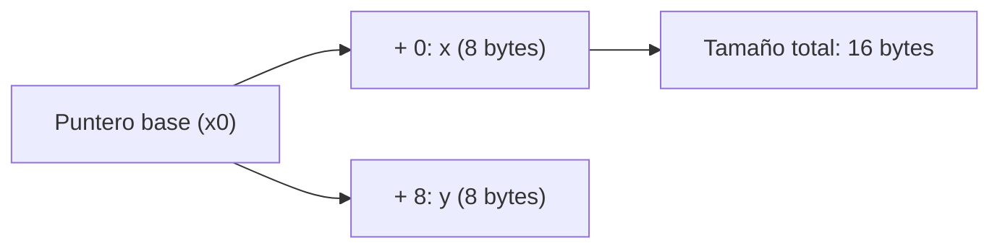

<style>
@import "../../../../styles/index.css";
</style>

<div class="ecys-cover-bg"></div>

<div class="ecys-title-cover">

<div class="muted">Escuela de Ingeniería de Ciencias y Sistemas</div>

# Arquitectura de Computadores y Ensambladores 1

</div>

---
layout: center
---

<div class="muted">Arquitectura de Computadores y Ensambladores 1</div>

## Unidad 14
## Layout de datos, structs, ADTs y objetos manuales

Diseñar datos complejos como bloques de memoria con offsets, invariantes y funciones.

<div class="cover-note">
Unidad práctica: pasar de "tengo una dirección de memoria" a "tengo una estructura de datos estructurada y segura".
</div>

---

# Anuncios importantes

<div class="numbered-grid">
  <div class="numbered-card">
    <div class="card-number">1</div>
    <h3>Anuncio 1</h3>
    <p></p>
  </div>
</div>

---

# Agenda

<div class="numbered-grid">
  <div class="numbered-card">
    <div class="card-number">1</div>
    <h3>Structs y Layout</h3>
    <p>Calcular campos, offsets, alignment, padding y size.</p>
  </div>

  <div class="numbered-card">
    <div class="card-number">2</div>
    <h3>ADTs e Invariantes</h3>
    <p>Operaciones seguras que respetan el estado de la memoria.</p>
  </div>

  <div class="numbered-card">
    <div class="card-number">3</div>
    <h3>Objetos Manuales</h3>
    <p>Cómo usar <code>self</code> en Assembly (<code>x0</code>), constructores y destructores.</p>
  </div>

  <div class="numbered-card">
    <div class="card-number">4</div>
    <h3>Descriptores</h3>
    <p>Modelar Buffers, Strings, Matrices y Wrappers de archivos.</p>
  </div>
</div>

---

# Competencias

<div class="concept-grid vertical-center">
  <div class="concept-card">
    <h3>Competencia 1</h3>
    <p>
      El estudiante desarrolla soluciones eficientes en sistemas computacionales
      integrando arquitectura de computadores, programación en bajo nivel y
      herramientas modernas de análisis y simulación para resolver problemas
      complejos en sistemas embebidos e IoT.
    </p>
  </div>

  <div class="concept-card">
    <h3>Competencia 2</h3>
    <p>
      Modela e implementa estructuras de datos complejas (ADTs) y objetos manuales
      en lenguaje ensamblador, administrando explícitamente el layout de memoria,
      el paso de punteros (<code>self</code>) y la garantía de invariantes lógicos.
    </p>
  </div>
</div>

---

# Valor de la semana

<div class="callout tip">
  <strong>Coherencia y Rigor.</strong>
  Mantener la integridad lógica y estructural de la información a través de reglas invariantes.
</div>

<div class="concept-grid">
  <div class="concept-card">
    <h3>Aplicación en clase</h3>
    <p>
      En alto nivel, el compilador protege tus estructuras. En bajo nivel, un <code>strb</code>
      mal calculado puede destruir el campo vecino. Diseñar datos con <strong>rigor</strong>
      (offsets definidos, padding, inicialización correcta) y mantener <strong>coherencia</strong>
      (invariantes como <code>len <= cap</code>) es la única defensa contra la corrupción de memoria.
    </p>
  </div>
</div>

---

# Qué buscamos hoy

<div class="slide-center-block">

<div class="objective-grid">
  <div v-click class="objective-item">
    <div class="item-number">1</div>
    <h3>Diseño Espacial</h3>
    <p>Saber ubicar variables complejas contiguas usando un "puntero base" y "offsets".</p>
  </div>

  <div v-click class="objective-item">
    <div class="item-number">2</div>
    <h3>Entender Padding</h3>
    <p>Comprender por qué la memoria se "rellena" para respetar el Alignment del procesador.</p>
  </div>

  <div v-click class="objective-item">
    <div class="item-number">3</div>
    <h3>Orientación a Objetos</h3>
    <p>Aprender cómo funciona el paradigma OO por debajo: funciones que reciben <code>self</code> en <code>x0</code>.</p>
  </div>

  <div v-click class="objective-item">
    <div class="item-number">4</div>
    <h3>Construir Abstracciones</h3>
    <p>Crear estructuras como `Buffer`, `String` o `Matrix` para no manejar bytes al azar.</p>
  </div>
</div>

</div>

---
layout: section
---

# Structs y Layout Manual

Un struct en assembly es una convención de offsets dentro de bytes.

---

###### Diseño antes de código

<div class="slide-center-block">

<div class="content-stack-lg">

<div class="key-idea centered-narrow">
En assembly no existe la palabra mágica <code>struct</code>.
Lo que existe es memoria y una <strong>convención estricta</strong> de cómo usarla.
</div>

<div class="diagram-block">



<div class="diagram-caption">
El objeto se interpreta según offsets fijos dentro de un bloque de memoria.
</div>

</div>

</div>

</div>

---

###### Diseño conceptual del objeto

<div class="slide-center-block">

<div class="content-stack-lg">

<div class="muted centered-narrow">Layout del bloque en memoria</div>

| Campo  | Offset | Tamaño |
| ------ | -----: | -----: |
| `x`    |    `0` |    `8` |
| `y`    |    `8` |    `8` |
| `SIZE` |   `16` |      - |

<div v-click class="callout info centered-narrow">
El layout define dónde empieza cada campo y cuánto ocupa el objeto completo.
</div>

</div>

</div>

---

###### Pasar el diseño a assembly

<div class="slide-center-block">

<div class="content-stack-lg">

<div class="muted centered-narrow">Definir offsets y usarlos en accesos a memoria</div>

```asm
// Definir "nombres" a los offsets
.equ POINT_X, 0
.equ POINT_Y, 8
.equ POINT_SIZE, 16

// Uso
ldr x1, [x0, #POINT_X]
ldr x2, [x0, #POINT_Y]
```

<div v-click class="callout info centered-narrow">
<code>x0</code> apunta al objeto. Los offsets permiten leer cada campo sin memorizar números mágicos.
</div>

</div>

</div>


---

###### Alignment y Padding

<div class="slide-center-block">

<div class="content-stack-lg">

<div class="key-idea centered-narrow">
El procesador prefiere leer datos en direcciones que son múltiplos de su tamaño.
Para mantener esto, se insertan bytes de "relleno" o <strong>Padding</strong>.
</div>

<div class="compare-grid mt-4">
  <div v-click class="compare-card">
    <div class="card-kicker">Ejemplo de Layout con Padding</div>
    <table class="w-full text-sm">
      <tr><th>Campo</th><th>Offset</th><th>Tamaño</th><th>Nota</th></tr>
      <tr><td><code>flag</code></td><td><code>0</code></td><td><code>1</code></td><td>Byte</td></tr>
      <tr class="text-gray-400"><td><em>padding</em></td><td><em>1</em></td><td><em>7</em></td><td><em>Relleno inútil</em></td></tr>
      <tr><td><code>value</code></td><td><code>8</code></td><td><code>8</code></td><td>Alineado a 8</td></tr>
      <tr><td><code>SIZE</code></td><td><code>16</code></td><td>-</td><td>Alineación final</td></tr>
    </table>
  </div>
  <div v-click class="compare-card">
    <div class="card-kicker">Reglas del Padding</div>
    <ul>
      <li>El padding son bytes inútiles. NO guardes información allí.</li>
      <li>Sirve para que el siguiente campo quede alineado.</li>
      <li>También existe Padding final para alinear elementos si usas Arreglos de Structs.</li>
      <li>El orden de declaración de campos importa (cambiarlo puede ahorrar bytes).</li>
    </ul>
  </div>
</div>

</div>

</div>

---
layout: section
---

# ADTs e Invariantes

Un ADT junta layout, operaciones y reglas que deben cumplirse.

---

###### Abstract Data Types (ADT)

<div class="slide-center-block">

<div class="content-stack-lg">

<div class="lead-block">
Un Layout solo dice dónde están los campos. Un ADT añade las funciones autorizadas para tocarlos y las reglas lógicas que siempre deben cumplirse (<strong>Invariantes</strong>).
</div>

<div class="concept-grid concept-grid-3 mt-4">
  <div v-click class="concept-card">
    <h3>Datos (Layout)</h3>
    <p>Los offsets: <code>data</code>, <code>len</code>, <code>cap</code>.</p>
  </div>
  <div v-click class="concept-card">
    <h3>Operaciones</h3>
    <p>Funciones que reciben el puntero base y ejecutan lógica (ej. <code>push_byte</code>).</p>
  </div>
  <div v-click class="concept-card">
    <h3>Invariantes</h3>
    <p>Promesas de estado. Ej: <code>0 <= len <= cap</code>. Si <code>len</code> supera <code>cap</code>, la invariante se rompe y el programa falla.</p>
  </div>
</div>

<div v-click class="callout warning centered-narrow mt-6">
El procesador NO sabe qué es válido. Tú debes programar los <code>cmp</code> y <code>b.ge</code> en tus operaciones para proteger la invariante. Si modificas campos manualmente desde afuera, rompes la coherencia.
</div>

</div>

</div>

---
layout: section
---

# Objetos Manuales y `self`

Constructor, destructor y métodos en bajo nivel.

---

###### Programación Orientada a Objetos en Ensamblador

<div class="slide-center-block">

<div class="content-stack-lg">

<div class="key-idea centered-narrow">
En bajo nivel, un <strong>objeto</strong> es solo un bloque de memoria.
Un <strong>método</strong> es una función normal que recibe un puntero hacia ese bloque.
</div>

<div class="concept-grid">
  <div v-click class="concept-card">
    <h3>Objeto</h3>
    <p>Datos agrupados en memoria con campos definidos por offsets.</p>
  </div>

  <div v-click class="concept-card">
    <h3>Método</h3>
    <p>Función que opera sobre ese bloque usando un puntero al objeto.</p>
  </div>
</div>

</div>

</div>

---

###### La convención <code>self</code>

<div class="slide-center-block">

<div class="content-stack-lg">

<div class="compare-grid">
  <div v-click class="compare-card">
    <div class="card-kicker">Entrada del método</div>
    <ul>
      <li><code>x0</code> = <code>self</code>, puntero al objeto</li>
      <li><code>x1</code> = argumento 1</li>
      <li><code>x2</code> = argumento 2</li>
    </ul>
  </div>

  <div v-click class="compare-card">
    <div class="card-kicker">Idea clave</div>
    <p>El método no necesita una clase especial: recibe la dirección del bloque y trabaja sobre sus campos.</p>
  </div>
</div>

<div v-click class="callout warning centered-narrow">
Como <code>x0</code> también se usa para devolver resultados, si el método llama a otra función y aún necesita <code>self</code>, debe guardarlo antes en un registro preservado como <code>x19</code> o en la pila.
</div>

</div>

</div>

---

###### Método manual: <code>buffer_push_byte</code>

<div class="slide-center-block">

<div class="content-stack-lg">

```asm
// x0 = self (Buffer)
// w1 = byte a escribir
buffer_push_byte:
    ldr x3, [x0, #BUF_LEN]
    ldr x4, [x0, #BUF_CAP]

    // Proteger invariante
    cmp x3, x4
    b.hs buffer_full

    // ... lógica para escribir ...
```

<div v-click class="callout info centered-narrow">
El método usa <code>x0</code> como base del objeto y accede a sus campos mediante offsets como <code>BUF_LEN</code> y <code>BUF_CAP</code>.
</div>

</div>

</div>


---

###### Constructores y Destructores

<div class="slide-center-block">

<div class="content-stack-lg">

<div class="compare-grid">
  <div v-click class="compare-card">
    <div class="card-kicker">Constructor (<code>init</code>)</div>
    <ul>
      <li>No crea magia, ni aparta la memoria del heap.</li>
      <li>Se encarga de llenar el bloque recién reservado con el <strong>Estado Válido Inicial</strong> (Invariantes listas).</li>
      <li>Ejemplo: Guardar el puntero de <code>data</code>, setear <code>len</code> a <code>0</code>, y <code>cap</code> a un límite.</li>
    </ul>
  </div>
  <div v-click class="compare-card">
    <div class="card-kicker">Destructor (<code>destroy</code>)</div>
    <ul>
      <li>Libera los recursos <strong>si el objeto es el verdadero Dueño (Owner)</strong>.</li>
      <li>Si el campo <code>data</code> fue creado por <code>mmap</code>, el destructor debe llamar a <code>munmap</code>.</li>
      <li>Si el objeto solo tenía un puntero prestado, no lo libera.</li>
    </ul>
  </div>
</div>

</div>

</div>

---

# Checklist mental

<div class="slide-center-block">

<div class="reveal-list centered-narrow">
  <div v-click class="reveal-item">Puedo explicar qué es un Struct y cómo convertirlo en Offsets constantes con <code>.equ</code>.</div>
  <div v-click class="reveal-item">Entiendo qué es el Alignment y por qué es necesario el Padding.</div>
  <div v-click class="reveal-item">Conozco la fórmula del Tamaño: offset del último campo + su tamaño (+ padding final).</div>
  <div v-click class="reveal-item">Comprendo qué es un ADT: Layout + Operaciones + Invariantes.</div>
  <div v-click class="reveal-item">Entiendo qué es la invariante <code>len <= cap</code>.</div>
  <div v-click class="reveal-item">Entiendo que en POO en bajo nivel, <code>self</code> suele pasarse en el registro <code>x0</code>.</div>
  <div v-click class="reveal-item">Reconozco la importancia de guardar <code>x0</code> si el método llama a otras funciones.</div>
</div>

</div>

---

# Siguiente paso

<div class="slide-center-block">

<div class="flow-column">
  <div v-click class="flow-step">Layouts manuales y POO</div>
  <div v-click class="flow-arrow">→</div>
  <div v-click class="flow-step">ABI Oficial y Funciones Complejas</div>
  <div v-click class="flow-arrow">→</div>
  <div v-click class="flow-step">Integración y llamadas a C</div>
</div>

</div>

---
layout: center
class: text-center
---

<div class="muted">Actividad de cierre</div>

# Preguntas de repaso

<div class="question-points mx-auto mt-6 max-w-2xl text-left">
  <div v-click>Si defino dos variables seguidas de tamaño 1 byte y 8 bytes, ¿por qué el offset de la segunda no es 1?</div>
  <div v-click>¿Qué es una "Invariante" en una estructura de datos?</div>
  <div v-click>En código de alto nivel como Java usamos la palabra reservada <code>this</code>. ¿Cuál es su equivalente en la convención de AArch64?</div>
  <div v-click>Si el campo <code>data</code> apunta a un buffer global en el <code>.bss</code>, ¿el destructor debe llamar a <code>munmap</code>?</div>
  <div v-click>¿Por qué NO deberías cambiar campos lógicos como <code>len</code> directamente desde fuera de las funciones del ADT?</div>
</div>

---

###### Ejemplo Práctico

<div class="slide-center-block">

<div class="content-stack-lg">

<div class="key-idea centered-narrow">
  <div class="muted">Definición de un ADT en Assembly</div>
  <p>Diseño y uso de un <strong>Punto</strong> 2D en memoria.</p>
</div>

<div class="concept-grid concept-grid-3">
  <div v-click class="concept-card">
    <h3>1. Layout</h3>
```asm
.equ P_X, 0
.equ P_Y, 8
.equ P_SIZE, 16
```
  </div>

  <div v-click class="concept-card">
    <h3>2. Constructor</h3>
```asm
// x0 = self, x1 = X, x2 = Y
punto_init:
  str x1, [x0, #P_X]
  str x2, [x0, #P_Y]
  ret
```
  </div>

  <div v-click class="concept-card">
    <h3>3. Método Getter</h3>
```asm
// x0 = self
punto_get_x:
  ldr x0, [x0, #P_X]
  ret
```
  </div>
</div>

</div>

</div>

---

# Fuentes

- Página Quarto: `site/courses/aarch64/layout-datos-structs/`
- Arm, *Learn the Architecture - A64 Instruction Set Architecture Guide*
- Slidev, documentación oficial

---
layout: statement
---

# Dudas¿?

---
layout: center
---

# Gracias por tu atención
