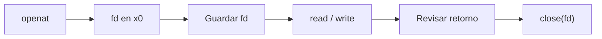

<style>
@import "../../../../styles/index.css";
</style>

<div class="ecys-cover-bg"></div>

<div class="ecys-title-cover">

<div class="muted">Escuela de Ingeniería de Ciencias y Sistemas</div>

# Arquitectura de Computadores y Ensambladores 1

</div>

---
layout: center
---

<div class="muted">Arquitectura de Computadores y Ensambladores 1</div>

## Unidad 10
## Linux como API del kernel

Archivos, errores y recursos usando syscalls AArch64
sin depender de libc.

<div class="cover-note">
Unidad práctica: file descriptors, ciclo open/read/write/close, errores, cleanup, lseek, fstat, getpid y nanosleep.
</div>

---

# Anuncios importantes

<div class="numbered-grid">
  <div class="numbered-card">
    <div class="card-number">1</div>
    <h3>Anuncio 1</h3>
    <p></p>
  </div>
</div>

---

# Agenda

<div class="numbered-grid">
  <div class="numbered-card">
    <div class="card-number">1</div>
    <h3>File descriptors y recursos</h3>
    <p>Qué es un fd, stdin/stdout/stderr y ciclo de vida.</p>
  </div>

  <div class="numbered-card">
    <div class="card-number">2</div>
    <h3>Archivos con syscalls</h3>
    <p><code>openat</code>, <code>read</code>, <code>write</code>, <code>close</code> en flujo completo.</p>
  </div>

  <div class="numbered-card">
    <div class="card-number">3</div>
    <h3>Errores y cleanup</h3>
    <p>Dos rutas de error, <code>cleanup</code> y errno conceptual.</p>
  </div>

  <div class="numbered-card">
    <div class="card-number">4</div>
    <h3>Posición y metadatos</h3>
    <p><code>lseek</code>, <code>fstat</code>, <code>statx</code> como mapa inicial.</p>
  </div>

  <div class="numbered-card">
    <div class="card-number">5</div>
    <h3>Procesos y tiempo</h3>
    <p><code>getpid</code>, <code>nanosleep</code>, <code>clock_gettime</code> y menciones.</p>
  </div>
</div>

---

# Competencias

<div class="concept-grid vertical-center">
  <div class="concept-card">
    <h3>Competencia 1</h3>
    <p>
      El estudiante desarrolla soluciones eficientes en sistemas computacionales
      integrando arquitectura de computadores, programación en bajo nivel y
      herramientas modernas de análisis y simulación para resolver problemas
      complejos en sistemas embebidos e IoT.
    </p>
  </div>

  <div class="concept-card">
    <h3>Competencia 2</h3>
    <p>
      Implementa sistemas embebidos orientados a IoT mediante el uso de
      Raspberry Pi, sensores digitales y comunicación con la nube para resolver
      problemas reales mediante automatización de procesos.
    </p>
  </div>
</div>

---

# Valor de la semana

<div class="callout tip">
  <strong>Responsabilidad.</strong>
  Capacidad de gestionar recursos correctamente y asumir las consecuencias
  de cada decisión técnica.
</div>

<div class="concept-grid">
  <div class="concept-card">
    <h3>Aplicación en clase</h3>
    <p>
      Cada recurso abierto es responsabilidad del programa. No cerrar un fd,
      ignorar un error o sobrescribir un retorno sin revisarlo son decisiones
      con consecuencias reales en sistemas de producción.
    </p>
  </div>
</div>

---

# Qué buscamos hoy

<div class="slide-center-block">

<div class="objective-grid">
  <div v-click class="objective-item">
    <div class="item-number">1</div>
    <h3>File descriptors</h3>
    <p>Entender fd como handle entero, no como puntero ni dirección.</p>
  </div>

  <div v-click class="objective-item">
    <div class="item-number">2</div>
    <h3>Ciclo de recurso</h3>
    <p>Abrir → usar → revisar → cerrar como disciplina de trabajo.</p>
  </div>

  <div v-click class="objective-item">
    <div class="item-number">3</div>
    <h3>Rutas de error</h3>
    <p>Diseñar cleanup que sabe qué recursos están vivos.</p>
  </div>

  <div v-click class="objective-item">
    <div class="item-number">4</div>
    <h3>Más allá de archivos</h3>
    <p>Reconocer que el mismo contrato sirve para posición, metadatos y tiempo.</p>
  </div>
</div>

</div>

---
layout: section
---

# File descriptors y recursos

Un fd es un número que representa un recurso abierto del kernel.

---
layout: center
class: text-center
---

<div class="big-question">
  <div class="muted">Pregunta de arranque</div>
  <h3>¿Un file descriptor es un puntero a memoria?</h3>
  <div class="question-points">
    <div v-click>No. Es un entero pequeño que el kernel asocia con un recurso.</div>
    <div v-click>No puedes hacer <code>ldr x1, [x0]</code> con un fd.</div>
    <div v-click>Se pasa como argumento a otras syscalls.</div>
  </div>
</div>

---

###### File descriptors iniciales

<div class="slide-center-block">

<div class="content-stack-lg">

```bash
proceso
  fd 0 → stdin
  fd 1 → stdout
  fd 2 → stderr
  fd 3 → archivo abierto por openat
```

<div class="concept-grid">
  <div v-click class="concept-card">
    <h3>fd 0 — stdin</h3>
    <p>Entrada estándar. <code>read</code> lee desde aquí.</p>
  </div>
  <div v-click class="concept-card">
    <h3>fd 1 — stdout</h3>
    <p>Salida estándar. <code>write</code> escribe aquí.</p>
  </div>
  <div v-click class="concept-card">
    <h3>fd 2 — stderr</h3>
    <p>Salida de error. Mensajes de fallo van aquí.</p>
  </div>
</div>

<div v-click class="callout warning centered-narrow">
Un fd no es puntero. No puedes hacer <code>ldr</code> con un fd. Se pasa como argumento a syscalls.
</div>

</div>

</div>

---

# Ciclo de vida de un recurso

<div class="slide-center-block">

<div class="content-stack-lg">

<div class="diagram-block">



<div class="diagram-caption">
Abrir → guardar → usar → revisar → cerrar.
</div>

</div>

<div v-click class="callout info centered-narrow">
<code>x0</code> cambia de papel: antes de <code>svc #0</code> es argumento, después es retorno. Por eso debes guardar valores importantes como el fd.
</div>

</div>

</div>

---
layout: section
---

# Archivos con syscalls

openat, read, write, close — el flujo completo de archivo.

---

##### Abrir y leer

<div class="slide-center-block">

<div class="content-stack-md">

<div class="muted centered-narrow">Primera mitad del flujo: obtener un descriptor y leer bytes.</div>

```asm
mov x0, #AT_FDCWD
ldr x1, =nombre
mov x2, #O_RDONLY
mov x3, #0
mov x8, #56         // openat
svc #0
cmp x0, #0
b.lt error_sin_fd

mov x19, x0         // guardar fd

mov x0, x19
ldr x1, =buffer
mov x2, #128
mov x8, #63         // read
svc #0
cmp x0, #0
b.lt cleanup
```

</div>

</div>

---

##### Escribir y cerrar

<div class="slide-center-block">

<div class="content-stack-md">

<div class="muted centered-narrow">Segunda mitad del flujo: escribir lo leído y liberar el descriptor.</div>

```asm
mov x20, x0         // bytes leídos

mov x0, #1          // stdout
ldr x1, =buffer
mov x2, x20
mov x8, #64         // write
svc #0
cmp x0, #0
b.lt cleanup

mov x0, x19
mov x8, #57         // close
svc #0

mov x0, #0
mov x8, #93         // exit
svc #0
```

</div>

</div>


---

# read no promete llenar el buffer

<div class="slide-center-block">

<div class="content-stack-lg">

```asm
mov x2, #128        // pido hasta 128 bytes
mov x8, #63
svc #0              // x0 = bytes realmente leídos
mov x20, x0         // guardo la cantidad real
```

<div class="compare-grid">
  <div v-click class="compare-card">
    <div class="card-kicker">Pedir 128</div>
    <ul>
      <li>Es el máximo que aceptas.</li>
      <li>No garantiza recibir 128.</li>
    </ul>
  </div>
  <div v-click class="compare-card">
    <div class="card-kicker">Recibir x0</div>
    <ul>
      <li>Cantidad real leída.</li>
      <li><code>write</code> debe usar esta cantidad, no 128.</li>
    </ul>
  </div>
</div>

</div>

</div>

---
layout: section
---

# Errores y cleanup

Una ruta de error debe saber qué recursos ya están abiertos.

---

# Dos rutas de error

<div class="slide-center-block">

<div class="content-stack-lg">

<div class="compare-grid">
  <div v-click class="compare-card">
    <div class="card-kicker"><code>error_sin_fd</code></div>
    <ul>
      <li>No hay fd abierto.</li>
      <li>Mensaje a stderr + <code>exit(1)</code>.</li>
      <li>Usado cuando <code>openat</code> falla.</li>
    </ul>
  </div>
  <div v-click class="compare-card">
    <div class="card-kicker"><code>cleanup</code></div>
    <ul>
      <li>Hay fd guardado en <code>x19</code>.</li>
      <li>Primero <code>close(x19)</code>.</li>
      <li>Luego cae a <code>error_sin_fd</code>.</li>
    </ul>
  </div>
</div>

```bash
openat falla       → error_sin_fd (nada que cerrar)
read/write falla   → cleanup → close(x19) → error_sin_fd
```

<div v-click class="callout warning centered-narrow">
No cierres basura. Si no hay fd abierto, no saltes a cleanup.
</div>

</div>

</div>

---

# errno conceptual

<div class="slide-center-block">

<div class="content-stack-lg">

<div class="compare-grid">
  <div v-click class="compare-card">
    <div class="card-kicker">Con libc</div>
    <ul>
      <li><code>errno</code> es una variable TLS.</li>
      <li>Funciones como <code>perror</code> la leen.</li>
    </ul>
  </div>
  <div v-click class="compare-card">
    <div class="card-kicker">Sin libc (nosotros)</div>
    <ul>
      <li>El retorno negativo en <code>x0</code> es el error.</li>
      <li>Patrón: <code>cmp x0, #0</code> + <code>b.lt error</code>.</li>
    </ul>
  </div>
</div>

<div v-click class="callout info centered-narrow">
En assembly sin libc, tu primer contrato es el valor que vuelve en <code>x0</code>. No esperes que <code>errno</code> aparezca solo.
</div>

</div>

</div>

---
layout: section
---

# Posición, metadatos y más allá

El mismo contrato sirve para servicios más allá de archivos.

---

# lseek y fstat

<div class="slide-center-block">

<div class="compare-grid">
  <div v-click class="compare-card">
    <div class="card-kicker"><code>lseek</code> — syscall 62</div>
    <ul>
      <li>Cambia posición dentro del fd.</li>
      <li><code>SEEK_SET</code> (0), <code>SEEK_CUR</code> (1), <code>SEEK_END</code> (2).</li>
      <li>No aplica a pipes ni terminales.</li>
    </ul>
  </div>
  <div v-click class="compare-card">
    <div class="card-kicker"><code>fstat</code> — syscall 80</div>
    <ul>
      <li>Consulta metadatos desde un fd abierto.</li>
      <li>Kernel escribe estructura en buffer que tú preparas.</li>
      <li>Tamaño, tipo, permisos, tiempos.</li>
    </ul>
  </div>
</div>

</div>

---

# Procesos y tiempo (mapa inicial)

<div class="slide-center-block">

<div class="concept-grid">
  <div v-click class="concept-card">
    <h3><code>getpid</code> — 172</h3>
    <p>Devuelve PID. Sin argumentos.</p>
  </div>
  <div v-click class="concept-card">
    <h3><code>nanosleep</code> — 101</h3>
    <p>Pausa el proceso. Recibe puntero a <code>timespec</code>.</p>
  </div>
  <div v-click class="concept-card">
    <h3><code>clock_gettime</code> — 113</h3>
    <p>Hora del sistema. Escribe <code>timespec</code> en buffer.</p>
  </div>
  <div v-click class="concept-card">
    <h3><code>execve</code> — 221</h3>
    <p>Reemplaza programa. Mención conceptual.</p>
  </div>
</div>

<div v-click class="callout info centered-narrow">
Archivos, procesos y tiempo usan el mismo mecanismo: registros, número de syscall, <code>svc #0</code>, retorno en <code>x0</code>.
</div>

</div>

---

# Checklist mental

<div class="slide-center-block">

<div class="reveal-list centered-narrow">
  <div v-click class="reveal-item">Puedo explicar qué es un file descriptor.</div>
  <div v-click class="reveal-item">Puedo distinguir fd, dirección y contenido.</div>
  <div v-click class="reveal-item">Puedo usar <code>openat</code>, <code>read</code>, <code>write</code> y <code>close</code> en un flujo completo.</div>
  <div v-click class="reveal-item">Puedo guardar el fd antes de sobrescribir <code>x0</code>.</div>
  <div v-click class="reveal-item">Puedo diseñar rutas <code>cleanup</code> y <code>error_sin_fd</code>.</div>
  <div v-click class="reveal-item">Puedo reconocer <code>lseek</code>, <code>fstat</code>, <code>getpid</code> y <code>nanosleep</code>.</div>
</div>

</div>

---

# Siguiente paso

<div class="slide-center-block">

<div class="flow-column">
  <div v-click class="flow-step">Linux como API del kernel dominado</div>
  <div v-click class="flow-arrow">→</div>
  <div v-click class="flow-step">Manejo de recursos y cleanup</div>
  <div v-click class="flow-arrow">→</div>
  <div v-click class="flow-step">Más servicios del kernel</div>
  <div v-click class="flow-arrow">→</div>
  <div v-click class="flow-step">Stack frames, funciones y ABI</div>
</div>

</div>

---
layout: center
class: text-center
---

<div class="muted">Actividad de cierre</div>

# Preguntas de repaso

<div class="question-points mx-auto mt-6 max-w-2xl text-left">
  <div v-click>¿Un fd es un puntero a memoria?</div>
  <div v-click>¿Por qué debes guardar el fd antes de llamar <code>write</code>?</div>
  <div v-click>¿Cuándo se salta a <code>cleanup</code> y cuándo a <code>error_sin_fd</code>?</div>
  <div v-click>¿Qué pasa si <code>read</code> devuelve menos bytes de los pedidos?</div>
  <div v-click>¿Qué tienen en común archivos, tiempo y procesos a nivel de syscall?</div>
</div>

---

###### Ejemplo Práctico

<div class="slide-center-block">

<div class="content-stack-lg">

<div class="key-idea centered-narrow">
  <div class="muted">Actividad guiada</div>
  <p>Programa que abre <code>entrada.txt</code>,
  lee un bloque, escribe en stdout,
  cierra fd y maneja errores con
  cleanup.</p>
</div>

<div class="concept-grid concept-grid-4">
  <div v-click class="concept-card">
    <h3>openat</h3>
    <p>Abrir archivo y guardar fd en <code>x19</code>.</p>
  </div>

  <div v-click class="concept-card">
    <h3>read → write</h3>
    <p>Leer hacia buffer, escribir la cantidad real a stdout.</p>
  </div>

  <div v-click class="concept-card">
    <h3>cleanup</h3>
    <p>Si falla después de abrir, cerrar fd antes de salir.</p>
  </div>

  <div v-click class="concept-card">
    <h3>Verificar</h3>
    <p><code>cat entrada.txt</code> vs salida del programa + <code>echo $?</code>.</p>
  </div>
</div>

</div>

</div>

---

# Fuentes

- Página Quarto: `site/courses/aarch64/linux-api-kernel/`
- Arm, *Learn the Architecture - A64 Instruction Set Architecture Guide*
- Larry D. Pyeatt y William Ughetta, *ARM 64-Bit Assembly Language*
- Linux kernel, *syscall table for AArch64*
- `man 2 openat`, `man 2 read`, `man 2 write`, `man 2 close`
- `man 2 lseek`, `man 2 fstat`, `man 2 statx`, `man 2 nanosleep`
- Slidev, documentación oficial

---
layout: statement
---

# Dudas¿?

---
layout: center
---

# Gracias por tu atención
