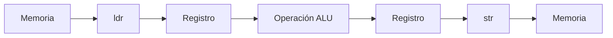

<style>
@import "../../../../styles/index.css";
</style>

<div class="ecys-cover-bg"></div>

<div class="ecys-title-cover">

<div class="muted">Escuela de Ingeniería de Ciencias y Sistemas</div>

# Arquitectura de Computadores y Ensambladores 1

</div>

---
layout: center
---

<div class="muted">Arquitectura de Computadores y Ensambladores 1</div>

## Unidad 06
## Memoria básica, secciones y direccionamiento

AArch64 es load/store: la ALU trabaja con registros y la memoria
se toca de forma explícita.

<div class="cover-note">
Unidad práctica: dirección vs contenido, secciones, ldr/str, tamaños, modos de direccionamiento y arrays.
</div>

---

# Anuncios importantes

<div class="numbered-grid">
  <div class="numbered-card">
    <div class="card-number">1</div>
    <h3>Anuncio 1</h3>
    <p></p>
  </div>
</div>

---

# Agenda

<div class="numbered-grid">
  <div class="numbered-card">
    <div class="card-number">1</div>
    <h3>Dirección y contenido</h3>
    <p>Memoria como bytes, punteros y diferencia entre cargar dirección y contenido.</p>
  </div>

  <div class="numbered-card">
    <div class="card-number">2</div>
    <h3>Secciones y mapa de memoria</h3>
    <p><code>.text</code>, <code>.rodata</code>, <code>.data</code>, <code>.bss</code>, stack y heap.</p>
  </div>

  <div class="numbered-card">
    <div class="card-number">3</div>
    <h3>Load/store básico</h3>
    <p><code>ldr</code>, <code>str</code>, cargar-modificar-guardar.</p>
  </div>

  <div class="numbered-card">
    <div class="card-number">4</div>
    <h3>Tamaños y modos de direccionamiento</h3>
    <p><code>ldrb</code>, <code>ldrh</code>, <code>ldrsw</code>, offsets, pre-index y post-index.</p>
  </div>

  <div class="numbered-card">
    <div class="card-number">5</div>
    <h3>Arrays y recorrido</h3>
    <p>Base + índice × tamaño, escalas y lectura guiada.</p>
  </div>
</div>

---

# Competencias

<div class="concept-grid vertical-center">
  <div class="concept-card">
    <h3>Competencia 1</h3>
    <p>
      Aplica el set de instrucciones ARM-64 utilizando instrucciones aritméticas,
      lógicas, de carga/almacenamiento, desplazamientos y rotaciones para
      construir programas funcionales que manipulen datos a nivel de registros
      y memoria.
    </p>
  </div>

  <div class="concept-card">
    <h3>Competencia 2</h3>
    <p>
      Analiza el comportamiento de arquitecturas modernas (ARM y RISC-V)
      utilizando simuladores como Gem5, QEMU, registros e instrucciones
      optimizando programas a bajo nivel en microprocesadores.
    </p>
  </div>
</div>

---

# Valor de la semana

<div class="callout tip">
  <strong>Precisión.</strong>
  Exactitud al escribir y ejecutar instrucciones a nivel de máquina.
</div>

<div class="concept-grid">
  <div class="concept-card">
    <h3>Aplicación en clase</h3>
    <p>
      En ensamblador, un error de un bit o una instrucción mal escrita puede
      producir resultados completamente inesperados. La precisión es esencial
      al trabajar con instrucciones aritméticas, lógicas y de memoria.
    </p>
  </div>
</div>

---

# Qué buscamos hoy

<div class="slide-center-block">

<div class="objective-grid">
  <div v-click class="objective-item">
    <div class="item-number">1</div>
    <h3>Dirección vs contenido</h3>
    <p>Distinguir dirección, contenido y valor interpretado en memoria.</p>
  </div>

  <div v-click class="objective-item">
    <div class="item-number">2</div>
    <h3>Load/store</h3>
    <p>Cargar datos a registros y escribir resultados de vuelta a memoria.</p>
  </div>

  <div v-click class="objective-item">
    <div class="item-number">3</div>
    <h3>Tamaños de acceso</h3>
    <p>Elegir <code>ldrb</code>, <code>ldrh</code>, <code>ldr w</code> o <code>ldr x</code> según el dato.</p>
  </div>

  <div v-click class="objective-item">
    <div class="item-number">4</div>
    <h3>Direccionamiento y arrays</h3>
    <p>Calcular offsets, usar escalas y recorrer memoria con post-index.</p>
  </div>
</div>

</div>

---
layout: section
---

# Dirección y contenido

La primera regla: una dirección dice dónde mirar; el contenido dice qué bytes hay allí.

---
layout: center
class: text-center
---

<div class="big-question">
  <div class="muted">Pregunta de arranque</div>
  <h3>¿Qué diferencia hay entre cargar una dirección y cargar lo que hay en esa dirección?</h3>
  <div class="question-points">
    <div v-click>Una dirección es un número que indica posición.</div>
    <div v-click>El contenido son bytes guardados en esa posición.</div>
    <div v-click>El valor depende de la instrucción y el tamaño de lectura.</div>
  </div>
</div>

---

# Memoria como arreglo de bytes

<div class="slide-center-block">

<div class="content-stack-lg">

```bash
Dirección:   0x400120  0x400121  0x400122  0x400123
Contenido:      2A        00        00        00
```

<div class="concept-grid">
  <div v-click class="concept-card">
    <h3>Dirección</h3>
    <p>Número que indica posición. Ej: <code>0x400120</code></p>
  </div>
  <div v-click class="concept-card">
    <h3>Contenido</h3>
    <p>Bytes guardados. Ej: <code>2A 00 00 00</code></p>
  </div>
  <div v-click class="concept-card">
    <h3>Valor</h3>
    <p>Interpretación. Ej: <code>42</code> como int32 LE.</p>
  </div>
</div>

</div>

</div>

---

###### Cargar dirección vs cargar contenido

<div class="slide-center-block">

<div class="content-stack-lg">

```asm
.data
valor:
    .quad 42

.text
_start:
    ldr x0, =valor    // x0 = dirección donde empieza valor
    ldr x1, [x0]      // x1 = contenido de 64 bits guardado allí
```

<div class="compare-grid">
  <div v-click class="compare-card">
    <div class="card-kicker"><code>ldr x0, =valor</code></div>
    <ul>
      <li>Carga una dirección.</li>
      <li><code>x0</code> = puntero, ej: <code>0x410158</code></li>
    </ul>
  </div>

  <div v-click class="compare-card">
    <div class="card-kicker"><code>ldr x1, [x0]</code></div>
    <ul>
      <li>Usa corchetes → acceso a memoria.</li>
      <li><code>x1</code> = valor leído: <code>42</code></li>
    </ul>
  </div>
</div>

</div>

</div>

---

###### La diferencia está en los corchetes

<div class="slide-center-block">

<div class="content-stack-lg">

<div class="compare-grid">
  <div v-click class="compare-card">
    <div class="card-kicker">Sin corchetes</div>
    <p><code>ldr x0, =valor</code></p>
    <p>Obtienes la <strong>dirección</strong> asociada al símbolo.</p>
  </div>

  <div v-click class="compare-card">
    <div class="card-kicker">Con corchetes</div>
    <p><code>ldr x1, [x0]</code></p>
    <p>Lees el <strong>contenido</strong> almacenado en esa dirección.</p>
  </div>
</div>

<div v-click class="callout info centered-narrow">
Los corchetes indican acceso a memoria: “ve a esa dirección y lee lo que hay allí”.
</div>

</div>

</div>

---
layout: section
---

# Secciones y mapa de memoria

Dónde viven código, datos constantes, datos modificables y espacio reservado.

---

# Mapa inicial de memoria

<div class="slide-center-block">

<div class="two-column-layout">

<div class="content-stack-md">

<div class="muted">Regiones de un proceso Linux</div>

<div class="concept-grid">
  <div v-click class="concept-card">
    <h3><code>.text</code></h3>
    <p>Instrucciones ejecutables.</p>
  </div>
  <div v-click class="concept-card">
    <h3><code>.rodata</code></h3>
    <p>Datos constantes (solo lectura).</p>
  </div>
  <div v-click class="concept-card">
    <h3><code>.data</code></h3>
    <p>Datos inicializados modificables.</p>
  </div>
  <div v-click class="concept-card">
    <h3><code>.bss</code></h3>
    <p>Espacio reservado (sin bytes en archivo).</p>
  </div>
</div>

</div>

<div class="content-stack-md">

<div class="muted">Zonas adicionales</div>

<div class="compare-grid compare-grid-stacked">
  <div v-click class="compare-card">
    <div class="card-kicker">Stack</div>
    <ul>
      <li>Existe desde <code>_start</code>.</li>
      <li><code>sp</code> apunta a esta zona.</li>
    </ul>
  </div>

  <div v-click class="compare-card">
    <div class="card-kicker">Heap</div>
    <ul>
      <li>Memoria dinámica futura.</li>
      <li>No la usaremos aún.</li>
    </ul>
  </div>
</div>

</div>

</div>

</div>

---
layout: section
---

# Load/store básico

AArch64 calcula en registros y accede a memoria con instrucciones explícitas.

---

# Arquitectura load/store

<div class="slide-center-block">

<div class="diagram-block">



<div class="diagram-caption">
La ALU trabaja con registros. Si un valor está en memoria, primero lo cargas. Si quieres conservar el resultado, lo escribes de vuelta.
</div>

</div>

</div>

---

##### Patrón cargar-modificar-guardar

<div class="slide-center-block">

<div class="two-column-layout">

<div class="content-stack-md">

<div class="muted">Código</div>

```asm
ldr x0, =contador
ldr x1, [x0]       // cargar
add x1, x1, #1     // modificar
str x1, [x0]       // guardar
```

</div>

<div class="content-stack-md">

<div class="muted">Secuencia</div>

<div class="reveal-list">
  <div v-click class="reveal-item">1. Cargar dirección.</div>
  <div v-click class="reveal-item">2. Cargar contenido al registro.</div>
  <div v-click class="reveal-item">3. Modificar en registro.</div>
  <div v-click class="reveal-item">4. Guardar resultado en memoria.</div>
</div>

</div>

</div>

</div>

---
layout: section
---

# Tamaños de acceso

La instrucción decide cuántos bytes leer o escribir.

---

# Instrucciones por tamaño

<div class="slide-center-block">

<div class="concept-grid">
  <div v-click class="concept-card">
    <h3><code>ldrb</code> / <code>strb</code></h3>
    <p>1 byte.</p>
  </div>
  <div v-click class="concept-card">
    <h3><code>ldrh</code> / <code>strh</code></h3>
    <p>2 bytes (halfword).</p>
  </div>
  <div v-click class="concept-card">
    <h3><code>ldr w</code> / <code>str w</code></h3>
    <p>4 bytes (word).</p>
  </div>
  <div v-click class="concept-card">
    <h3><code>ldr x</code> / <code>str x</code></h3>
    <p>8 bytes (doubleword).</p>
  </div>
</div>

</div>

---

# Mismos bytes, lecturas distintas

<div class="slide-center-block">

<div class="content-stack-lg">

```asm
.data
bytes:
    .byte 0x11, 0x22, 0x33, 0x44

.text
_start:
    ldr x0, =bytes
    ldrb w1, [x0]    // w1 = 0x11
    ldrh w2, [x0]    // w2 = 0x2211 (little-endian)
    ldr  w3, [x0]    // w3 = 0x44332211
```

<div v-click class="callout warning centered-narrow">
No existe "leer una variable". Existen instrucciones que leen 1, 2, 4 u 8 bytes desde una dirección. Elegir tamaño correcto es parte del programa.
</div>

</div>

</div>

---

# ldrsw: sign extension a 64 bits

<div class="slide-center-block">

<div class="compare-grid">
  <div v-click class="compare-card">
    <div class="card-kicker"><code>ldr w1, [x0]</code></div>
    <ul>
      <li>Lee 32 bits, limpia mitad alta.</li>
      <li><code>0xFFFFFFFF</code> → <code>x1 = 0x00000000FFFFFFFF</code></li>
    </ul>
  </div>
  <div v-click class="compare-card">
    <div class="card-kicker"><code>ldrsw x2, [x0]</code></div>
    <ul>
      <li>Lee 32 bits, extiende signo a 64.</li>
      <li><code>0xFFFFFFFF</code> → <code>x2 = 0xFFFFFFFFFFFFFFFF</code></li>
    </ul>
  </div>
</div>

<div v-click class="callout info centered-narrow">
La diferencia no está en los bytes guardados. Está en cómo se extiende el valor al registro de 64 bits.
</div>

</div>

---
layout: section
---

# Modos de direccionamiento

Cómo AArch64 calcula la dirección efectiva de un acceso a memoria.

---

# Formas principales

<div class="slide-center-block">

<div class="concept-grid">
  <div v-click class="concept-card">
    <h3><code>[x0]</code></h3>
    <p>Base sola. Dirección en <code>x0</code>.</p>
  </div>
  <div v-click class="concept-card">
    <h3><code>[x0, #8]</code></h3>
    <p>Offset inmediato. <code>x0 + 8</code>.</p>
  </div>
  <div v-click class="concept-card">
    <h3><code>[x0, x1]</code></h3>
    <p>Offset en registro. <code>x0 + x1</code>.</p>
  </div>
  <div v-click class="concept-card">
    <h3><code>[x0, x1, lsl #3]</code></h3>
    <p>Offset escalado. <code>x0 + x1 × 8</code>.</p>
  </div>
  <div v-click class="concept-card">
    <h3><code>[x0, #8]!</code></h3>
    <p>Pre-index. Actualiza <code>x0</code>, luego lee.</p>
  </div>
  <div v-click class="concept-card">
    <h3><code>[x0], #8</code></h3>
    <p>Post-index. Lee, luego actualiza <code>x0</code>.</p>
  </div>
</div>

</div>

---

# Pre-index vs post-index

<div class="slide-center-block">

<div class="compare-grid">
  <div v-click class="compare-card">
    <div class="card-kicker">Pre-index <code>[x0, #8]!</code></div>
    <ul>
      <li>Primero: <code>x0 = x0 + 8</code></li>
      <li>Luego: lee desde nuevo <code>x0</code>.</li>
      <li>Avanza el puntero antes del acceso.</li>
    </ul>
  </div>
  <div v-click class="compare-card">
    <div class="card-kicker">Post-index <code>[x0], #8</code></div>
    <ul>
      <li>Primero: lee desde <code>x0</code> actual.</li>
      <li>Luego: <code>x0 = x0 + 8</code></li>
      <li>Avanza el puntero después del acceso.</li>
    </ul>
  </div>
</div>

<div v-click class="callout tip centered-narrow">
Post-index es cómodo para recorrer memoria linealmente: lee y avanza en una sola instrucción.
</div>

</div>

---
layout: section
---

# Arrays y recorrido

Un array es memoria consecutiva. La dirección del elemento depende de base + índice × tamaño.

---

# Arrays y recorrido

Un array es memoria consecutiva. La dirección del elemento depende de base + índice × tamaño.

---

##### Fórmula de acceso a arrays

<div class="slide-center-block">

<div class="split-visual">

<div>

<div class="muted">Fórmula</div>

<div class="key-idea">

$$
\text{dir}[i] = \text{base} + i \times \text{tamaño}
$$

</div>

<br>

<div v-click class="compare-card compact-card">
  <div class="card-kicker">Escalas comunes</div>
  <ul>
    <li><code>.byte</code> — sin escala</li>
    <li><code>.word</code> — <code>lsl #2</code> (×4)</li>
    <li><code>.quad</code> — <code>lsl #3</code> (×8)</li>
  </ul>
</div>

</div>

<div>

<div class="muted">Ejemplo con offset escalado</div>

```asm
.data
array:
    .quad 10, 20, 30, 40

.text
_start:
    ldr x0, =array
    mov x1, #2              // índice
    ldr x2, [x0, x1, lsl #3]
    // x2 = array[2] = 30
```

</div>

</div>

</div>


---

# Recorrido con post-index

<div class="slide-center-block">

<div class="content-stack-lg">

```asm
ldr x0, =array
ldr x1, [x0], #8    // x1 = array[0], x0 avanza
ldr x2, [x0], #8    // x2 = array[1], x0 avanza
ldr x3, [x0], #8    // x3 = array[2], x0 avanza
```

```bash
Inicio:     x0 → array[0]
Después 1:  x0 → array[1]
Después 2:  x0 → array[2]
Después 3:  x0 → después del array
```

</div>

</div>

---

# ldp y stp: pares de registros

<div class="slide-center-block">

<div class="content-stack-lg">

```asm
.data
pares:
    .quad 11, 22

.text
_start:
    ldr x0, =pares
    ldp x1, x2, [x0]    // x1 = 11, x2 = 22
```

<div v-click class="callout info centered-narrow">
<code>ldp</code> carga dos registros consecutivos. <code>stp</code> guarda dos. Aparecerán mucho con stack frames.
</div>

</div>

</div>

---

###### Checklist mental

<div class="slide-center-block">

<div class="reveal-list centered-narrow">
  <div v-click class="reveal-item">Puedo distinguir dirección, contenido y valor.</div>
  <div v-click class="reveal-item">Puedo cargar una dirección con <code>ldr =symbol</code>.</div>
  <div v-click class="reveal-item">Puedo cargar contenido con <code>ldr xN, [xM]</code>.</div>
  <div v-click class="reveal-item">Puedo escribir memoria con <code>str</code>.</div>
  <div v-click class="reveal-item">Puedo elegir entre <code>ldrb</code>, <code>ldrh</code>, <code>ldr</code> y <code>ldrsw</code>.</div>
  <div v-click class="reveal-item">Puedo calcular offsets para arrays.</div>
  <div v-click class="reveal-item">Puedo distinguir pre-index de post-index.</div>
</div>

</div>

---

# Siguiente paso

<div class="slide-center-block">

<div class="flow-column">
  <div v-click class="flow-step">Dirección vs contenido dominados</div>
  <div v-click class="flow-arrow">→</div>
  <div v-click class="flow-step">Load/store y tamaños claros</div>
  <div v-click class="flow-arrow">→</div>
  <div v-click class="flow-step">Modos de direccionamiento y arrays</div>
  <div v-click class="flow-arrow">→</div>
  <div v-click class="flow-step">Control de flujo, stack y funciones</div>
</div>

</div>

---
layout: center
class: text-center
---

<div class="muted">Actividad de cierre</div>

# Preguntas de repaso

<div class="question-points mx-auto mt-6 max-w-2xl text-left">
  <div v-click>¿Qué diferencia hay entre <code>ldr x0, =valor</code> y <code>ldr x1, [x0]</code>?</div>
  <div v-click>¿Qué lee <code>ldrb w1, [x0]</code> vs <code>ldr w2, [x0]</code> desde los mismos bytes?</div>
  <div v-click>¿Qué escala usarías para un array de <code>.word</code>?</div>
  <div v-click>¿Qué diferencia hay entre pre-index y post-index?</div>
  <div v-click>¿Por qué AArch64 se llama arquitectura load/store?</div>
</div>

---

###### Ejemplo Práctico

<div class="slide-center-block">

<div class="content-stack-lg">

<div class="key-idea centered-narrow">
  <div class="muted">Actividad guiada</div>
  <p>Declarar datos, cargar, modificar, guardar y recorrer un array en AArch64.</p>
</div>

<div class="concept-grid concept-grid-4">
  <div v-click class="concept-card">
    <h3>Cargar</h3>
    <p><code>ldr x0, =dato</code> y <code>ldr x1, [x0]</code> para dirección y contenido.</p>
  </div>

  <div v-click class="concept-card">
    <h3>Modificar</h3>
    <p><code>add x1, x1, #1</code> y <code>str x1, [x0]</code> para leer-modificar-guardar.</p>
  </div>

  <div v-click class="concept-card">
    <h3>Recorrer</h3>
    <p>Array con post-index: <code>ldr x1, [x0], #8</code> y acumular.</p>
  </div>

  <div v-click class="concept-card">
    <h3>Inspeccionar</h3>
    <p><code>objdump -s -j .data</code> para ver bytes antes y después.</p>
  </div>
</div>

</div>

</div>

---

# Fuentes

- Página Quarto: `site/courses/aarch64/memoria-direccionamiento/`
- Larry D. Pyeatt y William Ughetta, *ARM 64-Bit Assembly Language*
- Arm, *Learn the Architecture - A64 Instruction Set Architecture Guide*
- William Hohl y Christopher Hinds, *ARM Assembly Language: Fundamentals and Techniques*
- `man objdump`, `man readelf` — inspección de secciones y datos
- Slidev, documentación oficial

---
layout: statement
---

# Dudas¿?

---
layout: center
---

# Gracias por tu atención
