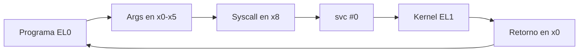

<style>
@import "../../../../styles/index.css";
</style>

<div class="ecys-cover-bg"></div>

<div class="ecys-title-cover">

<div class="muted">Escuela de Ingeniería de Ciencias y Sistemas</div>

# Arquitectura de Computadores y Ensambladores 1

</div>

---
layout: center
---

<div class="muted">Arquitectura de Computadores y Ensambladores 1</div>

## Unidad 09
## Syscalls esenciales

Usa Linux directamente como API del kernel desde
programas AArch64 sin libc.

<div class="cover-note">
Unidad práctica: contrato syscall, exit, write, read, openat, close y manejo mínimo de errores.
</div>

---

# Anuncios importantes

<div class="numbered-grid">
  <div class="numbered-card">
    <div class="card-number">1</div>
    <h3>Anuncio 1</h3>
    <p></p>
  </div>
</div>

---

# Agenda

<div class="numbered-grid">
  <div class="numbered-card">
    <div class="card-number">1</div>
    <h3>Contrato de syscall</h3>
    <p>Registros, <code>svc #0</code>, EL0 → EL1 y retorno en <code>x0</code>.</p>
  </div>

  <div class="numbered-card">
    <div class="card-number">2</div>
    <h3>exit y write</h3>
    <p>Terminar proceso y escribir bytes a stdout/stderr.</p>
  </div>

  <div class="numbered-card">
    <div class="card-number">3</div>
    <h3>read y buffers</h3>
    <p>Leer desde stdin hacia <code>.bss</code> y eco básico.</p>
  </div>

  <div class="numbered-card">
    <div class="card-number">4</div>
    <h3>openat y close</h3>
    <p>Abrir archivos, file descriptors y cerrar recursos.</p>
  </div>

  <div class="numbered-card">
    <div class="card-number">5</div>
    <h3>Errores mínimos</h3>
    <p>Retornos negativos, <code>b.lt error</code> y mensajes a stderr.</p>
  </div>
</div>

---

# Competencias

<div class="concept-grid vertical-center">
  <div class="concept-card">
    <h3>Competencia 1</h3>
    <p>
      El estudiante desarrolla soluciones eficientes en sistemas computacionales
      integrando arquitectura de computadores, programación en bajo nivel y
      herramientas modernas de análisis y simulación para resolver problemas
      complejos en sistemas embebidos e IoT.
    </p>
  </div>

  <div class="concept-card">
    <h3>Competencia 2</h3>
    <p>
      Configura entornos de desarrollo para programación en ensamblador ARM-64
      instalando y verificando herramientas en Linux como GAS, GDB y Make para
      establecer un ambiente funcional de compilación y depuración de código.
    </p>
  </div>
</div>

---

# Valor de la semana

<div class="callout tip">
  <strong>Aplicación.</strong>
  Capacidad de llevar teoría a la práctica.
</div>

<div class="concept-grid">
  <div class="concept-card">
    <h3>Aplicación en clase</h3>
    <p>
      Las syscalls convierten conocimiento de registros, flags y control de flujo
      en programas que interactúan con el sistema operativo real: leen entrada,
      escriben archivos y manejan errores.
    </p>
  </div>
</div>

---

# Qué buscamos hoy

<div class="slide-center-block">

<div class="objective-grid">
  <div v-click class="objective-item">
    <div class="item-number">1</div>
    <h3>Contrato completo</h3>
    <p>Preparar argumentos, elegir syscall, ejecutar <code>svc #0</code> y leer retorno.</p>
  </div>

  <div v-click class="objective-item">
    <div class="item-number">2</div>
    <h3>I/O básico</h3>
    <p>Usar <code>exit</code>, <code>write</code> y <code>read</code> como herramientas directas del kernel.</p>
  </div>

  <div v-click class="objective-item">
    <div class="item-number">3</div>
    <h3>Archivos</h3>
    <p>Abrir, escribir, cerrar con <code>openat</code> y <code>close</code>.</p>
  </div>

  <div v-click class="objective-item">
    <div class="item-number">4</div>
    <h3>Manejo de errores</h3>
    <p>Detectar retornos negativos y reaccionar con mensajes a stderr.</p>
  </div>
</div>

</div>

---
layout: section
---

# Contrato de syscall

Linux mira registros: número en x8, argumentos en x0–x5, retorno en x0.

---
layout: center
class: text-center
---

<div class="big-question">
  <div class="muted">Pregunta de arranque</div>
  <h3>¿svc #0 sabe qué hacer por sí solo?</h3>
  <div class="question-points">
    <div v-click>No. Solo provoca la entrada al kernel.</div>
    <div v-click>Antes debes poner el número de syscall en x8.</div>
    <div v-click>Y los argumentos en x0–x5.</div>
  </div>
</div>

---

###### El contrato AArch64 Linux

<div class="slide-center-block">

<div class="content-stack-lg">

<div class="diagram-block">



<div class="diagram-caption">
EL0 → svc #0 → Kernel EL1 → retorno en x0.
</div>

</div>

<div class="concept-grid">
  <div v-click class="concept-card">
    <h3>Plantilla mental</h3>

```asm
mov x0, #...    // arg 0
mov x1, #...    // arg 1
mov x2, #...    // arg 2
mov x8, #...    // syscall
svc #0          // kernel
// x0 = retorno
```

  </div>
</div>

</div>

</div>

---

# Syscalls de esta unidad

<div class="slide-center-block">

<div class="concept-grid">
  <div v-click class="concept-card">
    <h3><code>exit</code> — 93</h3>
    <p>Terminar proceso con código de salida.</p>
  </div>
  <div v-click class="concept-card">
    <h3><code>write</code> — 64</h3>
    <p>Escribir bytes a un file descriptor.</p>
  </div>
  <div v-click class="concept-card">
    <h3><code>read</code> — 63</h3>
    <p>Leer bytes desde un file descriptor.</p>
  </div>
  <div v-click class="concept-card">
    <h3><code>openat</code> — 56</h3>
    <p>Abrir archivo y obtener un fd.</p>
  </div>
  <div v-click class="concept-card">
    <h3><code>close</code> — 57</h3>
    <p>Cerrar file descriptor.</p>
  </div>
</div>

</div>

---
layout: section
---

# exit y write

Terminar proceso y escribir bytes directos sin printf ni libc.

---

##### exit en detalle

<div class="slide-center-block">

<div class="content-stack-lg">

<div class="muted centered-narrow">Terminar el proceso</div>

```asm
mov x0, #0      // código de salida
mov x8, #93     // exit
svc #0
```

<div v-click class="callout info centered-narrow">
Después de <code>exit</code>, el proceso termina. No se ejecuta código posterior.
</div>

</div>

</div>

---

##### write en detalle

<div class="slide-center-block">

<div class="content-stack-lg">

<div class="muted centered-narrow">Escribir bytes en stdout</div>

```asm
mov x0, #1          // stdout
ldr x1, =mensaje    // buffer
mov x2, #len        // longitud
mov x8, #64         // write
svc #0
```

<div v-click class="compare-grid">
  <div class="compare-card">
    <div class="card-kicker">write ≠ printf</div>
    <ul>
      <li>No interpreta formato.</li>
      <li>No busca <code>\0</code>.</li>
      <li>Escribe exactamente <code>x2</code> bytes.</li>
    </ul>
  </div>
</div>

</div>

</div>


---

# File descriptors iniciales

<div class="slide-center-block">

<div class="concept-grid">
  <div v-click class="concept-card">
    <h3>fd 0 — stdin</h3>
    <p>Entrada estándar.</p>
  </div>
  <div v-click class="concept-card">
    <h3>fd 1 — stdout</h3>
    <p>Salida estándar.</p>
  </div>
  <div v-click class="concept-card">
    <h3>fd 2 — stderr</h3>
    <p>Salida de errores.</p>
  </div>
</div>

<div v-click class="callout warning centered-narrow">
<code>stdout = 1</code> no es lo mismo que código de salida <code>1</code>. Son números con propósitos distintos.
</div>

</div>

---
layout: section
---

# read y buffers

Leer bytes desde stdin hacia memoria reservada en .bss.

---

# Eco básico: read → write

<div class="slide-center-block">

<div class="content-stack-lg">

```asm
    mov x0, #0          // stdin
    ldr x1, =buffer     // buffer destino
    mov x2, #64         // máximo bytes
    mov x8, #63         // read
    svc #0              // x0 = bytes leídos

    mov x2, x0          // cantidad leída → longitud
    mov x0, #1          // stdout
    ldr x1, =buffer
    mov x8, #64         // write
    svc #0
```

<div class="compare-grid">
  <div v-click class="compare-card">
    <div class="card-kicker">Antes de read</div>
    <ul>
      <li><code>x0 = 0</code> → fd stdin.</li>
      <li><code>x1</code> = dirección del buffer.</li>
      <li><code>x2</code> = máximo a leer.</li>
    </ul>
  </div>
  <div v-click class="compare-card">
    <div class="card-kicker">Después de read</div>
    <ul>
      <li><code>x0</code> = bytes leídos (ya no es fd).</li>
      <li><code>mov x2, x0</code> pasa la cantidad a write.</li>
      <li>Buffer contiene los datos.</li>
    </ul>
  </div>
</div>

</div>

</div>

---
layout: section
---

# openat y close

Abrir un archivo devuelve un file descriptor. Cerrar libera ese recurso.

---

# openat: nombre → fd

<div class="slide-center-block">

<div class="content-stack-lg">

```asm
.equ AT_FDCWD, -100
.equ O_WRONLY, 1
.equ O_CREAT,  64
.equ O_TRUNC,  512

    mov x0, #AT_FDCWD                   // directorio actual
    ldr x1, =nombre                     // nombre del archivo
    mov x2, #(O_WRONLY | O_CREAT | O_TRUNC)
    mov x3, #0644                       // permisos
    mov x8, #56                         // openat
    svc #0                              // x0 = fd o error
```

<div class="compare-grid">
  <div v-click class="compare-card">
    <div class="card-kicker">Registros</div>
    <ul>
      <li><code>x0</code> = directorio base (<code>AT_FDCWD</code>).</li>
      <li><code>x1</code> = nombre del archivo.</li>
      <li><code>x2</code> = flags de apertura.</li>
      <li><code>x3</code> = modo/permisos.</li>
    </ul>
  </div>
  <div v-click class="compare-card">
    <div class="card-kicker">Después</div>
    <ul>
      <li><code>x0 ≥ 0</code> → fd válido.</li>
      <li><code>x0 < 0</code> → error.</li>
      <li>Guardar fd en <code>x19</code> para write y close.</li>
    </ul>
  </div>
</div>

</div>

</div>

---

# Ciclo de archivo: abrir → escribir → cerrar

<div class="slide-center-block">

<div class="content-stack-lg">

<div class="lead-block">
Un fd es un recurso del proceso. Abrirlo, usarlo y cerrarlo es el ciclo mínimo.
</div>

```bash
openat  → x0 = fd
guardar → x19 = fd
write   → x0 cambia a bytes escritos
close   → x0 debe volver a ser fd (desde x19)
```

<div v-click class="callout warning centered-narrow">
Si no guardas el fd antes de <code>write</code>, no sabrás qué cerrar. <code>write</code> reemplaza <code>x0</code> con su retorno.
</div>

</div>

</div>

---
layout: section
---

# Errores mínimos

Si el retorno es negativo, algo falló.

---

# Patrón de error mínimo

<div class="slide-center-block">

<div class="content-stack-lg">

```asm
svc #0
cmp x0, #0
b.lt error
```

<div class="compare-grid">
  <div v-click class="compare-card">
    <div class="card-kicker">Retorno válido</div>
    <ul>
      <li><code>x0 ≥ 0</code></li>
      <li>Continúa normalmente.</li>
    </ul>
  </div>
  <div v-click class="compare-card">
    <div class="card-kicker">Retorno de error</div>
    <ul>
      <li><code>x0 < 0</code></li>
      <li>Saltar al bloque de error.</li>
      <li>Escribir a stderr (fd 2) y exit(1).</li>
    </ul>
  </div>
</div>

<div v-click class="callout warning centered-narrow">
No sobrescribas <code>x0</code> antes de revisarlo. Primero <code>cmp</code>, luego guarda o usa.
</div>

</div>

</div>

---

# Bloque de error completo

<div class="slide-center-block">

<div class="content-stack-lg">

```asm
error:
    mov x0, #2              // stderr
    ldr x1, =msg_error
    mov x2, #msg_error_len
    mov x8, #64             // write
    svc #0

    mov x0, #1              // exit code 1
    mov x8, #93             // exit
    svc #0
```

<div v-click class="key-idea centered-narrow">
Varios puntos del programa pueden saltar a la misma etiqueta <code>error</code>. Esto evita duplicar código de manejo.
</div>

</div>

</div>

---

# Checklist mental

<div class="slide-center-block">

<div class="reveal-list centered-narrow">
  <div v-click class="reveal-item">Puedo explicar el contrato: x8, x0–x5, svc #0, retorno.</div>
  <div v-click class="reveal-item">Puedo usar <code>exit</code> y <code>write</code> formalmente.</div>
  <div v-click class="reveal-item">Puedo leer entrada con <code>read</code> y hacer eco.</div>
  <div v-click class="reveal-item">Puedo abrir, escribir y cerrar un archivo con <code>openat</code>/<code>close</code>.</div>
  <div v-click class="reveal-item">Puedo detectar error con <code>cmp x0, #0</code> + <code>b.lt</code>.</div>
  <div v-click class="reveal-item">Puedo distinguir syscall directa de función de libc.</div>
</div>

</div>

---

# Siguiente paso

<div class="slide-center-block">

<div class="flow-column">
  <div v-click class="flow-step">Contrato de syscall dominado</div>
  <div v-click class="flow-arrow">→</div>
  <div v-click class="flow-step">I/O básico: exit, write, read</div>
  <div v-click class="flow-arrow">→</div>
  <div v-click class="flow-step">Archivos: openat, close</div>
  <div v-click class="flow-arrow">→</div>
  <div v-click class="flow-step">Stack frames, funciones y ABI</div>
</div>

</div>

---
layout: center
class: text-center
---

<div class="muted">Actividad de cierre</div>

# Preguntas de repaso

<div class="question-points mx-auto mt-6 max-w-2xl text-left">
  <div v-click>¿Qué registro contiene el número de syscall?</div>
  <div v-click>¿Qué contiene <code>x0</code> después de <code>svc #0</code>?</div>
  <div v-click>¿Por qué <code>write</code> necesita longitud explícita?</div>
  <div v-click>¿Qué pasa si no guardas el fd antes de llamar <code>write</code>?</div>
  <div v-click>¿Por qué <code>b.lt</code> funciona para detectar errores?</div>
</div>

---

###### Ejemplo Práctico

<div class="slide-center-block">

<div class="content-stack-lg">

<div class="key-idea centered-narrow">
  <div class="muted">Actividad guiada</div>
  <p>Crear un archivo con
  <code>openat</code>, escribir un mensaje con
  <code>write</code>, cerrar con
  <code>close</code> y manejar errores.
  </p>
</div>

<div class="concept-grid concept-grid-4">
  <div v-click class="concept-card">
    <h3>openat</h3>
    <p>Abrir <code>salida.txt</code> con flags <code>O_WRONLY
    |O_CREAT|O_TRUNC</code>.</p>
  </div>

  <div v-click class="concept-card">
    <h3>write</h3>
    <p>Escribir mensaje, usar retorno como verificación.</p>
  </div>

  <div v-click class="concept-card">
    <h3>close</h3>
    <p>Cerrar fd guardado en <code>x19</code>.</p>
  </div>

  <div v-click class="concept-card">
    <h3>Error</h3>
    <p>Cada syscall revisa <code>x0 < 0</code> y salta a bloque compartido.</p>
  </div>
</div>

</div>

</div>

---

# Fuentes

- Página Quarto: `site/courses/aarch64/syscalls-esenciales/`
- Arm, *Learn the Architecture - A64 Instruction Set Architecture Guide*
- Larry D. Pyeatt y William Ughetta, *ARM 64-Bit Assembly Language*
- Linux kernel, *syscall table for AArch64*
- `man 2 write`, `man 2 read`, `man 2 openat`, `man 2 close`
- Slidev, documentación oficial

---
layout: statement
---

# Dudas¿?

---
layout: center
---

# Gracias por tu atención
